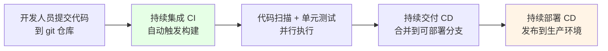
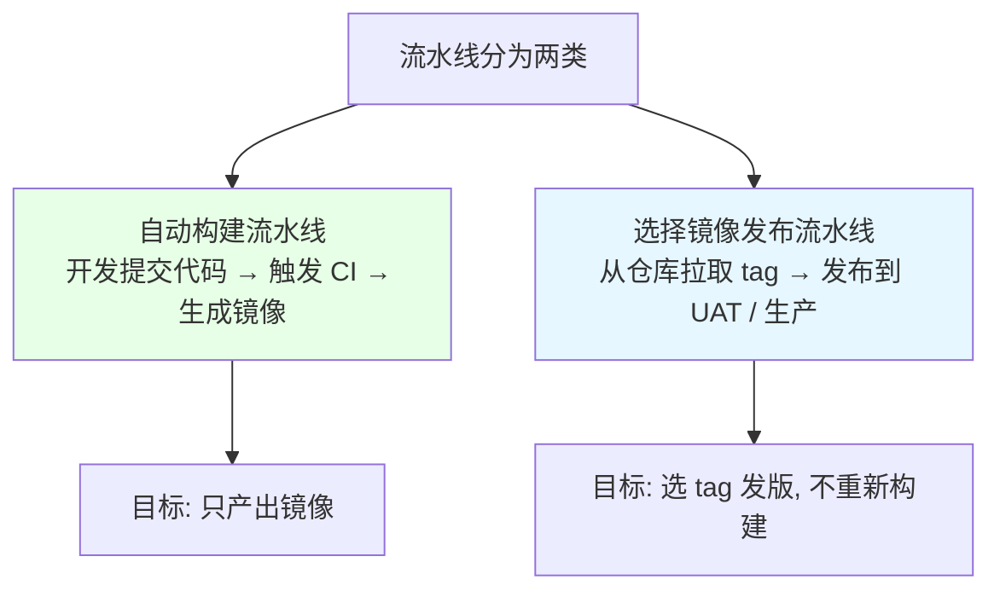
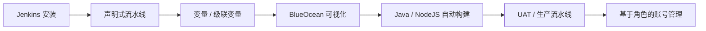

# Kubernetes 集群部署: Jenkins CI/CD 概述（一次构建、到处发布）

开篇文章：CI/CD 到底解决什么问题？结论先摆——在 Kubernetes 里发布应用要以**镜像为唯一基准**，做到「**一次构建、到处发布**」，整个发布链路从头到尾**只有一个镜像**，既省构建时间又避免测试代码和上线代码不一致。

## 纲要

- 持续集成、持续交付、持续部署三者的区别
- 为什么在 Kubernetes 里要以镜像为基准
- 一次构建、到处发布的收益
- 两类流水线：自动构建流水线 与 选择镜像发布流水线
- Jenkins 与 GitLab CI 的取舍
- 本章后续路线图

## 持续集成、持续交付、持续部署



| 阶段 | 含义 | 触发方式 |
| --- | --- | --- |
| 持续集成（CI） | 频繁把代码合并到共享仓库，提交即触发**自动构建 + 代码扫描 + 自动化测试**；扫描不通过就不构建 | 提交即触发 |
| 持续交付（CD） | 把通过集成测试的代码合并到「随时可部署生产」的分支（develop / master） | 通常手动 |
| 持续部署（CD） | 把交付产物真正发布到生产环境；**风险高，一般手动**，依赖高覆盖率的自动化测试 | 通常手动 |

> 代码扫描应在构建之前：漏洞 / bug 太多时没必要构建。代码扫描常用 SonarQube，自动化测试一般是单元 / 集成测试。

## 为什么在 Kubernetes 里要以镜像为基准

```text
传统多分支发布（不推荐）:

发布流程
├── 合并到 feature 分支 → 触发一次 build
├── 合并到 develop 分支 → 又触发一次 build
├── 合并到 master 分支 → 再触发一次 build
└── 问题: 重复构建三次, 测试代码 ≠ 上线代码
```

| 对比 | 传统多分支构建 | K8s 镜像发布 |
| --- | --- | --- |
| 构建次数 | 每个分支各构建一次 | **只构建一次** |
| 产物 | 多个不同产物 | **唯一镜像（tag 唯一）** |
| 一致性 | 测试 / 上线代码可能不一致 | commit 唯一 → 镜像唯一 → 代码一致 |
| 时间 | 多次构建耗时长 | 只构建一次，省时 |

> 在 K8s 里发布 = 打镜像 → 写资源文件 → 部署。Java / NodeJS 应用常涉及 `mvn install` / `npm install` 两步，合并多次会浪费大量时间。

## 两类流水线



| 类型 | 任务 | 说明 |
| --- | --- | --- |
| 自动构建流水线 | 编译 → 扫描 → 打镜像 → 推仓库 | 唯一目标是**生成一个镜像** |
| 选择镜像发布流水线 | 调 GitLab / 阿里云接口取 tag → 选 tag 发版 | 不再构建，直接选第一步产出的镜像发到 UAT / 生产 |

## Jenkins 与 GitLab CI 的取舍

```text
常见 CI 工具:

CI 平台
├── Jenkins        ← 社区强大, 功能全, 本章主选
└── GitLab CI      ← 方便, 但配合工程内自动化测试不够灵活
```

| 工具 | 优点 | 课程选择 |
| --- | --- | --- |
| Jenkins | 功能强大、使用简单、社区维护人员多、几乎覆盖所有场景 | ✅ 选用 |
| GitLab CI | 也方便，但自动化测试嵌入工程时不够灵活 | 未选 |

## 本章后续路线图



## API 速览

| 能力 | 做法 |
| --- | --- |
| 三类过程 | CI（提交即构建+扫描+测试）/ CD 交付（合可部署分支）/ CD 部署（发布生产，一般手动） |
| K8s 发布基准 | **以镜像为唯一基准，一次构建、到处发布** |
| 镜像唯一性 | 整个发布链路**只有一个镜像**，tag 唯一，保证测试=上线代码 |
| 流水线分类 | ① 自动构建流水线（产出镜像）② 选择镜像发布流水线（选 tag 发版） |
| 工具选型 | **Jenkins**（社区强、场景全）；GitLab CI 在嵌入工程测试时不够灵活 |
| 代码扫描 | 构建前执行（如 SonarQube），不过则不打镜像 |
| 自动化测试 | 单元 / 集成测试；覆盖率不足时部署步骤保持手动 |
| 后续内容 | 安装 → 声明式流水线 → 变量 → BlueOcean → Java/NodeJS 构建 → UAT/生产 → 账号管理 |

## Demo 示例

```bash
# 1. 查看当前镜像列表（一次构建后的唯一产物）
docker images

# 2. 从仓库按 tag 选取镜像进行发版（选择镜像发布流水线）
REGISTRY_ADDRESS=registry.cn-hangzhou.aliyuncs.com
NAMESPACE=demo
IMAGE_NAME=springcloud-demo
TAG=$(git log -1 --format=%H | cut -c1-14)

echo "将发布镜像: $REGISTRY_ADDRESS/$NAMESPACE/$IMAGE_NAME:$TAG"

# 3. 在 K8s 中仅更新镜像（不改动其他配置）
kubectl -n $NAMESPACE set image deployment/$IMAGE_NAME \
  $IMAGE_NAME=$REGISTRY_ADDRESS/$NAMESPACE/$IMAGE_NAME:$TAG

# 4. 确认滚动更新完成
kubectl -n $NAMESPACE rollout status deployment/$IMAGE_NAME
```

### 总结

- **CI/CD 解决「代码怎么可靠地变成线上服务」**：CI 是提交即自动构建 + 代码扫描 + 单元/集成测试；CD 交付是把通过测试的代码合到可随时部署的分支；CD 部署是把产物发到生产，**风险高一般手动**；
- **在 K8s 里发布必须以镜像为唯一基准**：完整链路是「开发提交代码 → CI 生成镜像 → 推仓库 → 多环境共用同一镜像」，做到**一次构建、到处发布**；
- **一次构建的核心收益有两点**：一是省掉多分支重复构建的时间（Java 有 `mvn`、NodeJS 有 `npm`，重复构建极耗时），二是 commit 唯一即镜像唯一，从根本上杜绝「测试代码和上线的代码不一致」；
- **流水线分两类**：① 自动构建流水线，唯一目标是生成镜像；② 选择镜像发布流水线，调 GitLab / 阿里云接口取 tag 后直接选镜像发到 UAT / 生产，不再重新构建；
- **工具选 Jenkins 不选 GitLab CI**：Jenkins 社区强、场景覆盖全；GitLab CI 嵌入工程内自动化测试时不够灵活。后续章节会讲安装、声明式流水线、变量、BlueOcean、Java/NodeJS 构建与 UAT/生产流水线、基于角色的账号管理。

