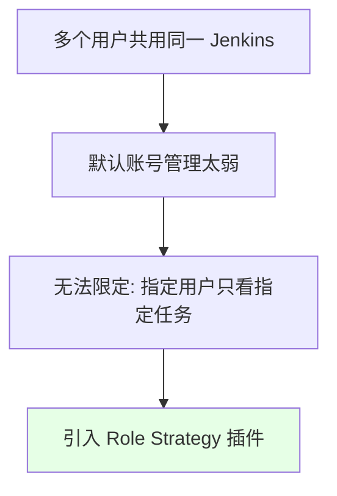
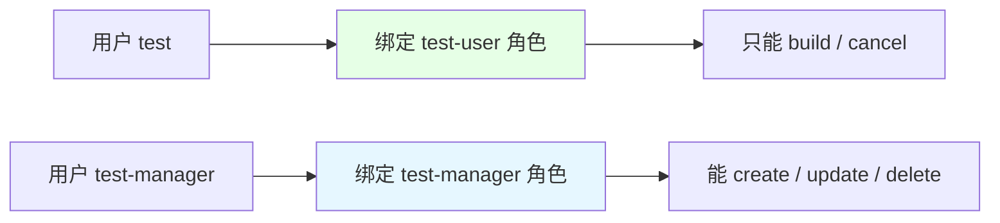

# Kubernetes 集群部署: Jenkins 基于角色的账户管理（Role Strategy 插件）

开篇文章：怎么让 A 用户只看 A 的项目、B 用户只看 B 的？结论先摆——Jenkins 自带账号管理不够细，需装 **Role Strategy 插件**：在 Global Security 切到 **Role-Based Strategy**，用 **Item Roles 的正则**匹配任务名（如 `.*-test`），把角色绑定给用户（类似 K8s 的 Role + RoleBinding），区分「只能 build」与「能 create/update/delete」两类人，并给匿名用户配 overall 只读。

## 纲要

- 为什么需要 Role Strategy 插件
- 切换到 Role-Based Strategy
- 全局角色：匿名用户 overall read
- Item Roles：正则匹配任务名
- Assign Roles：把角色绑给用户（类 RBAC）
- build 用户 vs manager 用户权限划分
- 插件略旧，注意保存

## 为什么需要



| 问题 | 说明 |
| --- | --- |
| 权限过大 | 执行构建的人能看到别人项目、误操作 |
| 默认不足 | 原生管理实现不了「指定人看指定任务」 |
| 解决 | Role Strategy 插件，类似 K8s RBAC |

## 切换到 Role-Based Strategy

```bash
# 概念步骤 (在 Web 界面操作, 非命令):
# 1. Manage Jenkins → Global Security
# 2. 授权策略改为: Role-Based Strategy
# 3. 保存后, Manage Jenkins 出现 Manage and Assign Roles
```

> 不把授权策略改成 Role-Based Strategy，就看不到「Manage and Assign Roles」入口。改完保存即可。

## 全局角色：匿名只读

```text
角色规划:

Roles
├── Global Roles
│   └── anonymous-read: 仅 overall 的 Read (必须, 否则界面打不开)
├── Item Roles (项目角色, 旧版叫 Project Roles)
│   ├── test-user:    匹配 .*-test
│   └── uat-user:     匹配 .*-uat
└── Node Roles (一般不用)
```

| 角色 | 作用 |
| --- | --- |
| `anonymous-read` | 匿名用户 overall Read，否则页面功能打不开 |
| `test-user` | 用正则 `.*-test` 匹配测试任务 |
| `uat-user` | 用正则 `.*-uat` 匹配 UAT 任务 |

> 必须先给匿名用户配 overall 只读，否则登录后其他功能都打不开、读不到内容。

## Item Roles 正则匹配

```text
Item Role 配置示例:

Role 名称: test-user
Pattern:    .*-test          ← 正则, 匹配所有以 -test 结尾的任务
权限:       Overall Read / Build / Cancel / Read Workspace

Role 名称: test-manager
Pattern:    .*-test
权限:       Create / Update / Delete / Configure / Read
```

| 元素 | 说明 |
| --- | --- |
| Pattern | 正则表达式，匹配任务名 |
| 不会写正则 | 需自行学习正则语法 |
| 权限粒度 | view / build / cancel / configure / create / delete |

## Assign Roles（类 RBAC）



> 这里的 Role 相当于 K8s RBAC 的 Role，Assign 相当于 RoleBinding。先建用户（Manage Jenkins → 添加用户），再到 Assign Roles 把角色勾给用户。

## build 用户 vs manager 用户

| 用户类型 | 权限 | 用途 |
| --- | --- | --- |
| build 用户 | Read / Build / Cancel / Read Workspace | 执行构建、看日志，不能改 |
| manager 用户 | Create / Update / Delete / Configure / Read | 管理测试 job 的配置 |

> 权限分配：build 用户只执行构建与取消、看日志；manager 用户能创建/更新/删除/配置。delete 可按需给或不给。

## API 速览

| 能力 | 做法 |
| --- | --- |
| 插件 | 安装 Role Strategy 插件 |
| 启用 | Global Security 授权策略改 Role-Based Strategy |
| 匿名 | 建全局角色 overall Read 给匿名用户 |
| 项目角色 | Item Roles 用正则（如 `.*-test`）匹配任务 |
| 绑定 | Assign Roles 把角色勾给用户（类 Role+RoleBinding） |
| 权限划分 | build 用户只构建；manager 用户可增删改 |
| 注意 | 插件较旧偶尔有 bug，改完务必保存 |

## Demo 示例

```bash
# 以下为界面操作, 仅列关键步骤 (非命令行):
# 1. 装 Role Strategy 插件
# 2. Global Security → 授权策略: Role-Based Strategy → 保存
# 3. Manage and Assign Roles → Manage Roles:
#    - Global: 添加 anonymous, 勾 overall Read
#    - Item: 添加 test-user, Pattern=.*-test, 勾 build/cancel/read
# 4. Assign Roles:
#    - 添加用户 test, 勾 test-user
#    - 添加用户 test-manager, 勾 test-manager (create/update/delete)
# 5. 退出用 test 登录验证: 仅见 *-test 任务, 可 build 不可编辑
```

### 总结

- **原生账号管理太弱，需 Role Strategy 插件**：多用户共用 Jenkins 时，默认无法做到「指定人只看指定任务」，装 Role Strategy 插件后用正则按任务名授权，思想类似 K8s RBAC；
- **先切授权策略**：Manage Jenkins → Global Security 把授权策略改为 Role-Based Strategy，否则看不到「Manage and Assign Roles」入口；
- **匿名用户必须配 overall Read**：建一个全局角色给匿名用户只读，否则登录后界面其他功能打不开、读不到内容；
- **Item Roles 用正则匹配任务**：如 `.*-test` 匹配所有以 `-test` 结尾的任务，权限可细分 view/build/cancel/configure/create/delete，不会写正则需自学；
- **Assign Roles 绑定用户（类 RoleBinding）**：先建用户再绑定角色，区分 build 用户（只构建/取消/看日志）与 manager 用户（可增删改配置）；插件较旧偶尔有 bug，每次改完务必保存。

