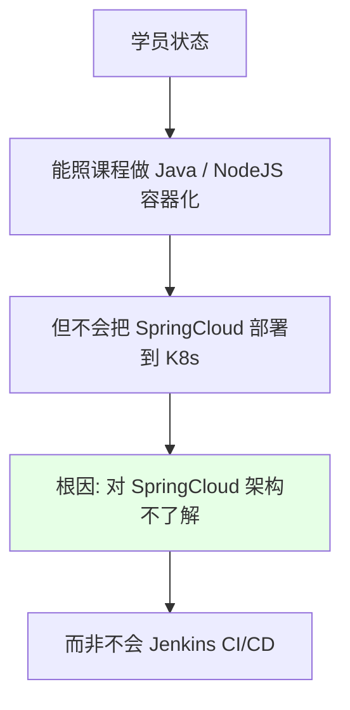
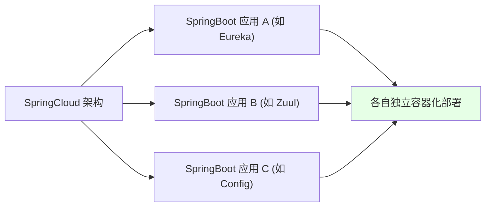
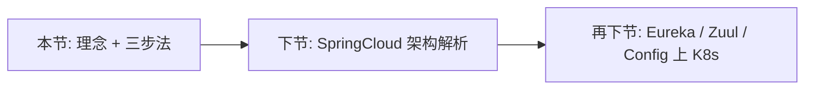

# Kubernetes 集群部署: 容器化 SpringCloud 项目说明（理念与三步法）

开篇文章：SpringCloud 项目该怎么容器化上 K8s？结论先摆——**别被架构忽悠**，SpringCloud 本质就是一堆 SpringBoot 应用，容器化原理和单个 Java 应用完全一样：**编译 → 产出物 → Dockerfile 打业务镜像**，掌握这套「持续集成/持续部署理念」比学会某一个框架的演示更重要，下一节再具体讲 SpringCloud 是什么。

## 纲要

- 学员常见误区：只会简单应用，不会 SpringCloud
- 核心：掌握 CI/CD 理念，而非某语言/框架怎么用
- 容器化万变不离其宗的三步
- SpringCloud = 多个 SpringBoot 组成
- 部署时要了解架构本身
- 下节预告：SpringCloud 架构解析

## 常见误区



| 误区 | 真相 |
| --- | --- |
| 「课程没讲 SpringCloud 容器化」 | 课程讲的就是通用 CI/CD 理念，无需逐框架演示 |
| 换了架构就不会 | 掌握要领后任何版本/架构都能驾驭 |
| 被架构名吓住 | 它只是多个单应用的组合 |

## 容器化三步法（万变不离其宗）

```text
任意语言/框架容器化三步:

容器化步骤
├── 1. 编译 (或不编译, 如脚本语言)
├── 2. 生成产物 (jar / 静态文件 / 二进制)
└── 3. Dockerfile 生成业务镜像
```

| 步骤 | 说明 |
| --- | --- |
| 编译 | 有的语言需要，有的直接有产物 |
| 产物 | jar 包 / dist 目录 / 二进制 |
| 镜像 | 用 Dockerfile 把产物打成业务镜像 |

> 仔细想，所有语言都是这个过程。哪怕不用编译，也是直接把产物用 Dockerfile 方式生成业务镜像。无论什么架构，都是这样，别被架构本身忽悠。

## SpringCloud = 多个 SpringBoot



| 视角 | 说明 |
| --- | --- |
| 宏观 | SpringCloud 由多个 SpringBoot 组成 |
| 微观 | 每个组件当普通应用看待 |
| 部署 | 逐个按单应用方式容器化上 K8s |

> SpringCloud 本身也是 Java 应用，没必要再演示一遍它怎么实现 CI/CD。把它拆成单个应用，按普通方式部署即可。

## 部署要了解架构本身

```text
光会 CI/CD 不够:

部署好 SpringCloud 还需
├── 了解各组件职责 (注册/网关/配置)
├── 了解组件间依赖关系
└── 才能决定如何更好部署到 K8s
```

| 维度 | 说明 |
| --- | --- |
| 不了解架构 | 不知从何下手 |
| 适度了解 | 知道怎么更好部署即可，不用太深 |
| 目标 | 作为 DevOps 应掌握的技能 |

> 很多学员不是不会 Jenkins 容器化，而是对 SpringCloud 本身不了解导致无从下手。了解架构（不必太深）才能部署得更好——这也是 DevOps 该掌握的技能。

## 下节预告



## API 速览

| 能力 | 做法 |
| --- | --- |
| 核心认知 | 掌握 CI/CD 理念，而非某框架演示 |
| 容器化三步 | 编译 → 产物 → Dockerfile 打镜像 |
| 看架构 | SpringCloud = 多个 SpringBoot，当单应用看 |
| 部署前提 | 了解各组件职责与依赖 |
| 适用面 | 任何语言/框架/版本都通用 |
| 下节 | SpringCloud 架构解析（上/下） |

## Demo 示例

```bash
# 单个 SpringBoot 组件的容器化 (以 Eureka 为例, 思路与任意 Java 应用一致)
# 1. 编译 (在 Jenkins 的 maven 容器中)
mvn clean package -DskipTests

# 2. 打镜像 (Dockerfile: FROM openjdk:8-jre + COPY jar)
docker build -t $REGISTRY_ADDRESS/demo/eureka:$TAG .

# 3. 推仓库并更新到 K8s
docker push $REGISTRY_ADDRESS/demo/eureka:$TAG
kubectl -n $NAMESPACE set image deployment/eureka \
  eureka=$REGISTRY_ADDRESS/demo/eureka:$TAG -l app=eureka
```

### 总结

- **学员卡住的根因不是不会 CI/CD，而是不了解 SpringCloud 架构**：课程讲的是通用的持续集成/持续部署理念，无需对每个框架从头演示一遍；
- **容器化万变不离其宗三步**：编译（或直接有产物）→ 生成产物（jar/静态文件/二进制）→ 用 Dockerfile 打成业务镜像，所有语言/框架都一样；
- **SpringCloud 本质是一堆 SpringBoot 应用**：把它拆成单个应用，按普通 Java 应用的方式逐个容器化部署即可，不要被「微服务架构」的名头吓住；
- **部署好还需了解架构本身**：适度了解各组件（注册/网关/配置）的职责与依赖，才能决定如何更好地上 K8s，这是 DevOps 应掌握的技能；
- **掌握要领比记住版本更重要**：会搭 1.17 也要会 1.19，会一个框架的容器化也要能举一反三到任意架构——下一节起具体讲 SpringCloud 架构与 Eureka/Zuul/Config 的上 K8s 实践。

