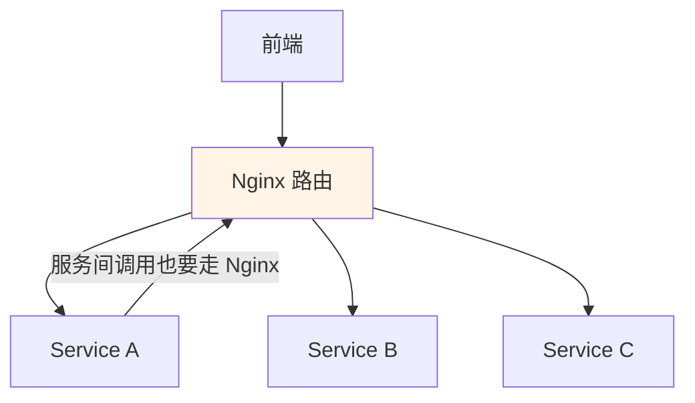
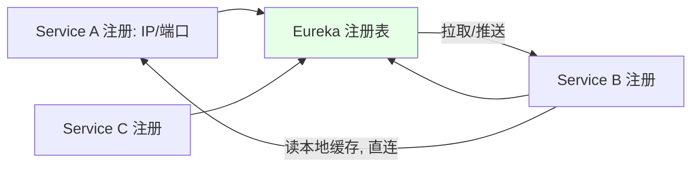

# Kubernetes 集群部署: SpringCloud 架构解析（上·传统架构痛点与服务发现/网关/配置中心）

开篇文章：SpringCloud 这套微服务全家桶到底解决了什么？结论先摆——传统架构**用 Nginx 维护服务地址/路由极难扩展**（40 个服务×3 副本=120 个实例要手配），SpringCloud 用 **Eureka（服务注册发现）、Zuul（网关/动态路由）、ConfigServer（统一配置）** 三个独立组件把这件事自动化；服务间调用叫**东西流量**，用户到前端的叫**南北流量**。

## 纲要

- 传统架构的痛点：Nginx 维护地址/路由
- 服务发现：从 Consul 到 Eureka
- Eureka 的注册/拉取/推送机制
- 网关 Zuul：统一 API 入口与动态路由
- 配置中心 ConfigServer：统一配置管理
- 东西流量与南北流量

## 传统架构的痛点



| 痛点 | 说明 |
| --- | --- |
| 实例增多配置爆炸 | 40 服务 × 3 副本 = 120 个 IP:端口，全手写 Nginx upstream |
| 扩缩容麻烦 | 每加一个实例就要改 Nginx 配置并同步 |
| 配置共享单点 | NFS 同步配置有单点故障；改错影响全部 |
| 服务间调用绕 Nginx | A 调 B 也要配域名路由，极其繁琐 |

## 服务发现：从 Consul 到 Eureka

```text
服务发现演进:

服务发现
├── 早期: Consul 等自研/第三方注册发现
│   └── 缺点: 客户端要自己实现选实例/容错/摘除逻辑
└── SpringCloud: 抽象出 Eureka (注册中心)
    └── 帮我们实现负载均衡 + 容灾, 无需自写代码
```

| 方案 | 特点 |
| --- | --- |
| Consul | 注册发现可用，但选实例、容错、下线摘除都要自己写代码 |
| Eureka | SpringCloud 抽象出的注册中心，内置负载均衡与容错 |

> Eureka 是 SpringCloud 的**服务注册发现中心**，本质也是个 Java 应用。服务启动后把「我是谁、IP、端口」注册上去，其他服务拉取注册表缓存到本地，调用时直连。

## Eureka 机制



| 机制 | 说明 |
| --- | --- |
| 注册 | 服务启动上报自身 IP/端口到 Eureka |
| 拉取 | 调用方把注册表缓存到本地，直连目标 |
| 推送 | Eureka 可主动推变更，立即感知上下线 |
| 容错 | 内置轮询下一个实例的容错，无需自写 |

## 网关 Zuul：南北流量的统一入口

```text
Zuul 网关:

南北流量
├── 根路径 /        → 前端
└── /api/service-a → Zuul 内部路由表 → Service A
    /api/service-b → Zuul 内部路由表 → Service B
```

| 对比 | 传统 Nginx | Zuul |
| --- | --- | --- |
| 路由维护 | 每个服务手写 upstream | Zuul 自动发现后端，维护路由表 |
| 能力 | 反向代理 | 动态路由 + 监控 + 安全 + 灰度/蓝绿发布 |
| 上下线 | 需改 Nginx | 自动更新路由 |

> Zuul 注册到 Eureka 获取各服务地址，内部维护路由表；前端只访问一个 `/api` 入口，由 Zuul 转发，不用在 Nginx 维护大量路由。还支持监控、安全、灰度发布。

## 配置中心 ConfigServer

```mermaid
flowchain: ""
flowchart TD
    A["多个微服务"] -->|"都需连 DB/Redis/RabbitMQ"| B["ConfigServer"]
    B --> C["git / SVN / 数据库 存配置"]
    A -->|"启动时拉配置到本地缓存"| B
    style B fill:#e6ffe6
```

| 痛点（无配置中心） | ConfigServer 解决 |
| --- | --- |
| 每个服务写死配置，30 服务×3 环境=90 份重复文件 | 一份配置，服务启动时拉取 |
| 改配置要重新编译打包上线 | 改中心配置 + 重启/热加载即可 |

> 类似工具：Java 用 ConfigServer，其他语言（Go/PHP）常用携程开源的 **Apollo**。配置改了服务可定期拉取并 reload（类似 Prometheus/Nginx reload）。

## 东西流量 vs 南北流量

```text
流量分类:

流量
├── 南北流量: 用户 → 前端 → (调后端走 /api)
└── 东西流量: Service A → Service B (服务间调用)
```

| 类型 | 方向 | 典型组件 |
| --- | --- | --- |
| 南北流量 | 外部用户到服务 | 前端、Zuul 网关 |
| 东西流量 | 服务与服务之间 | Eureka + 直接调用 |

## API 速览

| 能力 | 做法 |
| --- | --- |
| 传统痛点 | Nginx 手配地址/路由，实例多时不可维护 |
| 服务发现 | Eureka 注册中心，内置负载均衡与容错 |
| 网关 | Zuul 统一 `/api` 入口，动态路由、灰度、监控 |
| 配置 | ConfigServer 统一配置，避免重复文件与重编译 |
| 流量分类 | 南北（用户→服务）/ 东西（服务→服务） |
| 核心组件 | Eureka / Zuul / ConfigServer 三个独立服务 |
| 同类工具 | 服务发现 Consul；配置 Apollo（非 Java） |

## Demo 示例

```bash
# 概念示意: 服务通过 Eureka 地址注册 (运维告诉研发的写法)
# defaultZone 使用 StatefulSet 的固定 FQDN (详见下节)
export EUREKA_URL="http://eureka-0.eureka:8761/eureka,http://eureka-1.eureka:8761/eureka,http://eureka-2.eureka:8761/eureka"

# 应用连接配置中心 (统一地址, 跨环境不变)
export CONFIG_SERVER_URL="http://configserver-service:8888"

echo "服务注册到: $EUREKA_URL"
echo "配置中心地址: $CONFIG_SERVER_URL"
```

### 总结

- **传统架构用 Nginx 维护地址/路由在微服务规模下不可维护**：40 个服务×3 副本=120 个实例要手配 upstream，扩缩容、改错同步都极其痛苦，催生了服务发现；
- **Eureka 是 SpringCloud 的注册中心**：服务上报 IP/端口，调用方缓存注册表直连，内置负载均衡与容错（选实例、摘除、轮询下一个），不用自己写客户端逻辑；
- **Zuul 做南北流量的统一网关**：前端只访问一个 `/api` 入口，Zuul 内部维护路由表自动转发，支持动态路由、监控、安全、灰度/蓝绿发布，免维护大量 Nginx 路由；
- **ConfigServer 统一配置管理**：一份配置服务启动时拉取，避免每个服务写死配置导致的海量重复文件，改配置不必重新编译打包，类似工具有 Apollo（非 Java）；
- **分清两类流量**：用户到服务是**南北流量**（走前端+Zuul），服务间调用是**东西流量**（走 Eureka 直连）；SpringCloud 的核心就是 Eureka/Zuul/ConfigServer 三个独立部署的组件。

