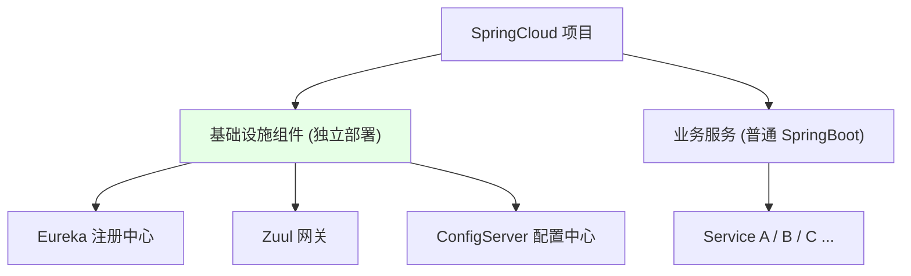
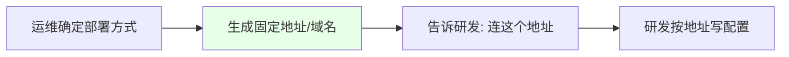

# Kubernetes 集群部署: SpringCloud 架构解析（下·组件独立部署与部署理念）

开篇文章：学完架构，运维/DevOps 真正要掌握的是什么？结论先摆——**三个核心组件（Eureka/Zuul/ConfigServer）都是独立部署的服务**，其余都是普通 SpringBoot 应用；作为运维你不必精通代码，只需**理解每个组件的作用与正确部署方式、连接方式**，并把「连哪个地址」告诉研发，掌握「单个应用如何上 K8s」的理念即可举一反三到任何架构。

## 纲要

- 三个组件是独立部署的服务
- 其余就是普通 SpringBoot 应用
- 运维/DevOps 该掌握的是什么
- 如何把部署方式「翻译」给研发
- 掌握理念胜过记住某框架
- 下节起：具体组件上 K8s 实践

## 三个组件是独立服务



| 类别 | 组件 | 部署形态 |
| --- | --- | --- |
| 基础设施 | Eureka / Zuul / ConfigServer | 作为**独立服务**部署 |
| 业务服务 | 各 SpringBoot 应用 | 普通单应用部署 |

> 这三个组件以代码实现逻辑，但作为独立应用单独部署；其余业务服务就是普普通通的 SpringBoot 单应用。

## 运维/DevOps 该掌握什么

```text
运维的核心能力:

运维关注点
├── 每个组件的作用 (注册/网关/配置)
├── 正确的部署方式 (StatefulSet / Deployment ?)
├── 正确的连接方式 (研发连哪个地址)
└── 把"连接地址格式"告诉研发
```

| 角色 | 关注点 |
| --- | --- |
| 开发 | 用代码实现组件逻辑，熟悉语言 |
| 运维/DevOps | 如何更好把组件部署到 K8s、以何种方式被连接 |

> 运维不必精通组件内部代码，但要清楚组件作用、正确部署形态与连接方式，并能把「该连哪个地址」准确传达给研发。

## 把部署方式「翻译」给研发



| 动作 | 说明 |
| --- | --- |
| 运维定部署 | 选 StatefulSet/Deployment，配 service/ingress |
| 给地址 | 如 Eureka 的 defaultZone、ConfigServer 的 service 名 |
| 研发接 | 按固定地址写配置文件，跨环境不变 |

## 掌握理念胜过记住框架

```text
举一反三的能力:

面对新架构
├── 它也是由单个应用组成
├── 只需知道: 单个应用怎么正确上 K8s
├── 怎么被正确访问
└── 无需逐框架演示
```

| 思维 | 说明 |
| --- | --- |
| 看架构 | 拆成单个应用，当普通应用看待 |
| 学要领 | 掌握容器化/CI-CD 理念，而非某框架演示 |
| 适用性 | 任何语言/框架/版本都能驾驭 |

> 类似 Redis、RabbitMQ 上 K8s，可用 Deployment/StatefulSet 等，哪种最合适 K8s 管理员最清楚。组件本身如何写代码是研发的事，怎么部署更好是运维的事。

## API 速览

| 能力 | 做法 |
| --- | --- |
| 组件认知 | Eureka/Zuul/ConfigServer 是独立部署的服务 |
| 业务服务 | 其余都是普通 SpringBoot 单应用 |
| 运维职责 | 懂组件作用+正确部署+连接方式 |
| 协作 | 运维给研发固定连接地址，研发写配置 |
| 理念 | 掌握「单应用上 K8s」胜过记某框架 |
| 类比 | Redis/RabbitMQ 上 K8s 同理，选最合适方式 |
| 下节 | 具体讲 Eureka/Zuul/ConfigServer 上 K8s |

## Demo 示例

```bash
# 运维给研发的"连接地址清单"示例 (概念)
# Eureka 集群 (StatefulSet 固定 FQDN, 详见 9-24)
EUREKA_URL="http://eureka-0.eureka:8761/eureka,http://eureka-1.eureka:8761/eureka,http://eureka-2.eureka:8761/eureka"

# ConfigServer (统一 service 名, 跨环境不变)
CONFIG_URL="http://configserver-service:8888"

# Zuul 网关入口
GATEWAY_URL="http://zuul-service:8080"

echo "研发连接以上固定地址即可, 无需关心后端实例变化"
```

### 总结

- **三个核心组件都是独立部署的服务**：Eureka（注册中心）、Zuul（网关）、ConfigServer（配置中心）以独立应用形态部署，其余业务服务就是普通 SpringBoot 单应用；
- **运维/DevOps 不必精通组件代码**：真正要掌握的是每个组件的作用、正确的 K8s 部署方式（如 Eureka 用 StatefulSet）、以及正确的连接方式，并把「连哪个地址」明确告诉研发；
- **把部署方式翻译成连接地址**：运维确定部署形态后生成固定域名/service 名，研发按地址写配置，做到跨环境、跨项目统一，无需改代码；
- **掌握理念胜过记住框架**：任何架构本质都是单个应用组成，只要会「单个应用如何正确上 K8s、如何被正确访问」，就能举一反三到任意新架构，不必等逐框架演示；
- **类比其他中间件**：Redis、RabbitMQ 上 K8s 同理，用 Deployment/StatefulSet 哪种最合适由 K8s 管理员判断——这正是运维该有的能力，下一节起具体讲三个组件的上 K8s 实践。

