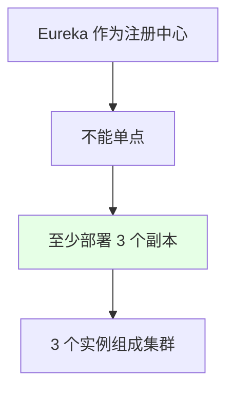
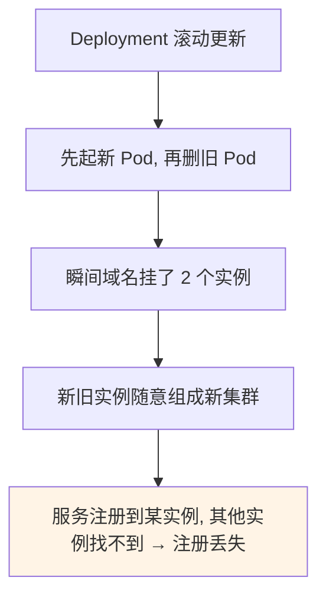

# Kubernetes 集群部署: 在 K8s 上正确部署 Eureka（StatefulSet 与 Headless Service）

开篇文章：Eureka 该用 Deployment 还是 StatefulSet？结论先摆——**必须用 StatefulSet 而非 Deployment**。Deployment 滚动更新时域名挂载多实例会导致集群分裂、服务注册丢失；StatefulSet 配合 **headless service** 给每个 Pod 生成**固定 FQDN**（如 `eureka-0.eureka:8761/eureka`），把 `defaultZone` 写成这三个固定地址，发版倒序更新、稳定可控，且跨环境统一。

## 纲要

- 为什么 Eureka 至少要三副本
- 为什么不用 Deployment（集群分裂问题）
- 用 StatefulSet + headless service
- 固定 FQDN 与 defaultZone 写法
- 告诉研发的两个地址
- 跨环境/项目统一

## 为什么至少三副本



| 要点 | 说明 |
| --- | --- |
| 单点风险 | 注册中心挂了，所有服务无法注册/拉取 |
| 副本数 | 至少 3 个，组成 Eureka 集群 |
| 集群机制 | 各实例 `defaultZone` 互相填写对方地址 |

> Eureka 集群通过配置文件里的 `defaultZone` 写上其他实例地址（默认端口 8761，路径 `/eureka`）来互联，可用环境变量、配置文件或 ConfigServer 注入。

## 为什么不用 Deployment



| 问题 | 说明 |
| --- | --- |
| 需 3 个 Deployment | 一个 Deployment 多副本无法给每个配独立域名，集群异常 |
| 滚动更新风险 | 新旧实例混在，可能重组集群，导致服务注册信息丢失 |
| 结论 | 不用 Deployment 部署 Eureka |

## 用 StatefulSet + headless service

```text
StatefulSet 部署 Eureka:

statefulset/eureka + service/eureka (headless)
├── eureka-0.eureka:8761/eureka   ← 固定 FQDN
├── eureka-1.eureka:8761/eureka
└── eureka-2.eureka:8761/eureka
```

| 机制 | 说明 |
| --- | --- |
| headless service | 给每个 Pod 分配固定、稳定的网络标识（FQDN） |
| 固定标识 | `eureka-0/-1/-2.eureka` 不会因重启改变 |
| 免配域名 | 不用给每个 Deployment 单独配域名 |

> headless service 给每个 Pod 一个固定 FQDN，省去给每个 Deployment 配域名的麻烦。若忘了可复习 headless service 章节。

## defaultZone 与 FQDN 写法

```yaml
# Eureka 集群配置 (示例: 通过环境变量注入 defaultZone)
# 三个固定地址, 顺序无所谓
env:
  - name: EUREKA_CLIENT_SERVICEURL_DEFAULTZONE
    value: "http://eureka-0.eureka:8761/eureka,http://eureka-1.eureka:8761/eureka,http://eureka-2.eureka:8761/eureka"
```

```text
defaultZone 格式:

http://eureka-0.eureka:8761/eureka,
http://eureka-1.eureka:8761/eureka,
http://eureka-2.eureka:8761/eureka
```

| 项 | 值 |
| --- | --- |
| 主机 | `eureka-0/-1/-2.eureka`（StatefulSet+headless 生成） |
| 端口 | 8761（Eureka 默认） |
| 路径 | `/eureka` |

## 告诉研发的两件事

```mermaid
flowchart TD
    A["运维告诉研发"] --> B["1. 集群 defaultZone = 三个固定 FQDN"]
    A --> C["2. 服务注册 Eureka 地址 = 同样三个地址"]
    B --> D["地址固定, 跨环境不变]
    C --> D
    style D fill:#e6ffe6
```

| 告知项 | 内容 |
| --- | --- |
| 集群组成 | `defaultZone` 写三个 `eureka-N.eureka:8761/eureka` |
| 服务注册 | 应用连接 Eureka 的地址也是这三个 |
| 好处 | 地址固定，生产/测试/开发一致，按 namespace 隔离 |

> 用 StatefulSet 发版是**倒序**更新（先删 2 再更新），有问题即停，不会出现「注册到新实例但其他实例找不到」的情况。地址固定，不同项目按 namespace 隔离，不同环境统一格式，大幅减少工作量。

## API 速览

| 能力 | 做法 |
| --- | --- |
| 副本数 | Eureka 至少 3 副本组成集群 |
| 部署方式 | **StatefulSet**（非 Deployment） |
| 网络 | headless service 生成固定 FQDN |
| defaultZone | 三个 `eureka-0/-1/-2.eureka:8761/eureka` |
| 注入方式 | 环境变量 / 配置文件 / ConfigServer |
| 发版 | StatefulSet 倒序更新，稳定可控 |
| 告知研发 | 集群地址 + 服务注册地址都用这三个固定 FQDN |
| 隔离 | 按 namespace 隔离，跨环境统一 |

## Demo 示例

```yaml
# Eureka StatefulSet (示意片段)
apiVersion: apps/v1
kind: StatefulSet
metadata:
  name: eureka
spec:
  serviceName: eureka            # headless service 名
  replicas: 3
  selector:
    matchLabels:
      app: eureka
  template:
    metadata:
      labels:
        app: eureka
    spec:
      containers:
        - name: eureka
          image: $REGISTRY_ADDRESS/demo/eureka:$TAG
          ports:
            - containerPort: 8761
          env:
            - name: EUREKA_CLIENT_SERVICEURL_DEFAULTZONE
              value: "http://eureka-0.eureka:8761/eureka,http://eureka-1.eureka:8761/eureka,http://eureka-2.eureka:8761/eureka"
---
apiVersion: v1
kind: Service
metadata:
  name: eureka
spec:
  clusterIP: None                # headless
  selector:
    app: eureka
```

### 总结

- **Eureka 必须至少 3 副本组成集群**：作为注册中心不能单点，`defaultZone` 互相填写对方地址（默认 8761/`eureka`）；
- **绝不用 Deployment 部署 Eureka**：其滚动更新会让新旧实例混挂、随意重组集群，导致服务注册信息丢到别的实例找不到；
- **用 StatefulSet + headless service**：headless service 给每个 Pod 生成固定 FQDN（`eureka-0/-1/-2.eureka`），无需给每个 Deployment 单独配域名；
- **defaultZone 写三个固定地址**：`http://eureka-0.eureka:8761/eureka,...`，可通过环境变量/配置/ConfigServer 注入，发版倒序更新、稳定可控；
- **告诉研发两件事且地址跨环境统一**：集群组成地址与服务注册地址都用这三个固定 FQDN，按 namespace 隔离，生产/测试/开发格式一致，大幅减少维护量。

