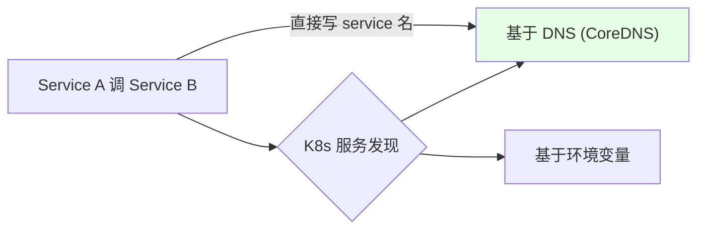
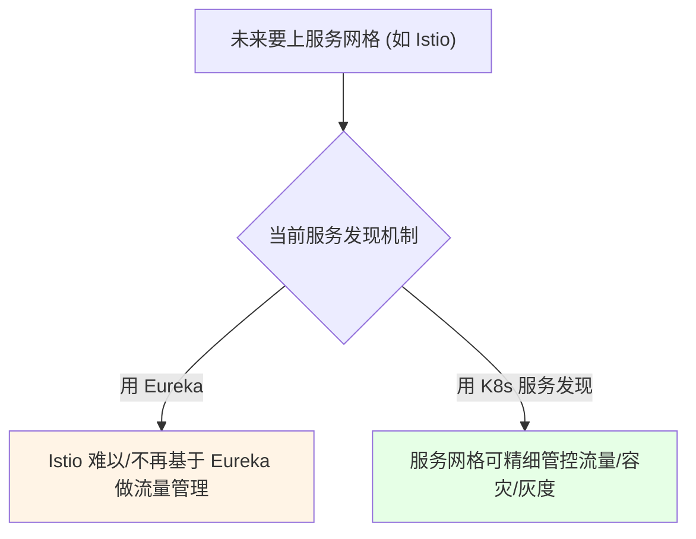

# Kubernetes 集群部署: 到底要不要用 Eureka（K8s 服务发现与服务网格权衡）

开篇文章：K8s 自带服务发现了，为什么还要 Eureka？结论先摆——**K8s 原生就支持服务发现**（基于 DNS 的 CoreDNS、基于环境变量两种），但老项目因「能不动就不动」常保留 Eureka，新项目**建议直接用 K8s 服务发现**（尤其将来要上 Istio 等服务网格时，Eureka 正走向闭源、与服务网格不兼容）。没有绝对答案，取决于项目阶段与是否要服务网格。

## 纲要

- K8s 自带两种服务发现
- 基于 DNS（CoreDNS）的调用方式
- 基于环境变量的方式（代码量较大）
- 老项目 vs 新项目的取舍
- Eureka 与服务网格（Istio）的冲突
- 没有一锤定音的答案

## K8s 自带服务发现



| 方式 | 原理 | 推荐度 |
| --- | --- | --- |
| 基于 DNS | 用 Service 名（如 `service-b`）在同 namespace 直接调用 | ✅ 推荐 |
| 基于环境变量 | kubelet 为 Pod 注入 `SERVICE_B_SERVICE_HOST` 等变量 | 用得少，需代码解析 |

> 即使不用 SpringCloud，每个应用加一个 Service 即可实现东西流量（服务间调用）。K8s 搭建时就部署了 CoreDNS 提供 DNS 服务发现。

## 基于 DNS 的调用

```bash
# 同 namespace 下, Service A 直接连 Service B (默认 80 端口可省略)
# 配置文件写: http://service-b
# 非 80 端口则需带端口: http://service-b:8080

# 验证: 进任意 Pod 看环境变量里 kubelet 注入的 service 信息
kubectl exec -it $POD -- env | grep -i service_b
```

| 注意 | 说明 |
| --- | --- |
| 默认端口 | 建议用 80 端口，直接写 `service-b` 即可 |
| 非 80 | 需带端口 `service-b:port` |
| 跨 namespace | 需写完整 `<svc>.<ns>.svc.cluster.local` |

> 基于 DNS 方式下，Service B 增删实例由 Service 自动维护，Service A 始终通过 Service 名连接，无需关心后端变化，天然服务发现。

## 基于环境变量的方式

```bash
# kubelet 为 Pod 注入形如 SERVICE_B_SERVICE_HOST / SERVICE_B_SERVICE_PORT 的变量
# 需要代码中解析这些变量, 有代码量, 用得不多
kubectl exec -it $POD -- env | grep SERVICE_B
```

| 优点 | 缺点 |
| --- | --- |
| 直接解析出 IP，少一层 DNS 解析、延迟略低 | 需代码解析变量，工作量大 |
| 延迟极低 | 不如 DNS 方式常用 |

## 老项目 vs 新项目取舍

```text
要用不要 Eureka ?

项目类型
├── 老项目 (已开发完/运行久)
│   └── 研发不愿改服务发现机制 → 保留 Eureka (能不动则不动)
└── 新项目
    └── 开发初期就可与研发确认: K8s 服务发现 or Eureka
        └── 简单场景建议: 不用 Eureka, 纯 SpringBoot + K8s Service
```

| 类型 | 建议 |
| --- | --- |
| 老项目 | 保留 Eureka，避免改代码引入风险 |
| 新项目 | 可与研发确认，倾向 K8s 服务发现 |

> 老项目改服务发现机制研发不愿意（怕引入未知问题）；即便强制上 K8s 去掉 Eureka 也要改代码。

## Eureka 与服务网格（Istio）的冲突



| 维度 | Eureka | K8s 服务发现 |
| --- | --- | --- |
| 服务网格兼容 | Eureka 走向闭源，Istio 越来越不支持 | 天然适配 |
| 流量治理 | 难做高级功能 | 灰度/容灾/策略易实现 |
| 上网格成本 | 改造麻烦 | 直接可用 |

> Istio 早期可基于 Eureka 做流量管理，但 Eureka 正走向闭源，Istio 已逐渐不支持。若要上服务网格，用 Eureka 会很难。

## API 速览

| 能力 | 做法 |
| --- | --- |
| K8s 服务发现 | 基于 DNS（CoreDNS，推荐）/ 基于环境变量 |
| DNS 调用 | 同 ns 写 `service-b`，非 80 带端口 |
| 环境变量 | kubelet 注入 `SERVICE_X_HOST/PORT`，需代码解析 |
| 老项目 | 保留 Eureka，避免改代码风险 |
| 新项目 | 倾向 K8s 服务发现，纯 SpringBoot + Service |
| 服务网格 | 上 Istio 等需用 K8s 发现，Eureka 不兼容 |
| 结论 | 无绝对，取决于项目阶段与是否要服务网格 |

## Demo 示例

```bash
# 不用 Eureka: 用 K8s Service 实现服务发现 (新项目推荐)
# 1. 给后端服务建 Service
kubectl expose deployment service-b --port=80 --name=service-b -n $NAMESPACE

# 2. Service A 配置里直接写对端 service 名 (同 namespace)
# http://service-b        (80 端口)
# http://service-b:8080  (非 80 端口)

# 3. 验证 DNS 解析
kubectl exec -it $POD -n $NAMESPACE -- nslookup service-b
```

### 总结

- **K8s 原生就有服务发现**：基于 DNS（CoreDNS，推荐，同 namespace 直接写 `service-b`）和基于环境变量（kubelet 注入 `SERVICE_X_HOST/PORT`，需代码解析）两种方式，足以替代 Eureka；
- **基于 DNS 最省事**：Service B 增删由 Service 自动维护，Service A 始终通过 Service 名连接，无需关心后端变化；非 80 端口要带端口，跨 namespace 写全称；
- **老项目通常保留 Eureka**：已开发完的项目研发不愿改服务发现逻辑（怕引入未知问题），强制改还要动代码，不如保留；
- **新项目建议用 K8s 服务发现**：开发初期就能确认，简单场景纯 SpringBoot + K8s Service 即可，不必引入 Eureka 全家桶；
- **服务网格是分水岭**：Eureka 正走向闭源、Istio 越来越不支持基于它做流量管理，若未来要上 Istio 做灰度/容灾/策略，必须用 K8s 服务发现——没有一锤定音的答案，按项目阶段与发展方向决定。

