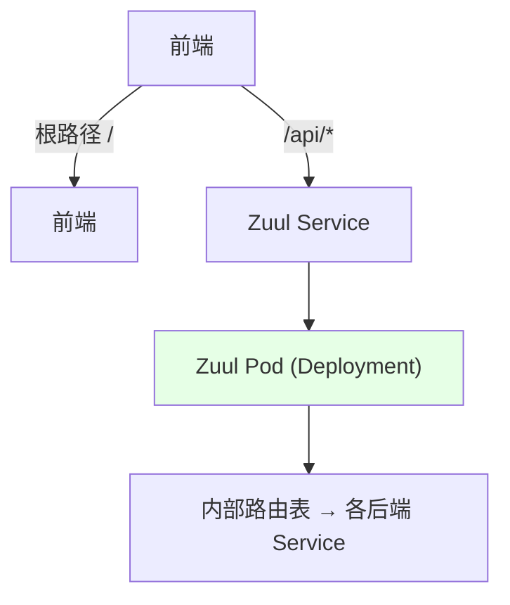
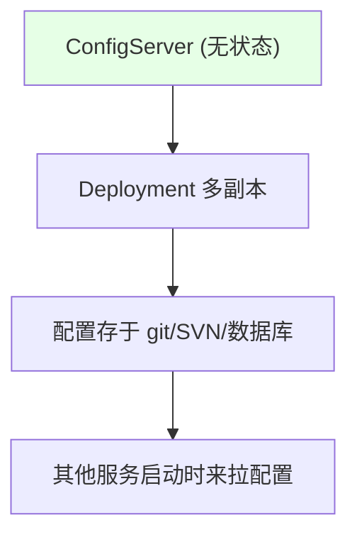

# Kubernetes 集群部署: 正确部署 Zuul 和 ConfigServer 到 K8s（网关与配置中心）

开篇文章：Zuul 和 ConfigServer 上 K8s 要注意什么？结论先摆——两者本质都是**普通 SpringBoot 应用**，比 Eureka 简单：**Zuul 用 Deployment + 一个 Service，前端只配 `/api` 入口指向它**（内部路由由 Zuul 自己管）；**ConfigServer 无状态、用 Deployment 多副本**，给研发一个固定 service 名（如 `configserver-service`）作连接地址即可；另给三个组件各配一个 Ingress 域名供研发查看。

## 纲要

- Zuul：普通应用，Deployment 即可
- Zuul 的 Service 与统一 API 入口
- ConfigServer：无状态，Deployment 多副本
- 告诉研发连接 ConfigServer 的固定地址
- 三个组件各配一个 Ingress 域名
- 跨环境/项目统一

## Zuul 部署



| 项 | 说明 |
| --- | --- |
| 部署 | Deployment（也可 DaemonSet，按需求） |
| 角色 | 网关，只有前端调用它，其他服务不调 |
| 入口 | 配一个 `/api` 路径指向 Zuul 的 Service |

> Zuul 本身只是个 Java 应用，编译完起一个 Deployment 配 Service 即可。内部路由表由 Zuul 自己维护，运维不用关心，只需把前端 `/api` 指到它。

## Zuul 的 Service 与入口

```yaml
# Zuul Service (示意)
apiVersion: v1
kind: Service
metadata:
  name: zuul
spec:
  selector:
    app: zuul
  ports:
    - port: 8080
      targetPort: 8080
```

```text
访问形态:

南北流量
├── /          → 前端
└── /api/*     → Zuul Service → 内部路由到对应后端
```

| 配置点 | 说明 |
| --- | --- |
| Service 名 | 如 `zuul`，供前端/Ingress 引用 |
| 前端配置 | 根路径到前端，`/api` 到 Zuul |
| 路由 | Zuul 内部维护，研发实现 |

## ConfigServer 部署（无状态）



| 项 | 说明 |
| --- | --- |
| 状态 | **无状态**，配置数据在 git/SVN/DB 等后端 |
| 部署 | Deployment，可多副本 |
| 关键 | 只需保证后端存储（git 等）不挂 |

> ConfigServer 本身无状态（数据在 git 等），所以用 Deployment 起多副本即可，只要保证它依赖的存储不挂。

## 告诉研发连接地址

```bash
# 统一连接地址 (跨环境/项目不变)
CONFIG_SERVER_URL="http://configserver-service:8888"

# 80 端口可省略端口; 建议用 80, 配置更简单
# 研发无论开发/测试/生产, 都连这一个地址
```

| 告知内容 | 说明 |
| --- | --- |
| 地址 | 如 `configserver-service`（统一 service 名） |
| 端口 | 配 80 则省略，配置简单 |
| 跨环境 | 不同集群/namespace 隔离，但 service 名统一，地址不变 |

> 和 Eureka 一样，运维只需告诉研发「连这个地址就够了」。因按 namespace 隔离，不同集群的 service 反弹到各自实例，但研发用同一地址即可。

## 三个组件各配 Ingress 域名

```text
给研发的 3 个 Ingress 域名:

域名规划
├── Eureka    → 查看注册信息
├── ConfigServer → 查看配置
└── Zuul      → 查看接口 (如 swagger)
```

| 组件 | Ingress 用途 |
| --- | --- |
| Eureka | 研发查看服务注册信息 |
| ConfigServer | 研发查看/管理配置 |
| Zuul | 研发查看接口文档等 |

> 三个组件各配一个 Ingress 暴露域名，供研发查看注册信息、配置、接口（如 swagger）。也可不配域名直接从 API 访问。

## API 速览

| 能力 | 做法 |
| --- | --- |
| Zuul 部署 | Deployment，配 Service，前端 `/api` 指向它 |
| Zuul 路由 | 内部由 Zuul 维护，运维不关心 |
| ConfigServer | 无状态，Deployment 多副本 |
| 连接地址 | 告诉研发固定 service 名（如 `configserver-service`） |
| 端口 | 建议 80，省略端口，配置简单 |
| Ingress | Eureka/ConfigServer/Zuul 各一个域名供研发查看 |
| 隔离 | 按 namespace 隔离，地址跨环境统一 |
| 本质 | 两者都是普通 SpringBoot 应用 |

## Demo 示例

```bash
# 1. 部署 ConfigServer (Deployment + Service, 80 端口)
kubectl -n $NAMESPACE expose deployment configserver --port=80 --name=configserver-service

# 2. 部署 Zuul (Deployment + Service)
kubectl -n $NAMESPACE expose deployment zuul --port=8080 --name=zuul

# 3. 给三组件配 Ingress 域名 (示意)
#   eureka.$DOMAIN  → eureka service
#   config.$DOMAIN → configserver-service
#   api.$DOMAIN    → zuul (路径 /api)

# 4. 告诉研发统一连接地址
echo "ConfigServer: http://configserver-service"
echo "Eureka:      http://eureka-0.eureka:8761/eureka (固定FQDN, 见 9-24)"
echo "网关入口:     http://api.$DOMAIN/api"
```

### 总结

- **Zuul 和 ConfigServer 本质都是普通 SpringBoot 应用**，比 Eureka 简单，没有特殊的集群/状态要求；
- **Zuul 用 Deployment + Service 即可**：只有前端调它，运维只需把前端根路径给前端、`/api` 入口指向 Zuul 的 Service，内部路由表由 Zuul 自己维护，不用在 K8s 网关写大量路由；
- **ConfigServer 无状态、用 Deployment 多副本**：配置数据存于 git/SVN/DB，只要保证后端存储不挂，起多副本即可；
- **给研发一个固定连接地址**：如 `configserver-service`（建议 80 端口省略端口），跨环境/项目统一不变，按 namespace 隔离，运维只需把地址告诉研发；
- **三组件各配一个 Ingress 域名**：Eureka（看注册）、ConfigServer（看配置）、Zuul（看接口如 swagger），方便研发查看；整体管理方式和 Eureka 一样轻松。

