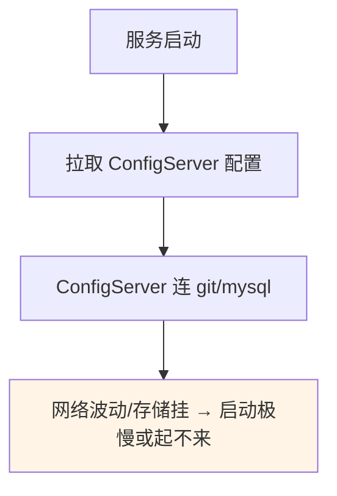
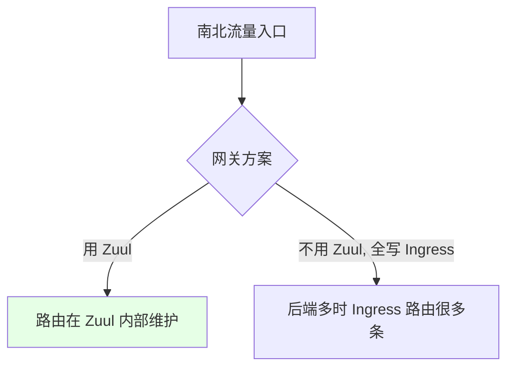

# Kubernetes 集群部署: 到底要不要用 Zuul 和 ConfigServer（配置管理替代方案）

开篇文章：ConfigServer 和 Zuul 在 K8s 里还有必要吗？结论先摆——**ConfigServer 调用链长、有故障放大风险，建议新项目可不用**，用「环境变量 / Service 代理外部中间件 / ConfigMap」三种更短的链路替代；**Zuul 可保留**（路由逻辑放 Ingress 配置虽简单但后端多时工作量大）。最终取决于把工作量分给谁，没有强制答案，个人倾向 ConfigServer 不用、Zuul 可用。

## 纲要

- ConfigServer 的隐患：调用链长、故障放大
- 替代一：环境变量注入配置
- 替代二：Service 代理外部中间件（统一地址）
- 替代三：ConfigMap 挂载配置
- Zuul 要不要用：放 Ingress 的权衡
- 个人建议与总结

## ConfigServer 的隐患



| 隐患 | 说明 |
| --- | --- |
| 调用链长 | 服务 → ConfigServer → git/DB，多一跳 |
| 故障放大 | git/DB 挂 + 滚动发布时，服务因读不到配置起不来 |
| 启动慢 | 网络波动时拉配置超时，健康检查失败 |

> ConfigServer 解决的是「多环境配置不同」的问题，但引入了更长调用链，任一环节故障都可能让服务起不来。

## 替代一：环境变量注入

```bash
# 启动容器时直接注入连接地址, 无需配置中心
env:
  - name: REDIS_HOST
    value: "redis-service"
  - name: MYSQL_HOST
    value: "mysql-service"
  - name: RABBITMQ_HOST
    value: "rabbitmq-service"
```

| 优点 | 说明 |
| --- | --- |
| 启动快 | 不依赖外部配置中心 |
| 无单点故障 | ConfigServer 挂不影响服务起 |

## 替代二：Service 代理外部中间件

```bash
# 用无 selector 的 Service + Endpoint 代理外部 mysql (跨环境改 endpoint 即可)
kubectl -n $NAMESPACE apply -f - <<EOF
apiVersion: v1
kind: Service
metadata:
  name: mysql-service
spec:
  ports:
    - port: 3306
---
apiVersion: v1
kind: Endpoints
metadata:
  name: mysql-service
subsets:
  - addresses:
      - ip: 10.0.0.18        # 开发环境 mysql
    ports:
      - port: 3306
EOF
```

```text
统一地址, 不同环境只改 endpoint:

mysql-service
├── 开发: endpoint → 10.0.0.18:3306
├── 测试: endpoint → 10.0.0.20:3306
└── 生产: endpoint → 172.16.0.20:3306
```

| 优势 | 说明 |
| --- | --- |
| 一份配置 | 所有环境用同一个 `mysql-service` 名 |
| 零配置中心 | 不需 ConfigServer，不改代码 |
| 隔离 | 按 namespace/环境改 endpoint 指向 |

> 多环境中间件地址不同，用 Service 代理后，研发只连统一 service 名，运维改 endpoint 指向即可，免去维护 ConfigServer。

## 替代三：ConfigMap 挂载

```bash
# 把配置写进 ConfigMap, 以文件形式挂进容器 (少一层调用)
kubectl -n $NAMESPACE create configmap app-config \
  --from-literal=mysql.host=mysql-service \
  --from-literal=redis.host=redis-service
```

| 对比 | ConfigServer | ConfigMap |
| --- | --- | --- |
| 调用 | 服务→ConfigServer→git | 直接挂文件读 |
| 速度 | 多一跳，慢 | 少一层，快 |
| 代价 | — | 需维护多个 ConfigMap |

> ConfigMap 把配置以文件挂入容器，少一层调用、启动更快；代价是运维要维护较多 ConfigMap（不同应用不同配置），但研发工作量变小。

## Zuul 要不要用



| 方案 | 运维工作量 | 研发工作量 |
| --- | --- | --- |
| 用 Zuul | 小（只配 `/api` 入口） | 小 |
| 不用 Zuul，全写 Ingress | 大（后端多时配很多条 Ingress） | 小 |

> Ingress 配路由比改 Nginx 简单（声明式），但后端多时 Ingress 条目变多，运维负担上升。Zuul 可保留，路由逻辑由它管。

## 个人建议

| 组件 | 建议 | 理由 |
| --- | --- | --- |
| ConfigServer | **可不用** | 环境变量/Service/ConfigMap 更短链路，调用少、不易因第三方故障起不来 |
| Zuul | **可用** | 保留网关，避免 Ingress 路由爆炸 |
| Apollo | 同 ConfigServer，坏了也危险 | 非 Java 通用配置中心，但同样有单点风险 |

> 小项目用 Service 方式最合适，便于将来做服务网格细化流控。最终没有强制，取决于把工作量分给运维还是研发。

## API 速览

| 能力 | 做法 |
| --- | --- |
| ConfigServer 隐患 | 调用链长、第三方故障致服务起不来 |
| 替代1 | 环境变量直接注入连接地址 |
| 替代2 | 无 selector Service + Endpoint 代理外部中间件，统一地址 |
| 替代3 | ConfigMap 挂载配置，少一层调用 |
| Zuul 取舍 | 保留可减 Ingress 负担；不用则 Ingress 路由变多 |
| Apollo | 类似 ConfigServer，非 Java 通用，也有单点风险 |
| 建议 | ConfigServer 可不用，Zuul 可用；取决于工作量分配 |

## Demo 示例

```bash
# 1. 不用 ConfigServer: 环境变量 + Service 代理中间件
kubectl -n $NAMESPACE expose deployment mysql --port=3306 --name=mysql-service
# 研发连 mysql-service 即可, 跨环境只改 endpoint

# 2. 或用 ConfigMap 挂载
kubectl -n $NAMESPACE create configmap app-config \
  --from-literal=mysql.host=mysql-service

# 3. Zuul 保留: 只需 Ingress 把 /api 指到 zuul
#   api.$DOMAIN/api  → zuul service
```

### 总结

- **ConfigServer 有调用链长、故障放大的隐患**：服务启动要先拉它、它再连 git/DB，任一环节故障或网络波动都会让服务启动慢甚至起不来，健康检查易失败；
- **替代一环境变量**：启动直接注入 `REDIS_HOST`/`MYSQL_HOST` 等，无配置中心依赖，启动快、无单点；
- **替代二 Service 代理外部中间件**：用无 selector Service + Endpoint 把外部 MySQL 等代理成统一 `mysql-service` 名，不同环境只改 endpoint，研发零改代码、免维护 ConfigServer；
- **替代三 ConfigMap 挂载**：配置以文件挂入容器，少一层调用、启动更快，代价是运维要维护较多 ConfigMap，但研发更轻松；
- **Zuul 可保留、ConfigServer 可不用**：不用 Zuul 则后端多时 Ingress 路由条目爆炸、运维负担重；个人建议新项目 ConfigServer 不用（环境变量/Service/ConfigMap 足够），Zuul 保留——最终无强制，看工作量分给谁。

