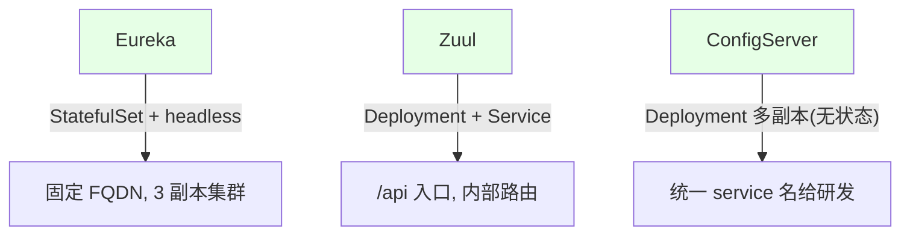
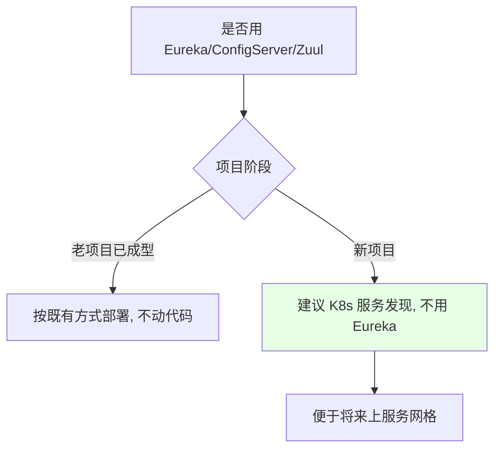

# Kubernetes 集群部署: SpringCloud 项目总结（部署方式与取舍建议）

开篇文章：SpringCloud 上 K8s 的核心结论是什么？结论先摆——三个组件各有**正确部署姿势**（Eureka 用 StatefulSet+headless、Zuul/ConfigServer 用 Deployment+Service），其他业务服务**不需要配 Service**（靠 Eureka 注册直连）；要不要用 Eureka/ConfigServer/Zuul **没有标准答案**，新项目建议直接用 K8s 服务发现以便于将来上服务网格，运维应在开发早期就给研发提建议。

## 纲要

- 三个组件的正确部署方式回顾
- 业务服务是否要配 Service
- 要不要用 Eureka / ConfigServer / Zuul
- 运维与研发的协作时机
- 新项目建议：K8s 服务发现 + 服务网格
- 万变不离其宗的理念

## 三个组件部署方式回顾



| 组件 | 部署方式 | 关键 |
| --- | --- | --- |
| Eureka | StatefulSet + headless service | 固定 FQDN，`defaultZone` 写三地址 |
| Zuul | Deployment + Service | 前端 `/api` 指它，内部路由自管 |
| ConfigServer | Deployment（无状态）多副本 | 给研发统一连接地址 |

## 业务服务要不要配 Service

```text
服务暴露规划:

组件/服务
├── Eureka     → 需要 Service (供注册/查看)
├── Zuul       → 需要 Service (网关入口)
├── ConfigServer → 需要 Service (配置拉取)
└── 其他 SpringBoot 业务服务 → 不需要 Service
    └── 地址注册到 Eureka, 通过注册表 IP:端口 直连
```

| 对象 | 是否需 Service | 原因 |
| --- | --- | --- |
| 三个组件 | 需要 | 供注册/入口/配置拉取 |
| 业务服务 | **不需要** | 注册到 Eureka 后被直连 |

> 注意：**没用 Eureka 时**，业务服务就需要配 Service 地址来被发现（走 K8s 服务发现）。用了 Eureka 则由注册表维护地址。

## 要不要用这三个组件



| 组件 | 建议 |
| --- | --- |
| Eureka | 新项目建议不用（K8s 发现更适配服务网格；Eureka 走向闭源） |
| ConfigServer | 可不用（环境变量/Service/ConfigMap 替代） |
| Zuul | 可用（避免 Ingress 路由爆炸） |

## 运维与研发的协作时机

```text
建议提出时机:

协作时机
├── 最佳: 项目开发早期, 运维/DevOps 介入
│   └── 一起定: 用不用 Eureka / ConfigServer / Zuul
└── 最晚: 上线通知时再提 → 已晚, 改代码成本高
```

| 时机 | 效果 |
| --- | --- |
| 早期介入 | 架构选型合理，避免返工 |
| 上线才提 | 研发已按全家桶开发，只能按部就班部署 |

> 「简单到没有缺陷」vs「复杂到没有缺陷」——选哪种由团队决定。若全基于 K8s 开发，周期可能更短；用 SpringCloud 全家桶逻辑更多、周期更长但更习惯。

## 新项目建议：K8s 服务发现 + 服务网格

```bash
# 新项目推荐: 用 K8s Service (基于 DNS) 做服务发现
# 业务服务都建 Service, 互相用 service 名调用
kubectl expose deployment service-a --port=80 --name=service-a
kubectl expose deployment service-b --port=80 --name=service-b
# 未来接入 Istio 等服务网格可精细管控流量/灰度/容灾
```

| 方向 | 说明 |
| --- | --- |
| 服务发现 | 用 K8s 基于 DNS 的发现（而非环境变量，需代码） |
| 服务网格 | 早期用 Eureka 后期上 Istio 改造极麻烦，故新项目直接 K8s 发现 |
| 收益 | 流量治理、灰度、容灾更易实现 |

## 万变不离其宗

```text
核心理念:

部署任何架构
├── 它都是由单个应用组成
├── 掌握: 单个应用如何正确上 K8s
├── 掌握: 它如何被正确访问
└── + 持续集成/持续部署理念 → 任何语言/架构都能 CI/CD
```

> 不必纠结「有没有演示过某架构」。只要掌握 K8s 概念与 CI/CD 理念，面对任何新架构（无论针对哪种语言）都能想清楚如何容器化部署。

## API 速览

| 能力 | 做法 |
| --- | --- |
| Eureka | StatefulSet+headless，固定 FQDN，3 副本 |
| Zuul | Deployment+Service，`/api` 入口 |
| ConfigServer | Deployment 多副本，统一连接地址 |
| 业务服务 | 用 Eureka 时**不**配 Service；用 K8s 发现时配 Service |
| Eureka 取舍 | 新项目建议不用，便于上服务网格 |
| ConfigServer | 可不用，用环境变量/Service/ConfigMap |
| Zuul | 可用，避免 Ingress 路由膨胀 |
| 理念 | 单应用上 K8s + CI/CD，举一反三 |

## Demo 示例

```bash
# 新项目推荐形态 (无 Eureka, 纯 K8s 服务发现)
kubectl -n $NAMESPACE expose deployment service-a --port=80 --name=service-a
kubectl -n $NAMESPACE expose deployment service-b --port=80 --name=service-b
# 研发配置里写 http://service-a / http://service-b (同 namespace)
# 未来接 Istio: 加 VirtualService/DestinationRule 即可做灰度流控

# 若用 Eureka 全家桶, 则只给三组件建 Service, 业务服务注册到 Eureka
```

### 总结

- **三个组件各有正确部署姿势**：Eureka 用 StatefulSet+headless service 生成固定 FQDN 组三副本集群；Zuul 用 Deployment+Service、前端 `/api` 指它；ConfigServer 无状态用 Deployment 多副本并给研发统一连接地址；
- **业务服务是否配 Service 取决于服务发现机制**：用 Eureka 时业务服务**不**配 Service（注册到 Eureka 后被直连）；用 K8s 服务发现时则都要配 Service 互用 service 名调用；
- **要不要用没有标准答案**：老项目按既有全家桶部署、不动代码；新项目建议直接用 K8s 服务发现（Eureka 走向闭源且难接入服务网格），ConfigServer 可不用（环境变量/Service/ConfigMap 替代），Zuul 可保留；
- **运维要在开发早期介入提建议**：上线通知时才提「要不要用」已太晚、改代码成本高；早期一起定架构选型，避免返工；
- **万变不离其宗**：任何架构都是单个应用组成，掌握「单应用如何正确上 K8s + 如何正确被访问」加 CI/CD 理念，就能举一反三到任何语言/架构——不必等逐框架演示。

