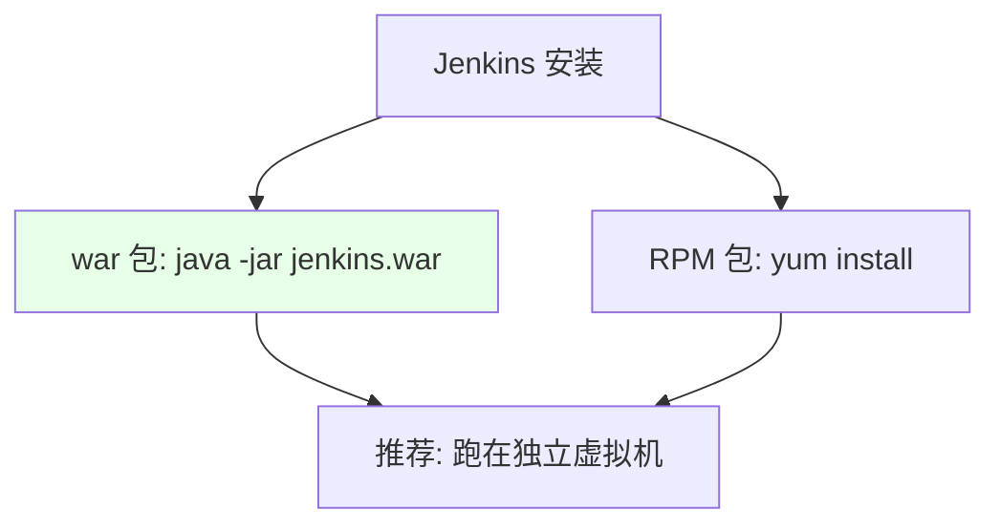
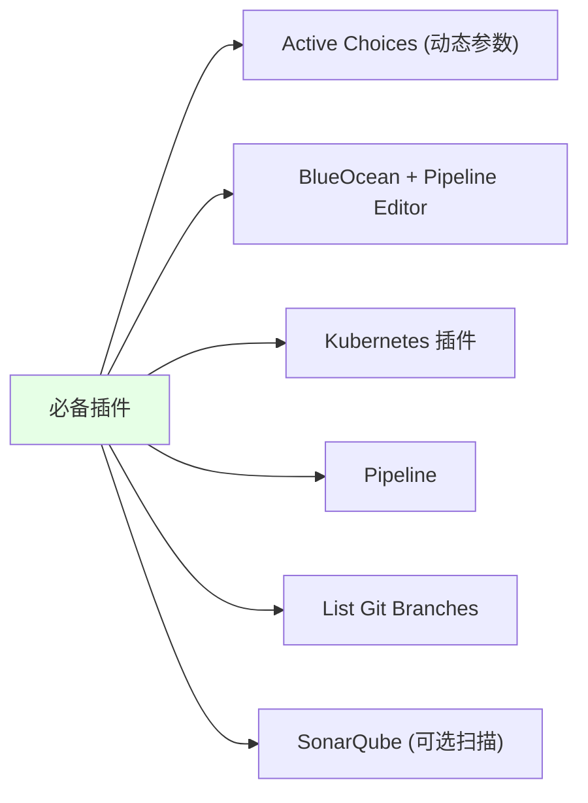

# Kubernetes 集群部署: Jenkins 安装（部署形态与插件管理）

开篇文章：Jenkins 怎么装最省心？结论先摆——推荐用 **war 包 + `java -jar` 跑在独立虚拟机**上（别放 K8s 里，没好存储会很慢）；数据全在 `$HOME/.jenkins` 目录、无数据库，迁移就是拷目录；插件要么提前拷 `plugins` 目录，要么装 **Active Choices / BlueOcean / Kubernetes / Pipeline / List Git Branches** 等必备项，**更新插件前务必先备份**。

## 纲要

- 安装方式：war 包 / RPM
- 推荐跑在独立虚拟机，不在 K8s
- 数据存储：整个 `$HOME/.jenkins` 目录
- 初始密码与目录结构
- 必备插件清单
- 插件更新必须备份

## 安装方式



| 方式 | 命令 | 说明 |
| --- | --- | --- |
| war 包 | `java -jar jenkins.war --httpPort=8080` | 最简单，推荐 |
| RPM | `yum install jenkins` | 也可，但 war 更灵活 |

> 建议找一台专门宿主机部署 Jenkins；若在 K8s Pod 里且没有好的后端存储，运行速度会非常慢。装在虚机上便于升级、迁移。

## 为什么不在 K8s 里

```text
部署形态选择:

部署位置
├── 独立虚拟机  ← 推荐: 便于管理/升级/迁移
└── K8s Pod    ← 无好存储时极慢, 不推荐
```

| 维度 | 独立虚拟机 | K8s Pod |
| --- | --- | --- |
| 存储 | 本地盘即可 | 需后端存储，否则慢 |
| 迁移 | 拷目录即可 | 需 PV/PVC |
| 升级 | 换 war 重启 | 需重新部署 |

## 数据存储：整个目录

```bash
# 启动后工作目录默认在 $HOME/.jenkins
java -jar jenkins.war --httpPort=8080

# 后台启动
nohup java -jar jenkins.war --httpPort=8080 > jenkins.log 2>&1 &

# 初始管理员密码在此文件
cat $HOME/.jenkins/secrets/initialAdminPassword
```

| 目录 | 内容 |
| --- | --- |
| `logs` | 日志 |
| `jobs` | 构建任务（可打包拷到另一台 Jenkins） |
| `plugins` | 插件（可整体迁移） |
| `agents` / `workspace` | 节点与构建工作区 |

> Jenkins 没有任何数据库，所有数据以目录形式存储，迁移就是把整个 `.jenkins` 目录拷过去。job / plugin 都可单独打包迁移，版本兼容即可直接启动。

## 目录结构与迁移

```text
$HOME/.jenkins/

.jenkins
├── logs/          ← 日志
├── jobs/          ← 构建任务 (可单独打包迁移)
├── plugins/       ← 插件 (可单独迁移, 版本兼容即启动)
├── agents/        ← 节点
├── workspace/     ← 工作区
└── secrets/       ← 初始密码等
```

> 升级也简单：下载新版 war 替换后重启即可。

## 必备插件清单



| 插件 | 用途 |
| --- | --- |
| Active Choices | 动态/级联变量参数 |
| BlueOcean | 可视化编辑流水线 |
| Kubernetes | 在 K8s 创建 Pod 作 slave |
| Pipeline | 声明式流水线（几乎全勾） |
| List Git Branches | 获取 GitLab 分支列表 |
| SonarQube | 代码扫描（可选） |

> 课程把常用插件打包好直接拷进 `plugins` 目录即可用，免去在线安装慢的痛。若公司已有 Jenkins，按需装上述插件。

## 插件更新必须备份

```bash
# 更新插件前先备份 plugins 目录
cp -r $HOME/.jenkins/plugins $HOME/.jenkins/plugins.bak

# 若更新失败导致 Jenkins 起不来, 用备份还原
rm -rf $HOME/.jenkins/plugins
cp -r $HOME/.jenkins/plugins.bak $HOME/.jenkins/plugins
```

| 注意点 | 说明 |
| --- | --- |
| 更新前备份 | 插件更新失败可能让 Jenkins 无法启动 |
| 版本兼容 | 迁移插件需版本兼容 |

## API 速览

| 能力 | 做法 |
| --- | --- |
| 安装 | `java -jar jenkins.war --httpPort=8080`（或 RPM） |
| 部署位置 | 独立虚拟机，不在无存储的 K8s |
| 数据 | 全在 `$HOME/.jenkins`，无数据库 |
| 初始密码 | `$HOME/.jenkins/secrets/initialAdminPassword` |
| 迁移 | 拷整个目录 / 单独拷 jobs / plugins |
| 升级 | 换 war 重启 |
| 必备插件 | Active Choices / BlueOcean / Kubernetes / Pipeline / List Git Branches |
| 插件更新 | **先备份再更新**，失败可还原 |

## Demo 示例

```bash
# 1. 后台启动 Jenkins
nohup java -jar jenkins.war --httpPort=8080 > jenkins.log 2>&1 &

# 2. 取初始密码
cat $HOME/.jenkins/secrets/initialAdminPassword

# 3. 更新插件前备份
cp -r $HOME/.jenkins/plugins $HOME/.jenkins/plugins.bak

# 4. (可选) 拷贝离线插件包到 plugins 目录后重启
cp -r /path/to/plugin-pack/* $HOME/.jenkins/plugins/
```

### 总结

- **推荐 war 包跑在独立虚拟机**：`java -jar jenkins.war --httpPort=8080` 最省心，不建议放进没有好存储的 K8s Pod（会极慢），虚机便于升级迁移；
- **数据全在 `$HOME/.jenkins` 目录、无数据库**：迁移就是拷整个目录，job 和 plugins 还能单独打包拷贝，版本兼容即可直接启动，升级也只需换 war 重启；
- **初始密码在 `secrets/initialAdminPassword`**：启动后按提示取密码改密码，目录结构 logs/jobs/plugins/agents/workspace 分工清晰；
- **必备插件清单**：Active Choices（动态参数）、BlueOcean（+Pipeline Editor）、Kubernetes 插件、Pipeline、List Git Branches，扫描可选 SonarQube，课程直接拷 `plugins` 目录最省事；
- **插件更新前务必备份**：更新失败可能导致 Jenkins 起不来，先 `cp -r plugins plugins.bak`，出问题用备份还原。

