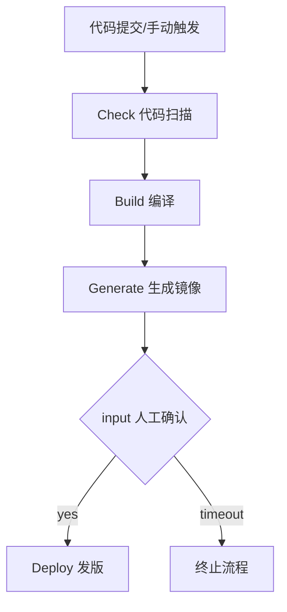

在编写 Jenkins 流水线时，最容易被"脚本式"和"声明式"两种写法搞混，导致 `pipeline {}` 与 `node {}` 混用、步骤不知道由哪个 agent 执行、以及明明想并行构建却串行了。结论是：现代 CI/CD 统一使用**声明式流水线**（`pipeline {}` 开头），通过 `agent` 指定执行节点、`post` 做收尾、`options` 控制超时与重试、`parameters`/`input` 传参与人工卡点、`when` 做条件、`parallel` 做并行，即可覆盖绝大多数场景。

## 纲要

- 声明式与脚本式流水线的根本区别以及为何主推声明式
- agent 的六种取值（any / none / label / node / docker / kubernetes）与优先级
- post 与 options：通知、超时、重试的标准写法
- parameters 与 input：参数化构建与人工审核门禁
- when 条件判断与 parallel 并行阶段的设计
- BlueOcean 对部分语法的可视化限制

## 一、声明式流水线基本结构

声明式流水线以 `pipeline {}` 开头，脚本式则以 `node {}` 开头。官方 2.0 之后主推声明式，结构更清晰、可校验。

```groovy
pipeline {
    agent any
    stages {
        stage('Build') {
            steps {
                sh 'mvn -B clean package'
            }
        }
        stage('Test') {
            steps {
                sh 'mvn test'
            }
        }
    }
}
```

## 二、agent 的几种取值与优先级

全局 `agent` 与 `stage` 内 `agent` 同时存在时，stage 级优先级更高。使用 `docker` 作为 agent 时，若某 stage 需要多个容器协作（如编译用 Maven、做镜像用 docker、发布用 kubectl），应将 `reuseNode` 或共享工作目录打开，保证文件在 stages 间可见。

```groovy
pipeline {
    agent none
    stages {
        stage('Build with Maven') {
            agent { label 'build' }
            steps { sh 'mvn package' }
        }
        stage('Image with Docker') {
            agent { docker 'docker:24' }
            steps { sh 'docker build -t $IMG .' }
        }
        stage('Deploy with kubectl') {
            agent {
                kubernetes {
                    yaml """
apiVersion: v1
kind: Pod
spec:
  containers:
  - name: kubectl
    image: bitnami/kubectl:latest
    command: [cat]
    tty: true
"""
                }
            }
            steps { sh 'kubectl apply -f deploy.yaml' }
        }
    }
}
```

下表汇总常用 `agent` 取值的语义：

| agent 取值 | 含义 | 典型使用场景 |
| --- | --- | --- |
| `any` | 任意可用节点 | 不挑机器的通用任务 |
| `none` | 无全局 agent，每个 stage 必须自带 | 多 stage 用不同容器 |
| `label` | 匹配标签的节点 | 指定 build / test 机 |
| `node` | 同 label，可自定义 `customWorkspace` | 需要固定工作目录 |
| `docker` | 启动容器作为执行环境 | 隔离编译依赖 |
| `kubernetes` | 动态起 Pod 执行 | K8s 内构建与发布 |

## 三、post 与 options

`post` 用于流水线结束或中断时执行收尾（如邮件通知），`options` 控制超时与重试。

```groovy
pipeline {
    agent any
    options {
        timeout(time: 1, unit: 'HOURS')
        retry(3)
    }
    stages {
        stage('Build') { steps { sh 'make' } }
    }
    post {
        always  { echo '无论成功失败都执行' }
        success { echo '构建成功' }
        failure { echo '构建失败' }
        unstable { echo '结果不稳定' }
        aborted { echo '被手动终止' }
    }
}
```

## 四、parameters 与 input：参数化与人工卡点

`parameters` 可在 Jenkinsfile 中声明变量（首次构建需先执行一次才会生效），`input` 实现人工审核门禁，常与 `options` 超时配合使用。

```groovy
pipeline {
    agent any
    parameters {
        string(name: 'DEPLOY_TO', defaultValue: 'uat', description: '是否部署及目标环境')
        choice(name: 'APP_ENV', choices: ['dev','uat','prod'], description: '部署类型')
    }
    stages {
        stage('Build') { steps { sh 'make' } }
        stage('Deploy') {
            steps {
                input message: '确认发布到生产？', ok: 'yes'
                sh 'kubectl apply -f deploy.yaml'
            }
        }
    }
}
```

注意：单引号不会展开变量，双引号才会。例如 `echo '$DEPLOY_TO'` 打印字面量，`echo "$DEPLOY_TO"` 才打印变量值。

## 五、when 条件与 parallel 并行

`when` 根据变量或分支决定是否执行某 stage；`parallel` 让多个 stage 同时执行，显著缩短代码扫描与构建的总时长。

```groovy
pipeline {
    agent any
    stages {
        stage('Build') { steps { sh 'make' } }
        stage('Parallel Checks') {
            parallel {
                stage('Scan')  { steps { sh 'sonar-scanner' } }
                stage('UT')    { steps { sh 'make test' } }
            }
        }
        stage('Deploy') {
            when { environment name: 'DEPLOY_TO', value: 'prod' }
            steps { sh 'kubectl apply -f deploy.yaml' }
        }
    }
}
```

`when` 常用组合：`branch 'master'`、`environment`、`allOf` / `anyOf` / `not`。

## 目录结构（典型 Jenkinsfile 组织）

```text
jenkins/
├── Jenkinsfile
├── vars/
│   ├── build.groovy
│   └── deploy.groovy
└── pipelines/
    ├── java.groovy
    └── nodejs.groovy
```

## 发布流程图



## API 速览

| 能力 | 做法 |
| --- | --- |
| 指定执行节点 | `agent { label 'build' }` 或 `agent any` |
| 容器化执行环境 | `agent { docker 'maven:3' }` |
| K8s 动态 Pod 执行 | `agent { kubernetes { yaml '''...''' } }` |
| 失败重试 | `options { retry(3) }` |
| 超时控制 | `options { timeout(time:1, unit:'HOURS') }` |
| 收尾通知 | `post { always {} failure {} }` |
| 声明构建变量 | `parameters { string/choice/booleanParam }` |
| 人工卡点 | `input message:'确认?'` |
| 条件跳过 stage | `when { environment/branch }` |
| 并行 stage | `parallel { stage('A'){} stage('B'){} }` |

## Demo 示例

```bash
# 在 Jenkins 上用声明式 Jenkinsfile 做参数化构建（变量使用 $ 形式）
JENKINS='http://'$TARGET_HOST':8080'
# 触发带参数的构建
curl -X POST "$JENKINS/job/$REPO/buildWithParameters" \
  --user '$JUSER:$JTOKEN' \
  --data DEPLOY_TO=uat --data APP_ENV=dev

# 查看某次构建的控制台输出
curl -X GET "$JENKINS/job/$REPO/$BUILD_NUMBER/consoleText" --user '$JUSER:$JTOKEN'
```

### 总结

- 声明式流水线以 `pipeline {}` 开头，是官方主推写法，结构可校验、易维护。
- `agent` 决定"谁执行"，全局与 stage 级冲突时 stage 级优先；多容器协作需共享工作目录。
- `post` 负责收尾通知，`options` 控制 `timeout` 与 `retry`，避免任务失控。
- `parameters` 做参数化、`input` 做人工门禁，二者配合可实现"审核后发版"。
- `when` 条件跳过 + `parallel` 并行，是缩短流水线时长的两个关键手段；注意 BlueOcean 对 `when` 等高级语法暂不支持在线编辑。

