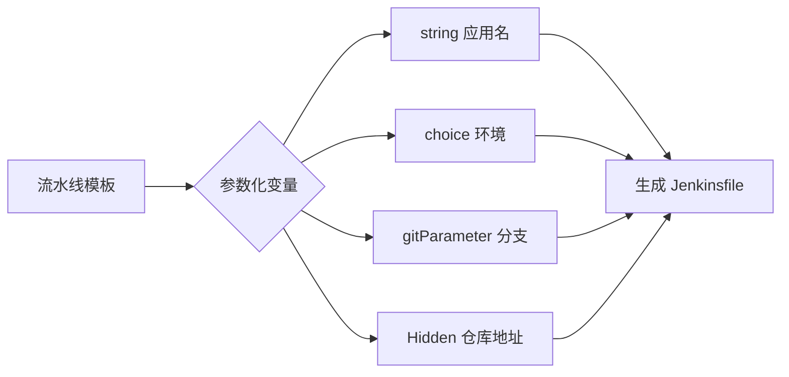

为什么同样的流水线要为 20 个项目写 20 份 Jenkinsfile？根本原因在于编译、扫描、做镜像、推仓库、发版这几步的命令高度雷同，差异只在分支、镜像名、环境、仓库地址等少数参数。结论是：把公共参数提取为**环境变量与参数化变量**，用一份 Jenkinsfile 配合不同入参即可驱动不同语言、不同模块的构建与发布，既减少重复又便于统一升级。

## 纲要

- 内置变量清单：BUILD_NUMBER、JOB_NAME、JOB_URL、BUILD_URL 等
- 自定义参数：string / choice / boolean / 隐藏参数（Hidden）
- 用 git parameter 动态列出分支并正则提取
- 将镜像仓库地址、镜像名、label、容器名等参数化
- 一份模板 + 多组参数实现多项目复用
- 单双引号对变量展开的影响

## 一、内置变量

在流水线 `sh` 步骤中执行 `env` 即可打印全部环境变量。常用内置变量如下：

```bash
# 在 Jenkinsfile 的 steps 中
sh 'env'
# 常用内置变量（部分）
echo "BUILD_NUMBER=$BUILD_NUMBER"   # 第几次构建
echo "JOB_NAME=$JOB_NAME"           # 任务名
echo "JOB_URL=$JOB_URL"             # 任务页面
echo "BUILD_URL=$BUILD_URL"         # 本次构建页面，邮件通知常用
echo "NODE_NAME=$NODE_NAME"         # 执行节点
```

## 二、参数化变量

`This project is parameterized` 后可添加多种参数。下面是常用类型对照：

| 参数类型 | 用途 | 示例 |
| --- | --- | --- |
| `string` | 普通字符串 | 应用部署类型 dev/uat/prod |
| `choice` | 下拉单选 | 是否部署：true/false |
| `booleanParam` | 布尔开关 | 是否推送镜像 |
| `gitParameter` | 列出 Git 分支 | 选择要构建的分支 |
| `password` / Hidden | 隐藏敏感值 | 镜像仓库地址、账号密码 |

```groovy
pipeline {
    agent any
    parameters {
        choice(name: 'DEPLOY_TO', choices: ['none','uat','prod'], description: '是否部署')
        gitParameter(name: 'BRANCH', type: 'PT_BRANCH', defaultValue: 'master',
                      description: '选择构建分支')
        string(name: 'IMG_NAME', defaultValue: 'app', description: '镜像名称')
        password(name: 'REGISTRY_ADDR', description: '镜像仓库地址(隐藏)')
    }
    stages {
        stage('Print') {
            steps {
                echo "branch=$BRANCH"
                echo "img=$IMG_NAME"
            }
        }
    }
}
```

## 三、gitParameter 列出分支并正则提取

`gitParameter` 可动态列出仓库分支。默认返回 `refs/heads/xxx`，用正则只取末尾分支名：

```groovy
parameters {
    gitParameter(
        name: 'BRANCH',
        type: 'PT_BRANCH',
        branchFilter: 'origin/(.*)',
        defaultValue: 'master',
        description: '选择需要构建的分支'
    )
}
```

## 四、参数化实现"一份模板多项目"

将差异项全部参数化，流水线本身只写逻辑：

```groovy
pipeline {
    agent { label "$AGENT_LABEL" }
    environment {
        REGISTRY = "$REGISTRY_ADDR"
        IMAGE   = "$REGISTRY/$NAMESPACE/$IMG_NAME:$BUILD_NUMBER"
    }
    stages {
        stage('Build')   { steps { sh "$BUILD_CMD" } }
        stage('Image')   { steps { sh 'docker build -t $IMAGE .' } }
        stage('Push')    { steps { sh 'docker push $IMAGE' } }
        stage('Deploy') {
            when { environment name: 'DEPLOY_TO', value: 'prod' }
            steps { sh 'kubectl apply -f deploy.yaml' }
        }
    }
}
```

## 目录结构（参数化模板）

```text
pipelines/
├── templates/
│   ├── java.groovy
│   └── nodejs.groovy
└── projects/
    ├── svc-a/
    │   └── params.env
    └── svc-b/
        └── params.env
```

## 参数类型对照图



## API 速览

| 能力 | 做法 |
| --- | --- |
| 读取内置变量 | 直接使用 `$BUILD_NUMBER`/`$JOB_URL` 等 |
| 普通字符串参数 | `parameters { string(name:'X', defaultValue:'') }` |
| 下拉单选 | `choice(name:'X', choices:['a','b'])` |
| 布尔参数 | `booleanParam(name:'X', defaultValue:false)` |
| 隐藏敏感参数 | `password(name:'X')` 或 Hidden 参数 |
| 列出 Git 分支 | `gitParameter(type:'PT_BRANCH')` |
| 正则提取分支名 | `branchFilter: 'origin/(.*)'` |
| 多项目复用 | 模板 + 传入不同参数组 |
| 变量展开 | 双引号 `"$VAR"` 才展开，单引号不展开 |

## Demo 示例

```bash
# 手动触发带参数构建（变量用 $ 形式传递）
curl -X POST "http://$TARGET_HOST:8080/job/$REPO/buildWithParameters" \
  --user '$JUSER:$JTOKEN' \
  --data DEPLOY_TO=prod --data BRANCH=master --data IMG_NAME=app

# 查看某分支最近一次构建的镜像标签
echo "镜像: $REGISTRY_ADDR/$NAMESPACE/$IMG_NAME:$BUILD_NUMBER"
```

### 总结

- 内置变量（`BUILD_NUMBER`/`JOB_URL`/`BUILD_URL`）是通知与追溯的基础，邮件里务必带上 `BUILD_URL`。
- `string`/`choice`/`booleanParam`/`password` 覆盖绝大多数参数化需求，敏感值用隐藏参数。
- `gitParameter` 可动态列分支，配合 `branchFilter` 正则只取分支名，避免 `refs/heads/` 噪声。
- 把镜像名、仓库地址、label、容器名、构建命令参数化后，一份 Jenkinsfile 即可服务多语言多模块。
- 牢记单引号不展开变量、双引号才展开，这是新手最常见的构建"变量打不出来"的原因。

