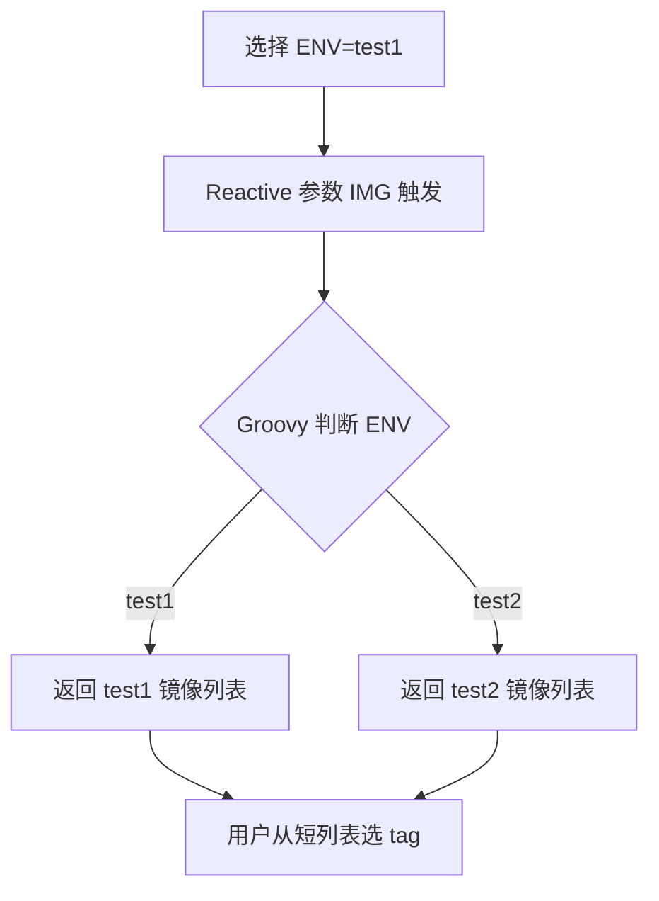

在发布流水线中，选了"测试环境 test1"后还要从所有镜像 tag 里大海捞针地找，既慢又容易选错。结论是：使用 **Active Choices Reactive** 参数，让第二个下拉框的值由第一个框（如机房、环境、分支）动态决定——选 test1 就只列出 test1 的镜像，选 test2 就只列出 test2 的镜像，既减少干扰又避免误发。

## 纲要

- 级联变量的本质：后一个变量根据前一个变量取值返回不同内容
- Active Choices Parameter 基础用法（单选/多选/过滤）
- Active Choices Reactive Parameter 关联上游变量
- 用 Groovy 脚本根据环境返回对应镜像列表
- 落地思路：调用镜像仓库接口拉 tag 再回填下拉框
- 在参数框中也可执行 shell 命令

## 一、什么是级联变量

级联变量（cascading parameter）指：第一个参数选定后，第二个参数的可选项由第一个值推导。典型场景：

- 选机房 → 列出该机房所有服务器 IP
- 选测试环境 → 列出该环境的镜像 tag
- 选多模块 → 勾选要发布的子应用

## 二、Active Choices Parameter 基础

安装 Active Choices 插件后，添加 `Active Choices Parameter`，用 Groovy 返回选项：

```groovy
// Active Choices Parameter: ENV
return ['test1', 'test2', 'test3']
```

展示形式可选 `radio`（单选）、`checkbox`（多选）、`multi-select`。选项多时可开启 `filter` 过滤（输入 test1 即只剩 test1）。

```groovy
// 多选示例（checkbox），便于一次发多个模块
return ['svc-user', 'svc-order', 'svc-pay']
```

## 三、Active Choices Reactive 关联上游

`Active Choices Reactive Parameter` 通过 `Referenced parameters` 关联上游变量（如 `ENV`），根据上游取值返回不同结果。

```groovy
// Reactive Parameter: IMG，关联 ENV
if (ENV.equals('test1')) {
    return ['test1-image:001', 'test1-image:002']
} else if (ENV.equals('test2')) {
    return ['test2-image:001', 'test2-image:002']
} else {
    return ['test3-image:001']
}
```

| 配置项 | 含义 |
| --- | --- |
| Name | 本参数名，如 `IMG` |
| Script | Groovy 脚本，根据上游变量 return 列表 |
| Referenced parameters | 上游参数名，如 `ENV` |
| Choice Type | radio / checkbox / multi-select |

提示：选 `radio` 时可设 `defaultValue` 默认勾选；`checkbox` 适合"勾选多个模块一起发"。

## 四、落地：调用仓库接口回填镜像 tag

高级用法是在 Reactive 脚本里调用镜像仓库接口，把 tag 列表拉回来回填。以 Harbor 为例（阿里云用其 CLI，思路一致）：

```bash
# Harbor：直接请求 API 取某仓库的 tag 列表
curl -u '$REG_USER:$REG_PASS' \
  "https://$REGISTRY_ADDR/api/v2.0/projects/$NS/repositories/$IMG/artifacts?page_size=20" \
  | jq -r '.[].tags[].name'

# 阿里云：用其 CLI 取 tag
aliyun cr get-repo-tags --namespace $NS --repo-name $IMG \
  | jq -r '.data[].tag'
```

在 Groovy 脚本中可用 `sh` 或 `HttpReq` 调用上述命令，把结果 `return` 给下拉框即可实现"选环境→列该环境镜像"。

## 目录结构（级联参数配置）

```text
jenkins/
├── Jenkinsfile
└── vars/
    ├── activeChoices.groovy
    └── listImages.groovy
```

## 级联变量数据流



## API 速览

| 能力 | 做法 |
| --- | --- |
| 单选下拉 | `Active Choices Parameter` + `return ['a','b']` |
| 开启过滤 | Choice Type 设 `radio` 并启用 `filter` |
| 多选模块 | Choice Type 设 `checkbox` |
| 关联上游 | `Active Choices Reactive` 填 `Referenced parameters` |
| 按上游返回值 | Groovy `if (ENV.equals('x')) return [...]` |
| 默认勾选 | Reactive 参数设 `defaultValue` |
| 拉取镜像 tag | 调 Harbor API / 阿里云 CLI + `jq` |
| 参数内执行命令 | 脚本里调用 `sh` 或 HTTP 请求 |

## Demo 示例

```bash
# 在 Reactive 脚本里用 shell 拉 Harbor tag 并交给 jq 解析
TAGS=$(curl -s -u '$REG_USER:$REG_PASS' \
  "https://$REGISTRY_ADDR/api/v2.0/projects/$NS/repositories/$IMG/artifacts" \
  | jq -r '.[].tags[].name')

# 阿里云等价命令
aliyun cr get-repo-tags --namespace $NS --repo-name $IMG | jq -r '.data[].tag'
echo "可发版镜像: $TAGS"
```

### 总结

- 级联变量的核心价值是"减少选项噪声"，选了环境就只看该环境的镜像，避免选错。
- `Active Choices Parameter` 用 Groovy `return` 列表，支持 radio/checkbox/multi-select 与过滤。
- `Active Choices Reactive` 通过 `Referenced parameters` 关联上游，实现真正的联动。
- 进阶玩法是在脚本里调镜像仓库接口（Harbor API 或阿里云 CLI）+ `jq` 解析 tag 回填下拉框。
- 多选 checkbox 适合"一次勾选多个模块批量发版"；注意变量引用与 Groovy 语法的大小写。

