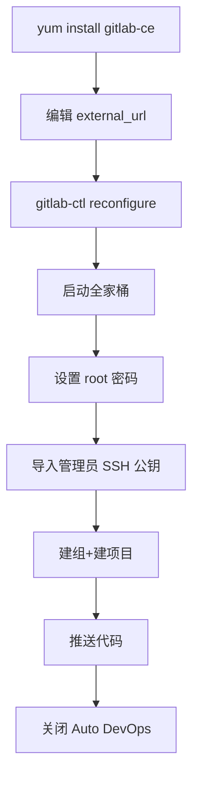

想让 Jenkins 自动拉取代码并触发 CI/CD，前提是有一个可访问的 Git 仓库。自建 GitLab 是常见选择，但装完常遇到端口冲突、管理员 Key 没配导致无法 clone、自动 DevOps 流水线干扰等问题。结论是：用 `yum install gitlab-ce` 一键安装，改 `external_url` 后 `gitlab-ctl reconfigure` 重载，导入管理员 SSH 公钥，并关闭自动 DevOps，即可成为一个干净的代码源。

## 纲要

- GitLab 一键安装与端口占用注意（80 / 6379 / PostgreSQL / Redis / NGINX）
- 修改 `external_url` 并执行 `gitlab-ctl reconfigure` 重载
- 启动/停止全家桶中的单个或所有服务
- 设置管理员密码并导入管理员 SSH 公钥
- 创建组（Group）与项目（Project），推送示例代码
- 关闭 Auto DevOps，避免干扰自有流水线

## 一、安装 GitLab

GitLab 现在支持 `yum` 直接安装，会占用较多端口（80、6379、PostgreSQL、Redis、NGINX 等），安装前确保这些端口未被占用（演示中曾卸载 Ingress 以释放 80）。

```bash
# 添加源并安装 GitLab CE
yum install -y gitlab-ce

# 修改外部访问地址（按需改为实际域名/IP）
vi /etc/gitlab/gitlab.rb
# 设置：external_url 'http://$TARGET_HOST'

# 重载配置并启动（首次较慢）
gitlab-ctl reconfigure
```

## 二、服务管理

GitLab 是"全家桶"，可按需启停：

```bash
gitlab-ctl restart          # 重启所有服务
gitlab-ctl stop gitlab-rails
gitlab-ctl stop grafana     # 用不到的可停掉，如 Prometheus/Grafana
gitlab-ctl status
```

## 三、管理员与 SSH Key

首次访问设置管理员（root）密码。导入 master 节点的 SSH **公钥**到管理员账户的 SSH Keys，使该管理员对全部项目拥有 push/pull 权限（无需逐个项目授权）。

```bash
# 在 master01 生成（若未生成）并查看公钥
ssh-keygen -t rsa -b 4096
cat ~/.ssh/id_rsa.pub

# 将上面输出粘贴到 GitLab：
# 用户头像 → Settings → SSH Keys → Add key
```

私钥保留在 Jenkins 凭证中（见 9-8），公钥留在 GitLab，二者配对即可免密拉取。

## 四、创建组与项目并推送代码

```bash
# 在 GitLab 网页：New group（如 springcloud-demo-group）
# 在组内 New project（如 springcloud-demo）

# 本地推送示例代码
git clone "http://$TARGET_HOST/springcloud-demo-group/springcloud-demo.git"
cd springcloud-demo
cp -r $SRC_PATH/* .
git add .
git commit -m "init: import demo"
git push origin master
```

## 五、关闭 Auto DevOps

新版默认开启 Auto DevOps，会干扰自有 Jenkins 流水线，需在项目与全局设置中关闭。

```text
项目 Settings → CI/CD → Auto DevOps → 取消 "Default to Auto DevOps pipeline"
Admin → Settings → CI/CD → 全局关闭 Auto DevOps
```

## 目录与访问结构

```text
gitlab.example.com/
├── groups/
│   └── springcloud-demo-group/
│       └── springcloud-demo/      # project
│           ├── branches/
│           └── settings/
│               ├── members
│               └── ssh_keys
└── admin/
    └── settings/
        └── CI/CD (关闭 Auto DevOps)
```

## GitLab 安装后组件



## API 速览

| 能力 | 做法 |
| --- | --- |
| 安装 GitLab | `yum install -y gitlab-ce` |
| 修改访问地址 | 编辑 `/etc/gitlab/gitlab.rb` 的 `external_url` |
| 重载配置 | `gitlab-ctl reconfigure` |
| 启停服务 | `gitlab-ctl restart/stop <service>` |
| 设置管理员 | 网页首次访问设 root 密码 |
| 配置 SSH | Settings → SSH Keys 添加 `id_rsa.pub` |
| 建组/项目 | New group / New project |
| 推送代码 | `git clone` + `git add/commit/push` |
| 关自动流水线 | 项目/全局 Settings 关 Auto DevOps |

## Demo 示例

```bash
# 在 GitLab 服务器上查看状态
gitlab-ctl status

# 本机生成密钥并查看公钥（用于粘贴到 GitLab）
ssh-keygen -t rsa -b 4096 -f ~/.ssh/id_rsa
cat ~/.ssh/id_rsa.pub

# 克隆并推送
git clone "http://$TARGET_HOST/$NS/springcloud-demo.git"
cd springcloud-demo
cp -r "$SRC_PATH/." .
git add .
git commit -m "init"
git push origin master
```

### 总结

- GitLab 可用 `yum install gitlab-ce` 一键安装，但会占用 80/6379 及 PG/Redis/NGINX 等端口，安装前先排查冲突。
- 改完 `external_url` 必须 `gitlab-ctl reconfigure` 才能生效；服务以全家桶形式运行，可单服务启停。
- 用管理员（root）的 SSH 公钥统一授权，可对所有项目拥有权限，省去逐项目加 member 的麻烦。
- 建组→建项目→推送代码，即得到一个可被 Jenkins 拉取的代码源。
- 务必关闭 Auto DevOps，否则会与自有 Jenkins 流水线互相干扰。

