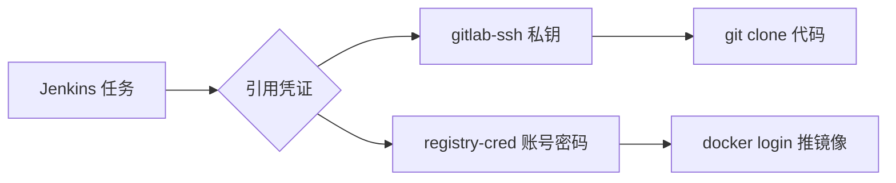

Jenkins 要拉 GitLab 代码、推镜像到仓库，离不开凭证。常见错误是把 master 节点的公钥传给了 GitLab 却忘了把**私钥**存进 Jenkins，或者镜像仓库账号密码散落明文在脚本里。结论是：在 Jenkins 凭证库里只存两类东西——GitLab 的 **SSH 私钥凭证** 和 **镜像仓库的账号密码凭证**，后续在 Jenkinsfile 中以变量方式引用，既安全又统一管理。

## 纲要

- 凭证要存的两类内容：GitLab SSH 私钥、镜像仓库账号密码
- 管理员公钥已在 GitLab、私钥存入 Jenkins 的链路
- 添加"账号密码"类型凭证（如阿里云/Harbor  Registry）
- 添加"SSH Username with private key"类型凭证
- 验证凭证可用：列出 GitLab 分支
- 后续在 pipeline 中引用凭证的方式预告

## 一、凭证链路梳理

前面在 GitLab 管理员账户导入了 master01 的 **公钥**（`id_rsa.pub`）。对应地，要把同一对密钥的 **私钥**（`id_rsa`）存入 Jenkins，这样 Jenkins 拉代码时即用该私钥认证。

```text
master01 生成密钥对
├── id_rsa.pub  ──粘贴到──> GitLab 管理员 SSH Keys（公钥）
└── id_rsa     ──存入────> Jenkins Credentials（私钥）
```

## 二、添加镜像仓库账号密码凭证

路径：Jenkins → Manage Jenkins → Credentials → System → Global → Add Credentials，类型选 **Username with password**。

```bash
# 凭证示例（在 Jenkins 网页填写，不要写进脚本）
# 类型: Username with password
# Username: $REG_USER        # 如阿里云账号或 Harbor 账号
# Password: $REG_PASS
# ID: registry-cred         # 后续引用用此 ID
```

## 三、添加 GitLab SSH 私钥凭证

类型选 **SSH Username with private key**，把私钥内容粘贴进去；若生成密钥时设了 passphrase 也要填，本例未设则为空。

```bash
# 在 Jenkins 网页填写
# 类型: SSH Username with private key
# Username: git            # GitLab 一般使用 git 用户
# Private Key: 粘贴 $HOME/.ssh/id_rsa 全文
# Passphrase: （空）
# ID: gitlab-ssh           # 后续引用用此 ID
```

## 四、验证凭证可用

添加后用"列出 GitLab 分支"测试 SSH 凭证是否生效（注意域名要在 Jenkins 主机 `/etc/hosts` 解析）。

```bash
# 在 Jenkins 任务中选择 gitlab-ssh 凭证，填入仓库地址，测试列出分支
git ls-remote "git@$TARGET_HOST:$NS/springcloud-demo.git"
# 能列出 refs/heads/* 即说明 SSH 凭证可用
```

## 凭证目录结构（逻辑视图）

```text
Jenkins Credentials (Global)
├── registry-cred          # Username with password → 镜像仓库
└── gitlab-ssh             # SSH private key → GitLab
```

## 凭证类型对照

| 凭证类型 | 用途 | 关键字段 |
| --- | --- | --- |
| Username with password | 镜像仓库登录 | Username/Password/ID |
| SSH Username with private key | GitLab 拉代码 | Username/Private Key/ID |
| Secret text |  token / webhook | Secret/ID |

## 凭证引用流程



## API 速览

| 能力 | 做法 |
| --- | --- |
| 进入凭证管理 | Manage Jenkins → Credentials → Global → Add |
| 存仓库账号密码 | 类型选 `Username with password`，设 ID |
| 存 GitLab 私钥 | 类型选 `SSH Username with private key`，粘私钥 |
| 引用凭证 ID | pipeline 中 `credentials('gitlab-ssh')` |
| 验证 SSH 凭证 | `git ls-remote git@host:ns/repo.git` |
| 注意域名解析 | Jenkins 主机 `/etc/hosts` 配 GitLab 域名 |
| 建议使用高权限 | 管理员公钥免逐项目授权 |

## Demo 示例

```bash
# 1) 复制私钥内容到剪贴板（用于粘贴进 Jenkins）
cat ~/.ssh/id_rsa

# 2) 测试 SSH 凭证是否可拉取 GitLab 分支
git ls-remote "git@$TARGET_HOST:$NS/springcloud-demo.git"

# 3) 用账号密码凭证登录镜像仓库（供后续 push）
docker login "$REGISTRY_ADDR" -u "$REG_USER" -p "$REG_PASS"
```

### 总结

- 凭证只需两类：GitLab **SSH 私钥** 与 镜像仓库 **账号密码**，集中存在 Jenkins 凭证库。
- 公钥在 GitLab（管理员 SSH Keys），私钥在 Jenkins，二者配对即可免密拉代码。
- 账号密码凭证用 `Username with password`，SSH 用 `SSH Username with private key`，都要设稳定 ID 以便引用。
- 验证 SSH 凭证用 `git ls-remote`；别忘了在 Jenkins 主机 `/etc/hosts` 解析 GitLab 域名。
- 建议用高权限管理员密钥，避免每个项目逐个加 member 的繁琐；后续在 pipeline 中以 `credentials()` 引用即可。

