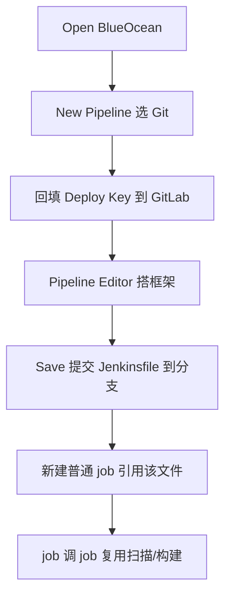

原生 Jenkins 界面步骤多了之后，根本看不出执行到哪一步、日志从哪开始、出错在哪一步。结论是：用 **BlueOcean** 插件获得清晰的分步视图、分步日志与失败高亮，并用其 Pipeline Editor **图形化搭框架**后提交到 GitLab；再新建普通 job 引用该 Jenkinsfile，做到"框架可视化设计、业务 job 引用"，避免手写出括号/语法错误。此外可用"job 调 job"拆分复用超长流水线。

## 纲要

- 原生 Jenkins 界面的三大痛点（不美观/步骤难定位/错误难查）
- BlueOcean 的价值：清晰步骤、分步日志、失败红色高亮、指定步骤重跑
- 用 Pipeline Editor 可视化创建并提交 Jenkinsfile 到 GitLab
- 生成的是多分支流水线（扫描所有分支的 Jenkinsfile）
- 变量放 job 还是放 Jenkinsfile 的取舍
- job 调 job：用 build step 复用与拆分超长流水线

## 一、原生界面痛点

普通 Jenkins 任务构建历史里，步骤一多就分不清执行到哪、日志起点在哪、报错在哪一步，定位成本很高。

## 二、BlueOcean 的核心能力

打开 BlueOcean 插件后：

- 每个 stage 清晰可见，点击即看该步日志
- 失败步骤标红，点击即可查看报错
- 支持从指定 stage 重跑（`Restart from stage`）
- 可直接在 Pipeline Editor 中增删步骤、设并行

```text
BlueOcean 视图
├── 构建历史（每个 run 一行）
├── 阶段视图（stage 横向排列）
│   ├── Test Stage
│   ├── Build Stage
│   └── Deploy Stage
└── 单步日志（点击展开）
```

## 三、用 Pipeline Editor 创建并提交

进入 Jenkins 主页 → Open BlueOcean → New Pipeline → 选 Git（如 GitLab）。BlueOcean 自动生成 Deploy Key 需回填到 GitLab；若仓库已有 Jenkinsfile 会自动读取各分支，否则新建。

```bash
# 图形化添加步骤后，点 Save 会提示提交到分支（如 master）
# 提交后在 GitLab 仓库生成对应 Jenkinsfile
# 可添加：sh 'echo step1' / printMessage / sleep / parallel 等
```

生成的结构（节选）：

```groovy
pipeline {
    agent any
    stages {
        stage('Test Stage') {
            steps { sh 'echo step1' }
        }
        stage('Parallel Stage') {
            parallel {
                stage('step-a') { steps { sh 'sleep 3' } }
                stage('step-b') { steps { echo 'hi' } }
            }
        }
        stage('Build') {
            steps { sh 'echo build' }
        }
    }
}
```

## 四、多分支流水线与变量位置

BlueOcean 创建的是**多分支流水线**，会扫描项目各分支下的 Jenkinsfile。关于变量放在哪：

| 变量位置 | 优点 | 缺点 |
| --- | --- | --- |
| 放在 Jenkinsfile（`parameters`） | 一份文件即完整，可直接跑 | 20 个项目要写 20 份 |
| 放在 job 配置 | 同份 Jenkinsfile 多 job 复用，改 job 即可 | 独立变量时该 job 才可用 |

结论：同类项目共用一份 Jenkinsfile，差异变量放 job 配置，复制 job 时改参数即可。

## 五、job 调 job 复用

对超长流水线，可拆成多个小 job，用 build step 互相调用与复用（如公共"代码扫描"job 被多个项目调用）。

```groovy
// 在流水线中调用另一个 job
stage('Trigger Scan') {
    steps {
        build job: 'code-scan',
             parameters: [string(name: 'REPO', value: "$REPO")],
             wait: true   // 是否等待其完成
    }
}
```

注意：build step 的 `quietPeriod` 等数字参数必须填值（官方已知 bug，空值可能调不起来）。

## 目录与产物结构

```text
gitlab: springcloud-demo-group/springcloud-demo/
├── Jenkinsfile              # 由 BlueOcean 提交
├── deploy.yaml
└── branches/
    ├── master
    └── dev

jenkins jobs/
├── pipeline-framework      # BlueOcean 设计出的框架
└── svc-a-build             # 普通 job，引用 Jenkinsfile
```

## 流水线设计流程



## API 速览

| 能力 | 做法 |
| --- | --- |
| 打开可视化 | Jenkins → Open BlueOcean |
| 新建流水线 | BlueOcean → New Pipeline → Git/GitLab |
| 关联仓库 | 回填自动生成的 Deploy Key 到 GitLab |
| 图形搭框架 | Pipeline Editor 增删步骤/设并行 |
| 提交文件 | Save 到指定分支生成 Jenkinsfile |
| 多分支扫描 | 多分支流水线自动扫各分支 Jenkinsfile |
| 指定步重跑 | 点 stage → Restart from stage |
| job 调 job | `build job:'x', wait:true` |
| 变量复用 | 同类项目共用 Jenkinsfile，差异放 job |

## Demo 示例

```bash
# 安装 BlueOcean 插件后，在 Jenkins 主机查看插件状态
curl -s "http://$TARGET_HOST:8080/blue/rest/organizations/jenkins/pipelines/" \
  --user '$JUSER:$JTOKEN'

# 新建普通 job 引用 GitLab 的 Jenkinsfile（示意：在 job 配置里填）
#  - Definition: Pipeline script from SCM
#  - SCM: Git, Repository URL: http://$TARGET_HOST/$NS/springcloud-demo.git
#  - Script Path: Jenkinsfile
```

### 总结

- 原生 Jenkins 界面步骤多时难定位、难排错，BlueOcean 提供清晰分步视图、分步日志与失败红色高亮。
- 用 Pipeline Editor 图形化搭出流水线框架并提交到 GitLab，比手写更不易出错（少括号/语法问题）。
- BlueOcean 生成的是多分支流水线，会扫描各分支 Jenkinsfile，适合按分支管理。
- 变量建议放 job 配置、Jenkinsfile 只放逻辑，使同类项目共用一份文件、复制 job 改参数即可。
- 超长流水线用"job 调 job"（`build` step）拆分复用；注意 `build` 的数字参数必填（官方已知 bug）。

