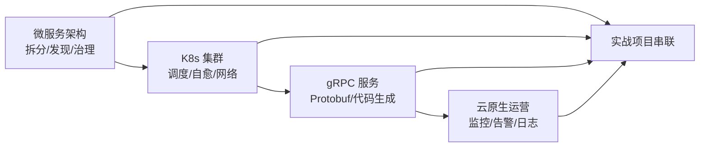

# Kubernetes + gRPC 云原生微服务实战：课程导学

欢迎来到一凡老师的实战课。这门课的全名是 **K8s + gRPC 云原生微服务开发与治理实战**。它要解决的不是某一个孤立的知识点，而是一整条链路：怎么把一个用多种语言写出来的微服务系统，装进容器、跑上 Kubernetes，并用云原生的开源产品把服务治理、可观测、可运营这几件难事统一收口。

如果你团队里同时有 Java（Spring Boot）、Go（gRPC / Gin）、Node（Next）等多种技术栈，那么"服务治理"就会变成每个语言各搞一套的烂摊子。本课程的目标，就是把这些共性难题——服务发现、负载均衡、扩缩容、健康检查、灰度、治理——**统一收敛到 K8s 这个底座上**，让你不再被编程语言绑死。

## 纲要

- 课程要解决的三个核心痛点：多语言治理、快速入门 K8s 体系、gRPC 内部调用
- 课程宗旨只有六个字：懂原理、会操作
- 技术栈全景：从 Docker 到 KCNA 真题
- 课程计划：原理 → 搭建集群 → 实战开发 → 治理运营 → 压测与认证
- 适合人群与学习建议

## 课程要解决的三个核心痛点

课程导学里明确抛出了三个反复被问到的问题，它们也正是整门课的线索：

| 痛点 | 具体处境 | 课程给的解法 |
| --- | --- | --- |
| **多语言服务治理难** | 团队跨 Spring Boot / Go / Next 等多种框架，治理方案各写一套 | 把治理收归 K8s + 云原生开源产品，摆脱语言绑定 |
| **K8s 体系太大、门槛高** | 产品多、概念杂、上手慢 | 覆盖绝大部分 K8s 云原生产品与知识，理论 + 大量实操 |
| **内部调用用 REST 太重** | 服务间内部调用若全用 HTTP/REST，定义易漂移、联调复杂、性能一般 | 引入 gRPC（Protobuf + 多语言代码生成），并补充 REST 网关双协议 |

第三点值得单独展开：微服务架构下，**服务之间的内部调用**才是调用量的大头——一个"用户任务列表"页面背后可能串联任务服务、用户服务、推荐服务、告警服务等十几个微服务。如果全部用 REST 来定义接口，虽然灵活，但容易出现"定义不够严谨、联调混乱、契约复杂"的问题。改用 gRPC 之后，用 `.proto` 文件定义服务、用 `protoc` 生成多语言的服务端/客户端代码，既统一了契约，又用 Protobuf 二进制提升了网络性能。课程还会讲多种把 gRPC 暴露成 REST API 的方法，让你**同时握有 gRPC 和 HTTP 两种协议**。

## 课程宗旨：懂原理、会操作

六个字拆开看：

- **懂原理**：微服务架构、K8s 集群、gRPC 架构、云原生服务运营，这些内容的底层原理才是重点。很多人"听说过、用过，但没真搞懂"——比如服务怎么拆更合理、服务发现与治理怎么落地、K8s 核心组件有哪些、集群内外怎么访问。
- **会操作**：课程用**一个完整的实战项目（用户积分与等级服务）**把全部知识串起来，覆盖环境部署、服务设计、开发、测试、部署、治理、运营的全流程。



## 技术栈全景

课程里用到的开源项目与云服务，基本就是一套标准的云原生工具箱：

```dir
课程技术栈（云原生工具箱）
├── 镜像与交付
│   ├── Docker（制作镜像）
│   └── Helm（制作 K8s 软件包 / Chart）
├── 集群与网络
│   ├── Kubernetes 集群（核心底座）
│   └── Ingress（集群统一对外入口）
├── 服务治理
│   ├── Istio / ServiceMesh（流量治理）
│   └── gRPC + Protobuf（内部调用）
├── 可观测性
│   ├── Prometheus（指标采集）
│   ├── Grafana（图表展示）
│   ├── AlertManager（告警）
│   └── 云日志服务 / COS（日志与对象存储）
├── 数据与接口
│   ├── MyBatis（数据层封装）
│   └── gRPC-Gateway（REST 接口暴露）
├── 压测与认证
│   ├── wrk（压力测试）
│   └── KCNA 真题讲解
```

## 课程计划安排

整门课的推进顺序是"先原理、后动手、再收口"：

1. **概念与底层原理**：微服务架构、gRPC、K8s 框架先讲清楚；
2. **上手实践**：搭建 K8s 集群，设计并开发实战 gRPC 服务，完成开发/测试/部署；
3. **延伸内容**：更多云原生产品与治理能力的实操；
4. **治理与运营**：单独章节讲微服务治理与运营，建立对 K8s + 治理 + 运营的完整认识；
5. **压测与认证**：wrk 压测 + KCNA 认证真题讲解。

## 适合人群与学习建议

这门课定位是**中级偏高级**，适合已经具备一定开发与运维能力的后端开发、运维开发工程师。课程以 Go 语言为主，但**不局限于 Go**——会其他语言也完全可以学。

学习建议三条，建议照做：

- 从**官网文档 / 手册**获取最新一手资料（很多是英文，翻译一下能懂）；
- 跟着课程**动手实践一遍**，本地或云服务器都行；
- 多思考、把内容**扩展到自己的工作中**，把学习真正转化为生产力。

## 总结

课程导学把整门课的"为什么学、学什么、怎么学"交代清楚了：

1. **痛点驱动**：多语言服务治理被语言绑死、K8s 体系门槛高、内部调用用 REST 过重，这三件事是课程的出发点；
2. **gRPC 是内部调用的更优解**：`.proto` 统一定义 + `protoc` 多语言生成，比 REST 更严谨、更高性能，课程还补了 REST 网关让你双协议在手；
3. **宗旨就六个字**：懂原理、会操作，靠一个"用户积分与等级服务"实战项目把知识串成线；
4. **技术栈即标准云原生工具箱**：Docker / Helm / K8s / Ingress / Istio / Prometheus / Grafana / AlertManager / 日志服务 / wrk；
5. **推进节奏清晰**：原理 → 集群 → 实战开发 → 治理运营 → 压测与 KCNA；
6. **面向中高级后端 / 运维开发**，Go 为主但不限语言，强调"官网一手资料 + 动手 + 落地到工作"。
