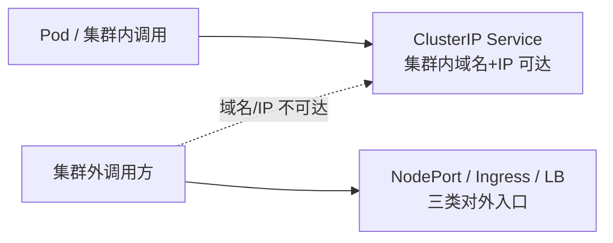

# K8s 服务暴露本章导学：从 NodePort 到 Ingress

本章要解决一个非常实际的问题：**怎么让 K8s 集群外面的调用方，访问到集群里面的服务**。我们开发出来的普通 Service，在集群内部可以靠服务域名（比如 `my-svc.default.svc.cluster.local`）访问，也可以直接用 ClusterIP 访问；但一旦出了集群，服务的域名和 ClusterIP 就都失效了。

针对 HTTP 类型的 Web 服务，给它配一个 Ingress 来对外暴露 API 接口，是一个非常好的选择。本章的脉络是：先认识 NodePort 的问题，再重点把 Ingress 用起来，最后对比 LoadBalancer。

## 纲要

- 集群内可达、集群外不可达：Service 的访问边界
- NodePort 为什么"能少用就少用"
- 本章重点：在云上部署 Ingress 并配置转发规则
- gRPC 与 HTTP 双协议都要支持
- 收尾对比：LoadBalancer 方式与它的代价

## Service 的访问边界

K8s 里最基础的 Service 类型是 `ClusterIP`：它只在集群内部的虚拟网络上分配一个 IP，配合 CoreDNS 做服务域名解析，Pod 之间互相调用很方便。但 ClusterIP 永远不通集群外，这是设计使然——它本就是"集群内部服务发现"的工具，不是对外入口。



要把服务暴露到集群外，K8s 提供了不止一种方式。本章会依次看 NodePort、Ingress、LoadBalancer 三种，并讲清楚各自适合什么场景。

## NodePort：能用，但有代价

NodePort 是在每个节点上开一个固定端口（默认范围 `30000-32767`），把流量转发到后端 Pod。它的问题在于：**基于 Web 服务的特点，实际用 NodePort 暴露服务的情况比较少**，但原因值得了解，因为特殊场景下仍可能用到。具体代价本章后面会展开（端口管理/节点 IP 稳定/额外转发跳），导学阶段先建立"它是备选而非首选"的认知。

## 本章重点：把 Ingress 真正用起来

Ingress 是本章的重头戏。我们会在云上（课程用的是腾讯云）把 Ingress Controller 部署起来，并配置转发规则，把"用户积分与等级服务"通过 Ingress 暴露出去，作为集群内服务的统一访问入口。

要点有两个层面：

- **80 端口的 HTTP / Web API 路由转发**：这是 Ingress 最擅长的 L7 路由，按域名 / 路径把请求分到不同后端 Service；
- **443 端口的 gRPC 服务转发**：因为我们的服务用的是 gRPC 协议，同时我们也实现了 REST API，所以 Ingress 要**同时支持 gRPC 和 HTTP 两种协议**——这部分配置相对复杂（涉及 TLS 证书、Secret、后端协议声明），但学会之后通用性很强。

```dir
本章 Ingress 实战路径
├── 部署 Ingress Controller（云上）
├── 配置转发规则（暴露用户积分等级服务）
│   ├── 80 端口：HTTP / Web API 路由
│   └── 443 端口：gRPC 转发（TLS + Secret + 后端协议）
└── 对比 LoadBalancer 方式
```

## gRPC 与 HTTP 双协议

我们的实战服务同时提供了 gRPC 接口和 REST API。Ingress 侧两种都要能接：

- HTTP API：常规 `host` + `path` 路由即可；
- gRPC：必须让 Ingress 把后端协议识别为 `GRPC`（以 NGINX Ingress 为例，常见做法是给后端 Service 加注解 `nginx.ingress.kubernetes.io/backend-protocol: "GRPC"`，并配好 TLS）。

具体注解键名与取值**建议以你所用 Ingress Controller 的官方文档为准**（不同实现差异较大），本章实操会带你逐个配通。

## 收尾对比：LoadBalancer

除了 NodePort 和 Ingress，还可以用 `LoadBalancer` 类型把服务暴露出去。它需要各云厂商去实现，大部分支持 L4 网络转发，也有一部分支持 L7 的 HTTP 转发。如果是 L7 的 HTTP 转发，那和 Ingress 就没区别了；若是 L4，性能更好，但"一个 LB 通常只能挂一个服务"，成本比 NodePort 还高。所以实际生产中用 Ingress 最多。

## 三种入口方式速览

| 方式 | 工作层级 | 典型适用 | 主要代价 |
| --- | --- | --- | --- |
| NodePort | 四层（端口映射） | 临时调试、特殊场景 | 端口管理难、依赖节点 IP 稳定、多一跳 |
| Ingress | 七层（域名/路径路由） | HTTP / gRPC Web 服务入口 | 需额外部署 Controller、gRPC 配置较繁 |
| LoadBalancer | 四层为主、部分七层 | 单服务独享入口 | 一个 LB 一个服务，成本高 |

## 总结

本章导学把"服务暴露"这件事的地图铺开了：

1. **ClusterIP 只通集群内**，要对外必须另选入口；
2. **NodePort 能用但代价明显**，是备选而非首选；
3. **Ingress 是本章重点**：云上部署 Controller + 配转发规则，对外暴露统一入口；
4. **gRPC 与 HTTP 双协议都要支持**，gRPC 需 TLS + Secret + 后端协议声明，复杂度更高；
5. **LoadBalancer 作为对照**：L4 性能优但"一 LB 一服务"成本高，多数场景仍首选 Ingress。
