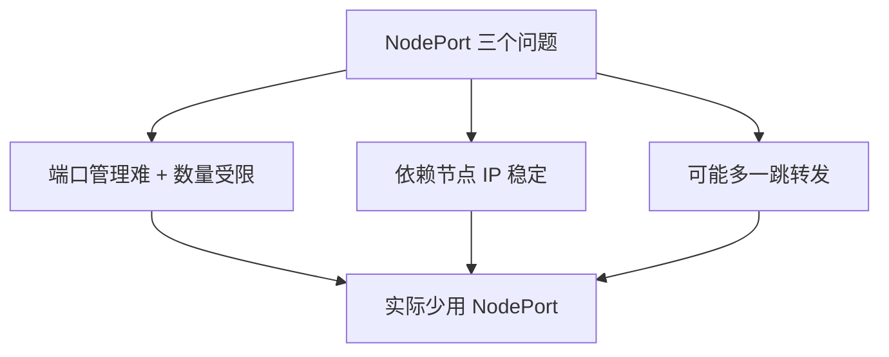

# K8s 服务暴露本章小结：NodePort、Ingress 与 LoadBalancer 的取舍

本章带着大家把 K8s 中的 Ingress 真正用起来了——通过 Ingress，把集群内的 Web 服务、gRPC 服务**集中、统一地对外暴露**，既保证了集群内服务的访问安全，也让外部调用变得简单。下面把本章的核心结论收一遍口。

## 纲要

- NodePort 暴露服务的三个老问题
- 本章重点：Ingress 的部署与两种协议转发
- gRPC 转发的额外成本（TLS / Secret / 后端协议）
- LoadBalancer 的 L4/L7 之分与代价
- 入口选型的最终结论

## NodePort 的三个老问题

本章一开始先讲了用 NodePort Service 把服务暴露到集群外的问题，主要有三个：

1. **端口管理与数量限制**：每个服务占用一个节点端口（默认 `30000-32767`），服务多了端口难管理、且范围有限；
2. **依赖节点 IP 稳定**：调用方记的是节点 IP，一旦节点发生变更（漂移、重建、扩缩节点），客户端配置就要跟着改；
3. **多一跳转发**：NodePort 所在的机器可能根本没部署这个服务，流量还得再转发一次到真正有 Pod 的节点，平白多一层网络跳转。



正因为这三点，实际生产中很少用 NodePort 来长期暴露服务。

## 本章重点：Ingress 的部署与转发

接下来是重头戏。我们从部署 Ingress Controller 开始，一步一步把 Ingress Service 部署和配置完成，并且**同时实现了两种转发**：

- **80 端口的 HTTP Web API 路由转发**：按域名 / 路径把请求分到后端 Service，这是 Ingress 最轻松的部分；
- **443 端口的 gRPC 服务转发**：要支持 gRPC，配置复杂了不少——既要有 SSL 证书，也要配置 Secret，还要特别设置 Ingress 的后端协议（让 Controller 知道后端是 gRPC 而非 HTTP）。设置路由规则时，通常**每个域名都要单独配好对应的 Secret**。

可见：对 Web API（HTTP）的支持，比对 gRPC 的支持要容易得多。好在大多数对外暴露的服务还是 HTTP 接口，gRPC 虽能支持，只是相对要多做一些配置。

```dir
Ingress 实战落地结构
├── 部署 Ingress Controller
├── 配置转发规则
│   ├── 80 端口：HTTP / Web API（host + path 路由）
│   └── 443 端口：gRPC
│       ├── SSL 证书
│       ├── Secret（每域名一个）
│       └── 后端协议声明（backend-protocol）
└── 验证两种协议均可达
```

> 注解键名（如 `nginx.ingress.kubernetes.io/backend-protocol`、`ssl-redirect` 等）**建议以所用 Ingress Controller 官方文档为准**，不同实现差异较大。

## gRPC 转发为什么更重

gRPC 建立在 HTTP/2 之上，Ingress Controller 必须明确以 `GRPC` 协议与后端通信，否则会当成普通 HTTP 处理而失败。因此除了常规的 `host`/`path` 规则，还必须：

- 准备并挂载 TLS 证书（Secret 形式）；
- 给每个需要 gRPC 的域名绑定对应 Secret；
- 显式声明后端协议为 GRPC。

这部分是本章"踩坑密度"最高的地方，也是考试 / 面试里常问的对比点。

## LoadBalancer：L4 与 L7 之分

本章最后讲了 `LoadBalancer` 这种暴露方式。它依赖各云厂商实现：

- 大部分 LB **只支持 L4 网络转发**；
- 也有一部分支持 **L7 的 HTTP 转发**——如果是 L7 HTTP，那和 Ingress 就没区别了；
- L4 转发性能当然更好，但**一个 LB 通常只能支持一个服务**，成本比 NodePort 还高。

## 入口选型的最终结论

把三种方式放在一起权衡：

| 方式 | 层级 | 多服务共享 | 成本 | 结论 |
| --- | --- | --- | --- | --- |
| NodePort | L4 | 可（端口区分） | 低 | 问题多，少用 |
| Ingress | L7 | 可（域名/路径） | 中 | **最常用**，Web/API 首选 |
| LoadBalancer | L4 为主 | 一 LB 一服务 | 高 | 特殊单服务独享 |

生产里用 Ingress 最多——毕竟 Web 开发大多是 API 接口，自定义协议（如纯 gRPC）相对少用，只有特殊情况才考虑 NodePort 或 LB。

## 总结

学完本章，你收获的不只是"会用 Ingress"，更是一把入口选型的尺子：

1. **NodePort 三个硬伤**：端口管理难、依赖节点 IP 稳定、可能多一跳，实际少用；
2. **Ingress 是重点**：部署 Controller + 配置转发，统一对外暴露集群内服务；
3. **HTTP 易、gRPC 难**：gRPC 转发要 SSL 证书 + Secret + 后端协议声明，每域名配 Secret；
4. **LoadBalancer 分 L4/L7**：L4 性能好但"一 LB 一服务"成本高，L7 则等同于 Ingress；
5. **最终结论**：绝大多数场景首选 Ingress；NodePort / LB 留给特殊需求。
