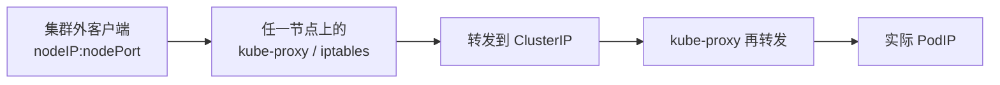
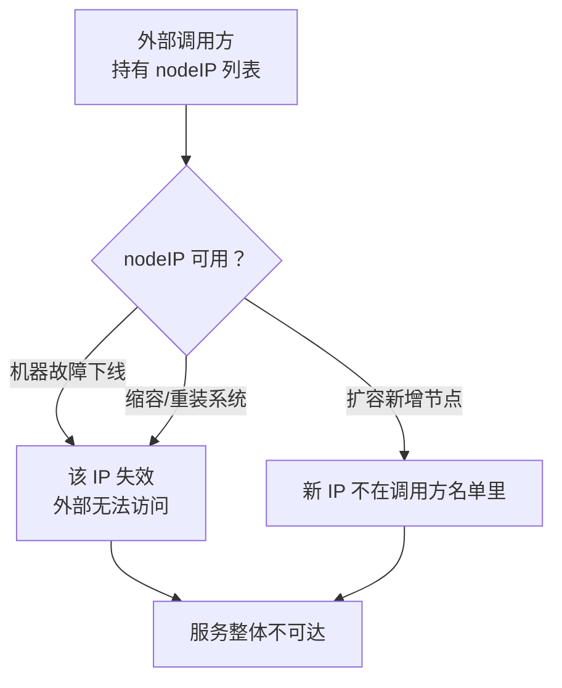
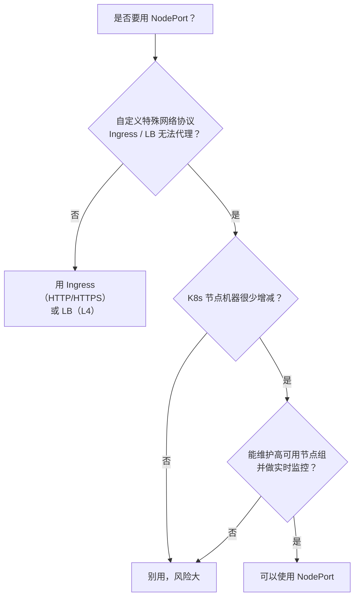

# Kubernetes 认证考点: NodePort 暴露服务的代价与三个适用边界

Service 是集群内部的服务发现机制：**ClusterIP 由服务名解析得到，访问 ClusterIP 会被转发到后端 Pod 的 PodIP**。NodePort 是在这套机制上再加一层 —— 在每个节点上开一个固定端口，让集群外的流量也进得来。

但它不是一个"更开放的 ClusterIP"，而是有明显上限的暴露方式：**整个集群只有 20000~32767 这 2 万多个端口可用，-port 需要人工规划，还要依赖稳定的 NodeIP**。绝大多数场景下应该走 Ingress，NodePort 只在特殊协议 + 稳定节点 + 可控运维三个条件同时满足时才值得用。

## 纲要

- ClusterIP 转发链路回顾：服务名 → ClusterIP → PodIP
- NodePort 的端口区间与"任意节点可达"特性
- 三个硬约束：端口总量、端口冲突、NodeIP 漂移
- 多一跳转发的性能代价与"入口节点未必有后端 Pod"问题
- 什么时候才真的该用 NodePort：三个前置条件

## ClusterIP 到 NodePort 的转发链路

普通 Service 有一个 ClusterIP，集群内通过服务名解析到 ClusterIP，再被 kube-proxy 转发到实际的 PodIP。NodePort Service 在此基础上**额外占用一个节点端口**：



NodePort 不依赖 ClusterIP 也能完成一次转发，**它同时用到了 nodeIP 和 nodePort 两个地址**。

### 端口区间是硬约束

NodePort 的取值范围是 **30000~32767**，一共只有 2768 个端口。

```yaml
apiVersion: v1
kind: Service
metadata:
  name: user-grow-http
spec:
  type: NodePort
  selector:
    app: user-grow
  ports:
    - port: 8080        # ClusterIP 上的端口
      targetPort: 8080  # Pod 的端口
      nodePort: 31080   # 节点端口，必须落在 30000-32767
```

这个区间是**整个集群共享的命名空间**，不是每个服务独占一份。服务一多，端口规划就成了必须人工维护的表格。

| 维度 | ClusterIP | NodePort |
| --- | --- | --- |
| 访问来源 | 仅集群内 | 集群内 + 集群外 |
| 依赖地址 | ClusterIP（服务名解析） | nodeIP + nodePort |
| 端口命名空间 | 每服务独立 | **全集群共享** |
| 外部访问入口 | 无 | 任一节点 |
| 需要外部感知内部拓扑 | 不需要 | **需要知道 nodeIP** |

## 三个必须接受的代价

### 端口总量会成为服务规模的瓶颈

2768 个端口，扣掉预留和一些常规约定，实际可用的数量更少。**一个服务占一个端口**，当服务数量接近这个量级时，根本没法靠 NodePort 对外暴露。

### 端口冲突只能靠人工维护

nodePort 是显式字段，写了就占用。两个团队各写了一个 `31080`，第二次创建会直接失败：

```bash
$ kubectl apply -f svc.yaml
The Service "user-grow-http" is invalid: spec.ports[0].nodePort: Invalid value: 31080: provided port is not in the allowed range, or is already allocated
```

这类冲突在跨团队、多环境时尤其难查 —— 报错发生在创建时，但占用方可能是另一个团队半年前建的。

### NodeIP 会漂移，外部就会访问失败

外部访问用的是 **nodeIP**，而 nodeIP 并不稳定：



机器故障撤销、扩容增加服务器、缩容，任何一个都会让外部访问断掉。**调用方必须自己维护一个健康的 nodeIP 池**，还得有实时剔除异常节点的机制。

## 多一跳转发的性能代价

NodePort 转发的入口节点，**上面很可能并没有跑实际的后端 Pod**：

```text
集群节点拓扑（假设有 3 个节点，后端只有 2 个副本）
├── node-1  (10.0.0.1)   ← NodePort 入口，但上面没有 user-grow Pod
├── node-2  (10.0.0.2)   ← NodePort 入口 + user-grow Pod ✓
└── node-3  (10.0.0.3)   ← NodePort 入口，但没有 user-grow Pod
```

流量打到 node-1 时要再转发一次才能到真正的 Pod。这多出来的一跳 **同时增加流量转发次数、也降低系统性能**。Kubernetes 的 kube-proxy 默认**不会做"优先调度到有 Pod 的节点"这类优化**，转发路径是固定的。

## 什么时候才该用 NodePort

总结下来，要**同时满足以下全部条件**才建议使用 NodePort 暴露服务：



三个前置条件：

1. **自定义的特殊网络协议** —— 这类协议 Ingress 代理不了，必须先验证"确实走不通"；
2. **K8s 集群的机器很少发生变更** —— 不扩容、少故障，nodeIP 池保持稳定；
3. **能维护高可用的 K8s 机器节点** —— 有健康检查、有异常节点实时剔除、有多节点冗余。

做不到这三点，用 NodePort 风险很大。

## API 速览

| 能力 | API / 字段 |
| --- | --- |
| 声明 NodePort | `spec.type: NodePort` |
| 固定节点端口 | `spec.ports[].nodePort`（30000~32767） |
| 服务内部端口 | `spec.ports[].port`（ClusterIP 上暴露） |
| 后端容器端口 | `spec.ports[].targetPort` |
| 服务选择器 | `spec.selector` → Pod 的 label |
| 查看已分配的端口 | `kubectl get svc -o wide` 的 `PORT(S)` 列 |
| 查看节点对外地址 | `kubectl get nodes -o wide` 的 `EXTERNAL-IP` 列 |
| .port 段冲突报错 | `provided port is not in the allowed range, or is already allocated` |

## Demo 示例

暴露一个 NodePort 服务并验证转发链路。

```text
# 先给变量赋值，例如：NODE_IP=10.0.0.1
# 1. 创建 Service，显式指定 nodePort
$ kubectl apply -f svc-nodeport.yaml
service/user-grow-http created

# 2. 确认端口分配
$ kubectl get svc user-grow-http
NAME              TYPE       CLUSTER-IP     EXTERNAL-IP   PORT(S)          AGE
user-grow-http    NodePort   10.96.42.17    <none>        8080:31080/TCP   12s
#                                                          ↑ClusterIP:↑nodePort

# 3. 从集群外直接访问（任意一个节点都通）
$ curl http://$NODE_IP:31080/task/list
{"code":500,"msg":"connect to 127.0.0.1:3306 ..."}   # 已到服务端，只是连不上库

# 4. 逐个节点探测，验证"入口节点未必有后端 Pod"
$ for ip in 10.0.0.1 10.0.0.2 10.0.0.3; do
    curl -s -o /dev/null -w "$ip -> %{http_code}\n" http://$ip:31080/task/list
  done
```

验证要点：

- `PORT(S)` 列里 `8080:31080` 前者是 ClusterIP 端口、后者是 nodePort；
- 三个节点 curl 都能通（说明 NodePort 覆盖全部节点），但**响应耗时会有差异** —— 这就是入口节点没有本地 Pod 导致的额外一跳；
- 返回数据库报错而不是连接被拒，说明流量确实到了应用层，L3/L4 转发链路是通的。

```yaml
# svc-nodeport.yaml
apiVersion: v1
kind: Service
metadata:
  name: user-grow-http
  namespace: default
spec:
  type: NodePort
  selector:
    app: user-grow
  ports:
    - name: http
      port: 8080
      targetPort: 8080
      nodePort: 31080
```

### 总结

NodePort 的本质是**给每个服务在节点上钉一个固定端口**，它解决的只是一件事：让集群外的请求能进入集群。为此付出的代价是端口总量受限、端口冲突靠人肉维护、外部必须持有并维护 nodeIP 池，以及可能多一跳转发的性能损耗。

判断该不该用，只看三条：**是不是 Ingress 和 LB 都代理不了的特殊协议、节点机器会不会频繁变更、有没有能力维护高可用节点组**。三条全中才用，缺一条就老老实实上 Ingress。

