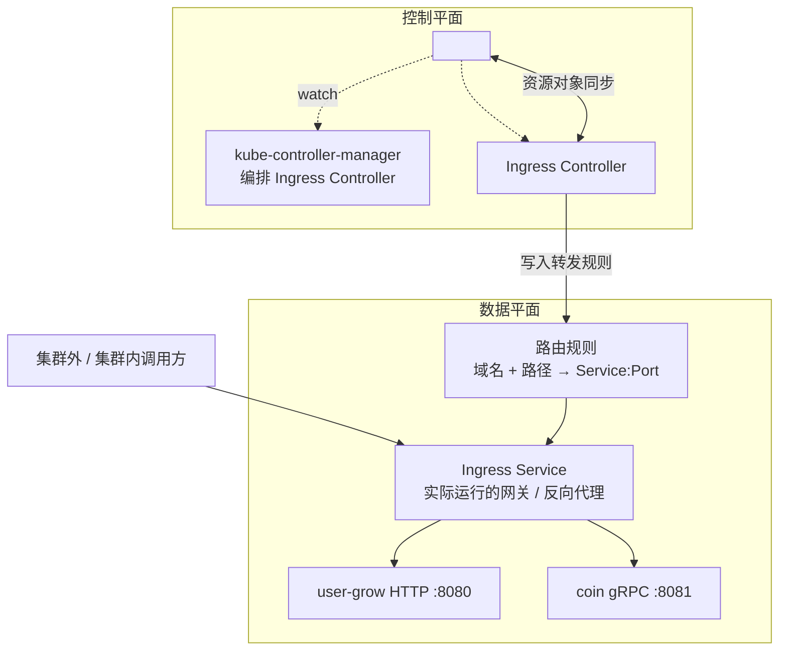
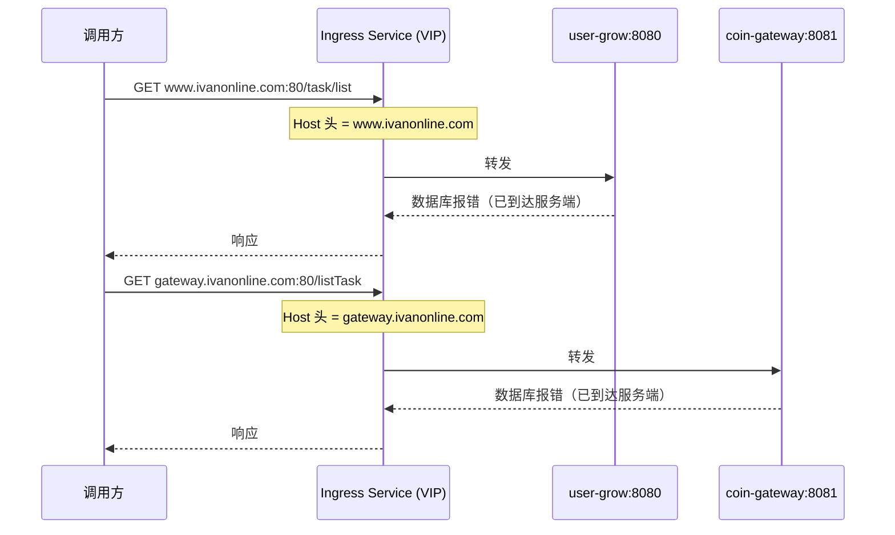

# Kubernetes 认证考点: 在 K8s 上部署、配置和使用 Ingress 的完整链路

Ingress 不是一个 Pod，也不是一个 API 对象直接承担流量 —— 它是**"路由规则描述" + "网关服务实体"**的组合。缺了任何一半，规则都没地方执行。

一句话结论：**Ingress Controller 负责监听和转发，Ingress Service 才是真正跑起来的网关，两者必须配套创建，再通过 ingressClass 关联起来**。

## 纲要

- Ingress 的两部分：Ingress Controller 与 Ingress Service
- Controller 如何监听 API Server 完成服务发现
- Service 作为网关实体的反向代理职责
- 路由规则的三个要素：header、URL 路径、目标服务与端口
- 实际部署要做的三件事
- 同时支持 HTTP 与 gRPC 两套转发规则

## Ingress 是两个东西，不是一个

Ingress 有以下几个组成部分：

1. **Ingress Controller** —— 需要部署到 K8s 核心组件的 controller-manager 里，**监听 API Server 中服务对象的变更**，完成服务发现，这样才可以通过 Ingress 正确访问到后端服务；
2. **Ingress Service** —— 这个服务就像一个网关服务，**所有 API 调用都经过它，再由它转发到实际的后端服务**；
3. **路由规则** —— 告诉 Ingress Service 怎么转发：识别请求的 header 和 URL 路径、知道转发的目标服务以及目标端口。



**Controller 是"大脑"，Service 是"手脚"**。只有 Controller 没有 Service，规则无处执行；只有 Service 没有 Controller，转发的后端是死的、不随 Pod 变化。

### Controller 的服务发现靠监听

Ingress Controller 本质是跑在集群里的一个控制器，它通过 watch API Server 拿到 Ingress、Service、Endpoints 的变化，动态生成自己的转发表。所以**它必须被 kube-controller-manager 一起管理、一起启动**（在云厂商托管的集群里这一步已经封装掉了，属于"组件管理里装一个组件"的操作）。

## 实际部署要做的三件事

```text
Ingress 落地流程
├── 第一步：安装 Ingress Controller 组件
│   └── [组件管理] 新建组件 → "NGINX Ingress" 类型的 right 组件
│       └── 把 controller 放进 kube-controller-manager 一起拉起
├── 第二步：创建 Ingress Controller 实例
│   ├── 指定命名空间
│   ├── 公网访问 → 生成公网 IP；内网访问 → 生成内网 IP
│   ├── 配置 HPA 触发策略（CPU / 内存利用率）
│   └── 资源规格取最低即可
└── 第三步：创建 Ingress Service 并配置路由规则
    ├── type 选 ingressClass（如 test-nginx）
    ├── 转发端口 + 路径
    └── 按协议分两次配置
```

第二步里**实例（instance）这层容易被忽略**：Controller 组件装完还需要创建一个实例，实例才是真正分配 VIP 的东西。创建的实例会拿到一个 VIP（Virtual IP），后面所有域名都解析到这个 VIP。

触发策略其实就是配一个 HPA —— Ingress Service 也能动态调整实例数量。指标是 CPU / 内存利用率（相对 limit 和 request），**利用率达标就扩容**：

```yaml
spec:
  replicas: 1
  template:
    spec:
      containers:
        - name: nginx-ingress
          resources:
            requests:
              cpu: 100m
              memory: 128Mi
            limits:
              cpu: "1"
              memory: 512Mi
  # 触发策略：CPU 利用率超过 60% 就扩容，最多 20 个实例
  autoscaling:
    enabled: true
    metrics:
      - type: Resource
        resource:
          name: cpu
          targetAverageUtilization: 60
    maxReplicas: 20
```

写 20 个实例时行为类似：达到触发条件就不断创建新实例，直到最高的那个上限就不再继续。

## 路由规则：靠 Host 头区分同路径服务

部署好之后配置转发规则。以 HTTP 的 REST API 为例，80 端口的转发规则可以**根据请求的域名和路径**来配：

```yaml
apiVersion: networking.k8s.io/v1
kind: Ingress
metadata:
  name: user-grow-http
spec:
  ingressClassName: test-nginx
  rules:
    - host: www.ivanonline.com
      http:
        paths:
          - path: /
            pathType: Prefix
            backend:
              service:
                name: user-grow-svc
                port:
                  number: 8080
    - host: gateway.ivanonline.com
      http:
        paths:
          - path: /
            pathType: Prefix
            backend:
              service:
                name: coin-gateway-svc
                port:
                  number: 8081
```

关键点在于 **host 字段**：两个后端服务的路径是一样的，靠不同的域名来区分。



两个域名都解析到**同一个 Ingress VIP**，但请求进来时 HTTP 头里的 `Host` 字段不一样，**规则就靠这个差异做路由分派**。

## HTTP 与 gRPC 两套规则

因为要同时支持 HTTP 和 gRPC，配置要分两次做。

### 先看规则差异

| 维度 | HTTP/HTTPS | gRPC |
| --- | --- | --- |
| 底层协议 | HTTP/1.1 | **HTTP/2** |
| 转发端口 | 80 端口 | **443 端口** |
| 安全要求 | 普通明文即可 | 需要 **SSL/TLS 证书** |
| 网关配置 | 默认即可 | 需要额外加 annotation 声明协议 |
| Ingress 支持 | 支持 | 支持（因为支持 HTTP/2） |

gRPC 基于 HTTP/2，所以只能用 **443 端口**做转发，而 HTTPS 又**必须先有证书**，还要把证书配置进集群、存成 Secret，转发规则里才能引用。

### 证书：Secret 是必经过的一步

申请到证书后，要在集群的**配置管理里把这个证书配置为一个 Secret**：

```bash
# 用 cert-key pair 直接创建 TLS Secret
$ kubectl create secret tls ivanonline-cert \
    --cert=ivanonline.crt \
    --key=ivanonline.key \
    -n default
secret/ivanonline-cert created
```

```yaml
apiVersion: v1
kind: Secret
type: kubernetes.io/tls
metadata:
  name: ivanonline-cert
  namespace: default
data:
  tls.crt: <base64 编码的证书文件>
  tls.key: <base64 编码的私钥>
```

有了 Secret，接下来才能正常配置 443 端口的转发。

### gRPC 转发需要额外声明协议

在 Ingress 的 annotation 里必须写明后端协议，网关才知道用 HTTP/2 去连：

```yaml
metadata:
  annotations:
    nginx.ingress.kubernetes.io/backend-protocol: "GRPC"
```

这样网络传输协议才是 HTTP/2，才支持 gRPC 请求转发。转发的写法和 80 端口类似，**域名 + 路径 → 后端服务的指定端口**。

### 调用方式变化

配置好 Ingress Service 之后，**调用就不再直接打自己的服务了**，而是先拿 Ingress Service 的 IP：

```text
调用链路
├── 集群内调用方 ──┐
└── 集群外调用方 ──┴→ Ingress Service IP → 按 Host 路由 → 后端 Service
```

这个 IP **集群内和集群外都能访问**。因为用域名访问，需要把「IP + 域名」写进 `/etc/hosts` 来模拟正式域名解析：

```bash
# /etc/hosts
10.0.0.50  www.ivanonline.com gateway.ivanonline.com
```

配置好之后：

- 通过 `http://www.ivanonline.com` 能访问 gin 框架封装的 Web 服务；
- 通过 `http://gateway.ivanonline.com` 能访问 gRPC Gateway 封装的 Web 服务；
- 443 端口转发的 gRPC 服务也能访问。

但 gRPC 客户端代码没带上 SSL 证书，直接访问会报错，验证时用 **`grpcurl` 工具** —— 它能指定参数、让客户端忽略安全认证。

```bash
# 用 grpcurl 走 Ingress 访问 gRPC，跳过客户端证书校验
$ grpcurl -insecure \
    -d '{}' \
    https://ivanonline.com:443 \
    coin.UserGrow/ListTask
```

## API 速览

| 能力 | API / 字段 |
| --- | --- |
| 路由规则主体 | `networking.k8s.io/v1` `kind: Ingress` |
| 关联 Controller 实例 | `spec.ingressClassName` |
| 域名匹配 | `spec.rules[].host` |
| 路径匹配 | `spec.rules[].http.paths[].path` + `pathType` |
| 后端服务 | `spec.rules[].http.paths[].backend.service` |
| 后端协议声明 | `nginx.ingress.kubernetes.io/backend-protocol: "GRPC"` |
| TLS 证书引用 | `spec.tls[].secretName` |
| 证书落地 | `kubectl create secret tls <name> --cert --key` |
| 查看入口 VIP | 查看 Ingress Controller 实例的对外 IP |
| 域名解析模拟 | 把 VIP 写进 `/etc/hosts` |
| gRPC 调试工具 | `grpcurl -insecure` |

## Demo 示例

一次把 HTTP 与 gRPC 规则都配上、并本地验证。

```bash
# ---------- 1. 导入 TLS 证书，生成 Secret
$ kubectl create secret tls ivanonline-cert \
    --cert=ivanonline.crt --key=ivanonline.key -n default
secret/ivanonline-cert created

# ---------- 2. 应用 Ingress（含 HTTP + gRPC 两条规则）
$ kubectl apply -f ingress.yaml
ingress.networking.k8s.io/user-grow-ingress created

# ---------- 3. 域名解析指向 Ingress VIP
$ grep ivanonline /etc/hosts
10.0.0.50  www.ivanonline.com gateway.ivanonline.com ivanonline.com

# ---------- 4. 远程登录一个工作负载 Pod，在里面做验证
# 先给变量赋值，例如：POD=$(kubectl get pod -o jsonpath='{.items[0].metadata.name}')
$ kubectl exec -it $POD -- sh
#容器内直接带域名访问，无需再改 hosts
$ curl http://www.ivanonline.com:80/task/list
{"code":500,"msg":"connect to 127.0.0.1:3306"}   # gin 服务已收到
$ curl http://gateway.ivanonline.com:80/listTask
{"code":500,"msg":"connect to 127.0.0.1:3306"}   # gateway 服务已收到

# ---------- 5. gRPC 走 443，用 grpcurl 跳过证书校验
$ grpcurl -insecure -d '{}' https://ivanonline.com:443 coin.UserGrow/ListTask
```

```yaml
# ingress.yaml
apiVersion: networking.k8s.io/v1
kind: Ingress
metadata:
  name: user-grow-ingress
  namespace: default
  annotations:
    nginx.ingress.kubernetes.io/backend-protocol: "GRPC"
spec:
  ingressClassName: test-nginx
  tls:
    - hosts:
        - ivanonline.com
        - www.ivanonline.com
        - gateway.ivanonline.com
      secretName: ivanonline-cert
  rules:
    - host: www.ivanonline.com
      http:
        paths:
          - path: /
            pathType: Prefix
            backend:
              service:
                name: user-grow-svc
                port:
                  number: 8080
    - host: gateway.ivanonline.com
      http:
        paths:
          - path: /
            pathType: Prefix
            backend:
              service:
                name: coin-gateway-svc
                port:
                  number: 8081
    - host: ivanonline.com
      http:
        paths:
          - path: /
            pathType: Prefix
            backend:
              service:
                name: coin-grpc-svc
                port:
                  number: 8080
```

**验证要点**

- 三个域名都返回"数据库连不上"而不是连接超时 —— 说明流量确实打到了应用层，Ingress 转发链路成立；
- 报错来自**不同的后端服务**（gin 与 grpc-gateway），能据此确认 Host 路由分派正确；
- gRPC 用 `grpcurl -insecure` 是因为**客户端代码里没指定证书**，不带证书的 gRPC 客户端是访问不了的。

### 总结

Ingress 的价值在于**一个入口代理多个后端服务**：外部只需要知道一个 VIP 加一组域名，完全不必了解集群内部有哪些 Service 和 Pod。

落地时按顺序做三件事：**装 Controller 组件 → 建 Controller 实例（拿到 VIP、配 HPA）→ 建 Ingress Service 并写路由规则**。规则里靠 `host` 字段区分同路径的不同后端，gRPC 因为跑在 HTTP/2 上必须走 443 端口，还得额外准备 TLS 证书（存成 Secret）和 `backend-protocol: GRPC` 的 annotation。

最后提醒两点容易踩的：**gRPC 客户端必须自己带证书**，验证阶段用 `grpcurl -insecure` 绕开即可；**本地验证要先在 `/etc/hosts` 里把域名指向 VIP**，否则域名解析不到网关。

