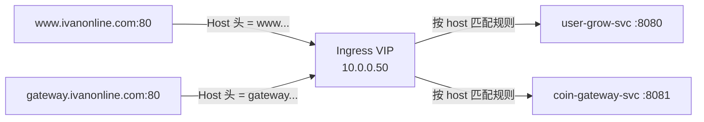
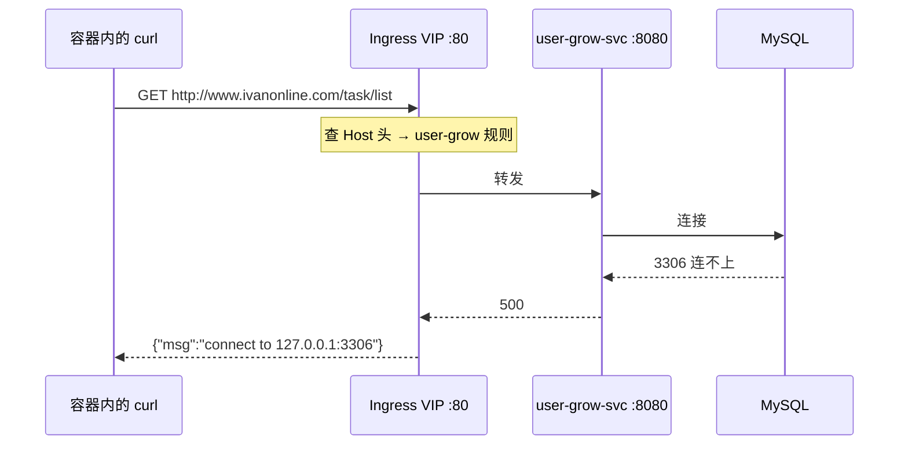

# Kubernetes 认证考点: 部署 Ingress 实例并配置 80 端口 Web 转发规则

这一节把 Ingress 真正跑起来：**从"装一个组件"到"域名能通"要过四道关 —— 组件安装、实例创建、Service 关联、转发规则验证**。

结论先给：**Ingress Controller 装完只是有了大脑，必须再建一个实例才算拿到 VIP；Service 再通过 `ingressClassName` 关联到实例；最后是 80 端口 + 不同 Host 域名的转发规则**。

## 纲要

- 组件管理里安装 NGINX Ingress 组件
- 创建 Controller 实例：命名空间、内外网 IP、HPA 触发策略
- Service 用 ingressClass 关联到具体实例
- 80 端口转发规则：域名 → Service → ServicePort
- 容器内做域名解析与调用验证

## 第一关：安装 Controller 组件

先把 nginx-ingress 组件装上。这一步会把 Ingress Controller 放进 kube-controller-manager 里一起管理、一起启动，所以需要一点时间。

```text
组件管理操作
├── 进入「组件管理」
├── 新建一个组件
│   └── 类型选 nginx ingress（right 组件）
└── 创建 → Controller 进入 kube-controller-manager 统一编排
```

## 第二关：创建 Controller 实例

组件装好之后，**还要创建一个 nginx-ingress 的实例** —— 实例才是真正分配资源、拿到 VIP 的对象。

```text
创建实例
├── 实例名称（后面 Service 会引用这个名字）
├── 命名空间 → 指定自建的命名空间
├── 访问类型
│   ├── 公网访问 → 生成公网 IP
│   └── 内网访问 → 生成内网 IP（不申请公网 IP）
├── 资源规格 → 默认 / 最低规格即可
└── 触发策略 → HPA
```

这里有两个判断点。

### 内外网决定 IP 类型

**如果 Ingress 是给公网访问，就会生成相应的公网访问 IP；如果是内网访问，就是内网 IP。** 用内网访问则不需要去申请公网 IP —— 这一步在云厂商集群上是自动完成的，选错类型会白等一串公网 IP 分配不出来。

### 触发策略本质是一个 HPA

触发策略配的就是 HPA，让 Ingress Service 也能动态调整实例数量。指标可以是 CPU、内存等，看**利用率（相对 limit 与 request）**达到多少就触发：

```yaml
metadata:
  annotations:
    autoscaling.tencent.com/via: hpa
spec:
  replicas: 1
  autoscaling:
    enabled: true
    metrics:
      - type: Resource
        resource:
          name: cpu
          target:
            type: Utilization
            averageUtilization: 50
    maxReplicas: 5
```

一个实例不够用就扩到两个；写二十个实例也一样，**达到触发条件就会不断创建新实例，直到最高的那个上限就不再继续**。

## 第三关：Service 关联到实例

Ingress Service 要指定类型为 ingressClass，值就是**前面创建的那个实例名**（例如 `test-nginx`）。Service 靠这个 `ingressClassName` 找到实例，**由实例来帮忙做调用的转发**。

```yaml
apiVersion: v1
kind: Service
metadata:
  name: nginx-ingress-svc
  namespace: kube-system
spec:
  type: LoadBalancer
  externalTrafficPolicy: Local
  selector:
    app: nginx-ingress   # 选中 Controller 实例打在这组 label 上的 Pod
  ports:
    - name: http
      port: 80
      targetPort: 80
      protocol: TCP
```

关键点：**Service 的 selector 选中 Controller Pod，Service 的 ingressClassName 指向实例**。两者缺一，规则写了也转发不过去。

## 第四关：配置 80 端口转发规则

先配 80 端口能够转发的 Web 接口。集群里现在有两个后端：

- **gin 框架**开发的 **8080** 端口；
- **gRPC Gateway** 开发的 **8081** 端口。

两个服务路径是一样的，所以要配**两个不一样的域名**来区分：

```yaml
apiVersion: networking.k8s.io/v1
kind: Ingress
metadata:
  name: user-grow-http
  namespace: default
spec:
  ingressClassName: test-nginx
  rules:
    - host: www.ivanonline.com
      http:
        paths:
          - path: /
            pathType: Prefix
            backend:
              service:
                name: user-grow-svc
                port:
                  number: 8080
    - host: gateway.ivanonline.com
      http:
        paths:
          - path: /
            pathType: Prefix
            backend:
              service:
                name: coin-gateway-svc
                port:
                  number: 8081
```

配置顺序是**域名 → 选择转发到的后端服务 → 选择该服务的端口**，两级都要选对。

### 为什么靠域名而不是靠端口区分



请求打到 Ingress Service 时都是 80 端口，域名也都解析到同一个 VIP，**唯一的区别是 HTTP 请求头里 `Host` 字段不同**。规则就靠这个差异做分派。

## 验证：进容器里做域名解析和调用

创建 Ingress 需要时间（要分配资源、会有一个 VIP 创建过程）。建完之后进容器测试。

第一步在容器内做**域名解析** —— 前面拿到的 IP 就是刚创建的 Ingress VIP，把域名解析加进去，调用时就可以直接用域名：

```bash
# 容器内 /etc/hosts
10.0.0.50  www.ivanonline.com gateway.ivanonline.com
```

> 云厂商的容器工作负载里通常已经预置好了这个解析（「后视侧就已经配好了」），没配就手动加一行。

第二步通过域名直接调用服务：

```bash
# 域名 → Ingress VIP → 后端 user-grow 服务（8080）
$ curl http://www.ivanonline.com:80/hello
{"code":500,"msg":"connect to 127.0.0.1:3306 ..."}

$ curl http://www.ivanonline.com:80/task/list
{"code":500,"msg":"connect to 127.0.0.1:3306 ..."}
```

两个接口都**返回了数据库报错而不是连接失败** —— 说明请求已经打到服务端，只是在服务端内部连不上 MySQL。这就是"已到服务端"判据：



再验证 gRPC Gateway 那条规则：

```bash
# 域名 → 同一个 VIP，但走 gateway 规则 → coin-gateway-svc :8081
$ curl http://gateway.ivanonline.com:80/listTask
{"code":500,"msg":"connect to 127.0.0.1:3306 ..."}
```

同样是数据库报错，但**后端已经是 8081 的 gateway 服务**，说明 80 端口的两条 host 规则各自命中了。

判断转发是否成功的通用判据：**返回应用层错误（如数据库 3306 连不上）= 链路通了；返回连接超时 / connection refused = 链路断了**。

## API 速览

| 能力 | API / 字段 / 命令 |
| --- | --- |
| 安装 Controller | 组件管理 → 新建 nginx ingress 组件（进 controller-manager 编排） |
| 创建 Controller 实例 | 指定命名空间 + 公网/内网 IP 类型 + 资源规格 |
| 实例动态伸缩 | 触发策略 = HPA（CPU / 内存利用率，取 limit 与 request 之比） |
| Service 关联实例 | `spec.ingressClassName: <实例名>` |
| Service 选中 Controller | `spec.selector` → Controller Pod 的 label |
| 路由规则 | `spec.rules[].host` + `paths[].path` + `backend.service` |
| 后端端口 | `backend.service.port.number` |
| 查看 VIP | `kubectl get ingress` 的 ADDRESS 列 |
| 容器内域名解析 | 把 VIP 写进容器的 `/etc/hosts` |
| 验证链路 | `curl http://<域名>/<路径>` 看是否到达应用层 |

## Demo 示例

一次性把部署 + 验证跑通。

```bash
# ---------- 1. 创建 nginx-ingress 实例（控制台操作），拿到 VIP
# 假设实例名 test-nginx，内网类型，VIP = 10.0.0.50

# ---------- 2. 应用 Service 与 Ingress
$ kubectl apply -f ingress-svc.yaml
service/nginx-ingress-svc created
$ kubectl apply -f ingress-http.yaml
ingress.networking.k8s.io/user-grow-http created

# ---------- 3. 等 VIP 分配完成
$ kubectl get ingress user-grow-http -w
NAME              CLASS        HOSTS                                  ADDRESS        PORTS
user-grow-http    test-nginx   www.ivanonline.com, gateway...ivan...   10.0.0.50     80

# ---------- 4. 登录一个工作负载 Pod
# 先给变量赋值，例如：POD=$(kubectl get pod -o jsonpath='{.items[0].metadata.name}')
$ kubectl exec -it $POD -- sh
/ # cat >> /etc/hosts <<'EOF'
10.0.0.50  www.ivanonline.com gateway.ivanonline.com
EOF

# ---------- 5. 验证 gin 后端
/ # curl -s http://www.ivanonline.com:80/task/list
{"code":500,"msg":"connect to 127.0.0.1:3306"}

# ---------- 6. 验证 gRPC-gateway 后端
/ # curl -s http://gateway.ivanonline.com:80/listTask
{"code":500,"msg":"connect to 127.0.0.1:3306"}
```

**排错清单**

| 现象 | 原因 |
| --- | --- |
| ADDRESS 列一直空着 | Controller 实例还没起来，等一会儿；或内外网类型选错 |
| 返回 `connection refused` | Service selector 没选中 Controller Pod |
| 返回 404 | host 没匹配上，检查本地 `/etc/hosts` 解析 |
| 两个域名都打到同一个后端 | 两个 rule 的 host 写重了，后写的覆盖先写的 |
| 返回数据库错误但端口不对 | 后端 `port.number` 配错，核对目标服务监听端口 |

### 总结

部署 Ingress 的实际动作只有四个：**装组件、建实例（拿 VIP、配 HPA）、建 Service 并用 `ingressClassName` 指向实例、写 host + path 转发规则**。

最容易漏的是第二关 —— **Controller 装完必须再建实例**，实例才是 VIP 的持有者；Service 和 Ingress 都靠这个名字挂上去。

80 端口的 Web 转发靠 **`Host` 头区分同路径的多个后端**，验证时只要看到应用层报错（如 3306 连不上）就说明链路打通了，别被"报错"两个字误导。

