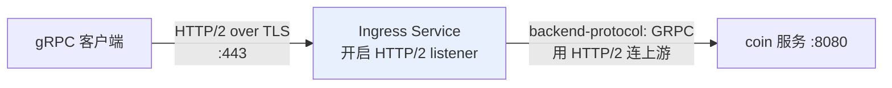
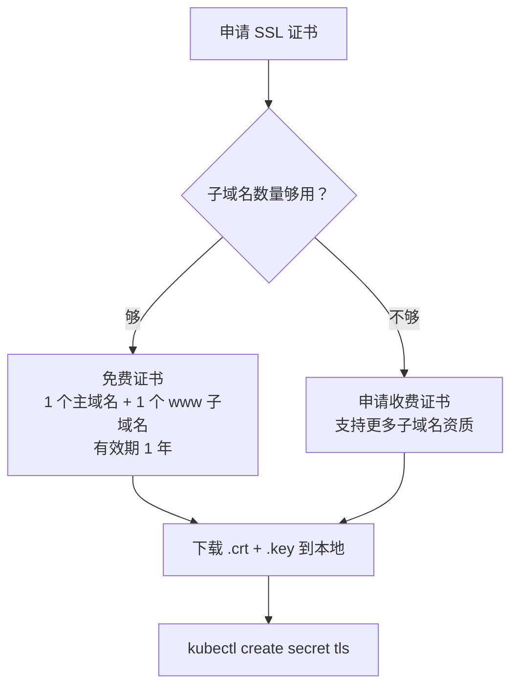
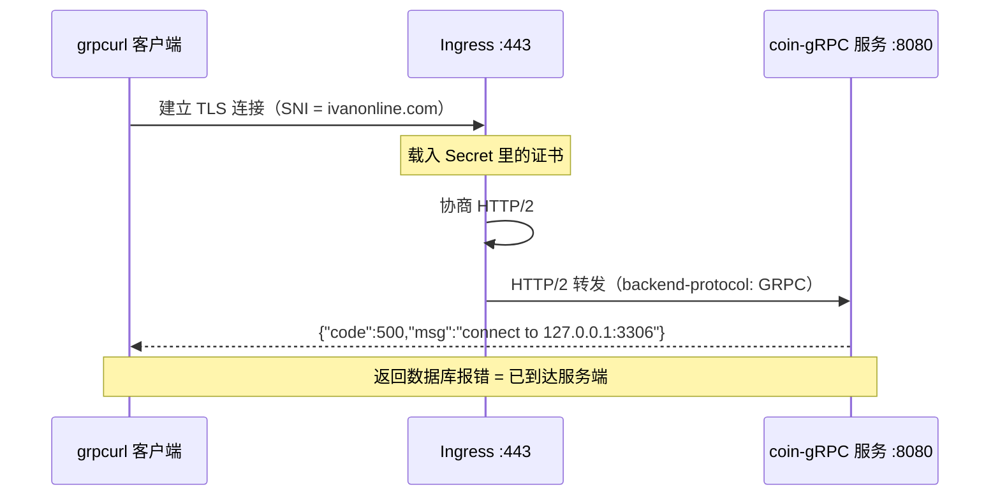
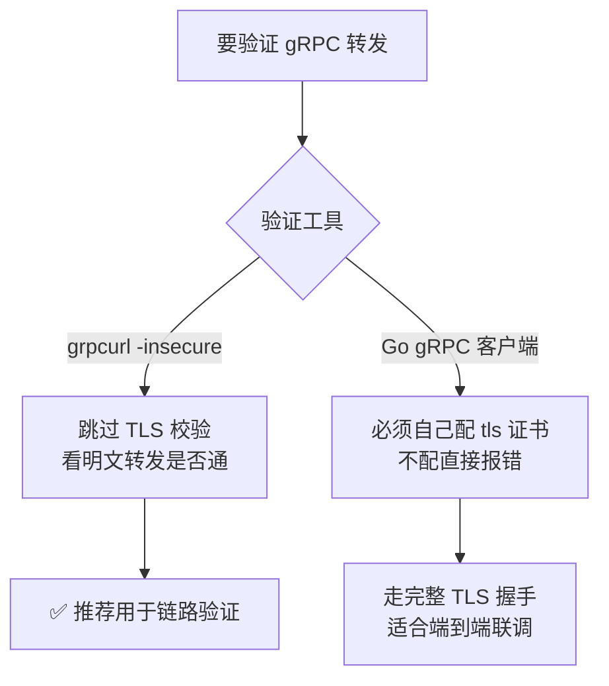

# Kubernetes 认证考点: 用 TLS 证书与 annotation 为 Ingress 配置 gRPC 转发

gRPC 跑在 HTTP/2 上，这一条决定了它在 Ingress 里的整个配置姿态：**必须走 443 端口、必须带 TLS 证书、必须额外声明后端协议**。

结论：**申请带域名的 SSL 证书 → 导入集群变成 Secret → Ingress 里引用该 Secret 并加 `backend-protocol: GRPC` annotation → 用 `grpcurl -insecure` 验证**。四步缺一不可。

## 纲要

- gRPC 走 HTTP/2，所以只能用 443 端口
- SSL 证书的域名要求与有效期
- 把证书导入集群成为 Secret
- annotation 声明后端协议为 GRPC
- 443 端口转发规则的配置
- 为什么验证要用 grpcurl 而不是 gRPC 客户端

## 为什么 gRPC 必须配证书和 443

gRPC 协议使用的是 **HTTP/2.0 协议，所以只能使用 443 端口**来做转发。而作为 HTTPS 的安全协议，**需要有 SSL 安全证书才可以使用**。



Ingress 网关默认监听的是 80/443 上的 HTTP，要吃 gRPC 就得打开 HTTP/2 listener，并且**告知上游也用 HTTP/2 回去** —— 这个"告知"就是 annotation。

## 第一步：申请 SSL 证书

证书里**要配置域名**。免费的证书可以**申请一个主域名，再带一个 `www.` 二级子域名**，而且只能用一年时间 —— 但至少是免费的。



免费证书够用就别花钱：**这一节只用到一个 `ivanonline.com` 域名做 443 转发**，一年期到期换个证书重新导一遍即可。

## 第二步：把证书导入集群成为 Secret

有了证书，要去创建 K8s 集群**配置管理里的 Secret**。指定命名空间，证书文件是 `.crt` 和 `.key`：

```bash
$ kubectl create secret tls ivanonline-cert \
    --cert=ivanonline.crt \
    --key=ivanonline.key \
    -n default
secret/ivanonline-cert created

$ kubectl get secret ivanonline-cert
NAME                TYPE                DATA   AGE
ivanonline-cert     kubernetes.io/tls   2      5s
```

> DATA 是 2 就对了：一个 `tls.crt` 一个 `tls.key`。少一个说明导入时漏了文件。

## 第三步：annotation 声明后端协议

**关于 gRPC 协议的转发，在 Ingress 的配置中还需要增加一个协议说明**。在 annotation 里把 `backend-protocol` 加进去，指定为 GRPC：

```yaml
metadata:
  annotations:
    nginx.ingress.kubernetes.io/backend-protocol: "GRPC"
```

不写这一行，网关会用 HTTP/1.1 去连上游，**gRPC 调用会直接失败**，而且报的错往往指向 "upstream prematurely closed connection" 这种看不懂的提示。

## 第四步：配置 443 端口转发规则

```yaml
apiVersion: networking.k8s.io/v1
kind: Ingress
metadata:
  name: coin-grpc-ingress
  namespace: default
  annotations:
    nginx.ingress.kubernetes.io/backend-protocol: "GRPC"
spec:
  ingressClassName: test-nginx
  tls:
    - hosts:
        - ivanonline.com
      secretName: ivanonline-cert
  rules:
    - host: ivanonline.com
      http:
        paths:
          - path: /
            pathType: Prefix
            backend:
              service:
                name: coin-grpc-svc
                port:
                  number: 8080
```

三个要点：

1. `spec.tls.secretName` 引用刚才创建的 Secret —— **不引用，443 listener 就启不来**；
2. `backend-protocol: GRPC` 让网关用 HTTP/2 连上游；
3. 443 转发到后端服务的 **8080** 端口（网关对外 443、对内仍是普通端口）。

```text
### gRPC 转发涉及的三个配置件
├── Ingress 规则对象（networking.k8s.io/v1）
│   ├── spec.ingressClassName → 关联 nginx-ingress 实例
│   ├── spec.tls[].secretName → 引用证书 Secret
│   └── spec.rules[].http.paths[]
│       └── backend.service.port.number → 后端服务端口
├── annotation（写在 metadata 上）
│   └── nginx.ingress.kubernetes.io/backend-protocol: GRPC
└── Secret（证书落地，Data 必须是 2）
    ├── 类型 kubernetes.io/tls
    ├── 数据 tls.crt（证书正文）
    └── 数据 tls.key（私钥）


```### 与 80 端口规则的差异对比

| 配置项 | HTTP 规则 | gRPC 规则 |
| --- | --- | --- |
| 监听端口 | 80 | **443** |
| 证书 | 不需要 | **必须（Secret）** |
| annotation | 无 | `backend-protocol: GRPC` |
| 传输协议 | HTTP/1.1 | **HTTP/2** |
| 域名 | `www.ivanonline.com` | `ivanonline.com` |
| 后端端口 | 8080 / 8081 | 8080 |

## 验证：先改 hosts，再用 grpcurl

同样的，`/etc/hosts` 里要配一下 IP，只配 `ivanonline.com` 到 80 端口的那条不用了（因为只配了一个端口规则）。



进到工作负载里配置完就可以访问了：

```bash
# 用 grpcurl 工具访问
$ grpcurl -insecure -d '{}' \
    https://ivanonline.com:443 \
    coin.UserGrow/ListTask

# 返回（同样是与 HTTP 规则一致的信息）
{"code":500,"msg":"connect to 127.0.0.1:3306 ..."}
```

**返回信息和前面 HTTP 规则那条完全一样** —— 这正好证明通过 Ingress Service 也能请求到 gRPC 服务。

### 为什么用 grpcurl 而不是 gRPC 客户端程序

因为 gRPC 客户端可以指定这些参数、**客户端可以忽略掉安全认证**。而我们的客户端代码里**没有去指定证书**，用没有指定证书的 gRPC 访问的话是访问不了的：



一句话：**链路验证用 `grpcurl`，端到端联调用自己的客户端**。

## API 速览

| 能力 | API / 字段 / 工具 |
| --- | --- |
| 证书落地 | `kubectl create secret tls <name> --cert=*.crt --key=*.key` |
| Secret 类型 | `kubernetes.io/tls`（含 `tls.crt` / `tls.key`） |
| Secret 引用 | `spec.tls[].secretName` |
| 后端协议声明 | `nginx.ingress.kubernetes.io/backend-protocol: "GRPC"` |
| gRPC 对外端口 | 443（HTTP/2 只能走 443） |
| 后端端口 | `backend.service.port.number` |
| 关联 Controller 实例 | `spec.ingressClassName` |
| 忽略证书校验 | `grpcurl -insecure <target> <service>/<method>` |
| 指定请求体 | `grpcurl -d '{}'` |
| 域名解析 | `/etc/hosts` 把域名指向 Ingress VIP |

## Demo 示例

从证书到 gRPC 通的完整命令序列。

```bash
# ---------- 1. 申请证书（控制台/厂商证书中心）
# 域名：ivanonline.com（免费证书含主域名 + www 二级域名，1 年有效）
# 下载到本地：ivanonline.crt / ivanonline.key

# ---------- 2. 导入集群，创建 Secret
$ kubectl create secret tls ivanonline-cert \
    --cert=ivanonline.crt --key=ivanonline.key -n default
secret/ivanonline-cert created

$ kubectl describe secret ivanonline-cert
Type: kubernetes.io/tls
Data:
  tls.crt:  1234 bytes
  tls.key:  1704 bytes

# ---------- 3. 更新 Ingress 转发配置（443 + GRPC）
$ kubectl apply -f ingress-grpc.yaml
ingress.networking.k8s.io/coin-grpc-ingress configured

# ---------- 4. 本地 hosts 指向 VIP
$ grep ivanonline /etc/hosts
10.0.0.50  ivanonline.com

# ---------- 5. 远程登录一个工作负载 Pod 再配置一次 hosts
# 先给变量赋值，例如：POD=$(kubectl get pod -o jsonpath='{.items[0].metadata.name}')
$ kubectl exec -it $POD -- sh
/ # echo "10.0.0.50 ivanonline.com" >> /etc/hosts

# ---------- 6. grpcurl 验证（跳过安全认证）
$ grpcurl -insecure -d '{}' \
    https://ivanonline.com:443 \
    coin.UserGrow/ListTask
{"code":500,"msg":"connect to 127.0.0.1:3306 ..."}
```

**常见失败模式**

| 报错 | 原因 |
| --- | --- |
| `x509: certificate is valid for ... not ivanonline.com` | 证书里没包含请求的域名，重新申请带该域名的证书 |
| `upstream prematurely closed connection` | 缺 `backend-protocol: GRPC`，网关用 HTTP/1.1 连上游 |
| 443 端口连不上 | `spec.tls.secretName` 写错，或 Secret 不在 Ingress 的 namespace |
| 客户端报 TLS 错误 | 客户端没带证书，改用 `grpcurl -insecure` 验证 |

### 总结

gRPC 的 Ingress 配置和 HTTP 相比，多出来的是**证书 + 协议声明**这两件事：因为跑在 HTTP/2 上必须走 443，所以必须先有 TLS 证书并把它变成集群里的 Secret；又因为网关默认不认识 gRPC 上游，必须用 `backend-protocol: GRPC` 的 annotation 告诉它用 HTTP/2 回连。

验证阶段有个实用技巧：**用 `grpcurl -insecure` 而不是自己的 gRPC 客户端** —— 客户端代码里没配证书是访问不了的，而 grpcurl 可以忽略安全认证，专门用来验证"网关到上游"这条链路通不通。

判断成功的标准还是那个：返回应用层错误（数据库 3306 连不上）就说明 gRPC 请求确实穿过 Ingress 到了后端。

