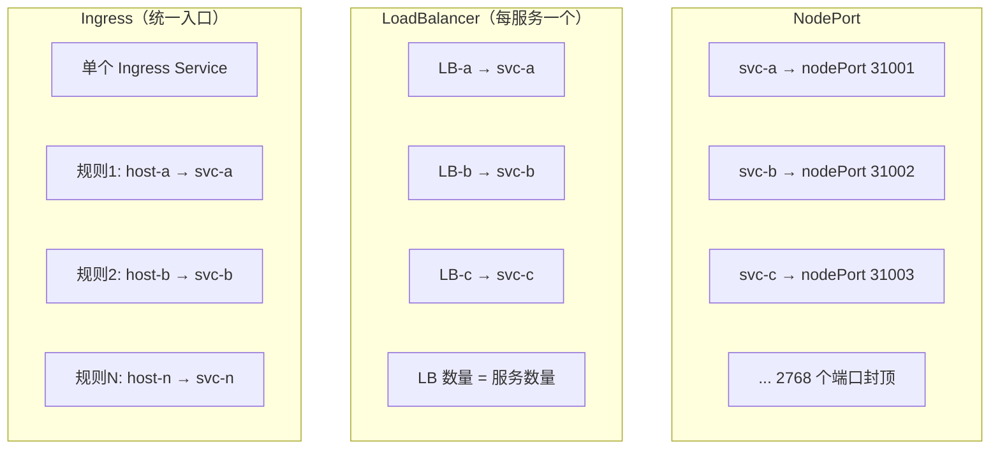
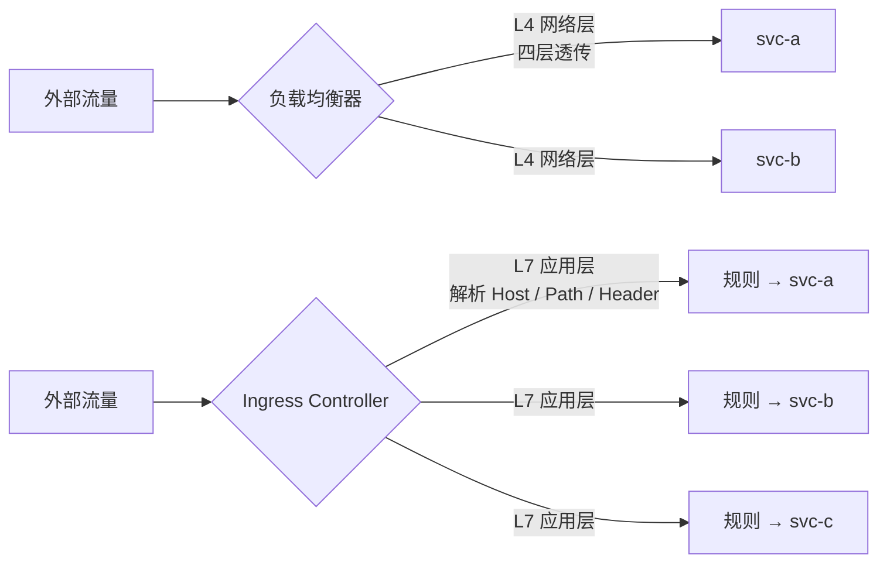
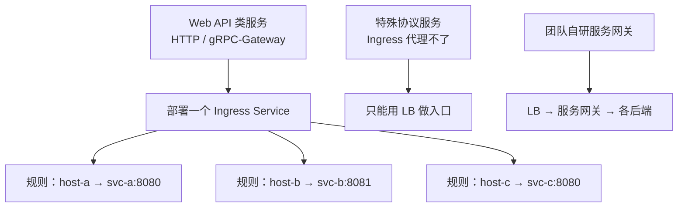
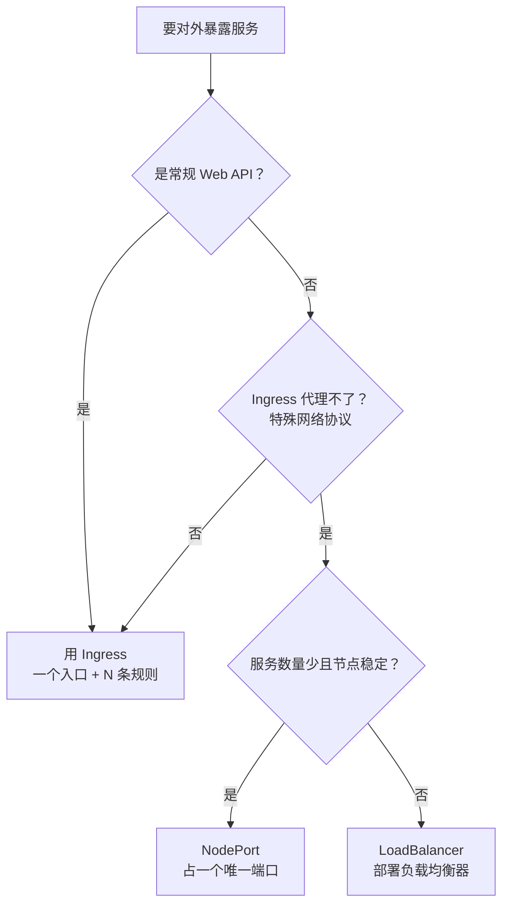

# Kubernetes 认证考点: NodePort、Ingress 与负载均衡器三种入口的差异选型

把服务暴露到集群外，手上其实只有三件工具：**NodePort 占一个端口、Ingress 配一套路由规则、LoadBalancer 挂一个 LB**。三者的成本形态完全不同。

结论：**大部分情况下 Web API 用 Ingress 一个入口搞定；只有 Ingress 代理不了的特殊协议才退到 NodePort 或 LB；如果团队自己研发了服务网关，那所有流量都先打到 LB 再由网关分发。**

## 纲要

- NodePort 的旧问题：每个服务一个唯一端口
- LoadBalancer 方式：每个服务一个负载均衡服务器
- 工作层级差异：L4 网络层 vs L7 应用层
- 成本与灵活性的取舍
- 三种入口的选型决策路径

## 三种暴露方式，三种成本形态

前面用 NodePort 方式暴露服务时，**要给每一个服务分配唯一的端口号**，端口号的数量限制会成为服务规模的瓶颈。

而 LoadBalancer 方式则要**给每一个服务分配一个负载均衡服务器** —— 听起来比分配一个端口还要更重一些。



**NodePort 占一个唯一端口号，LoadBalancer 则要部署一个负载均衡器来实现流量转发。**

## 工作层级：L4 与 L7 是核心差异

LoadBalancer 更多是**工作在 L4，也就是网络层** —— 这种情况下，它一般是转发到单个服务，性能也会更好。

当然也有一些 LoadBalancer 服务是**工作在 L7，也就是应用层**，这就跟 Ingress 这种后端代码服务类似，也可以配置很多的路由规则来做转发。



| 维度 | 负载均衡器（L4） | 负载均衡器（L7） | Ingress（L7） |
| --- | --- | --- | --- |
| 工作层级 | 网络层 | 应用层 | 应用层 |
| 一个实例能代理的服务 | **只能一个** | 多个 | 多个 |
| 路由规则 | 基本没有 | 可配大量规则 | **可配大量规则，最灵活** |
| 单服务性能 | **更好** | 一般 | 一般 |
| 成本 | 高（每服务一个） | 中 | 低（一个入口） |
| 典型实现 | 云厂商四层 CLB | 云厂商七层 CLB | nginx-ingress |

## 成本：L4 的一个 LB 只能转发到一个服务

**由于工作在 L4 的 LoadBalancer，一个 LB 只能转发到一个服务，它的成本还是很高的。**

所以针对 gRPC 协议，如果都是 Web 服务 API 接口的话，**还是统一使用 Ingress 作为入口就可以了** —— 部署和运行一个 Ingress 服务，然后配置很多的路由转发规则就可以实现了。



**只有在 Ingress 服务无法完成转发的情况，比如特定的通信协议，那就只能用 LB 来做入口来做流量转发了。**

## 三种典型的组织形态

```text
形态一：纯云厂商托管（最常见）
├── 云 LB（L4/L7）
│   └── Ingress Service （nginx-ingress 实例）
│       ├── 规则1 → svc-a（gin :8080）
│       ├── 规则2 → svc-b（gateway :8081）
│       └── 规则3 → svc-c（grpc :8080, 443）
└── 对外只暴露一个 VIP

形态二：特殊协议兜底
├── 云 LB ──→ 特殊协议服务（L4 透传）
└── Ingress Service ──→ 常规 Web 服务

形态三：自研服务网关
├── LoadBalancer
│   └── 自研服务网关（LB 唯一后端）
│       ├── 服务发现（注册中心）
│       ├── 服务调用
│       ├── 熔断 / 限流 / 灰度
│       └── → 集群内各个 Service
```

第三种形态里，**无论是使用 Ingress 还是自己开发的服务网关，这类产品都是要实现服务发现功能** —— 通过它作为入口，它可以方便快捷的访问到集群内的各个服务，这也是可以让集群外很好的调用访问到集群内的服务。

## 选型决策

基于前面讲过的 NodePort、Ingress 和 LoadBalancer，什么时候使用哪种方式就很清楚了：



大部分情况下，如果只是 Web 服务的 API 接口之类，**使用 Ingress 服务就好了**。特殊的网络协议或者个别的特殊服务，可以考虑使用 NodePort 或者 LoadBalancer 方式来暴露服务 —— NodePort 方式占用一个唯一端口号，而 LoadBalancer 则需要部署一个负载均衡器来实现流量转发。

## Demo 示例

用一条命令看清楚当前集群里三种 Service 各有多少个：

```text
# ---------- 1. 统计三种暴露方式的分布
$ kubectl get svc -A --no-headers \
    | awk '{print $2, $1}' > /dev/null
$ kubectl get svc -A -o json | python3 -c "
import json,sys,collections
data = json.load(sys.stdin)
cnt = collections.Counter()
for item in data['items']:
    spec = item.get('spec', {})
    cnt[spec.get('type', 'ClusterIP')] += 1
for k, v in sorted(cnt.items(), key=lambda x: -x[1]):
    print(f'{k:14s} {v}')
"
ClusterIP       42
LoadBalancer     3
NodePort         1
Ingress          0
# ↑ Ingress 类型本身是 0，真正的入口是 Controller 的 LoadBalancer 型 Service

# ---------- 2. 看 Ingress 背后的入口是什么
$ kubectl get ingress -A
NAMESPACE   NAME             CLASS        ADDRESS      PORTS
default     user-grow-http    test-nginx   10.0.0.50   80, 443

$ kubectl get svc -n kube-system -l app=nginx-ingress
NAME                TYPE           CLUSTER-IP   PORT(S)
nginx-ingress-svc   LoadBalancer   10.96.1.8   80:31749/TCP,443:30629/TCP

# ---------- 3. 一条规则代理多个后端，NodePort 做不到
$ kubectl get ingress user-grow-http -o jsonpath='{.spec.rules}' | python3 -m json.tool
[
  {
    "host": "www.ivanonline.com",
    "http": {
      "paths": [
        {
          "path": "/",
          "backend": {"service": {"name": "user-grow-svc", "port": {"number": 8080}}}
        }
      ]
    }
  },
  {
    "host": "gateway.ivanonline.com",
    "http": {
      "paths": [
        {
          "path": "/",
          "backend": {"service": {"name": "coin-gateway-svc", "port": {"number": 8081}}}
        }
      ]
    }
  }
]
```

**结论核对**：一个 Ingress 对象代理了 2 个后端服务，对外只暴露 1 个地址；而 LoadBalancer 每多一个就要多一个 LB —— 这就是"一个入口 vs 一服务一入口"的成本差。

### 总结

入口选型的本质是在**成本、性能、灵活性**三者之间做交换。

- **Ingress 是默认解**：一个入口 + N 条路由规则，成本最低、最灵活，覆盖 90% 以上的 Web/gRPC-Gateway 场景；
- **L4 LB 是性能解**：工作在网络层、单服务转发性能最好，但一个 LB 只能代理一个服务，成本随服务数线性上涨，只用于 Ingress 代理不了的特殊协议；
- **NodePort 是兜底解**：占一个唯一端口，代价是外部要维护 nodeIP 池，只在节点稳定 + 有 HA 能力时可用。

如果团队已经自研了服务网关，那 LB 后面接的就是网关而不是 Ingress —— 网关承担服务发现和治理，出口统一，这一点和 Ingress 的定位是同构的。

