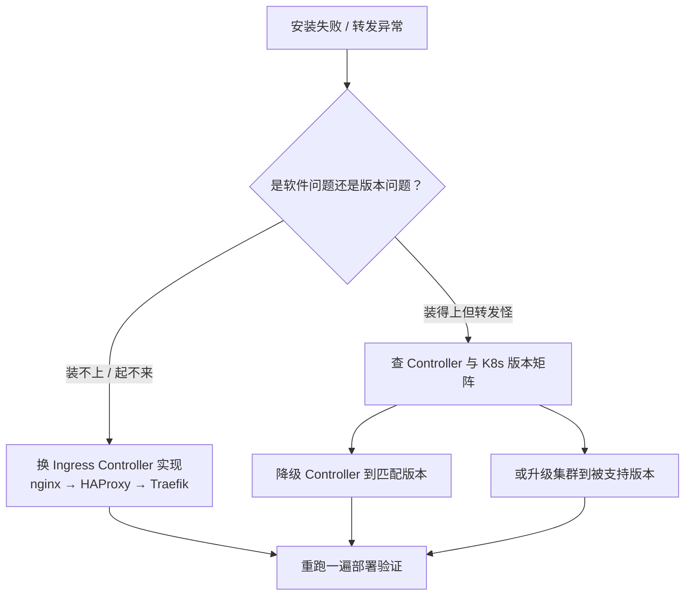
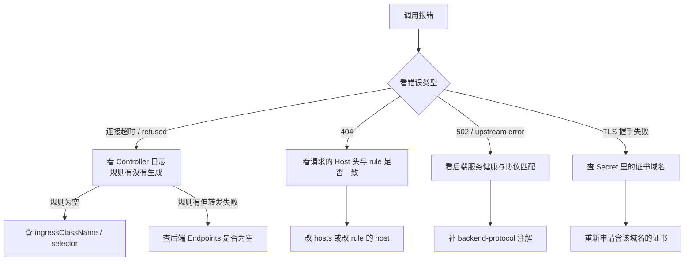
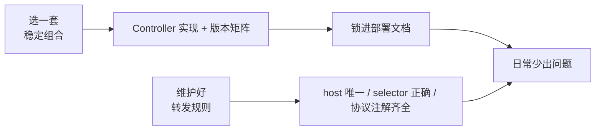

# Kubernetes 认证考点: Ingress 部署中的三类高频故障与排查路径

自己搭 K8s 集群就要自己装各种组件，遇到的问题会非常多。Ingress 部署中常见问题也就是下面几类。

结论：**八成的问题集中在「软件选型 + 版本兼容」和「路由规则配置错误」两块，排查顺序是 Controller 日志 → 应用调用错误 → 规则逐条比对**；用云厂商托管集群则基本不用碰这些。

## 纲要

- 问题一：Ingress Controller 的安装与选型（nginx / hyproxy 等）
- 问题二：版本兼容性 —— Controller 版本与集群版本
- 问题三：路由规则配置错误引发的诡异调用问题
- 排查路径：Controller 日志 + 应用错误信息交叉验证
- 托管集群为什么几乎不出这些问题

## 问题一：Controller 选型

Ingress Controller 的安装是第一步，**有很多 Ingress 组件可选**：可能是 nginx，也可能是 hyproxy（即 HAProxy/Nginx 一类的网关代理软件）。

```text
Ingress Controller 选型
├── nginx-ingress       （最主流，生态最全）
│   ├── 支持 HTTP / HTTPS
│   ├── 支持 gRPC（backend-protocol 注解）
│   └── 支持 Canary、rewrite、CORS 等大量注解
├── HAProxy Ingress
├── Traefik              （自动发现强，配置即 CRD）
├── Kong Ingress         （带插件生态）
└── 云厂商托管版          （控制台一键装）
```

选型的判断标准很简单：**先看要代理的协议是否都在支持列表里**。这一节的 gRPC 场景就必须选支持 `backend-protocol` 的版本，否则装完发现不支持，只能换。

## 问题二：版本兼容性

**Ingress Controller 的版本与不同的 K8s 集群版本也会有兼容性问题。**

所以在安装 Ingress Controller 的时候，**大部分问题都是关于软件以及版本的问题**。遇到这些只能更换一下软件或者版本，多实验几次找到合适的软件以及版本才行。



版本问题的典型表现有几种：

| 现象 | 可能原因 |
| --- | --- |
| Controller 起不来，CrashLoopBackOff | 镜像 k8s API 版本不兼容 |
| Ingress 资源能被 watch 到但规则不生效 | `ingressClassName` 与版本支持的字段路径不一致 |
| 老版本不支持 `networking.k8s.io/v1` | 集群版本太新，需要边车版本或新版 Controller |
| 转发偶发 502 | Controller 与上游协议不匹配（如 gRPC 缺注解） |

> 这类问题没有捷径，就是**记下组合、换一个再试**。生产上建议把验证过的「集群版本 + Controller 版本」矩阵锁进部署文档。

## 问题三：路由规则配置错误

最后是配置路由规则，**如果配置错误或者混乱，也会引起调用中的各种奇怪问题。**

常见的错法：

```yaml
# 错误示范 1：两个 rule 的 host 写重了，后写的静默覆盖先写的
spec:
  rules:
    - host: www.ivanonline.com   # 下面这条被覆盖了
      http: {paths: [{path: /, backend: {service: {name: user-grow-svc, port: {number: 8080}}}}]}
    - host: www.ivanonline.com   # 重复 host
      http: {paths: [{path: /, backend: {service: {name: coin-svc, port: {number: 8081}}}}]}

# 错误示范 2：selector 写错，转发到的后端根本没有匹配 Pod
spec:
  selector:
    app: user-grow-typo        # ← 拼错，Endpoints 为空

# 错误示范 3：pathType 用 Exact 但请求带了 query / 子路径
spec:
  rules:
    - http:
        paths:
          - path: /task        # Exact 模式下 /task/list 匹配不上
            pathType: Exact
```

配置混乱导致的"奇怪问题"有个共同特点：**报的错不在配置本身，而在应用侧**。所以排查必须两头对着看。

## 排查路径：日志 + 错误信息交叉验证

这时候就需要**根据 Ingress 日志以及应用调用错误信息结合起来排查** —— 看看到底是在哪个环节出现了问题，到底是哪个配置引起的。



分层定位的关键是**先确认"规则有没有生成"**，再确认"生成的规则对不对"：

```text
# 1. Controller Pod 是否正常运行
$ kubectl get pods -n kube-system -l app=nginx-ingress
NAME                                    READY   STATUS    RESTARTS
nginx-ingress-7d9f8b6c4-x2p9k          1/1     Running   0

# 2. Controller 日志里有没有把规则加载进去
$ kubectl logs -n kube-system -l app=nginx-ingress --tail=50
10.0.0.50 - - "GET /task/list HTTP/1.1" 502 172 upstream
2026/10/02 12:03:11 [error] 17#17: *42 connect() failed (111: Connection refused)
                  while connecting to upstream, client: 10.0.1.9,
                  upstream: "10.96.42.17:8080"
# ↑ 规则加载了，是 upstream 连不上 → 问题在后端，不在 Ingress

# 3. 后端 Endpoints 是否真的有 Pod
$ kubectl get endpoints user-grow-svc
NAME            ENDPOINTS                      PORTS
user-grow-svc   172.17.0.12:8080,172.17.0.13:8080   8080
# Endpoints 为空就说明 selector 没选中 Pod
```

日志里的 `upstream: "10.96.42.17:8080"` 一行信息量最大：**它直接告诉你是 Ingress 生成的规则指向了这个地址** —— 既有规则、又有目标，接下来只需要查这个 Service 的 Endpoints。

## 整体结论

总之，在运维的日常工作中，经常遇到的也就是**软件啊版本啊兼容性的问题，网络请求与配置错误等问题** —— 只要找到一套软件和版本，注意维护路由转发规则，使用 Ingress 还是很容易的。



**如果平时都是用云厂商的 K8s 集群，使用厂商提供的 Ingress 组件和服务，这些问题就基本上很少遇到了** —— 毕竟都是经过大量客户使用和验证过的产品，这也是云原生的一些优势。

## API 速览

| 能力 | 排查手段 / API |
| --- | --- |
| 看 Controller 是否就绪 | `kubectl get pods -l app=<ingress>` |
| 看规则加载情况 | `kubectl logs -l app=<ingress>` 查 upstream 行 |
| 看生成的转发目标 | Controller 日志里的 `upstream: "ClusterIP:port"` |
| 查后端是否真的有 Pod | `kubectl get endpoints <svc>` |
| 查 Ingress 状态 | `kubectl get ingress`（ADDRESS 列是否分配） |
| 查规则绑定 | `kubectl describe ingress <name>` 看 Rules 段 |
| 看证书 Secret | `kubectl describe secret <name>`（DATA 应为 2） |
| 强制刷新规则 | 改 annotation 触发 Controller reload |
| 常见错误码 | 502=上游连不上、504=上游超时、404=host 未匹配 |

## Demo 示例

走一遍完整排错。

```text
# ---------- 现象：外部访问 https://ivanonline.com 报 502

# 1. 先看 Ingress 有没有地址
$ kubectl get ingress coin-grpc-ingress
NAME                 CLASS        ADDRESS      PORTS
coin-grpc-ingress    test-nginx   10.0.0.50    80, 443
# ADDRESS 有值 → 入口正常，问题在转发

# 2. 看 Controller 日志定位到 upstream
$ kubectl logs -n kube-system -l app=nginx-ingress --tail=20
[error] connect() failed (111: Connection refused)
        upstream: "10.96.42.19:8080", client: 10.0.1.9
# ↑ upstream 已生成，但被拒

# 3. 查这个 ClusterIP 对应 Service 的 Endpoints
$ kubectl get svc coin-grpc-svc
NAME             TYPE        CLUSTER-IP    PORT(S)
coin-grpc-svc    ClusterIP    10.96.42.19   8080/TCP

$ kubectl get endpoints coin-grpc-svc
NAME             ENDPOINTS   PORTS
coin-grpc-svc    <none>      8080
# ↑ Endpoints 为空！selector 没选中 Pod

# 4. 定位原因
$ kubectl get pod -l app=coin-grpc --show-labels
# 返回为空 → 说明 Pod 根本没起来 / label 写错

# 5. 修：补上 label 或修 Deployment
$ kubectl apply -f deploy-coin.yaml
$ kubectl get endpoints coin-grpc-svc
NAME             ENDPOINTS                PORTS
coin-grpc-svc    172.17.0.21:8080         8080

# 6. 再验一次
$ grpcurl -insecure -d '{}' https://ivanonline.com:443 coin.UserGrow/ListTask
{"code":500,"msg":"connect to 127.0.0.1:3306"}
# ↑ 从"连不上"变成"到服务端了"，链路恢复
```

**三步定因口诀**

1. **规则生没生成** → 看 Controller 日志里的 `upstream` 行；
2. **目标对不对** → 用 `kubectl get endpoints` 校验；
3. **协议配没配** → gRPC 必须有 `backend-protocol: GRPC`，HTTPS 必须引用 Secret。

### 总结

Ingress 部署的坑其实很集中：一类是**选软件、配版本**的兼容性问题，只能靠试出稳定组合；一类是**路由规则写错**引发的请求诡异失败，靠 Controller 日志和应用报错交叉定位。

最有效的实践是两句话：**把验证过的「集群版本 + Controller 版本」组合锁进部署文档**，以及**每次转发报错先看 Controller 日志里的 upstream 地址，再用 `kubectl get endpoints` 核对目标有没有 Pod**。

自己搭集群就得多踩这两类坑；用云厂商托管集群则基本免疫 —— 这也是云原生"把基础设施问题收敛到厂商侧"的价值所在。

