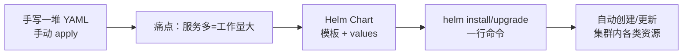

# 用 Helm 管理 K8s 部署：本章导学

本章我们来学习用 **Helm** 这个工具，给 K8s 服务做一个"安装包"（Chart），从而非常方便、快捷地在 K8s 集群上安装和升级我们的服务。

以前我们部署服务，都是手动在云控制台上创建命名空间、部署服务等。如果只是一个两个、而且不怎么更新，那还好办；**一旦服务变多，手动操作的工作量就会越来越大**。而用 Helm 做一个 Chart 安装包，就能把这套手动工作"模板化、自动化"掉。

## 纲要

- 手动部署的痛点：服务多了管不过来
- 本章路线：安装 Helm → 编写 Chart → 一行命令安装 / 升级
- Helm 有多种安装方式，总有一款适合你
- 用实战项目（用户积分等级服务）编写第一个 Chart
- Chart 把"配置"与"模板"结合，产出可复用安装包

## 手动部署的痛点

K8s 里一个服务的上线，往往伴随一堆 YAML：Deployment、Service、ConfigMap、Ingress……手动 `kubectl apply` 没问题，但代价是：

- 服务数量一多，**重复劳动指数级上升**；
- 环境差异（开发 / 测试 / 生产）靠复制粘贴 YAML 解决，极易出错；
- 升级、回滚没有版本概念，全凭人脑记。

Helm 的思路，就是用"模板 + 值文件"把这套 YAML 抽象成一个**参数化的安装包**，一次编写、多处复用。



把"手动部署"和"用 Helm 部署"放在一起对照，差距就非常直观：

| 维度 | 手动 `kubectl apply` | 用 Helm（Chart） |
| --- | --- | --- |
| 多服务管理 | 重复劳动指数级上升 | 一套模板 + 值文件复用 |
| 环境差异 | 复制 YAML 易错 | values 区分 dev/test/prod |
| 升级 / 回滚 | 全凭人脑记版本 | 有版本概念，可 `rollback` |
| 交付物 | 一堆散 YAML | 一个版本化安装包 |

## 本章路线

整章分三步走：

1. **安装 Helm**：Helm 本身支持多种安装方式，针对不同操作系统环境也有很多推荐方式，总有一种适合你的部署方式；
2. **编写自定义 Chart**：用课程实战项目"用户积分与等级系统"来编写一个 Chart，看看做一个基础安装包到底要做哪些工作、要改多少配置；
3. **安装与升级**：Chart 做好之后，用 Helm 命令行工具完成服务的安装和升级——使用上只是一行命令的事，但背后是 K8s 里众多资源对象的自动创建与配置。

## Helm 的安装

Helm 是一个单独的命令行客户端，官方提供了多种安装途径（包管理器、二进制下载、脚本安装等）。在集群侧，历史上 Helm v2 需要部署一个名为 **Tiller** 的服务器端组件；**Helm v3 起已移除 Tiller，改为纯客户端、直接基于 kubeconfig 与 Kubernetes API 交互**（这部分建议以你安装的 Helm 版本官方文档为准）。

## 用实战项目编写第一个 Chart

本章最核心的动手环节，是给我们的"用户积分与等级服务"编写一个 Chart。一个最小 Chart 的目录结构大致如下：

```dir
user-points-chart/（一个 Chart 安装包）
├── Chart.yaml          # 包元数据：name / version / apiVersion
├── values.yaml         # 默认参数值（镜像、副本数、端口等）
├── charts/             # 依赖的子 Chart（可选）
└── templates/          # 模板目录
    ├── deployment.yaml # 引用 {{ .Values.xxx }} 渲染
    ├── service.yaml
    ├── ingress.yaml
    └── _helpers.tpl    # 复用片段（可选）
```

关键在于：把"需要的配置信息"结合进模板文件，**最终渲染出我们想要的 K8s 资源清单**。模板里通过占位符引用 `values.yaml` 的值，从而实现一套模板适配多环境。

## 安装 / 升级：一行命令背后

Chart 开发完成后，真正部署时命令极简：

```bash
# 安装（首次）
helm install user-points ./user-points-chart -n demo --create-namespace

# 升级（改了 values 或模板后）
helm upgrade user-points ./user-points-chart -n demo

# 查看历史与回滚
helm history user-points -n demo
helm rollback user-points 1 -n demo
```

> 上面命令为 Helm 通用写法，具体参数（如 `-n` 命名空间、`--create-namespace`）**建议以你所用 Helm 版本的官方文档为准**。

## 为什么值得学

用 Helm 制作安装包，对开发和运维都是简单高效的工具：把"一堆 YAML"变成"一个版本化的包"，部署、升级、回滚都有据可依。稍微学习和掌握，对以后的工作效率帮助很大。

## 总结

本章导学把 Helm 的价值和路线讲清了：

1. **手动部署的瓶颈在服务数量**——多了就管不过来，必须模板化、自动化；
2. **Helm 用 Chart 封装安装包**：模板 + 值文件，一套适配多环境；
3. **路线三步走**：装 Helm → 写 Chart（以用户积分等级服务为实战）→ 一行命令安装 / 升级；
4. **Helm v3 已去 Tiller**，纯客户端基于 kubeconfig 工作（版本差异以官方文档为准）；
5. **收益明确**：部署 / 升级 / 回滚都有版本概念，开发与运维都省力。
