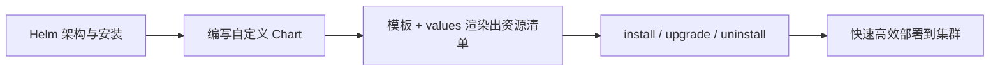

# 用 Helm 管理 K8s 部署本章小结：Chart 与常用命令

这一章带着大家了解了 K8s 集群中的 Helm 工具——通过 Helm 编写 Chart 软件包，来管理 K8s 集群中服务部署等大量资源对象。除了 Helm 工具的安装与使用，还需要了解 K8s 资源对象的 YAML 配置文件（这部分内容非常多，需要大家结合 K8s 官网 API 文档进一步学习）。下面把本章收个口。

## 纲要

- 本章主线：Helm 架构与安装 → 编写自定义 Chart → 安装/卸载/升级
- Helm 的架构与历史形态（Tiller 的角色）
- 编写 Chart：从建项目到模板渲染出资源清单
- 三个最常用的命令：install / uninstall / upgrade
- 进阶提醒：K8s 资源 YAML 需查官方 API 文档

## 本章主线回顾

整章的推进非常清晰：

1. 先介绍 **Helm 的架构**，以及如何在 K8s 集群上部署、安装 Helm 工具（历史上还包括 Tiller 服务端）；
2. 接着**编写自定义的 Chart 软件包**：从创建一个 Helm 项目，到增加文件、修改配置，让大家知道如何把需要的配置信息结合进模板文件，最终得到想要的 Chart 安装包；
3. 最后演示了 Helm 的**安装、卸载、升级**这几个常用命令——它们的使用都非常容易。



有了 Chart 软件包，通过 Helm 工具就能帮我们快速高效地把服务部署到 K8s 集群中，提升对集群和服务的管理效率。

## Helm 的架构与历史形态

Helm 被称为 K8s 的"包管理器"，其本质是把一组 K8s 资源清单参数化、版本化。需要特别说明版本差异：

- **Helm v2**：采用"客户端 + Tiller 服务端"的架构，Tiller 部署在集群内，负责实际与 Kubernetes API 交互；
- **Helm v3（当前主流）**：**移除了 Tiller**，改为纯客户端，直接读取本地 kubeconfig 与集群通信，权限收敛、部署更简单。

> 课程中提到的 tiller 相关部署，对应的是 Helm v2 形态；**你实际用的若是 Helm v3，则无需、也无法部署 Tiller**，具体以官方文档为准。

## 编写 Chart：从项目到渲染

编写一个基础 Chart 的典型流程：

```bash
# 1. 创建一个 Helm 项目骨架
helm create user-points
```

生成后的关键文件与职责：

| 文件 / 目录 | 作用 |
| --- | --- |
| `Chart.yaml` | 包的元数据：名称、版本、`apiVersion` |
| `values.yaml` | 默认参数（镜像地址、副本数、端口、资源配额等） |
| `templates/` | 资源模板，通过 values.yaml 占位符引用参数 |
| `templates/NOTES.txt` | 安装后给用户的提示信息（可选） |
| `charts/` | 依赖的子 Chart（可选） |

所谓"把配置结合进模板"，就是：在 `templates/` 里写 Deployment / Service / Ingress 等模板，模板中用类似 `.Values.image`、`.Values.replicaCount` 的占位符读取 `values.yaml`（或命令行 `--set`）传入的值，最后由 Helm 渲染成完整的 K8s 资源清单再提交集群。

```dir
Chart 编写产物结构
├── Chart.yaml（元数据）
├── values.yaml（默认参数）
├── templates/
│   ├── deployment.yaml（含 {{ .Values.xxx }}）
│   ├── service.yaml
│   └── ingress.yaml
└── 渲染后 → 完整 K8s 资源清单
```

## 三个最常用的命令

本章演示的 `install / uninstall / upgrade` 使用都很简单：

```bash
helm install   user-points ./user-points -n demo   # 安装
helm upgrade   user-points ./user-points -n demo   # 升级（改模板或值后）
helm uninstall user-points -n demo                 # 卸载
```

一行命令背后，是 Helm 自动帮我们完成了集群中众多资源对象的创建与配置——这正是它比手动 `kubectl apply` 高效的地方。

## 进阶提醒：资源 YAML 仍需查官方文档

Helm 只是"打包与渲染"工具，真正落地的还是 K8s 资源对象。本章涉及的 Deployment / Service / Ingress 等配置文件内容非常多，**必须结合 K8s 官网的 API 文档进一步学习**——尤其是字段版本（如 `apps/v1`、`networking.k8s.io/v1`）和不同 K8s 大版本的字段差异，这部分无法靠 Helm 本身解决。

## 总结

本章小结把 Helm 这条线收拢了：

1. **主线清晰**：Helm 架构与安装 → 编写自定义 Chart → install/uninstall/upgrade；
2. **架构要分清版本**：Helm v2 有 Tiller 服务端，v3 已移除、纯客户端（以官方文档为准）；
3. **Chart = 模板 + 值文件**：values.yaml 的占位符把配置注入模板，渲染出资源清单；
4. **三个命令很简单**：install / upgrade / uninstall 一行搞定，背后自动管理大量资源对象；
5. **资源 YAML 是基本功**：Helm 不替你懂 K8s API，字段与版本仍需查官方文档。
