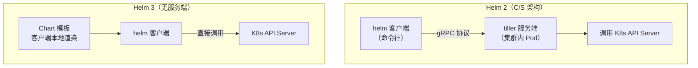
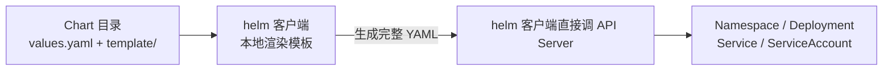
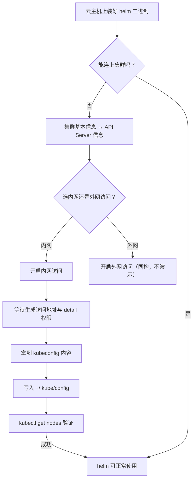

# Kubernetes 认证考点: 在 K8s 上部署 Helm 与 tiller 架构的演进

Helm 有两个组成部分：**客户端工具（命令行）+ 集群内的服务端**。这听起来像是两件要分别部署的东西，但 Helm 3 之后服务端被去掉了。

结论：**Helm 2 是典型 C/S 架构，需要部署 tiller 服务端；Helm 3 直接由客户端调用 K8s API Server 完成管理** —— 所以装 Helm 3 只需要在一台能访问集群的机器上装一个二进制。

## 纲要

- Helm 的客户端 / 服务端两件套
- Helm 2 的 tiller 架构：gRPC 通信 + RBAC 代理
- Helm 3 去掉 tiller 的架构简化
- 三种客户端安装方式：脚本 / 包管理器 / 源码
- 让客户端真正连上集群：开启访问方式 + 配置 kubeconfig

## Helm 的架构：从两件套到一件

Helm 客户端工具就是一个命令行工具软件，像 `kubectl` 一样的工具软件；**在 K8s 集群内还需要部署一个 tiller 服务端软件**。然后 Helm 客户端通过 **gRPC 协议**连接到 tiller 服务端，把相应的 Chart 软件包文件和指令发送给 tiller 服务端；服务端接收到指令以及文件就可以调用 K8s 集群的 API Server 组件的接口，完成资源对象的创建、删除等管理工作。



**这就是典型的 C/S 架构。** 不过在 Helm 3.0 版本之后，它去掉了 tiller 服务端，简化了架构：

1. 直接由 Helm 客户端调用 API Server 来完成全部的资源对象的管理工作，不再需要 tiller 这个服务端；
2. 所以也**不需要在 K8s 集群内部署 tiller 这个服务了**；
3. 软件包的内容直接在 Helm 客户端处理和转换好，生成 K8s 可以识别的相应的资源对象的 YAML 文件，然后再用 API Server 来完成集群中资源对象的管理工作。



### 两种版本的差异

| 维度 | Helm 2 | Helm 3 |
| --- | --- | --- |
| 集群内服务端 | **需要 tiller** | 无 |
| 客户端到集群的协议 | gRPC → tiller → API Server | 直接 HTTPS 调 API Server |
| 集群权限 | tiller 需要单独配 RBAC | 客户端用 kubeconfig 自带权限 |
| 默认命名空间 | tiller 所在 ns（kube-system） | 当前 kubeconfig 的 namespace |
| 部署复杂度 | 高（装镜像 + 配权限） | 低（一个二进制） |

**Helm 3 的简化是本质性的**：不再需要给 tiller 单独授权、不再需要担心 tiller 的 RBAC 配太宽，权限边界就是操作者自己的 kubeconfig。

## 安装 Helm 客户端的三种方式

### 方式一：脚本安装

直接下载 Helm 提供的安装脚本，简单执行一下，就可以完成 Helm 客户端的安装。

```bash
$ curl -fsSL -o get_helm.sh https://raw.githubusercontent.com/helm/helm/main/scripts/get-helm-3
$ chmod 700 get_helm.sh
$ ./get_helm.sh
Helm is installing to your current directory
v3.14.0 is already downloaded
```

### 方式二：包管理器（推荐）

这是推荐使用的、比较简单的方式。比如在 macOS 上用 Homebrew 装 Helm 就可以把最新的软件安装好了；当然在 Linux、或者是 Windows 操作系统上也有对应的包管理器。

```bash
# macOS
$ brew install helm

# Debian / Ubuntu
$ apt-get install helm

# Fedora / RHEL / CentOS
$ dnf install helm
```

### 方式三：源码安装

首先 `git clone` 下载 Helm 的源码到本地，然后 `make` 编译和安装。**源码安装相对比较慢，对编译环境也会有要求，所以不太推荐使用。**

```bash
$ git clone https://github.com/helm/helm.git
$ cd helm
$ make build && sudo make install
```

> 三种方式按性价比排序是：**包管理器 > 脚本 > 源码**。源码编译除了慢，还得有 Go 环境和匹配的构建工具链，为它花时间不值。

装完验证一下：

```bash
$ helm version
version.BuildInfo{Version:"v3.14.0", GitCommit:"...", GitTreeState:"clean", GoVersion:"go1.21.0"}
```

## 客户端要真正连上集群，还差两步

**使用 Helm 工具需要一个可以访问的 K8s 集群。** 光有二进制没用 —— 后面使用 Helm 的过程中，要开启 K8s 集群的内网访问权限，然后把 kubeconfig 信息配置到操作的机器上，这样操作的机器才可以连接到 K8s 集群，Helm 也就可以正常与 K8s 集群的 API Server 进行交互了。



典型操作路径：

```text
服务器端
├── 进入集群「基本信息」
├── 找到「APIServer 信息」
│   ├── 支持外网访问
│   └── 支持内网访问  ← 这里只开内网
├── 开启内网访问
├── 等待生成（需要等一会儿）
└── 查看 kubeconfig 权限详情，拿到 kubeconfig 内容

本地 / 云主机
├── mkdir -p ~/.kube
├── 复制 kubeconfig 内容
└── 写入 ~/.kube/config
```

验证：

```bash
$ kubectl get nodes
NAME         STATUS   ROLES    AGE   VERSION
10.0.0.31    Ready    <none>   12d   v1.30.4
10.0.0.32    Ready    <none>   12d   v1.30.4
# 能列出节点，说明 kubeconfig 生效，helm 也就能调 API Server 了
```

## API 速览

| 能力 | 命令 / 配置 |
| --- | --- |
| 查看版本 | `helm version` |
| 客户端安装（脚本） | `curl -fsSL ... get-helm.sh \| bash` |
| 客户端安装（macOS） | `brew install helm` |
| 客户端安装（源码） | `git clone` + `make build && make install` |
| 集群访问地址 | 集群基本信息 → APIServer 信息（内网 / 外网开关） |
| 连接凭证 | `kubeconfig`（复制到 `~/.kube/config`） |
| 验证连接 | `kubectl get nodes` / `kubectl get ns` |
| 查看已有 chart 仓库 | `helm repo list` |
| 添加仓库 | `helm repo add <name> <url>` |
| 初始化客户端 | Helm 3 不需要 `helm init`（那是 tiller 时代的动作） |
| 集群内服务端 | Helm 3 无 tiller，`helm init` 已废弃 |

## Demo 示例

在云主机上把 Helm 3 跑通。

```text
# ---------- 1. 装客户端（包管理器最省事）
$ brew install helm
$ helm version --short
v3.14.0+g8af9ef

# ---------- 2. 集群侧开启内网访问
# 控制台：基本信息 → APIServer 信息 → 开启「内网访问」
# 等待生成，拿到内网地址，例如 https://10.0.0.10:443

# ---------- 3. 把 kubeconfig 落到操作机器
$ mkdir -p ~/.kube
$ cat ~/.kube/config
apiVersion: v1
kind: Config
clusters:
- cluster:
    certificate-authority-data: <base64 CA>
    server: https://10.0.0.10:443     # 内网地址
  name: cls-ivanonline
contexts:
- context:
    cluster: cls-ivanonline
    user: cls-ivanonline-admin
  name: cls-ivanonline
current-context: cls-ivanonline
users:
- name: cls-ivanonline-admin
  user:
    token: <base64 token>
    # 或用 client-certificate-data + client-key-data

# ---------- 4. 验证能连上集群
$ kubectl get ns
NAME              STATUS   AGE
default           Active   12d
kube-system       Active   12d
usergrow          Active   10m

# ---------- 5. 加个常用仓库，Helm 3 已无需 helm init
$ helm repo add bitnami https://charts.bitnami.com/bitnami
$ helm repo list
NAME    URL
bitnami https://charts.bitnami.com/bitnami

# ---------- 6. 确认集群里没有 tiller（Helm 3 特征）
$ kubectl get pods -n kube-system | grep -i tiller
# 无输出 → 正确
```

**三个常见卡点**

| 现象 | 原因 |
| --- | --- |
| `Error: Kubernetes cluster has no configuration` | `~/.kube/config` 没写入或路径不对 |
| `The connection to the server ... was refused` | 开了内网访问但用的还是外网地址 |
| `Unauthorized` / `forbidden` | kubeconfig 过期，重新取一份 |

### 总结

Helm 的部署难度在 Helm 3 之后大幅下降：**Helm 2 要同时装客户端和集群内的 tiller，客户端通过 gRPC 把包和指令发给服务端，由服务端调 API Server；Helm 3 把 tiller 整个去掉，客户端本地渲染出完整 YAML 后直接调 API Server**。

所以实际工作中，装 Helm 就是三件事：**选包管理器装一个二进制、在集群开好内网/外网访问、把 kubeconfig 写到 `~/.kube/config`**，最后用 `kubectl get nodes` 验证连通性。

别忘了 Helm 只是"把一堆 YAML 变成可参数化的一行命令"，**它不创造资源对象** —— 能不能写好 Chart，最终还是看你有多熟 K8s 的各类资源 YAML。

