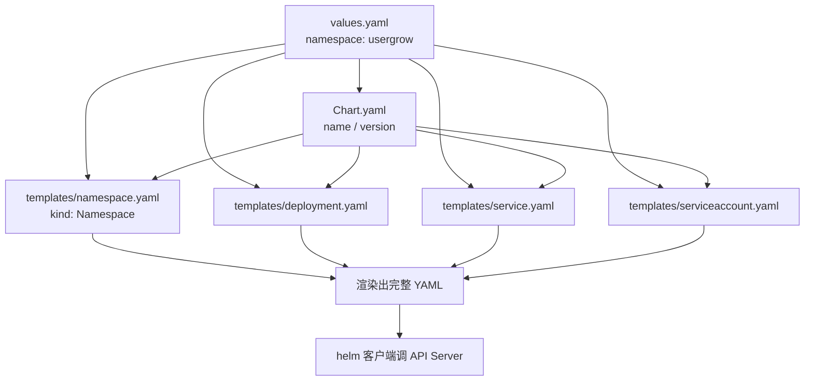
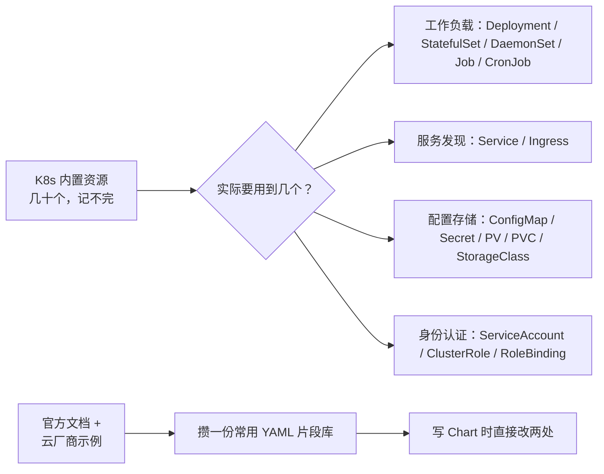

# Kubernetes 认证考点: 给用户积分等级服务编写自定义 Chart

给自研的微服务做 Chart，本质上**不是学 Helm，是把已有的 K8s YAML 模板化**。Chart 里放的就是 `deployment.yaml`、`service.yaml`、`ingress.yaml`、`serviceaccount.yaml` 这些文件，只不过把定值换成了 `{{ .Values.xxx }}` 形式的变量标签。

结论：**`helm create` 生成骨架 → 改 `values.yaml`（镜像、namespace、密钥）→ 改 `template/`（补 namespace、把 HTTP 健康检查改成 TCP Socket）→ 就完事**。

## 纲要

- `helm create` 生成 Chart 骨架
- values.yaml 承载可变配置
- template 目录是 Go 模板 + K8s YAML 的合成
- 为新集群补一个 namespace.yaml
- 把 HTTP 健康检查改成 TCP Socket（gRPC 服务的刚需）
- 模板文件的本质是「熟悉 K8s 资源对象」

## 第一步：创建 Helm 项目

在咱们的项目代码中创建一个 helm 目录，在这个目录里面执行一下 `helm create usergroups` 命令，就可以创建一个 Helm 项目了。里面已经有完成的 chart 文件、values.yaml、template 目录等等。

```bash
$ mkdir helm && cd helm
$ helm create usergrow
Create usergrow/chart/examples
Create usergrow/.helmignore
Create usergrow/Chart.yaml
Create usergrow/values.yaml
Create usergrow/templates/serviceaccount.yaml
Create usergrow/templates/service.yaml
Create usergrow/templates/deployment.yaml
Create usergrow/templates/hpa.yaml
Create usergrow/templates/ingress.yaml
Create usergrow/templates/NOTES.txt
```

生成的目录长这样：

```text
usergrow/
├── Chart.yaml              # Chart 元数据：name / version / appVersion
├── values.yaml             # 【要改】所有可变配置的默认值
├── .helmignore             # 打包时忽略的文件
├── templates/              # 【要改】K8s 资源模板
│   ├── deployment.yaml
│   ├── service.yaml
│   ├── serviceaccount.yaml
│   ├── ingress.yaml
│   ├── hpa.yaml
│   ├── NOTES.txt
│   └── _helpers.tpl        # 复用的命名与标签片段
└── charts/
    └── examples/           # 子 Chart
```

**接下来只需要对其中的部分内容进行修改就好了** —— 打开 values.yaml 把里面的一些配置信息根据自己的项目需求做一些修改，有一些需要新增加的配置也可以放在这个文件里面。

## values.yaml：可变配置的唯一来源

然后是 Chart software 包的重点部分，**修改模板文件，这些文件都在 template 目录里**，会有 `service.yaml`、`deployment.yaml`、`ingress.yaml`、`serviceaccount.yaml` 等。

```yaml
# usergrow/values.yaml
replicaCount: 2

namespace: usergrow          # ← 新加的配置项

image:
  repository: ccr.ccs.tencentyun.com/ivanonline/usergrow
  pullPolicy: Always
  tag: "v1.2.0"              # ← 改成本项目自己制作的镜像地址与版本

imagePullSecrets:
  - name: qcloudregistrykey   # ← 配一个能拉取镜像仓库的密钥

nameOverride: ""
fullnameOverride: ""

serviceAccount:
  create: true
  name: usergrow-sa

service:
  type: ClusterIP
  port: 8080

ingress:
  enabled: false
  className: nginx
  hosts:
    - host: www.ivanonline.com
      paths:
        - path: /
          pathType: Prefix

resources:
  requests:
    cpu: 100m
    memory: 256Mi
  limits:
    cpu: "1"
    memory: 1Gi

# 健康检查：gRPC 服务不能用 HTTP GET，改成 TCP Socket
livenessProbe:
  tcpSocket:
    port: 8080
  initialDelaySeconds: 15
  periodSeconds: 10

readinessProbe:
  tcpSocket:
    port: 8080
  initialDelaySeconds: 5
  periodSeconds: 5

autoscaling:
  enabled: true
  minReplicas: 2
  maxReplicas: 6
  targetCPUUtilizationPercentage: 70
```

四个必须改的点：

1. **镜像地址 image** —— 改成之前自己制作的镜像地址以及相应的镜像版本；
2. **拉取镜像的密钥** —— 配置 `imagePullSecrets`，值是能拉私有仓库的 Secret 名；
3. **namespace** —— 新加的定义；
4. **健康检查方式** —— 见下面一节。

## 模板文件：K8s YAML + Go 模板变量

这里的文件都是**模板文件，实际的内容就是 K8s 资源对象的 YAML 配置文件**，只不过把很多的值换成了模板的变量标签；最终生成的 Chart 软件包肯定都是根据这些模板以及 values.yaml、Chart.yaml 等文件中的配置信息，最终生成的 K8s 资源对象的完整的 YAML 配置文件。

```yaml
# usergrow/templates/deployment.yaml
apiVersion: apps/v1
kind: Deployment
metadata:
  name: {{ include "usergrow.fullname" . }}
  namespace: {{ .Values.namespace }}        # ← 默认模板中没有，需手动加
  labels:
    {{- include "usergrow.labels" . | nindent 4 }}
spec:
  replicas: {{ .Values.replicaCount }}
  selector:
    matchLabels:
      {{- include "usergrow.selectorLabels" . | nindent 6 }}
  template:
    metadata:
      labels:
        {{- include "usergrow.selectorLabels" . | nindent 8 }}
    spec:
      {{- with .Values.imagePullSecrets }}
      imagePullSecrets:
        {{- toYaml . | nindent 8 }}
      {{- end }}
      serviceAccountName: {{ include "usergrow.serviceAccountName" . }}
      containers:
        - name: {{ .Chart.Name }}
          image: "{{ .Values.image.repository }}:{{ .Values.image.tag | default .Chart.AppVersion }}"
          imagePullPolicy: {{ .Values.image.pullPolicy }}
          ports:
            - name: grpc
              containerPort: {{ .Values.service.port }}
          livenessProbe:
            {{- toYaml .Values.livenessProbe | nindent 12 }}
          readinessProbe:
            {{- toYaml .Values.readinessProbe | nindent 12 }}
          resources:
            {{- toYaml .Values.resources | nindent 12 }}
```

```yaml
# usergrow/templates/service.yaml
apiVersion: v1
kind: Service
metadata:
  name: {{ include "usergrow.fullname" . }}
  namespace: {{ .Values.namespace }}
  labels:
    {{- include "usergrow.labels" . | nindent 4 }}
spec:
  type: {{ .Values.service.type }}
  ports:
    - port: {{ .Values.service.port }}
      targetPort: grpc
      protocol: TCP
      name: grpc
  selector:
    {{- include "usergrow.selectorLabels" . | nindent 4 }}
```

`serviceaccount.yaml` 也一样，**加了一个 namespace**：

```yaml
# usergrow/templates/serviceaccount.yaml
apiVersion: v1
kind: ServiceAccount
metadata:
  name: {{ include "usergrow.serviceAccountName" . }}
  namespace: {{ .Values.namespace }}
  labels:
    {{- include "usergrow.labels" . | nindent 4 }}
```

> 一句话记住 Helm 模板：`{{ .Values.x }}` 取值、`{{ include "y" . }}` 复用片段、`{{- toYaml .Values.z | nindent N }}` 把一整块 values 安全地缩进到某个层级。最后那个组合是写 values 大块配置的标准写法。

## 补一个 namespace.yaml

**我们还要创建自定义的 namespace，所以在 template 目录下咱们再新增一个 namespace.yaml 文件。**

```yaml
# usergrow/templates/namespace.yaml
apiVersion: v1
kind: Namespace
metadata:
  name: {{ .Values.namespace }}
  labels:
    {{- include "usergrow.labels" . | nindent 4 }}
```

这个配置文件很简单，**就是一个 namespace 的 YAML 文件，指定我们需要的 namespace 名称**；而这个 `namespace` 正是前面在 values 里新加进去的。



## 关键改动：gRPC 服务必须改健康检查方式

这是最容易踩坑的一处。**健康检查默认的话，它是 HTTP GET 的方式来请求一个路径；因为我们是 gRPC 服务，所以不太适合这种方式来做健康检查。所以我们改成 TCP Socket 来监听一个端口。**

```text
默认模板的 HTTP 探针（不适合 gRPC）
├── livenessProbe.httpGet.path: /healthz
└── readinessProbe.httpGet.path: /ready
    └── gRPC 服务没有暴露 HTTP 端点 → 探针持续失败 → Pod 反复重启

改成 TCP Socket 探针（正确）
├── livenessProbe.tcpSocket.port: 8080
└── readinessProbe.tcpSocket.port: 8080
    └── 只要端口能连上就算健康
```

| 探针方式 | 适用 | 不适合 |
| --- | --- | --- |
| `httpGet` | 有 HTTP 端点的 Web 服务 | gRPC 服务、纯 TCP 服务 |
| `tcpSocket` | **gRPC / 任意 TCP 监听** | 需要业务级健康判断的场景 |
| `exec` | 有独立脚本 | 多容器时行为不直观 |

TCP Socket 能解决"进程活着"的问题，但**判断不了业务逻辑是否可用**（比如数据库连不上）。gRPC 服务要更精细的健康检查，可以另配 `grpc` 探针：

```yaml
readinessProbe:
  grpc:
    port: 8080
    service: grpc.health.v1.Health/Check
  initialDelaySeconds: 5
  periodSeconds: 5
```

前提是你的服务实现了 `grpc.health.v1.Health` 接口。

## 会不会写 Chart，取决于有多熟资源对象

要掌握如何修改或者新增 template 目录中的模板文件，**关键还是要再次熟悉掌握 K8s 集群中的资源对象**。

之前的章节有介绍过 K8s 集群中有**工作负载类资源、service 类资源、配置和存储类资源、身份认证类资源、鉴权类资源以及策略类资源**，不包括其他扩展的和自定义的资源对象。K8s 内置的资源对象总共就有好几十个，**咱们肯定是没法一个一个都记住和掌握的**。

所以根据需要还是要去看官方文档以及参考云厂商的使用示例 —— 积累了一些常用的资源对象 YAML 配置信息以后，再次使用就可以直接拿过来，稍微修改一下就能用。



**一个实用的做法**：把常用资源对象的高可用 YAML 存成自己的"片段库"（Git 仓库或者本地目录），写 Chart 时复制过来改字段名。这比每次从零敲快得多，也不容易漏字段。

## API 速览

| 能力 | 命令 / 字段 |
| --- | --- |
| 创建 Chart 骨架 | `helm create <name>` |
| Chart 元数据 | `Chart.yaml`（`name` / `version` / `appVersion`） |
| 默认值集中处 | `values.yaml` |
| 模板目录 | `templates/`（`deployment` / `service` / `ingress` / `serviceaccount` / `hpa`） |
| 自定义资源模板 | 在 `templates/` 下新增 `namespace.yaml` 等 |
| 取值语法 | `{{ .Values.key }}` |
| 复用标签片段 | `{{- include "chart.labels" . | nindent N }}` |
| 整块渲染 | `{{- toYaml .Values.resources | nindent 12 }}` |
| HTTP 探针 | `livenessProbe.httpGet.path` |
| TCP 探针 | `livenessProbe.tcpSocket.port`（gRPC 用这个） |
| gRPC 探针 | `readinessProbe.grpc.port` + `grpc.health.v1.Health/Check` |
| 私有镜像密钥 | `values.imagePullSecrets[].name` |
| 渲染预览 | `helm template <release> <chart> --values dev.yaml` |
| 语法校验 | `helm lint <chart>` |

## Demo 示例

渲染验证改好的 Chart，确认输出的就是预期资源。

```bash
# ---------- 1. 语法校验
$ helm lint usergrow
[OK] chart lint passed

# ---------- 2. 渲染预览（不落集群，先看生成了什么）
$ helm template usergrow ./usergrow --namespace usergrow
---
# Source: usergrow/templates/namespace.yaml
apiVersion: v1
kind: Namespace
metadata:
  name: usergrow
---
# Source: usergrow/templates/serviceaccount.yaml
apiVersion: v1
kind: ServiceAccount
metadata:
  name: usergrow-sa
  namespace: usergrow
---
# Source: usergrow/templates/deployment.yaml
apiVersion: apps/v1
kind: Deployment
metadata:
  name: usergrow
  namespace: usergrow
...
        livenessProbe:
          tcpSocket:
            port: 8080
          initialDelaySeconds: 15
          periodSeconds: 10

# ---------- 3. 覆盖配置渲染（改镜像 tag 试试）
$ helm template usergrow ./usergrow \
    --set image.tag=v1.3.0 \
    --set replicaCount=4 | grep -E "image:|replicas:"
          image: "ccr.ccs.tencentyun.com/ivanonline/usergrow:v1.3.0"
  replicas: 4

# ---------- 4. 用自定义 values 文件
$ cat > prod.yaml <<'EOF'
replicaCount: 6
image:
  tag: "v1.4.1"
namespace: usergrow-prod
service:
  type: NodePort
livenessProbe:
  tcpSocket:
    port: 8080
EOF
$ helm template usergrow ./usergrow -f prod.yaml | grep -E "kind: Namespace|image:|type: "
kind: Namespace
          image: "ccr.ccs.tencentyun.com/ivanonline/usergrow:v1.4.1"
  type: NodePort
```

**输出核对清单**

| 检查项 | 期望 |
| --- | --- |
| 渲染结果里有 `kind: Namespace` | 说明 `namespace.yaml` 被识别 |
| 所有资源都带 `namespace: usergrow` | 说明新加的 namespace 值透传成功 |
| `tcpSocket` 而不是 `httpGet` | 说明 gRPC 探针改对了 |
| `imagePullSecrets` 出现在 Pod spec | 说明能拉私有仓库镜像 |
| `helm lint` 无 error | 模板语法正确 |

### 总结

写自定义 Chart 的正确姿势是"**模板化已有 YAML**"，不是从零发明新东西。流程固定四步：

1. `helm create usergrow` 拿到骨架；
2. 改 `values.yaml` —— 镜像地址、版本号、拉取密钥的 Secret 名、namespace；
3. 改 `templates/` —— 给 deployment / service / serviceaccount 补 `namespace`，**把 gRPC 服务的 HTTP 探针换成 TCP Socket（或 gRPC 探针）**；
4. 想单独建命名空间就再补一个 `templates/namespace.yaml`。

真正的能力分水岭不是 Helm 语法，而是**对 K8s 内置资源对象的熟悉程度** —— 内置的有几十个，记不完也别记，靠官方文档和云厂商示例攒一份自己的 YAML 片段库，写 Chart 时改两处就能用。

