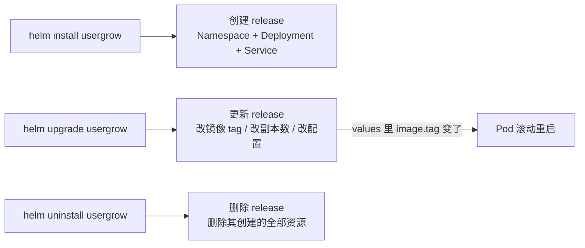
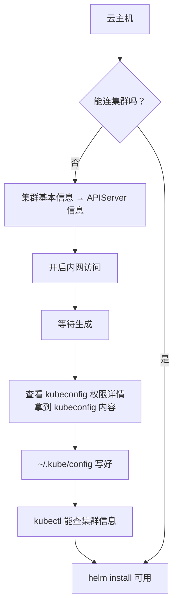
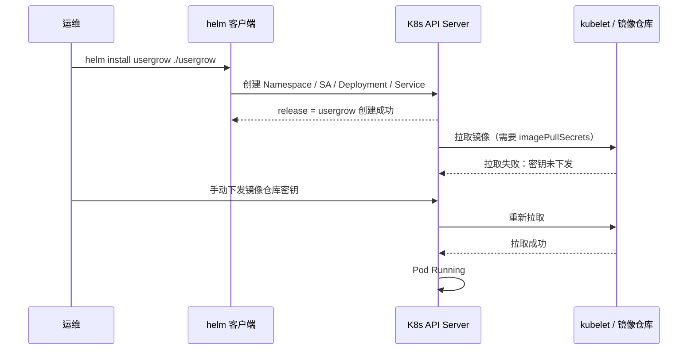
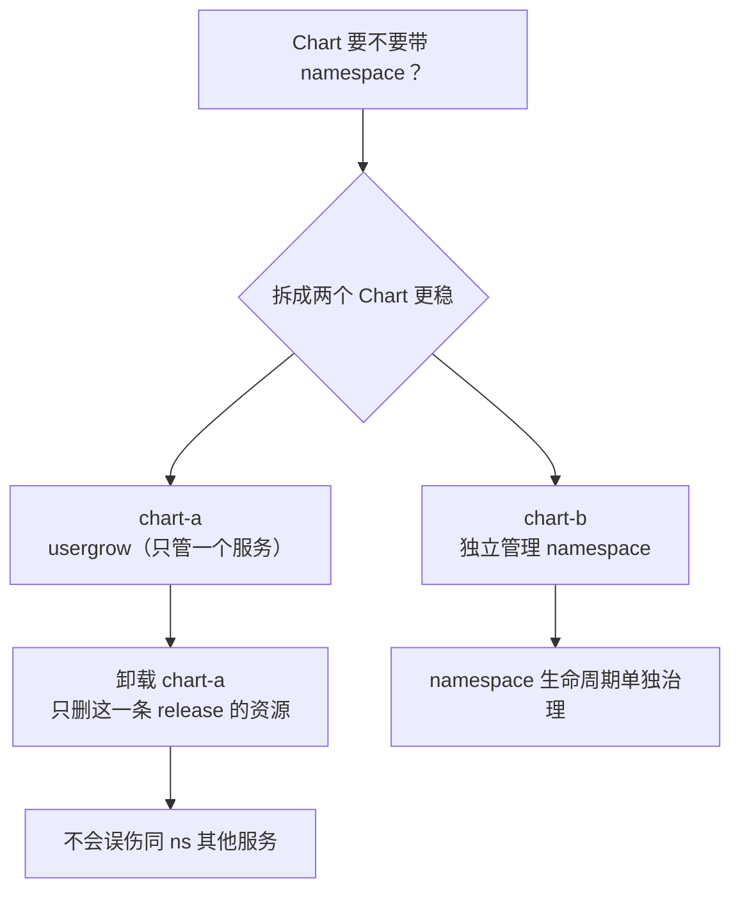

# Kubernetes 认证考点: 用 Helm 一行命令安装升级应用与命名空间的两个坑

写好了 Chart 的软件包文件，就可以**像普通代码文件一样放在 Git 仓库中、放在单独的 Helm 仓库中，也可以自己保存，或者保存在本地或者云盘上，甚至以文件形式共享**。

结论：**安装、卸载、升级都只是一行命令；但 Chart 里不要默认携带 namespace 的创建与删除** —— 密钥下发不会自动完成，而且删命名空间会连带删掉里面所有服务。

## 纲要

- Chart 软件包的存放位置：仓库 / 本地 / 文件共享
- `helm install` / `uninstall` / `upgrade` 三行命令
- 操作前的连通性准备：kubeconfig
- 坑一：镜像仓库密钥没有自动下发
- 坑二：卸载连带删除命名空间，里面别的服务一起没了
- 实际工作中的建议：一个 Chart 只管一个服务

## 三行命令覆盖日常全部操作

有了 Chart 软件包，接下来把它应用到 K8s 集群中就变得非常简单和高效了。

首先是安装服务，只需要执行一行命令：

```bash
$ helm install usergrow usergrow/usergrow
```

前面的 `usergroups` 是**软件包应用实例的名称**（release name），后面的 `usergroups/目录` 是可以找到 chart 文件的目录。

卸载对应的软件也是一行命令：

```bash
$ helm uninstall usergrow
```

`helm uninstall` 后面的 `usergroups` 跟上面的软件包应用实例的名称一样，就可以卸载了。

而平时的代码更新、应用程序升级也是类似的一行命令：

```bash
$ helm upgrade usergrow usergrow/usergrow
```

升级的命令跟安装的命令几乎是一样的，**里面可能改相应的版本号、改它的镜像的 tag** 呀，就这么一些差别 —— 把这个命令中的 `install` 改成 `upgrade` 就好了。



## 操作前先解决连通性

到 K8s 集群中来实际操作。这个 Helm 项目在 K8s 集群里面来使用部署的话，我们首先**需要有 K8s 集群，有了 K8s 集群，我们又要怎么来访问它呢？** —— 所以还需要**开放一个 kubeconfig 的访问权限**。



拿到 kubeconfig 之后要在云主机上创建目录和文件，把内容粘贴进去；配置好之后就可以访问到这个集群了 —— 通过 `kubectl` 命令去访问集群能看到集群的信息，说明连接通了。

有些环境之前创建过这个文件，**需要先把它删除再重新创建一下**，还要等到生成完。

```bash
# 确认当前上下文指向这个集群（避免装到别的集群去）
$ kubectl config current-context
cls-ivanonline

$ kubectl get ns
NAME              STATUS   AGE
default           Active   18d
usergrow          Active   3m
```

> 这一步是**最容易被跳过的**：Helm 3 直接用 kubeconfig 的权限，连错了集群不会报明显错，只会"装了个寂寞"。

## 实际安装过程

用 `helm install` 命令去安装 K8s 服务，需要进到上一层目录：

```bash
# 在包含 usergrow/ 目录的上一层执行
$ helm install usergrow ./usergrow
NAME: usergrow
LAST DEPLOYED: Fri Oct  2 20:16:11 2026
NAMESPACE: usergrow
STATUS: deployed
REVISION: 1
TEST SUITE: None
```

进到 K8s 集群里看：工作负载 `usergroups` 在创建，secret空间里**「镜像仓库密钥要下发有异常」，我们要手动的把它下发一下**；密钥下发下去之后，下面的部署呢它就能拉取到镜像了 —— 现在就已经成功地把服务的部署创建好了。

然后看看这个服务的 service 是不是也创建起来了：Service 也创建起来了。**总结一下这个地方做了几件事：命名空间、工作负载和 service 都正常的创建出来了。**



## 坑一：镜像密钥不会自动下发

云厂商集群里，`imagePullSecrets` 引用的镜像仓库密钥**常常需要手动下发到 namespace**，Chart 模板里写了 `imagePullSecrets` 也不等于密钥就在那个命名空间里。

密钥下发下去之后，部署才能拉取到镜像。这在 fresh namespace 上尤其明显 —— 新建的命名空间是"干净"的，任何凭据都得显式带进去。

排查方式：

```bash
# 1. 看 Pod 状态
$ kubectl get pods -n usergrow
NAME                          READY   STATUS         RESTARTS   AGE
usergrow-6d9f8b6c4-x2p9k      0/1     ImagePullBackOff   0          1m

# 2. 看具体原因
$ kubectl describe pod usergrow-6d9f8b6c4-x2p9k | tail -6
Events:
  Type     Reason     Message
  ----     ---------  -------
  Normal   BackOff    Back-off pulling image "..."
  Warning  Failed     Failed to pull image "...":
           unauthorized: authentication required

# 3. 手动补一个 image pull secret
# 先给变量赋值，例如：TCR_USER=100012345678；TCR_PWD=******
$ kubectl create secret docker-registry qcloudregistrykey \
    --docker-server=ccr.ccs.tencentyun.com \
    --docker-username=$TCR_USER \
    --docker-password=$TCR_PWD \
    -n usergrow
secret/qcloudregistrykey created
```

手动下发给这个命名空间之后，**密钥才会下发下去，下面的部署就能拉取到镜像了**。

## 坑二：卸载会连带删掉命名空间

再来看这个服务，卸载 `usergrow` 只要执行这个卸载命令：

```bash
$ helm uninstall usergrow
release "usergrow" uninstalled
```

再看 Service，里面已经没有了；工作负载里也没有了。**那 secret 空间呢？这个也处于回收（Terminating）状态。** 我们再次去安装，它应该又都会回来了。

因为 namespace 没有删除掉，所以会有一个报错。看这个过程中部署有没有创建成功 —— 也没有。

```text
反复安装 / 卸载的观察
├── 第一次 install   → ns / deploy / svc 全部创建 ✓
├── uninstall        → svc 消失、deploy 消失
│                     ns 进入 Terminating，没删干净
├── 第二次 install   → release 名重复报错
│                     报错指向 namespace 已存在（其实是 Terminating）
│                     Pod 起不来（镜像密钥没自动下发）
├── 再 uninstall + 强制清 ns
└── 第三次 install   → 成功
```

Namespace 卡在 `Terminating` 是 K8s 的经典现象，**尤其当 namespace 里还有资源没清理干净时**。

```bash
# 查看卡住的原因
$ kubectl get namespace usergrow -o jsonpath='{.spec.finalizers}'
["kubernetes"]

# 批量清掉残留资源后强制删（仅在确认无价值时）
$ kubectl proxy &
$ kubectl delete namespace usergrow --grace-period=0 --force
```

> 生产上不要这么干。正确做法是**先卸载 release，再确认 ns 里的资源都清了，最后才删 ns**。

## 实际建议：一个 Chart 只管一个服务

在实际工作中，**不建议把命名空间也配置上去**。在刚才实践的过程中大家也看到会有一些问题：首先是这个密钥的下发，它没有自动的完成；然后就是如果要删除的话，会把这个命名空间删掉，**如果 namespace 里面有很多的服务，那也就都不能用了，所以还是挺危险的**。

所以我们一个 Chart 软件包，**尽量的是把我们需要管理的几个服务，或者就一个服务放到里面就好了**。



对比一下两种组织方式：

| 做法 | 卸载影响 | 密钥下发 | 适用 |
| --- | --- | --- | --- |
| Chart 含 namespace（多服务） | **删 ns → 同 ns 所有服务一起没了** | 不自动下发，要手动补 | 演示 / 一次性环境 |
| Chart 只含单服务 | 只删 release 自己的资源 | 仍要手动补 | **生产推荐** |
| namespace 由 IaC 单独管 | 卸载不碰 ns | 密钥预置在 ns | **生产推荐** |

那我们以后再用这个 Chart 就可以非常快速便捷地去更新 K8s 的服务了，去部署服务啊这些都会变得更容易。

## API 速览

| 能力 | 命令 / 对象 |
| --- | --- |
| 安装 | `helm install <release> <chart路径]` |
| 卸载 | `helm uninstall <release>` |
| 升级 | `helm upgrade <release> <chart路径]` |
| 查看 release | `helm list -A` |
| 查看 release 历史 | `helm history <release>` |
| 回滚 | `helm rollback <release> <revision>` |
| 渲染不执行 | `helm template <release> <chart>` |
| 语法校验 | `helm lint <chart>` |
| 覆盖配置 | `--set key=value` / `-f values.yaml` |
| 指定命名空间 | `--namespace <ns> -n <ns>` |
| 镜像拉取凭据 | `imagePullSecrets: [{name: ...}]` + `kubectl create secret docker-registry` |
| 查看卡住的 ns | `kubectl get ns` 看 STATUS + `kubectl describe ns` |
| 强制清 ns | namespace 有 `kubernetes` finalizer 卡住时需先清残留资源 |

## Demo 示例

走一遍从装到卸载再到重装的完整流程。

```bash
# ---------- 0. 连通性准备
$ kubectl config current-context
cls-ivanonline
$ kubectl get ns
NAME        STATUS   AGE
default     Active   18d
usergrow    Active   3m

# ---------- 1. 安装
$ helm install usergrow ./usergrow -n usergrow
NAME: usergrow
STATUS: deployed
REVISION: 1

# ---------- 2. 发现镜像拉不下来
$ kubectl get pods -n usergrow
NAME                          READY   STATUS             RESTARTS   AGE
usergrow-6d9f8b6c4-x2p9k      0/1     ImagePullBackOff   0          40s

# ---------- 3. 手动下发镜像仓库密钥
# 先给变量赋值，例如：TCR_PWD=******；POD=$(kubectl get pod -n usergrow -o jsonpath='{.items[0].metadata.name}')
$ kubectl create secret docker-registry qcloudregistrykey \
    --docker-server=ccr.ccs.tencentyun.com \
    --docker-username=ivanonline --docker-password=$TCR_PWD -n usergrow
secret/qcloudregistrykey created

# ---------- 4. 等 Pod 起来
$ kubectl get pods -n usergrow -w
usergrow-6d9f8b6c4-x2p9k   1/1     Running   0   12s

# ---------- 5. 远程登录验证服务真的跑起来了
$ kubectl exec -it -n usergrow $POD -- sh
/ # grpcurl -insecure -d '{}' usergrow:8080 coin.UserGrow/ListTask
{"code":500,"msg":"connect to 127.0.0.1:3306"}
# ↑ 返回数据库报错 = gRPC 服务已运行

# ---------- 6. 升级：只改镜像 tag
$ helm upgrade usergrow ./usergrow \
    --set image.tag=v1.2.0 -n usergrow
NAME: usergrow
STATUS: deployed
REVISION: 2
$ kubectl get rs -n usergrow    # 新 ReplicaSet 滚动中

# ---------- 7. 回滚到上一版
$ helm rollback usergrow 1

# ---------- 8. 卸载（注意：Chart 里没带 namespace 就不会删 ns）
$ helm uninstall usergrow -n usergrow
release "usergrow" uninstalled
$ kubectl get svc,deploy -n usergrow
# 已清空，但 ns 还在
$ kubectl get ns usergrow
usergrow   Active   25m
```

**如果 Chart 里带了 namespace**（不推荐），卸载时会看到：

```bash
$ helm uninstall usergrow -n usergrow
$ kubectl get ns
usergrow   Terminating   25m     ← 卡在 Terminating
```

这就是"**如果 namespace 里面有很多的服务，那也就都不能用了**"的来源 —— 一条 release 的卸载影响了整个命名空间。

### 总结

Helm 的操作本身极简：**`helm install` 起服务、`helm upgrade` 换 tag 做升级、`helm uninstall` 拆掉，都是一行命令**，背后一次性把命名空间、工作负载、Service 全建出来。

但两个坑必须在动手前就想清楚：

1. **镜像拉取密钥不会自动下发** —— Chart 里写了 `imagePullSecrets` 只是引用，密钥得手动用 `kubectl create secret docker-registry` 补进 namespace，否则就是 `ImagePullBackOff`；
2. **别让 Chart 管 namespace** —— 卸载一条 release 会把整个命名空间删掉，同命名空间里的其他服务跟着一起没，风险极高。

所以生产实践是：**namespace 由基础设施层单独治理，Chart 里只放一个服务的资源**。这样升级走 `helm upgrade`，回滚走 `helm rollback`，服务的生命周期和命名空间的生命周期互不干扰。

