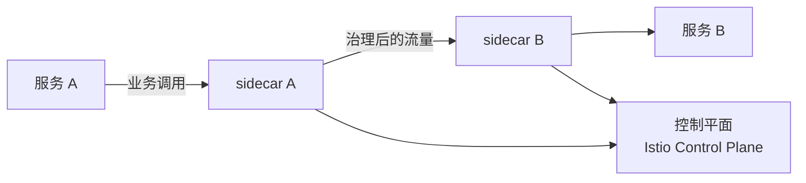

# ServiceMesh 与 Istio 本章导学：把治理下沉到边车

本章我们来了解用 **Istio** 来实现微服务治理。在容器化 K8s 和微服务发展的同一时期，还有一项技术——**ServiceMesh（服务网格）**——也同步发展起来。但直到今天，它给人的感觉还是"雷声大雨点小"：大公司也没能在生产环境完全推广开。不过，已经有越来越多团队开始把 ServiceMesh 引入自己的架构。为什么它这么晚才被认真考虑？本章就来介绍 ServiceMesh，以及一个比较成熟的实现方案 Istio，帮你在"是否上服务网格"这个问题上做出更好的选择。

## 纲要

- 什么是 ServiceMesh，以及它为什么"来得晚"
- ServiceMesh 要解决的、与解决的问题
- Istio 的实现方案：原理与能力
- 本章重点：用 Istio 在 K8s 里做服务治理
- 能力取舍：本章聚焦流量治理，其余留待延伸

## 什么是 ServiceMesh

ServiceMesh 的核心思想是：**给每个服务实例注入一个"边车"（sidecar）代理，由它接管微服务之间的所有网络通信**。这样一来，服务本身只需要关心业务逻辑，而重试、熔断、限流、加密、观测这些"治理脏活"全部下沉到这一层去统一处理。



## 为什么它"来得晚"

容器化、K8s、微服务跑得飞快，ServiceMesh 却慢半拍，原因主要有：

- 它**多引入了一层网络调用**，复杂性和性能都会受一些影响；
- 它不是"装上就完事"，治理与配置的复杂度只是被**抽象和集中化**，工作本身并没有减少；
- 早期产品成熟度、运维门槛都偏高，大公司也多是"试点"而非"全量"。

但反过来，一旦规模上去、服务间调用关系变复杂，ServiceMesh 提供的统一治理层价值就开始显现，所以"越来越多团队开始考虑"是趋势。

## ServiceMesh 要解决的与已经解决的

导学里强调：不能只"听说过 ServiceMesh 这个名字"，而要全面了解它的**来由、原理、要解决的问题、优点和缺点**，才能理解它在架构体系里的真实位置。它覆盖的能力很广：

| 能力 | 说明 |
| --- | --- |
| 服务发现 / 负载均衡 | 边车层统一做，业务代码无感知（本章前 K8s 章节已详讲，故本章略） |
| 配置管理 | 动态下发路由、策略 |
| 安全认证 / 授权 | mTLS、身份、访问控制 |
| 可观测性 | 指标、日志、链路（与后续云原生监控告警日志类似） |
| **流量治理** | **本章重点**：路由、灰度、故障注入等 |

## Istio：一个较成熟的实现

本章会重点讲解如何用 **Istio** 在 K8s 集群中完成服务治理。Istio 是目前相对成熟的服务网格产品，它的原理和能力会与"服务网格"本身高度重合（因为 Istio 就是服务网格的一种落地方案），我们会再细化讲一遍。

Istio 的能力很有吸引力，但也因为篇幅有限，本章**把重点放在流量治理**上——毕竟服务发现和负载均衡在前面的 K8s 章节已经讲得够多，可观测性后面的云原生监控告警日志章节也会覆盖。如果你对 Istio 的其它能力（服务发现、负载均衡、配置管理、安全、可观测、流量管理）兴趣更大，后续可以考虑学习专门的 Istio 课程，到时会全面覆盖。

## 本章动手：用 Istio 做服务治理

最后，也是最有分量的一环，是**在 K8s 集群中真正用 Istio 落地服务治理**。你会动手：

- 创建 K8s 集群并安装 Istio（启用 sidecar 自动注入）；
- 通过 Istio 工具管理集群资源，创建服务和部署；
- 配置 **Gateway、VirtualService、DestinationRule** 等路由规则；
- 实践流量转发、灰度 / 金丝雀发布、故障注入等治理手段。

```dir
本章 Istio 实战结构
├── 安装 Istio（控制平面 + sidecar 注入）
├── 创建服务与部署（开启注入的命名空间）
├── 配置流量规则
│   ├── Gateway（入口网关）
│   ├── VirtualService（路由）
│   └── DestinationRule（目标策略）
└── 治理实验：灰度 / 金丝雀 / 故障注入
```

## 总结

本章导学把 ServiceMesh 与 Istio 的"为什么、是什么、学什么"交代清楚了：

1. **ServiceMesh = 边车接管通信**，把治理从业务代码里抽离出来；
2. **它来得晚有原因**：多一层调用、复杂度与性能代价、配置工作没减少；
3. **能力很全**：发现 / 负载均衡 / 配置 / 安全 / 可观测 / 流量治理，但**本章聚焦流量治理**；
4. **Istio 是成熟实现**，原理与能力基本等同于 ServiceMesh 本身；
5. **动手是重点**：装 Istio、开注入、配 Gateway/VirtualService/DestinationRule，做实灰度与故障注入。
