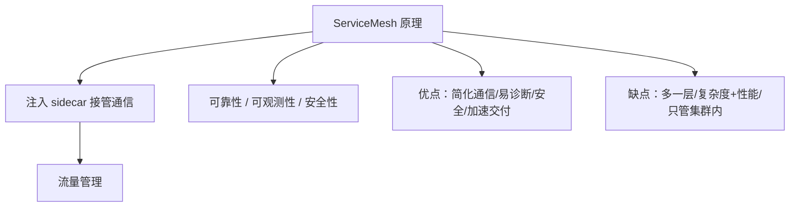

# ServiceMesh 与 Istio 本章小结：边车、流量治理与故障注入

这么快就到了本章小结，一起来回顾一下微服务治理的内容。本章介绍了 ServiceMesh 的工作原理、为什么采用服务网格，也用 Istio 在 K8s 集群中落地了服务治理，并动手做了流量转发、灰度发布和故障注入。下面把全章收一遍口。

## 纲要

- ServiceMesh 原理：sidecar 接管网络通信
- 服务网格的特性与优缺点
- Istio 的原理与能力（= 服务网格的细化实现）
- 实战：在 K8s 中装 Istio 并配 Gateway / VirtualService / DestinationRule
- 治理实验：TCP 路由、灰度、故障注入、限流扩展

## ServiceMesh 原理：sidecar 接管通信

服务网格的核心机制是：**给服务的部署注入 sidecar，由 sidecar 接管微服务之间的网络通信**。在这个过程中，可以实现微服务调用的流量管理。服务网格还有更多特性——可靠性、可观测性、安全性。



## 服务网格的特性与优缺点

**优点**包括：

- 简化微服务与容器间服务的通信；
- 在服务网格这一层就能很容易地诊断通信错误；
- 支持安全认证、授权等特性；
- 允许更快的开发、测试、部署应用。

**缺点**也要心里有数：

- 增加了一层服务网格的调用，多了一个步骤，**复杂性和性能都会有一些影响**；
- 服务网格**只解决集群内的调用**，不能解决与其它服务或系统的集成；
- 网络管理的复杂度被抽象和集中化了，但**对服务网格的管理和配置工作仍然没法减少**。

把服务网格的利弊摆成一张表，选型时一目了然：

| 维度 | 优点 | 缺点 |
| --- | --- | --- |
| 通信 | 简化微服务 / 容器间通信 | 多一层调用，复杂度与性能有折损 |
| 诊断 | 网格层易诊断通信错误 | 网络管理被抽象集中，配置工作未减少 |
| 安全 | 支持认证、授权 | 只解决集群内调用，不解决外部集成 |
| 交付 | 加速开发 / 测试 / 部署 | 引入与运维门槛偏高 |

另外，本章也简单介绍了服务网格的市场情况：现阶段 **Istio 是相对成熟的产品**，课程中也使用 Istio 来做微服务治理。

## Istio 的原理与能力

因为 Istio 是服务网格的一种解决方案，所以它的原理和能力基本类似于服务网格本身，本章在视频之外还整理了一篇图文，方便大家在视频学习之外用文章巩固。Istio 的能力涵盖：服务发现、负载均衡、配置管理、安全认证、可观测性，以及本章重点的**流量管理**。

## 实战：在 K8s 中落地 Istio

本章最后是在 K8s 集群中应用 Istio 来实现服务治理——这部分需要动手操作：

1. 创建 K8s 集群并安装 Istio（通过 `istioctl` 管理集群资源）；
2. 创建服务和部署，并**开启 sidecar 自动注入**（通常给命名空间打标签）；
3. 配置 Istio 网关（Gateway）与 VirtualService、DestinationRule、路由规则等。

```bash
# 给命名空间开启 sidecar 自动注入（示意，参数以官方文档为准）
kubectl label namespace demo istio-injection=enabled

# 应用网关与路由规则（示意）
kubectl apply -f gateway.yaml
kubectl apply -f virtualservice.yaml
kubectl apply -f destinationrule.yaml
```

> 上述 `istioctl` 安装、`kubectl label` 注入等命令为通用写法，**具体参数建议以所用 Istio 版本官方文档为准**。

## 治理实验：路由、灰度与故障注入

本章在 Istio 上实做的治理能力包括：

- **TCP 流量转发**与**路由转发**，可实现 **A/B 测试、金丝雀发布、渐进式部署**等功能；
- **故障注入**：实验了**延时（delay）、异常（abort）、超时（timeout）、熔断（circuit breaking）**等；
- **限流**：通过配置 Envoy 的过滤规则，引入第三方的 ratelimit 服务，实现速率限制。如果还想做更多能力，也可以参照 ratelimit 服务，通过**自定义开发来扩展 Istio 的能力**，达成更多想要的微服务治理能力。

```dir
Istio 治理实验清单
├── 流量路由
│   ├── TCP 转发
│   ├── A/B 测试
│   └── 金丝雀 / 渐进式部署
├── 故障注入
│   ├── 延时 delay
│   ├── 异常 abort
│   ├── 超时 timeout
│   └── 熔断 circuit breaking
└── 限流
    ├── EnvoyFilter 过滤规则
    └── 第三方 ratelimit 服务（可自定义扩展）
```

## 总结

本章小结把 ServiceMesh 与 Istio 的全貌收拢了：

1. **原理一句话**：给服务注入 sidecar，由它接管微服务间通信，实现流量管理；
2. **优点明显**：简化通信、易诊断、安全授权、加速交付；
3. **缺点也真实**：多一层调用、复杂度与性能折损、只管集群内、配置工作未减少；
4. **Istio 是成熟实现**，原理能力≈服务网格本身，本章用它在 K8s 落地；
5. **动手覆盖广**：Gateway / VirtualService / DestinationRule + 灰度 + 故障注入（延时/异常/超时/熔断）；
6. **限流靠扩展**：EnvoyFilter + 第三方 ratelimit 服务，并可自定义开发扩展 Istio 能力。
