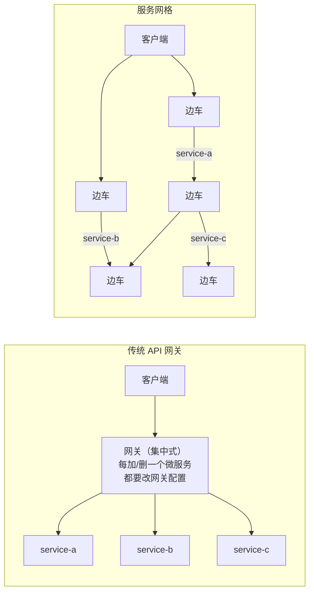
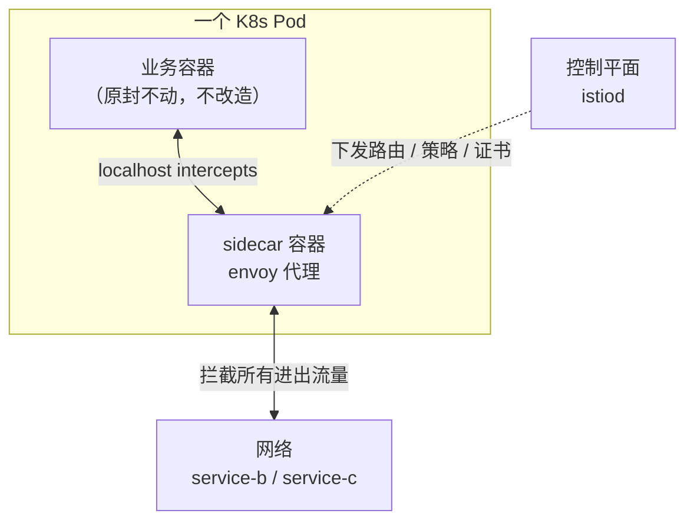
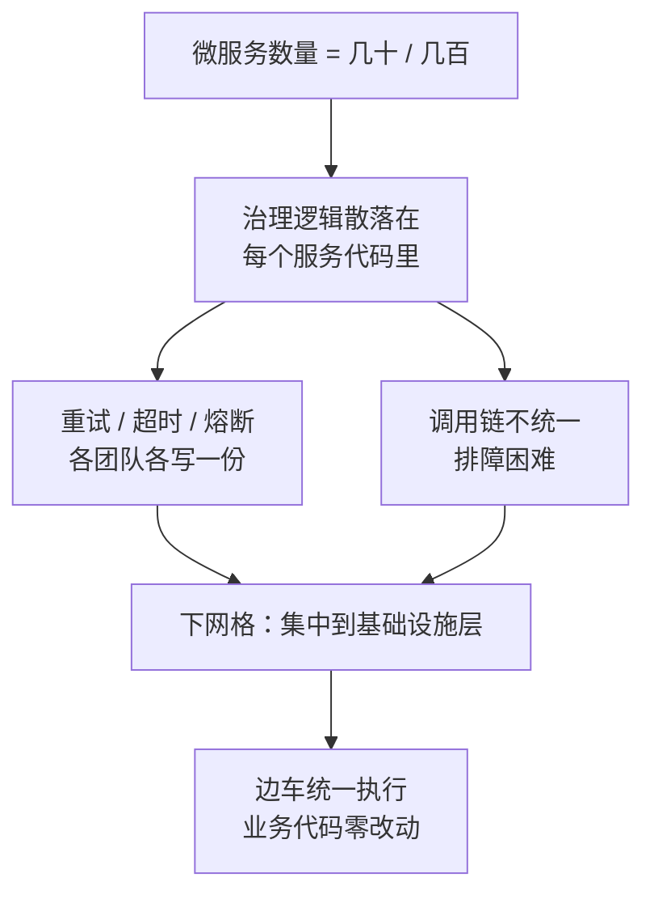
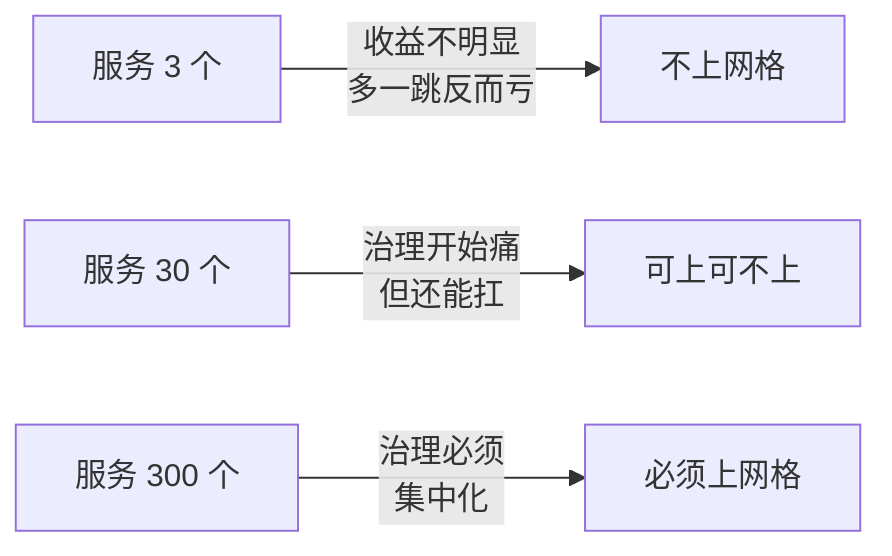
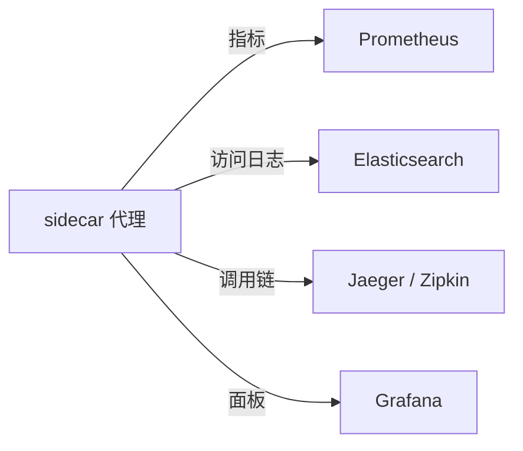
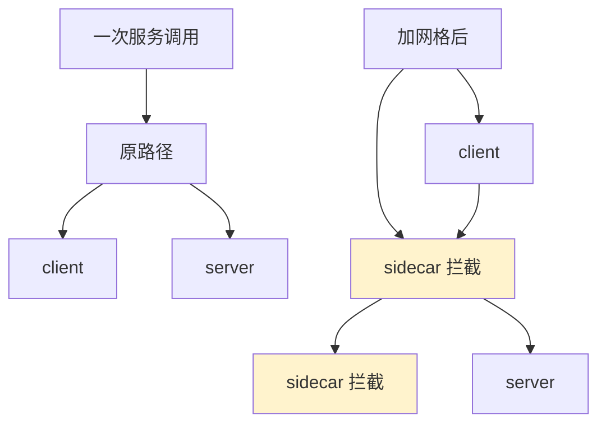

# Kubernetes 认证考点: ServiceMesh 是什么——边车代理构成的数据平面

服务网格（Service Mesh）字面意思来看 —— **就是管理「服务间网络通信调用」这件**。它是一个**专用的基础设施层，用于控制网络上的服务到服务通信**。

结论：**在微服务里给每个 Pod 挂一个 sidecar（边车）代理，所有网络请求都走边车；边车们构成数据平面，控制平面负责下发策略。价值随微服务数量增长而增长 —— 服务少时不划算，服务多了才显出收益。**

## 纲要

- 服务网格的定义：专用基础设施层
- sidecar 边车代理：架构核心
- 数据平面与控制平面的分工
- 为什么要上服务网格：微服务数量带来的治理难题
- 三大特性：可靠性、可观测性、安全
- 优点与缺点：延迟、多一跳、复杂度并未消失
- 市场现状与选型

## 定义：它不是网关，但比网关覆盖得更广

服务网格通常与容器 K8s 和微服务一起出现，**它控制应用程序中的服务请求的传递**。

服务网格提供的常见功能，包括**服务发现、负载均衡、加密和故障恢复**，通过使用由 API 来控制的软件，而不是硬件。它的高可用性也很常用 —— 服务网格可以使服务到服务的通信快速可靠和安全。

团队也可以选择完全类似功能的服务网关或者 API 网关，而不是服务网格。但是**每次添加或者删除微服务时，开发人员都必须更新网关的配置**。

而**服务网格通常提供超出传统网关的功能，使微服务的网络管理具有可扩展性和灵活性**。



关键差别在**配置变更的代价**：网关是"服务变了要改配置"，网格是"服务注册进来就自动被接管"。

## 工作原理：sidecar 边车

**服务网格架构通常是在使用容器化技术的微服务中，使用 sidecar（边车）代理服务。**

在微服务应用程序中，sidecar 附加到每个服务的容器中；sidecar 附加到每个应用程序的容器、VM 或者是容器编排单元 —— 比如 K8s 里面的 Pod。sidecar 可以处理从服务本身抽象出来的任务，比如**可观测性和安全**。



**服务实例 sidecar 及其交互，构成了服务网格中所谓的数据平面；而控制平面管理诸如创建实例、监控和实施网络管理和安全策略等任务**。控制平面可以在命令行或者可视化界面上进行应用程序的管理。

分工一目了然：

| 平面 | 组成 | 职责 | 故障影响 |
| --- | --- | --- | --- |
| **数据平面** | 每个 Pod 里的 sidecar 代理 | 实际转发流量、执行重试/超时/熔断 | 直接断流 |
| **控制平面** | istiod 等控制面组件 | 下发配置、服务发现、签发证书、策略 | 新规则不生效，旧流量不受影响 |

> 这个分离是网格最重要的设计：**控制面挂了不会立刻打挂业务流量，只有数据面挂了才会断流**。

## 为什么采用服务网格

在微服务架构中，构建的应用程序可能包含几十个或者数百个服务，所有服务都有自己的实例在线上环境中运行。对于开发人员来说，跟踪哪些组件必须交付、监控他们的健康状况和性能、并在出现问题时更改服务或组件，是一项巨大的挑战。

服务网格让开发人员**能够在专用基础设施层中分离和管理服务到服务通信**。



**随着应用程序设计的微服务数量的增加，使用服务网格来管理和监控，他们的好处也在增加。总结：微服务的数量越多，那么服务网格的作用和好处就更加明显。**

这也是为什么**服务网格的发展滞后于容器化 K8s 和微服务的发展** —— 因为需要**量变才会凸显出 Service Mesh 的价值**。



## 三大特性

它通常提供许多功能使容器化或者微服务通信更加可靠、安全和可观察。

### 可靠性

通过 sidecar 代理和控制平面管理通信，提高了服务请求策略和配置的效率和可靠性。具体功能包括**负载均衡和故障注入**。

### 可观测性

服务网格架构可以提供对服务行为和健康状况的洞察 —— **控制平面可以从组件交互中收集和聚合可观测数据，以确定服务的健康状况**。例如流量和延时、分布式跟踪和访问日志，与 Prometheus、Elasticsearch 和 Grafana 等工具的第三方集成，可实现进一步的监控和可视化。



### 安全

**网格可以自动加密通信，并将安全策略（包括身份验证和授权）从网络分发到应用程序和各个微服务**。通过控制平面和 sidecar 代理集中管理安全策略，有助于跟上分布式应用程序内部和之间日益复杂的连接。

| 特性 | 网格提供的具体能力 | 传统做法 |
| --- | --- | --- |
| 可靠性 | 负载均衡、故障注入、超时、重试、熔断 | 写进业务代码或网关配置 |
| 可观测性 | 指标 / 日志 / 链路三件套，自动采集 | 每个服务自己埋点 |
| 安全 | mTLS 自动加密、身份、授权、审计 | 服务间手动配 TLS、证书轮转麻烦 |

## 优点与缺点

讲了这么多服务网格的内容，总结它的优点和缺点分别是什么？

**优点：**

1. 简化微服务和容器中服务之间的通信；
2. 更容易诊断通信错误 —— 因为它们会发生在自己的基础设施层上；
3. 支持加密、认证和授权等安全特性；
4. 允许更快的开发、测试和部署应用程序；
5. 放置在容器集群旁边的边车可以有效管理网络服务。

**缺点：**

1. **运行时间因为通过服务网格会增加**（延迟上升）；
2. **每次服务调用都要先通过 sidecar 代理，这就多了一个步骤**；
3. **服务网格不解决与其他系统或服务的集成，以及路由类型或转换类型**；
4. **网络管理的复杂性被抽象和集中了，但并没有消除** —— 必须有人将服务网格集成到系统架构中并管理它的配置。



第四条缺点最容易被忽略：**复杂度只是搬了个家，没有凭空消失**。上网格之前要有人懂它的配置模型（VirtualService / DestinationRule 之类），上完之后 Still 有这个成本。

## 市场与选型

**企业使用服务网格仍处于初期阶段，远远落后于容器。** 生产中使用最多的服务网格：

```text
服务网格市场
├── Linkerd       （Linkerd2）
│   └── 开源、多平台、由 Buoyant 开发，建立在 Twitter 的 Finagle 库之上
├── HashiCorp Consul
│   └── 提供服务发现和服务网格功能，适用于 AWS 和 GKE，也可作为 SaaS 产品
└── Istio         （本课程采用）
    └── 开源、通用控制平面，最初针对 K8s 部署，架构师可在多平台使用
        └── 数据平面依赖 Envoy 代理
```

选择要点：

| 方案 | 数据平面 | 特点 | 上手门槛 |
| --- | --- | --- | --- |
| **Istio** | Envoy | 功能最全、生态最大、配置模型复杂 | 中高 |
| **Linkerd** | linkerd2-proxy（Rust） | 最轻、延迟低、上手快 | 低 |
| **Consul** | Envoy / 内建 | 与 Consul 服务发现一体，多平台 | 中 |

**市面上主要的云厂商和 K8s 平台提供商都提供托管的服务网格产品，选择云服务的上手门槛更低。** 咱们的课程中也是直接选用腾讯云的服务网格来演示它的一些重要功能。

> 选型建议：没有强定制需求的团队，**优先用云厂商托管版**（本节演示也是托管集群）；需要深度自定义、要跨混合云控制的再考虑自建 Istio。

## API 速览

| 能力 | 概念 / 组件 |
| --- | --- |
| 网格定义 | 专用基础设施层，控制服务到服务通信 |
| 数据平面 | sidecar 代理及其交互 |
| 控制平面 | 下发配置、服务发现、策略、证书 |
| 边车注入 | sidecar 附加到每个 Pod / 容器 / VM |
| 常见功能 | 服务发现、负载均衡、加密、故障恢复 |
| 可观测三件套 | 指标（Prometheus）、日志（Elasticsearch）、链路（Jaeger） |
| 安全能力 | 自动 mTLS 加密、身份验证、授权、审计 |
| 主流实现 | Istio（Envoy）/ Linkerd / Consul |
| 托管方案 | 云厂商服务网格产品 |
| 代价 | 延迟增加、每次调用多一跳、复杂度转移而非消除 |

## Demo 示例

看一个注入了 sidecar 的 Pod 长什么样。

```bash
# ---------- 1. 确认 namespace 开启了自动注入
$ kubectl get namespace usergrow -o jsonpath='{.metadata.labels}'
map[istio-injection=enabled]

# ---------- 2. 部署一个服务，看 Pod 里的容器数
$ kubectl run usergrow --image=... --generator=run-pod/v1
$ kubectl get pod usergrow-xxx -o jsonpath='{.spec.containers[*].name}'
istio-proxy usergrow
#      ↑ 自动注入的边车        ↑ 原业务容器

# ---------- 3. 看边车拦截了什么（iptables 规则）
$ kubectl exec usergrow-xxx -c istio-proxy -- iptables -t nat -S
-A PREROUTING -p tcp -j ISTIO_INBOUND
-A ISTIO_INBOUND -p tcp -d 127.0.0.1/32 -j RETURN
-A ISTIO_INBOUND -p tcp -j ISTIO_REDIRECT --to-ports 15001
# ↑ 所有入站 TCP 被重定向到 envoy 的 15001

# ---------- 4. 对比加网格前后的调用延迟
# 未注入时
$ curl -s -o /dev/null -w "time: %{time_total}s\n" http://usergrow/task/list
time: 0.008s

# 注入 sidecar 后（同一请求）
$ kubectl exec client -- curl -s -o /dev/null -w "time: %{time_total}s\n" http://usergrow/task/list
time: 0.014s
# ↑ 多了约 6ms —— 这就是"运行时间会增加""多一个步骤"的直观体现

# ---------- 5. 边车带来的可观测性（无需改代码）
$ kubectl exec istio-proxy-usergrow-xxx -- \
    curl -s localhost:15000/stats | grep -E "upstream_rq_(1xx|2xx|5xx)"
```

**这张表说明了什么**

| 观察点 | 结论 |
| --- | --- |
| Pod 多了一个容器 | sidecar 是自动注入的，业务 Deployment 没改 |
| iptables 重定向规则 | 边车靠 iptables 接管所有进出流量 |
| 延迟从 8ms 涨到 14ms | 少了会用的缺点：每次调用都要先过 sidecar |
| `istio-proxy` 的 stats 端口 | 可观测性是白送的，业务代码零改动 |

### 总结

服务网格的定义很朴素：**一个专门管服务间通信的基础设施层**。实现手段也很朴素 —— **在每个 Pod 旁挂一个 sidecar 代理，用 iptables 接管网络请求，代理们组成数据平面，控制平面负责下发规则**。

它的价值曲线很关键：**服务少时不划算（多一跳的延迟 + 学习成本），服务多到治理逻辑开始失控时才凸显收益**。判断依据就是团队现在为了重试、超时、熔断、mTLS 这些事情改了多少次业务代码。

上网格前先接受三条代价：**延迟上升、每次调用多一跳、复杂度从业务代码转移到了基础设施配置（并没有消失）**。接受这三条的团队，才谈得上用网格换来的可观测性、安全和统一的流量治理。

落地选型上，**云厂商托管版的门槛远低于自建**；课程演示同样选托管服务网格来做功能验证。

