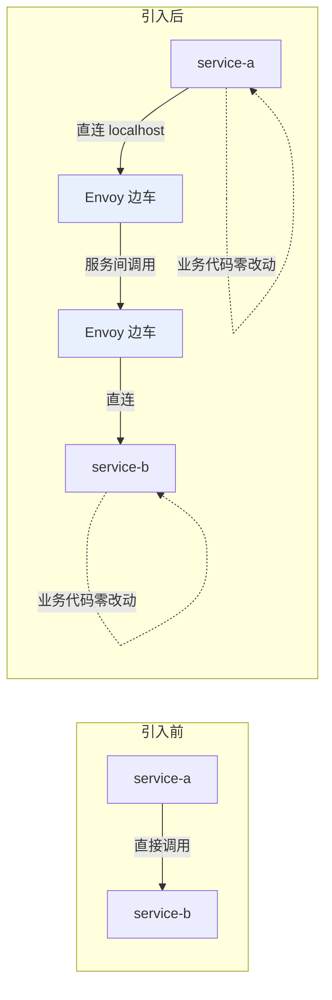
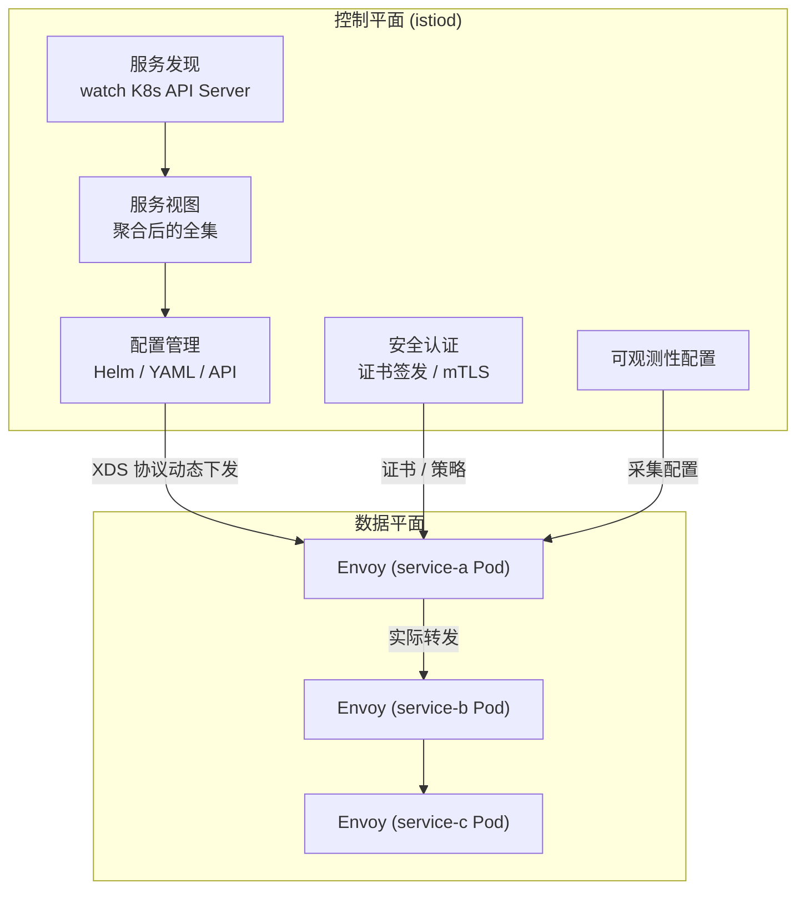
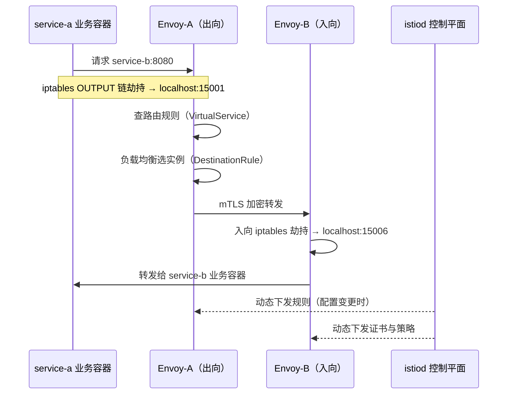
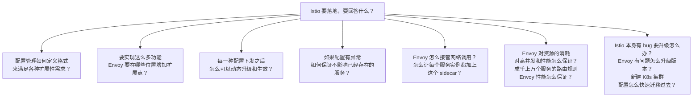
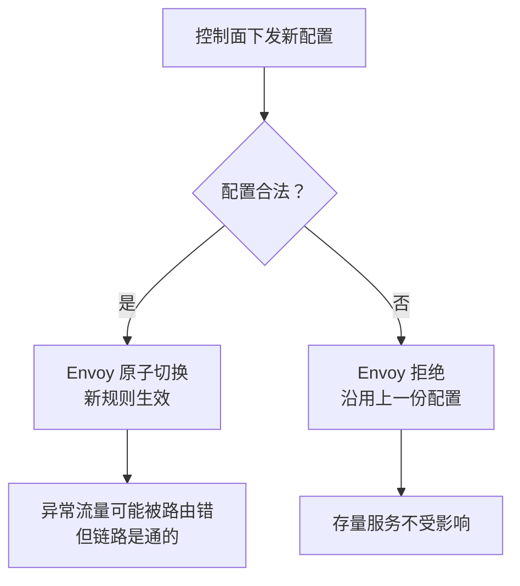
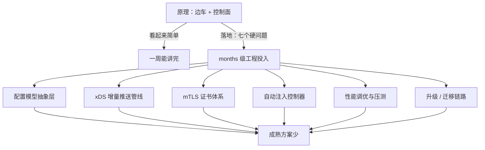
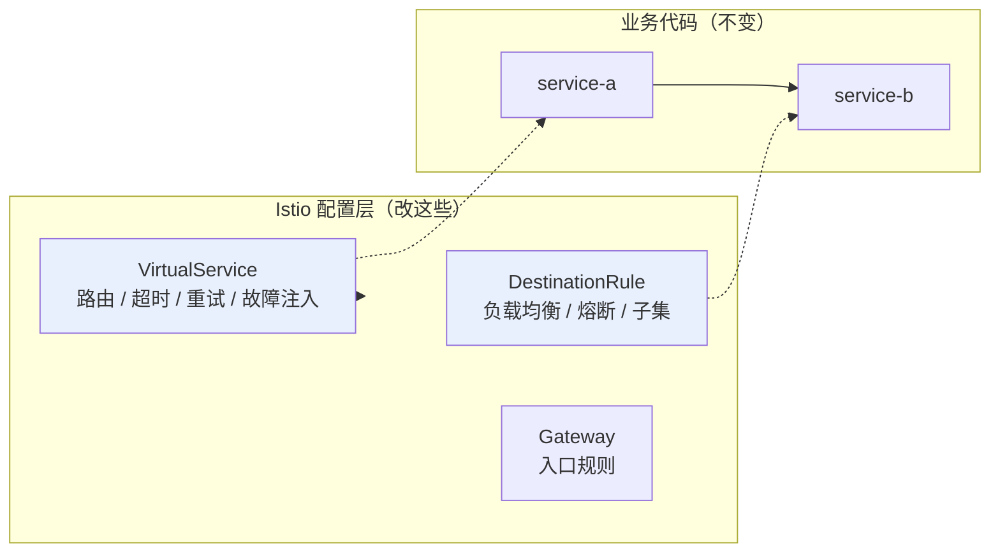

# Kubernetes 认证考点: Istio 的原理——Envoy 边车与控制平面的分工

Istio 是 ServiceMesh 的一个实现方案，它的架构和 ServiceMesh 的架构类似，只是具体的实现差异而已。

结论：**引入 Istio 后业务代码一行不改 —— 它在 service-a 和 service-b 的实例上都加一个 Envoy 代理，服务间调用全部由 Envoy 完成；业务方仍然把网络调用当黑盒。架构看懂很容易，难的是「配置怎么定义、扩展点在哪、怎么动态生效、出问题怎么不影响存量」这些实现细节。**

## 纲要

- 引入前后：调用链路只多了两个边车
- 数据平面：Envoy 代理拦截所有网络请求
- 控制平面：下发配置、维护服务视图
- 控制平面与数据平面的协作流程
- 原理之外：必须回答的七个实现难题
- 为什么成熟好用的方案那么少

## 引入前后到底变了什么

**没有引入 Istio 的时候，service-a 直接调用到 service-b**（当然也可以通过 ingress 或者其他网关这些中间件来调用）。而引入 Istio 之后，整个架构并没有太大的变化，**只是在 service-a 和 service-b 的实例上都会增加一个 Envoy 代理，服务间的调用会通过 Envoy 代理来完成**。

对于 service-a 和 service-b 来说，**并不需要做任何改变，还是原来一样调用和请求；背后的网络调用，对服务来说都是黑盒状态，不需要了解，也不需要做改造。**



关键点：**调用方写入的仍然是 service-b 的服务名，只是流量被 iptables 劫持到了本机 Envoy，由 Envoy 按 control plane 下发的规则转发出去**。

## Istio 的两个组件

从架构图中可以清晰看出，Istio 包括两个组件：**数据平面和控制平面**。

### 数据平面

**数据平面是服务之间的通信，Istio 使用代理来拦截你的所有网络请求，从而根据你设置的配置提供广泛的应用程序感知功能。** Envoy 代理与你的集群启动的每个服务一起部署，或者与在虚拟机上运行的服务一起运行。

### 控制平面

**控制平面管理配置信息和提供服务视图，并对代理（Envoy）服务器进行动态编程。**

随着规则或环境的变化更新，它们控制平面会监听 API Server，处理服务发现和负载均衡信息，也能管理更多的配置、安全认证信息和可观测性配置信息。**所有这些信息都可以在控制平面管理，并且下发到数据平面，最后由 Envoy 来执行。**



**从原理上看非常简单，很容易理解和掌握：给现有的服务增加一个边车接管所有的网络请求，再加上一个管理控制端，把各种规则配置管理和下发就行。**

### 一次调用的完整路径



## 原理之外：真正难的是这七个问题

**这就是典型的架构，原理一看就懂；实际应用还是一脸懵逼。**

只说原理不行，还有具体的功能。下列问题必须回答：



逐个拆一下：

### 配置格式如何满足扩展性

要实现这么多功能，Envoy 要在哪些位置增加扩展点？Istio 的做法是**不直接让用户写 Envoy 配置**，而是自己定义一套高层抽象（VirtualService、DestinationRule、Gateway、ServiceEntry 等），再翻译成 Envoy 的 xDS 配置。


好处是**配置模型稳定**：Envoy 升级变了多少，用户写的 Yaml 不用跟着改。

### 配置如何动态生效

Envoy 通过 **xDS 协议增量推送**拿到配置变更，不需要重启进程。这就是"动态编程"的含义 —— 控制面规则一变，边车秒级更新。

```bash
# 看 Envoy 当前拿到的是哪一代配置
# 先给变量赋值，例如：POD=$(kubectl get pod -o jsonpath='{.items[0].metadata.name}')
$ kubectl exec $POD -c istio-proxy -- \
    curl -s localhost:15000/server_info | python3 -m json.tool
{
 "state": "LIVE",
 "uptime_since_in_prometheus": 3600,
 "stats": {...}
}
```

### 配置异常如何不影响存量服务

这是灰度与稳定性设计的核心。Istio 的策略是：**下发失败或配置非法时，Envoy 保留上一份可用配置继续转发**，而不是加载失败导致断流。



```text
### 一个 Pod 被注入后的内部结构
├── 业务容器（原封不动，不加任何 sidecar 代码）
├── init 容器（写入 iptables 劫持规则，跑完即退出）
└── istio-proxy 容器（Envoy 边车）
    ├── 15001  ← 出站流量劫持入口
    ├── 15006  ← 入站流量劫持入口
    ├── 15000  ← admin 端口（config_dump / stats）
    └── 15090  ← Prometheus 指标端口


```### Envoy 怎么接管网络调用、怎么批量注入

- **接管**：Pod 注入边车后，istiod 注入的 init container 写 iptables 规则，把入站（15006）和出站（15001）流量全部劫持到 Envoy；
- **注入**：靠 `istio-injection=enabled` 的 namespace label 做**自动注入**（MutatingAdmissionWebhook），新建 Pod 时自动加边车容器。

### 性能与资源开销

Envoy 是 C++ 写的，单实例开销可控，但**每个 Pod 一个代理，节点上的代理数量等于 Pod 数量**。成千上万个服务的路由规则靠 EDS（Endpoint Discovery Service）增量推送，避免全量下发。

### 升级与迁移

- Istio 本身升级：控制面滚动更新，期间**存量数据面继续用旧配置转发**，不中断；
- Envoy 升级：改边车镜像版本，靠namespace 重新注入；
- 新集群迁移：把 Istio 配置（VirtualService / DestinationRule 等 CRD）**整包 export 再 import**，服务发现信息由新集群的 API Server 重新提供。

## 为什么成熟好用的方案不多

**市面上 ServiceMesh 解决方案并不多，成熟好用的更少，那一定是有原因的。**

把上面七个问题串起来看：每一个都需要大量工程投入 —— 配置模型的抽象层、xDS 推送管线、证书体系、注入控制器、性能调优、升级与迁移链路。**这已经在做分布式系统中间件了，不再是"挂个代理"的量级。**



## 服务治理能力不需要改业务代码

回到功能：**Istio 最核心的卖点，是所有服务治理能力都不需要微服务做二次开发，只需要对 Istio 这一层做相应的规则配置就行。**



## API 速览

| 能力 | 概念 / 组件 |
| --- | --- |
| 数据平面 | Envoy 代理（随每个服务部署，可跑在容器或 VM） |
| 控制平面 | istiod（配置管理、服务发现、证书、策略） |
| 流量劫持 | iptables 重定向到 Envoy（出向 15001 / 入向 15006） |
| 自动注入 | `istio-injection=enabled` 标签 + 准入 webhook |
| 配置下发 | xDS 协议动态推送（LDS / RDS / CDS / EDS） |
| 路由抽象 | VirtualService / DestinationRule / Gateway |
| 安全 | mTLS 自动加密、证书签发与轮转 |
| 可观测 | 边车自动暴露指标 / 日志 / 链路 |
| 典型命令 | `istioctl proxy-status` / `istioctl analyze` |
| 升级迁移 | 导出 Istio CRD 配置，新集群重新 apply |

## Demo 示例

验证"边车接管"和"配置动态生效"这两件最本质的事。

```bash
# ---------- 1. 确认边车已注入
$ kubectl get pod usergrow-xxx -o jsonpath='{.spec.containers[*].name}'
istio-proxy usergrow

# ---------- 2. 看 iptables 劫持规则（边车接管网络的证据）
$ kubectl exec usergrow-xxx -c istio-proxy -- sh -c \
    "iptables -t nat -S | grep ISTIO"
-A PREROUTING -p tcp -j ISTIO_INBOUND
-A OUTPUT -p tcp -j ISTIO_OUTBOUND
-A ISTIO_INBOUND -p tcp -d 127.0.0.1/32 -j RETURN
-A ISTIO_INBOUND -p tcp -j ISTIO_REDIRECT --to-ports 15001
-A ISTIO_OUTBOUND -p tcp -j ISTIO_TUNNEL
```

```bash
# ---------- 3. 不改任何业务代码，加一条 0.5s 超时的路由规则
$ cat <<'EOF' | kubectl apply -f -
apiVersion: networking.istio.io/v1
kind: VirtualService
metadata:
  name: usergrow
spec:
  hosts:
    - usergrow
  http:
    - timeout: 0.5s
      route:
        - destination:
            host: usergrow
            port:
              number: 8080
EOF
virtualservice.networking.istio.io/usergrow created
```

```bash
# ---------- 4. 配置瞬间生效，无需重启 Pod（动态编程的体现）
$ kubectl exec usergrow-xxx -c istio-proxy -- \
    curl -s localhost:15000/config_dump | grep -c "timeout"
1
# ↑ 新规则已进 Envoy 配置

# ---------- 5. 异常配置不影响存量服务
$ kubectl apply -f - <<'EOF'
apiVersion: networking.istio.io/v1
kind: VirtualService
metadata:
  name: broken
spec:
  hosts:
    - nosuchservice
  http:
    - route:
        - destination: {host: nosuchservice}
EOF
# Envoy 拒绝该路由，但存量服务继续正常转发
$ kubectl exec client -- curl -s -o /dev/null -w "%{http_code}\n" http://usergrow/task/list
200
```

**验证要点**

| 观察 | 说明 |
| --- | --- |
| 容器列表里有 `istio-proxy` | 边车自动注入，业务容器未改 |
| iptables 有 ISTIO 链 | Envoy 确实接管了所有 TCP 流量 |
| 改 VirtualService 后不重启就生效 | 走的是 xDS 动态推送 |
| 非法规则被拒但存量调用仍 200 | 异常配置不影响运行中服务 |

### 总结

Istio 的原理可以一句话说完：**给每个服务加一个 Envoy 边车接管网络请求，再加一个 istiod 控制平面负责配置下发、服务发现、证书和策略。** 业务代码零改动，这正是它的卖点。

但的工程复杂度全在实现层 —— **配置模型怎么抽象、扩展点放哪、xDS 怎么动态推送、配置非法时怎么保存量、边车怎么劫持流量和批量注入、成千上万个服务的规则下 Envoy 性能怎么保、升级和跨集群迁移怎么做**。这七个问题每一个都是 months 级的投入，也解释了"市面上成熟好用的服务网格方案并不多"。

学习建议：**不要停在架构图**。看懂"边车 + 控制面"只需五分钟，真正有价值的是亲手验证 —— 边车是不是真的劫持了 iptables、改一条 VirtualService 是不是秒级生效、写错规则会不会打挂存量服务。这三点验证过，就深入了。

