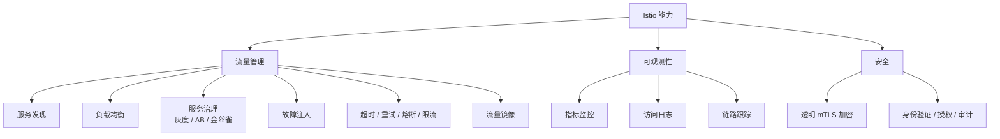
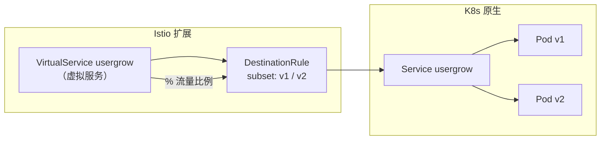
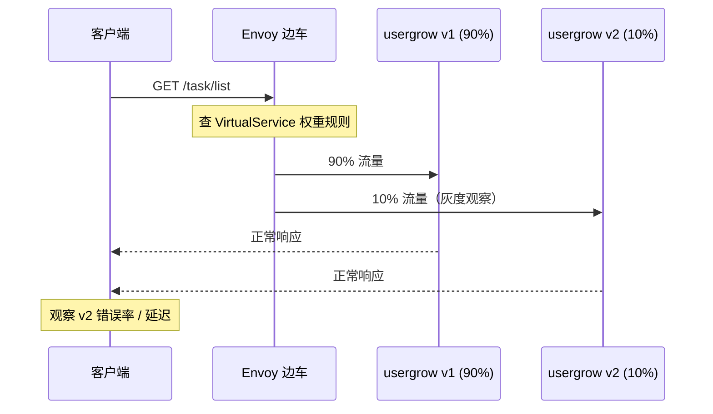
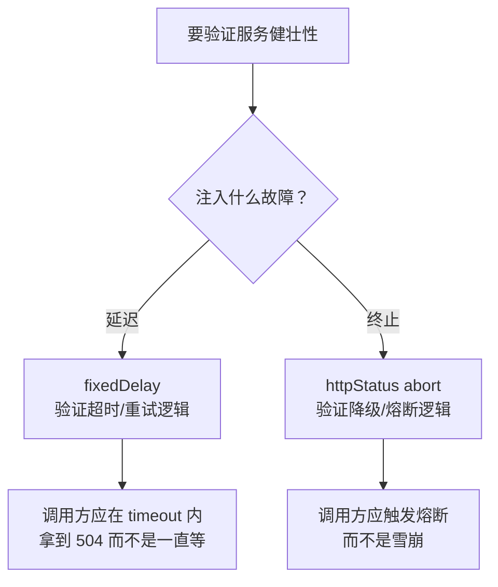
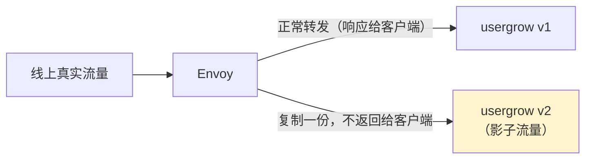
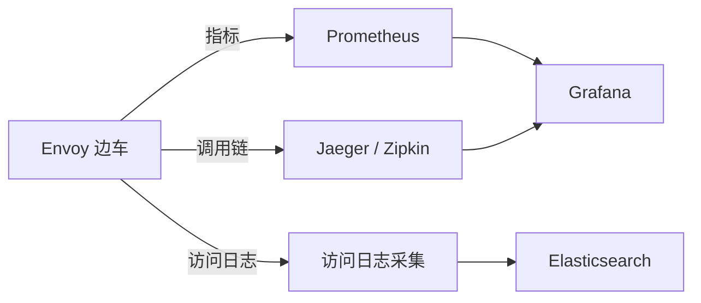
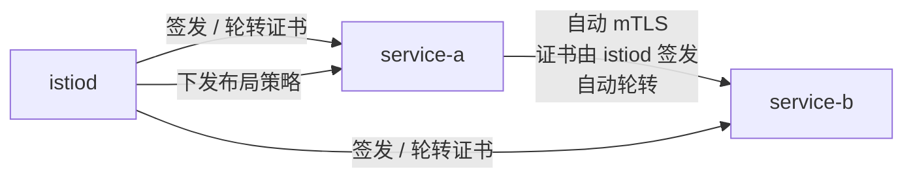

# Kubernetes 认证考点: Istio 的三类能力——流量治理、可观测性与安全

Istio 最直观的能力有三个方面：**一是流量管理，一是可观测性，还有就是安全能力**。

结论：**流量管理是最实用的那一块 —— 靠 VirtualService（路由 / 超时 / 故障注入 / 重试 / 镜像）加 DestinationRule（负载均衡 / 熔断 / 子集）两个 CRD 就能实现灰度、AB 测试、超时、熔断、限流，全部不用改业务代码。**

## 纲要

- 能力总览：流量管理 / 可观测性 / 安全
- 流量管理：服务发现、负载均衡与虚拟服务
- 灰度与金丝雀：VirtualService 做百分比分流
- 故障注入：延时与终止，验证健壮性
- 超时、熔断、限流、流量镜像
- 可观测性：指标 / 日志 / 链路
- 安全：mTLS 与身份授权（不深入）

## 能力总览



**这些服务治理的能力都不需要微服务做二次开发，只需要对 Istio 这一层做相应的规则配置就行。**

## 流量管理：服务发现与负载均衡

流量管理方面可以支持服务发现和服务治理。这里的服务发现和 K8s 的服务发现能力类似，但又有些不一样。

**相似的地方**：大家还记得课程最开始讲到 K8s controller-manager 里面的 client-go 开源项目吗？可以用它来实现自己的控制器来实现服务发现，这是相似的地方 —— 于是就可以知道服务的创建、销毁或者实例信息了；有了服务的这些信息，也就可以做到负载均衡了。

**不一样的地方：Istio 扩展了 K8s 的服务发现能力，它在 K8s 的服务概念之上，额外增加了一个虚拟服务的概念。** 可以把多个部署放在同一个 K8s 服务里面，然后管理一个虚拟服务控制它的目标路由。



K8s Service 只能把流量**均匀打散**到所有 Endpoint；Istio 的 VirtualService 能**按权重、按 header、按 URI 精确控制** —— 这就是"虚拟服务"多出来的那一层。

```text
## 治理能力的落点分布（改哪个对象就开哪个功能）
├── 流量管理
│   ├── VirtualService
│   │   ├── http.route[].weight        → 灰度 / AB 分流
│   │   ├── http.fault.delay           → 延时注入
│   │   ├── http.fault.abort           → 异常终止
│   │   ├── http.timeout               → 超时（504）
│   │   └── http.mirror                → 流量镜像
│   └── DestinationRule
│       ├── trafficPolicy.loadBalancer → 负载均衡
│       ├── trafficPolicy.connectionPool → 连接池
│       └── trafficPolicy.outlierDetection → 熔断
├── 可观测性（Envoy 边车自动产出，业务代码零改动）
│   ├── 指标   → Prometheus
│   ├── 日志   → 访问日志采集
│   └── 链路   → Jaeger / Zipkin
└── 安全（课程不展开）
    ├── 自动 mTLS 加密
    └── 身份 / 授权 / 审计


```## 灰度发布：金丝雀与 AB 测试

以咱们的实战项目 usergrows 服务为例：线上有一个运行的版本 v1，但是接下来要发布一个新的版本 v2。这个 v2 版本需要**引入部分线上流量来验证，验证没有问题之后才可以切换为正式的版本**。

这时就会有 usergroups 的 v1 版本和新部署的 v2 版本，**通过 Istio 的路由转发能力，就可以把部分流量转发到 usergroups 的 v2 版本上，大部分的流量还是转发到 v1 版本上**。

与这个功能类似的，可以实现 **AB 测试、金丝雀部署或者基于百分比的流量拆分**的分阶段部署。这些能力就可以通过 Istio 的虚拟服务来实现，通过配置虚拟服务和目标路由规则来分配请求的流量，以实现更好的部署策略。

```yaml
apiVersion: networking.istio.io/v1
kind: VirtualService
metadata:
  name: usergrow
spec:
  hosts:
    - usergrow
  http:
    - route:
        - destination:
            host: usergrow
            subset: v1
          weight: 90
        - destination:
            host: usergrow
            subset: v2
          weight: 10
```

DestinationRule 定义这两个子集具体指向哪些 Pod：

```yaml
apiVersion: networking.istio.io/v1
kind: DestinationRule
metadata:
  name: usergrow
spec:
  host: usergrow
  trafficPolicy:
    loadBalancer:
      simple: LEAST_CONN
    connectionPool:
      http:
        http2MaxRequests: 1024
      tcp:
        maxConnections: 1024
    outlierDetection:
      consecutive5xxErrors: 5
      interval: 10s
      baseEjectionTime: 30s
  subsets:
    - name: v1
      labels:
        version: v1
    - name: v2
      labels:
        version: v2
```



| 场景 | 配置要点 |
| --- | --- |
| 金丝雀 10% | 两个 subset，权重 90 / 10 |
| AB 测试 | 用 `match.http.headers` 按 header 分流 |
| 分阶段发布 | 权重从 1% → 10% → 50% → 100% 逐级调 |
| 回滚 | 把 v2 权重改回 0，Pod 可以不删 |

## 故障注入：验证健壮性

Istio 的路由规则可以轻松控制服务之间的流量和调用，所以也就可以达到服务治理的能力。**比如故障注入，通过 Istio 的配置，可以给服务调用注入故障，用来测试和验证应用程序的健壮性。**

**验证注入 HTTP 请求延时故障** —— 验证调用一个有延时的服务，是否还可以正常工作：

```yaml
  http:
    - fault:
        delay:
          percent: 100
          fixedDelay: 3s
      route:
        - destination: {host: usergrow, subset: v1}
```

**验证注入 HTTP 终止故障** —— 验证调用这个异常状态的服务，是否还可以正常工作：

```yaml
  http:
    - fault:
        abort:
          percent: 100
          httpStatus: 503
      route:
        - destination: {host: usergrow, subset: v1}
```



故障注入的正确姿势是：**先在测试环境全量注入（100%），确认调用方的超时、重试、降级都生效，再逐步降到 0**。

## 超时、重试、熔断、限流

### 超时

**除了故障注入，还可以在虚拟服务中配置服务的请求超时，比如配置 timeout 等于 0.5 秒。那么调用这个服务的请求超过 0.5 秒就会被 Istio 的 Envoy 代理主动断开连接，并且返回 504 服务超时的错误码。**

```yaml
  http:
    - timeout: 0.5s
      retries:
        attempts: 2
        perTryTimeout: 0.3s
      route:
        - destination: {host: usergrow, subset: v1}
```

注意 `timeout`（整体）与 `retries.perTryTimeout`（每次尝试）**是两个不同层级**，配错会导致重试超过总超时。

### 熔断

**熔断是配置在服务的目标规则（DestinationRule）上，可以根据连接数、请求并发量，也可以根据异常状态码出现的频率来触发熔断。通过熔断来保护服务的后端实例，让它有一个喘息的机会，不会被突发的流量冲垮。**

上面 DestinationRule 那段里的 `outlierDetection` 就是熔断：连续 5 个 5xx、每 10s 检查一次、剔除 30s。被剔除的实例从负载均衡池里摘掉，**这就是"给它喘息机会"**。


### 限流

**除了前面讲的超时、熔断的能力，Istio 还可以支持服务的限流，可以是服务端的限流，也可以是在调用端的本地限流。**

| 限流位置 | 实现方式 | 特点 |
| --- | --- | --- |
| 调用端本地限流 | Envoy 的 `ratelimit` HTTP filter + 本地配额 | 单机维度，简单但配额不全局 |
| 服务端全局限流 | 配合 Envoy 的 rate limit service（集中式） | 全局准确，但要自建 RLS |

```yaml
  http:
    - route: [...]
    - match:
        - prefix: /task
      route:
        - destination: {host: usergrow, subset: v1}
      rateLimit:
        actions:
          - descriptorKey: request_rate_limit
            requestHeaders:
              headerName: x-user-id
              descriptorValue: "USER"
```

### 流量镜像

**Istio 还支持流量镜像的能力。这个能力很特别，可以考虑在测试环境开启它：流量镜像可以把调用请求转发到安全审查部门的扫描器，这样就可以简单快速的让安全部门知道咱们正在开发和测试的服务里面是否有潜在的风险；当然也可以让流量镜像的能力来做一些实时分析的工作。**

```yaml
  http:
    - route:
        - destination: {host: usergrow, subset: v1}
      mirror:
        host: usergrow-canary
        subset: v2
      mirrorPercentage:
        value: 100
```



镜像流量的关键特性：**镜像出去的请求不会把响应返回给客户端**，所以可以放心地拿真实流量去喂新版本 / 扫描器 / 风控模型。

## 可观测性

可观测性的能力主要有三个方面：**指标监控、日志和链路跟踪**。通过 Istio，运维人员可以清晰的了解受监控服务的交互方式，**开发人员都不需要对应用程序做修改**。



- **指标**：Envoy 自动暴露 `istio_requests_total`、`istio_request_duration_milliseconds` 等；
- **日志**：每个请求一条访问日志，包含来源、目标、状态码、耗时；
- **链路**：服务间调用自动生成 span，跨服务串联。

**这一块的性价比最高 —— 它是"白送"的**：不用改代码、不用埋点，装上边车就有了。

## 安全

**关于安全能力，Istio 提供强大的身份策略、透明的 TLS 加密以及身份验证、授权和审计工作来保护我们的服务和数据。** 具体的证书管理、验证方法、授权和 TLS 配置，这里就不做深入讲解 —— 咱们的课程重点还是介绍通过 Istio 来实现**无侵入式微服务治理**。



## API 速览

| 能力 | CRD / 字段 |
| --- | --- |
| 虚拟服务（路由） | `VirtualService`（`http.route` / `match` / `timeout` / `fault` / `mirror`） |
| 流量比例控制 | `http.route[].weight`（两个 subset 配成 90 / 10） |
| 目标规则（LB / 熔断） | `DestinationRule`（`trafficPolicy` / `subsets`） |
| 熔断（异常实例剔除） | `trafficPolicy.outlierDetection`（`consecutive5xxErrors` / `baseEjectionTime`） |
| 连接池限流 | `trafficPolicy.connectionPool`（`tcp.maxConnections` / `http.http2MaxRequests`） |
| 故障注入-延时 | `http.fault.delay`（`percent` + `fixedDelay`） |
| 故障注入-终止 | `http.fault.abort`（`percent` + `httpStatus`） |
| 超时 | `http.timeout`（整体） |
| 重试 | `http.retries`（`attempts` + `perTryTimeout`） |
| 限流 | `http.rateLimit.actions`（配合 RLS） |
| 流量镜像 | `http.mirror` + `http.mirrorPercentage` |
| 入口网关 | `Gateway` |
| 可观测 | Envoy 自动输出指标 / 访问日志 / 链路 |
| 安全 | 自动 mTLS，证书由控制面签发与轮转 |

## Demo 示例

一次把超时、灰度、故障注入跑通。

```text
# 先给变量赋值，例如：POD=$(kubectl get pod -o jsonpath='{.items[0].metadata.name}')
# ---------- 1. 标记两个版本
$ kubectl label deploy/usergrow-v2 app=usergrow version=v2 --overwrite
$ kubectl apply -f destinationrule.yaml   # subset: v1 / v2
destinationrule.networking.istio.io/usergrow created

# ---------- 2. 灰度：90% 打 v1，10% 打 v2
$ kubectl apply -f virtualservice-canary.yaml
virtualservice.networking.istio.io/usergrow configured

$ for i in $(seq 1 20); do
    kubectl exec client -- \
      curl -s -o /dev/null -w "%{http_code} " http://usergrow/task/list
  done
# 200 200 200 200 200 200 200 200 500 200 ...   ← 约 10% 打到 v2

# ---------- 3. 注入 3 秒延时，验证超时保护
$ kubectl apply -f - <<'EOF'
apiVersion: networking.istio.io/v1
kind: VirtualService
metadata: {name: usergrow}
spec:
  hosts: [usergrow]
  http:
    - timeout: 0.5s
      route:
        - destination: {host: usergrow, subset: v1}
EOF
$ kubectl exec client -- curl -s -o /dev/null -w "code=%{http_code} time=%{time_total}\n" \
    http://usergrow/task/list
code=504 time=0.512s
# ↑ Envoy 主动断开，返回 504 —— 超时保护生效

# ---------- 4. 注入 100% 中断，验证熔断触发
$ kubectl apply -f - <<'EOF'
apiVersion: networking.istio.io/v1
kind: VirtualService
metadata: {name: usergrow}
spec:
  hosts: [usergrow]
  http:
    - fault:
        abort: {percent: 100, httpStatus: 503}
      route:
        - destination: {host: usergrow, subset: v1}
EOF
$ kubectl exec client -- curl -s -o /dev/null -w "code=%{http_code}\n" http://usergrow/task/list
code=503

# ---------- 5. 观察 Envoy 指标（无需改业务代码）
$ kubectl exec $POD -c istio-proxy -- \
    curl -s localhost:15000/stats | grep istio_requests_total | head -3
```

**验证清单**

| 步骤 | 期望结果 |
| --- | --- |
| 20 次请求中 v2 约占 2 次 | VirtualService 权重分发生效 |
| 3s 延时 + `timeout: 0.5s` | 返回 504 且总耗时约 0.5s |
| 100% abort | 返回 503，不打到业务容器 |
| Envoy stats 有 `istio_requests_total` | 指标是边车自动采集的 |

### 总结

Istio 的三类能力里，**流量管理是最能立刻产生价值的**：VirtualService 负责"流量怎么走"（路由、权重、超时、重试、故障注入、镜像），DestinationRule 负责"后端怎么扛"（负载均衡、连接池、熔断、子集）。两者合起来覆盖了灰度发布、AB 测试、超时控制、熔断限流这些传统上要写进业务代码的治理逻辑，**业务侧零改动**。

可观测性是"白送"的红利：指标、日志、链路三件套由边车自动产出，不用埋点。安全这块（mTLS、身份、授权）也很强，但配置体系复杂，课程不深入 —— 实际落地建议先只开流量治理，安全策略逐步加。

上手路径建议：**先上金丝雀（改权重）→ 再加超时和重试 → 再开故障注入做健壮性验证 → 最后开熔断和限流**。逐步加，每一步都能独立验证，比一次全开要稳得多。

