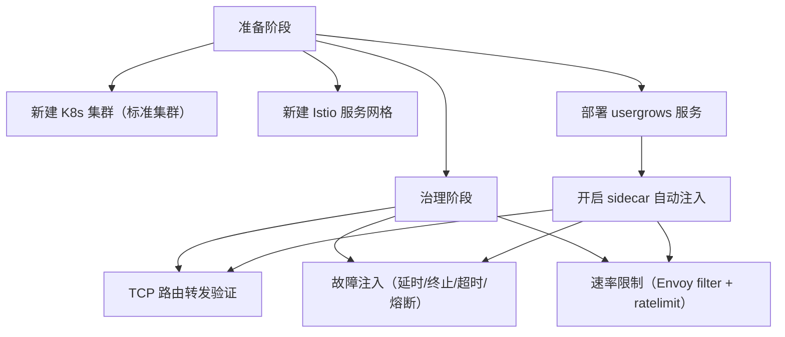
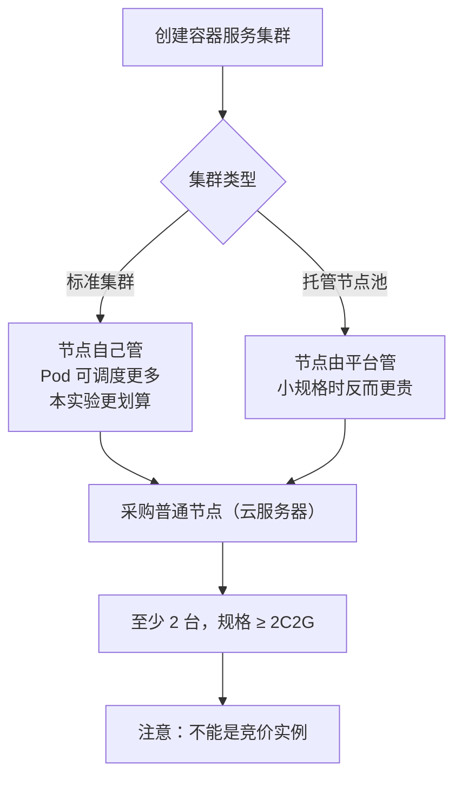
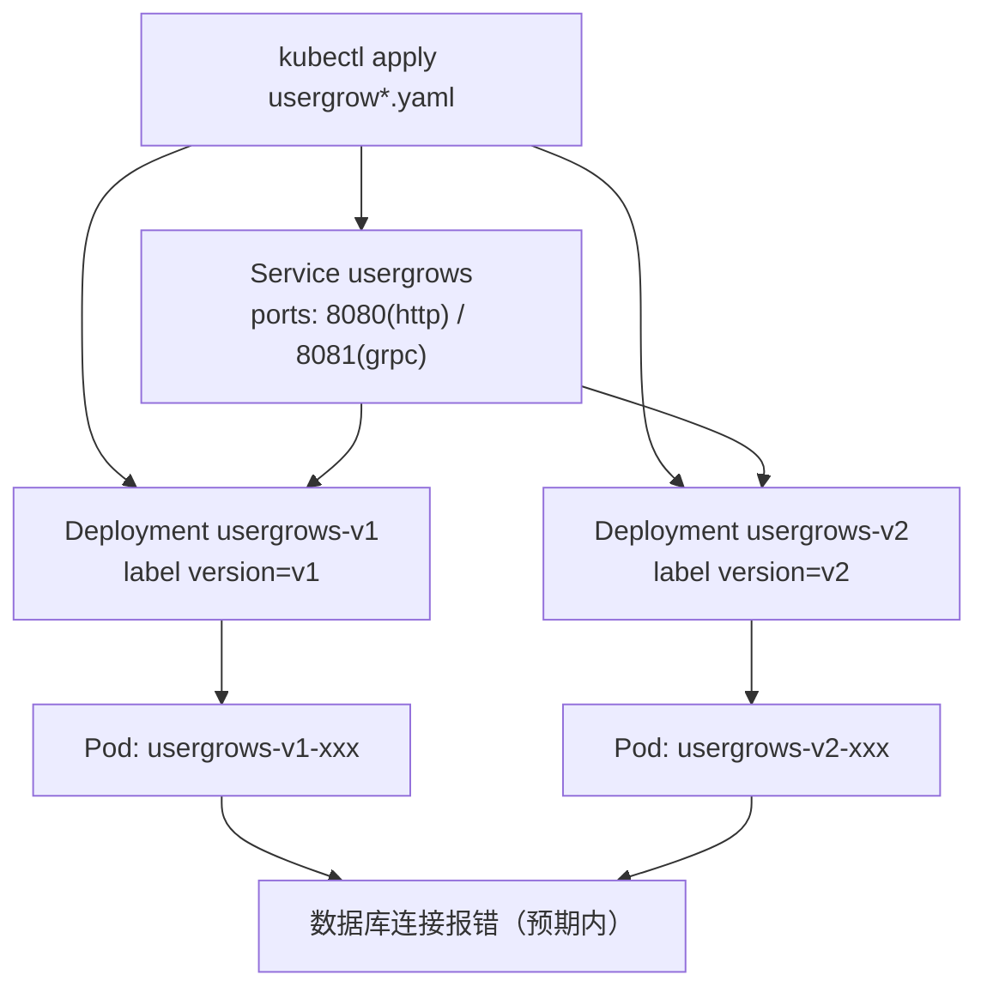
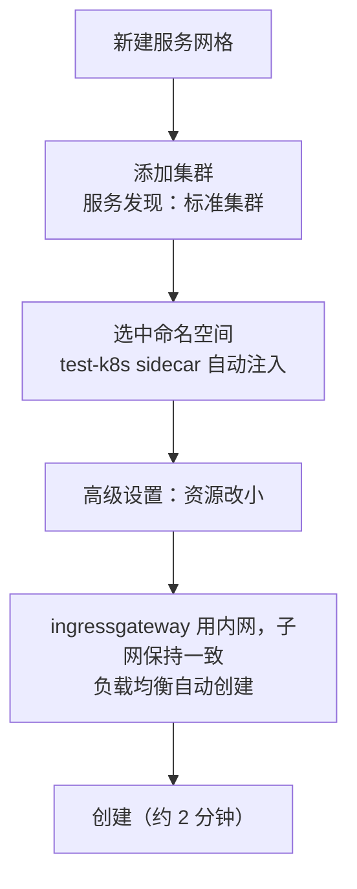

# Kubernetes 认证考点: 用 Istio 做服务治理的准备工作——建集群、建网格、开注入

前面讲了那么多原理和能力，这一节开始用 Istio 真正实现微服务治理。

结论：**准备工作只有四件事 —— 建 K8s 标准集群、建托管服务网格、部署 usergrows 的 v1/v2 双版本、给命名空间开 sidecar 自动注入。前面三步是环境，最后一步是开关，打开后这个 ns 里新建的 Pod 都会自动长出一个 Envoy 边车。**

## 纲要

- 本节要做的事：集群 → 网格 → 部署服务 → 开注入
- 为什么选标准集群而不是托管节点池
- 建集群：节点规格、节点来源、组件安装
- 建服务网格：自动注入范围、资源规格、网关设置
- 部署 usergrows 服务：Service + 两个 Deployment
- 开启 sidecar 自动注入

## 本节要验证的能力清单

首先是要实现路由转发 —— 先来验证 TCP 的路由转发。接着就是故障注入，**故障注入需要用到 HTTP 的路由转发，故障注入支持很多种，包括延时、异常终止、超时和熔断的**。最后通过配置 Envoy 的过滤规则来实现速率限制，**可以让指定服务的指定接口限制速度，比如最多一个请求每分钟，超过这个数量，就会出现 429 状态码，不让请求到后端服务了**。



**这些是直接在 Istio 层来完成的服务治理，不需要服务这一块做任何调整就可以支持的能力。**

## 第一步：创建 K8s 集群

这次创建的 K8s 集群选择标准集群，**因为我们这次实验要验证的东西比较多，建立的服务 Pod 也会比较多；如果用托管节点池，它的成本反而会比标准集群要高一点**。



### 节点采购的几个硬性约束

1. **至少申请两个云服务器，至少是两核两G的**；如果更高规格也可以，**低规格就不行了**；
2. **注意不能是那种竞价实例** —— 竞价实例随时可能被回收，做服务治理实验会反复断；
3. 创建集群时**每次新建集群都会对操作系统进行重新安装，如果上面有数据就要小心一点**。

### 集群参数

```text
集群创建向导
├── 集群名称：test-k8s-istio
├── 容器网络：默认（不用改）
├── 节点来源
│   ├── 新增节点 → 采购新机器
│   ├── 已有节点 → 选择现有云主机
│   └── 本次选「已有节点」：我们已经有 2 台，选中它
├── 集群类型
│   ├── 托管集群
│   ├── 独立集群
│   └── 本次选托管集群
├── 密码：系统重装后需要设置新密码（务必记住）
└── 组件安装：默认即可（这么多功能组件我们还用不上）
```

托管集群**需要至少三台云主机**；我们自己可以管理它，费用方面差不多。

### 集群安装网关 API 与实验特性

在集群内的节点上操作，先要装一些 CRD —— **K8s 的网关 API 和一些实验性的功能是比较新的一些版本，把它们安装上去**：

```bash
# 安装 istio 的工具：从 istio 仓库拿 CRD 的 yaml 文件并安装
# （此处执行 istioctl 相关安装命令）
# 两部分：Gateway API + 实验性功能

# 国内机器上操作有可能会有网络问题、会比较慢，遇到超时报错要重试几遍
# 先给变量赋值，例如：GATEWAY_API_CRD=standard-install；EXPERIMENTAL_CRD=experimental-install
$ kubectl apply -f ${GATEWAY_API_CRD}.yaml
$ kubectl apply -f ${EXPERIMENTAL_CRD}.yaml
```

> 国内网络下这两个补丁包下载慢或超时是常态，**重试几遍**就好，不用换源。

集群创建全过程大概三分钟左右。

## 第二步：部署 usergrows 服务

在集群内创建完集群，我们来新建一个命名空间，之后所有实验都在这个 ns 里做。

把课程仓库里准备好的 YAML 文件上传到云主机根目录，**所有 YAML 文件都传到了服务器上**，然后执行：

```bash
$ kubectl apply -f usergrow-service.yaml
$ kubectl apply -f usergrow.yaml
```

### 这个 YAML 里定义了什么

我们简单看一下 `usergrows-service.yaml`：

- 里面会定义一个 Service `usergrows`；
- 然后是该服务用到的几个端口：**8080 和 8081**；
- 然后会选择有这个标签值的 Deployment。

在下面有两个 Deployment，一个是 v1 版本，它里面有一个标签 `version: v1`；然后是 config 的配置，参照着写就行。**最主要的是要真正运行起来，还要去改一下这个服务配置里面配置的数据库** —— 我们这里是按照本地配置的，所以服务的数据库连接肯定会报错，**因为我们只验证开发者和 container sidecar 的功能，所以可以忽略服务的报错。**

```yaml
apiVersion: v1
kind: Service
metadata:
  name: usergrows
spec:
  selector:
    app: usergrows
  ports:
    - name: http
      port: 8080
      targetPort: 8080
    - name: grpc
      port: 8081
      targetPort: 8081
---
apiVersion: apps/v1
kind: Deployment
metadata:
  name: usergrows-v1
spec:
  replicas: 1
  selector:
    matchLabels:
      app: usergrows
      version: v1
  template:
    metadata:
      labels:
        app: usergrows
        version: v1
    spec:
      containers:
        - name: usergrows
          image: <镜像仓库>/usergrows:v1
          ports:
            - containerPort: 8080
              name: http
            - containerPort: 8081
              name: grpc
---
apiVersion: apps/v1
kind: Deployment
metadata:
  name: usergrows-v2
spec:
  replicas: 1                    # ← 版本信息在 modedeploment 里定义为 version=v2
  selector:
    matchLabels:
      app: usergrows
      version: v2
  template:
    metadata:
      labels:
        app: usergrows
        version: v2
    spec:
      containers:
        - name: usergrows
          image: <镜像仓库>/usergrows:v2
          ports:
            - containerPort: 8080
              name: http
            - containerPort: 8081
              name: grpc
```

`kubectl` 执行一下，就会把一个服务和两个部署都创建起来。去页面上看一眼集群的工作负载：**命名空间里有两个部署，一个是 v1，一个是 v2，都运行起来了；服务也已经创建起来了。**



> **数据库报错是可以忽略的**：这一节验证的是路由转发和 sidecar 注入，`/hello` 这种不碰库的接口会正常返回，只用 `/task/list` 会报 3306 连不上 —— 那恰恰说明流量到了服务端。

## 第三步：开启 Istio 服务网格

来到服务网格，很简单，新建一个服务网格，**添加集群的服务发现** —— 标准集群。



关键配置点：

1. **`sidecar 自动注入` 选中这个命名空间** —— 这样 Istio 就会给这个命名空间所有部署、所有 Pod 里面都把 sidecar 注入进去；
2. **高级设置里资源规格改小一点，CPU 内存都小一点** —— 如果没什么访问、也没什么数据量，只要能运行起来就够了；
3. **ingressgateway 用内网，子网保持一致，负载均衡自动创建**；
4. 资源规格 request 是最低值、limit 是最高值；**监控调用跟踪这些不用，日志可以开启，看日志来调试还是比较方便**。

```yaml
# 服务网格侧要生效的注入配置（概念示意）
apiVersion: v1
kind: Namespace
metadata:
  name: usergrows
  labels:
    istio-injection: enabled   # ← 打开这扇门，后面新建的 Pod 自动长边车
```

费用方面：控制面的托管费用不贵，**但是服务网格的费用比 K8s 集群还是要贵很多**。它要部署在 K8s 集群内，**不超过一百个是不收费的，超过的话还是会再计费**。

> 这一点做实验时要心里有数：网格控制面 ≈ 2 元/小时（含 ingress gateway 负载均衡），跑两小时就是十几块。**用完记得销毁**。

网格创建大约两分钟。

## API 速览

| 能力 | 操作 / 字段 |
| --- | --- |
| 集群类型 | 标准集群 / 托管集群（≥3 台云主机） |
| 节点规格 | ≥ 2C2G，**不能用竞价实例** |
| 节点来源 | 新增节点（采购新机器）/ 已有节点（选现有云主机） |
| CRD 安装 | 网关 API + 实验性功能（国内网络需重试） |
| 服务定义 | `Service usergrows`，端口 8080 / 8081 |
| 双版本 | 两个 Deployment，label `version: v1` / `v2` |
| 自动注入开关 | 命名空间标签 `istio-injection: enabled` |
| 注入范围 | 该 ns 下所有部署、所有 Pod 都注入 sidecar |
| 网格资源 | request 取最低值、limit 取最高值；可开日志调试 |
| 网关 | ingressgateway 内网 + 负载均衡自动创建 |
| 计费边界 | 网格内 ≤100 个不额外计费，超出再计 |

## Demo 示例

从零到"Pod 里多出一个 istio-proxy"。

```text
# ---------- 1. 建集群（控制台向导）
# 标准集群 / 已有节点（2 台 2C2G 非竞价实例）/ 托管集群 / 组件默认

# ---------- 2. 装 CRD
$ kubectl apply -f gateway-api-standard.yaml
$ kubectl apply -f experimental-features.yaml
# 国内网络慢就重试几遍

# ---------- 3. 建命名空间并打开注入开关
$ kubectl create namespace usergrows
$ kubectl label namespace usergrows istio-injection=enabled
$ kubectl get namespace usergrows -o jsonpath='{.metadata.labels}'
map[istio-injection:enabled]

# ---------- 4. 部署服务与双版本
$ kubectl apply -f usergrow-service.yaml
$ kubectl apply -f usergrow-v1v2.yaml
$ kubectl get pod -n usergrows
NAME                            READY   STATUS    RESTARTS   AGE
usergrows-v1-6d9f8b6c4-x2p9k    1/1     Running   0          20s
usergrows-v2-7c8b9a5d3-k1m2n    1/1     Running   0          20s
# 注意此刻 READY 是 1/1 —— 还没有边车（后面网格创建完会变 2/2）

$ kubectl get svc -n usergrows
NAME         TYPE        CLUSTER-IP     PORT(S)          AGE
usergrows    ClusterIP   10.96.42.17    8080/TCP,8081/TCP   20s

# ---------- 5. 建服务网格（控制台）
# 新建服务网格 → 添加集群（标准集群）
# → sidecar 自动注入勾选 usergrows 命名空间
# → 高级设置：CPU/内存 request 取最低、limit 取最高
# → ingressgateway 内网、负载均衡自动创建
# → 创建（约 2 分钟）

# ---------- 6. 等网格就绪后，新建 Pod 自动带边车
$ kubectl run testpod -n usergrows --image=busybox -- sleep 3600
$ kubectl get pod testpod -n usergrows -o jsonpath='{.spec.containers[*].name}'
istio-proxy testpod
#     ↑ 自动注入的 sidecar    ↑ 业务容器

# ---------- 7. 确认边车接管了网络
$ kubectl exec testpod -n usergrows -c istio-proxy -- \
    sh -c "iptables -t nat -S | grep ISTIO"
-A ISTIO_INBOUND -p tcp -j ISTIO_REDIRECT --to-ports 15001
```

**就绪检查清单**

| 检查项 | 期望 |
| --- | --- |
| ns 标签有 `istio-injection=enabled` | 注入开关打开 |
| 两个 Deployment 都 Running | v1 / v2 双版本就位 |
| 新建 Pod 容器数为 2 | 边车自动注入成功 |
| `istio-proxy` 容器存在 | 数据平面 ready |
| iptables 有 ISTIO 链 | Envoy 已接管流量 |

### 总结

准备工作可以压缩成一句话：**建标准集群 → 建托管网格 → 部署 v1/v2 双版本 → 给命名空间打开 sidecar 自动注入**。

四个容易出错的地方：

1. **节点规格不够（<2C2G）或用了竞价实例** —— 边车和网格控制面一起跑，资源不够会起不来，竞价实例被回收会更乱；
2. **CRD 装不全**（网关 API / 实验特性）—— 国内网络超时就重试几遍，别跳过；
3. **忘了给命名空间打 `istio-injection=enabled`** —— 这是最典型的"Istio 装了但没效果"，Pod 里根本没有边车；
4. **网格控制面只计费到 100 个，超出要另外算钱**；日志建议先开着，调试比省这点资源划算。

数据库报错不用管 —— 这一节的目标不是跑通业务，是**确认边车已经接管流量**。下一步的路由转发、故障注入、限速，全部建立在这个之上。

