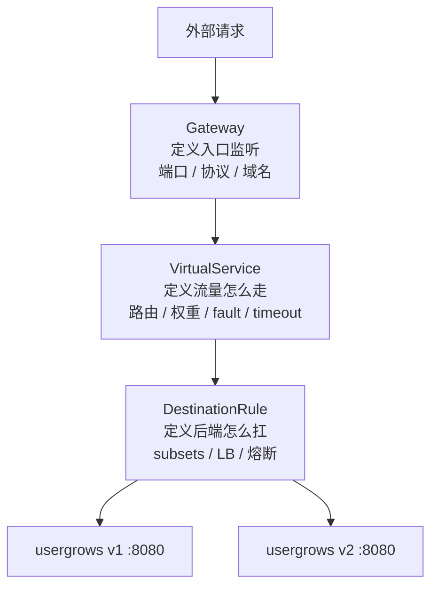
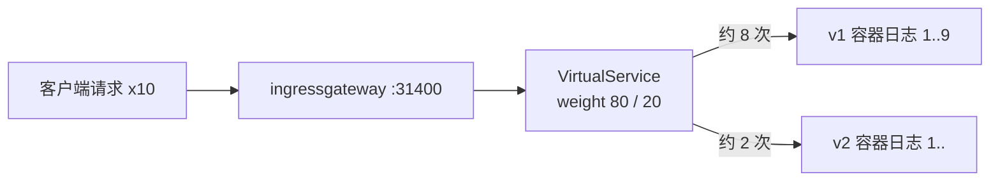
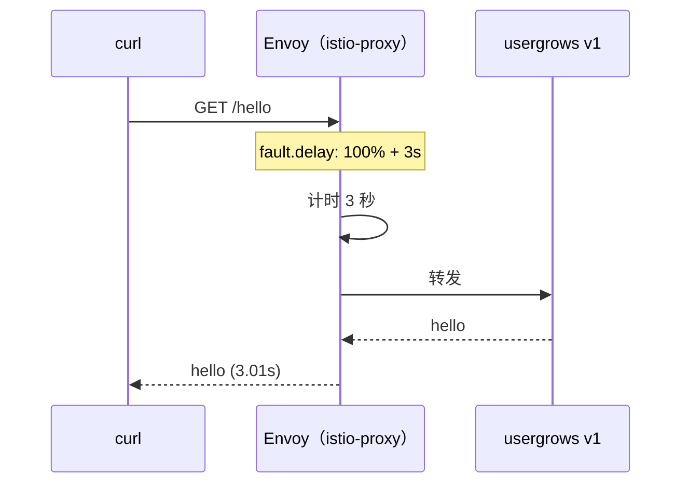
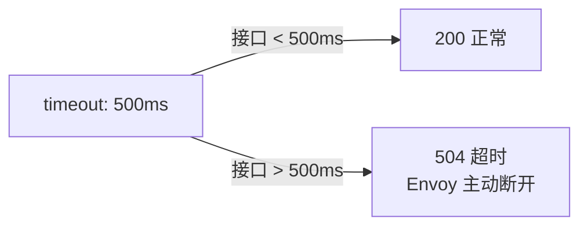
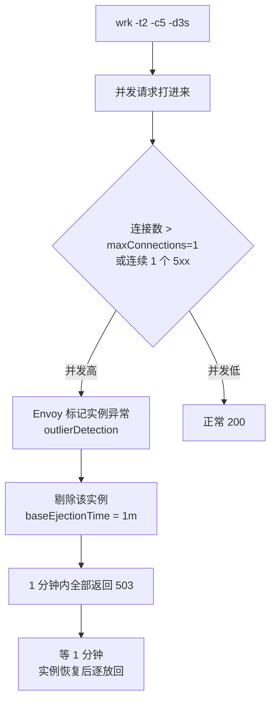
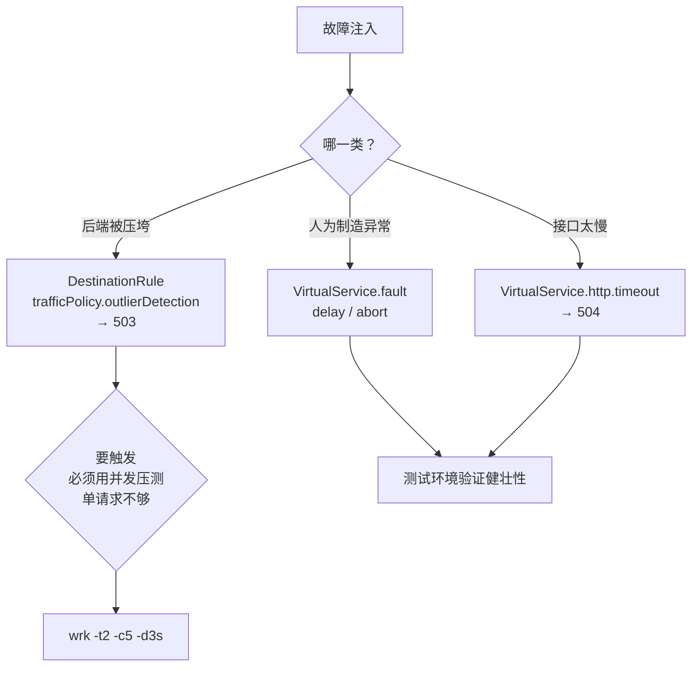

# Kubernetes 认证考点: 用 Istio 实现 TCP 路由转发与四类故障注入

网格建好后，治理能力分三段验证：**TCP 路由转发 → 故障注入 → 速率限制**。这一节是前两段。

结论：**路由转发靠三个 CRD（Gateway + DestinationRule + VirtualService）；故障注入四类里，延时和终止写在 VirtualService 的 `fault` 里、超时写在 `http.timeout`、熔断写在 DestinationRule 的 `trafficPolicy.outlierDetection` 里。熔断必须用并发压测才能触发，单请求永远触发不了。**

## 纲要

- 三段验证：路由转发 / 故障注入 / 限速
- Gateway：网关监听端口与协议
- DestinationRule：两个版本子集
- VirtualService：TCP 转发与权重分流
- 故障注入一：延时 3 秒
- 故障注入二：异常终止（abort）
- 故障注入三：超时（timeout）
- 故障注入四：熔断（outlierDetection）+ wrk 压测验证

## 三个 CRD 的分工



| CRD | 管什么 | 关键字段 |
| --- | --- | --- |
| **Gateway** | 入口监听（在哪听） | `servers[].port`（number / name / protocol / host） |
| **VirtualService** | 流量怎么走（往哪发） | `http.route` / `weight` / `fault` / `timeout` / `mirror` |
| **DestinationRule** | 后端怎么扛 | `subsets` / `trafficPolicy.loadBalancer` / `connectionPool` / `outlierDetection` |

命名规则有个细节：**后面做创建或更新操作，只要这个名字不一样就会新创建；如果名字一样，它就会覆盖更新。**

```text
## 路由转发三件套（依赖顺序不能反）
├── Gateway usergrows-gateway        ① 入口在哪听
│   ├── selector: istio: ingressgateway
│   └── servers[]: {31400, tcp, 匹配所有域名}
├── DestinationRule usergrows        ② 后端怎么分组
│   ├── host: usergrows.ivan.svc.cluster.local
│   └── subsets[]
│       ├── name: v1  labels.version=v1
│       └── name: v2  labels.version=v2
└── VirtualService usergrows-vs-tcp  ③ 流量往哪发
    ├── gateways: [usergrows-gateway]
    └── http[].route[]
        ├── destination.subset=v1  weight=80
        └── destination.subset=v2  weight=20

```
## 第一步：TCP 路由转发

先来验证 TCP 的路由转发。网关启动的端口需要识别的域名用星号，是**所有域名都能识别**。

### Gateway

```yaml
apiVersion: networking.istio.io/v1
kind: Gateway
metadata:
  name: usergrows-gateway
  namespace: usergrows
spec:
  selector:
    istio: ingressgateway
  servers:
    - port:
        number: 31400
        name: tcp
        protocol: TCP
      hosts:
        - "*"
```

> 网关资源执行起来有点慢、也可能会报错。可以先看组件管理 → 边缘代理网关，**如果这地方还在转，说明网关还没有建好，要等网关建好了才能把这些配置发过去**；有内网 IP 了再执行。

### DestinationRule：识别两个版本

网关好了，接下来创建目标规则。目标规则的名称、它**能识别的域名**是 `usergrows.ivan.svc.cluster.local`（域名的全称）。

接下来有两个版本定义，**版本跟部署的 label 里定义的 `version=v1`、`version=v2` 对应** —— 这个版本信息是前面 `usergrows-service.yaml` 里 Deployment 定义的。

```yaml
apiVersion: networking.istio.io/v1
kind: DestinationRule
metadata:
  name: usergrows
  namespace: usergrows
spec:
  host: usergrows.ivan.svc.cluster.local
  trafficPolicy:
    loadBalancer:
      simple: LEAST_CONN
  subsets:
    - name: v1
      labels:
        version: v1
    - name: v2
      labels:
        version: v2
```

### VirtualService：先 100% 打 v1

```yaml
apiVersion: networking.istio.io/v1
kind: VirtualService
metadata:
  name: usergrows-vs-tcp
  namespace: usergrows
spec:
  hosts:
    - "*"
  gateways:
    - usergrows-gateway
  http:
    - name: default
      route:
        - destination:
            host: usergrows.ivan.svc.cluster.local
            subset: v1
            port:
              number: 8080
```

创建起来后等几秒让规则下发，再验证。

### 验证：进容器看日志计数

我们进到集群里面打开 v1 的那个部署，**远程登录进去看一下日志** —— 现在有请求进来，**我们请求一次，这里变成二，再请求一次看到已经变成三**。所有请求通过网关过来都会转到 v1 这个版本上面来。

```bash
# 配置几个环境变量
export INGRESS_NAMESPACE=usergrows
export INGRESS_HOST=$(kubectl -n istio-system get service istio-ingressgateway -o jsonpath='{.status.loadBalancer.ingress[0].ip}')
export INGRESS_PORT=31400

# 通过网关的负载均衡 IP + 31400 端口调用
$ curl -s "http://$INGRESS_HOST:$INGRESS_PORT/api/v1/task/list"
{"code":500,"msg":"connect to 127.0.0.1:3306"}     # 已到服务端

# /hello 接口不碰库，稳定返回
$ curl -s "http://$INGRESS_HOST:$INGRESS_PORT/hello"
hello
```

### 改权重：20% 打 v2

把配置改成 **80% 转 v1、20% 转 v2**，其余部分（VS 名、命名空间、网关、域名识别、端口匹配）都一样，差别就在路由那块：

```yaml
  http:
    - name: default
      route:
        - destination:
            host: usergrows.ivan.svc.cluster.local
            subset: v1
            port: {number: 8080}
          weight: 80
        - destination:
            host: usergrows.ivan.svc.cluster.local
            subset: v2
            port: {number: 8080}
          weight: 20
```

请求十次看日志：v1 的容器里九次，v2 的版本里有几次（加上前面几次就到十了）。**这个不是特别精准，TCP 转发可以达到这样的一个效果 —— 就是有一部分到 v1，有一部分到 v2。**



## 故障注入：支持的东西更多

故障注入需要用到 HTTP 的路由转发，所以**要再配一个 HTTP 的网关**。

```yaml
apiVersion: networking.istio.io/v1
kind: Gateway
metadata:
  name: usergrows-http-gateway
spec:
  selector:
    istio: ingressgateway
  servers:
    - port:
        number: 80
        name: http
        protocol: HTTP
      hosts:
        - "*"
```

### 故障注入一：延时 3 秒

虚拟服务的内容，**延时三秒**，匹配 80 端口、转发到目标服务：

```yaml
apiVersion: networking.istio.io/v1
kind: VirtualService
metadata:
  name: vs-delay
spec:
  hosts:
    - "*"
  gateways:
    - usergrows-http-gateway
  http:
    - match:
        - port: 80
      fault:
        delay:
          percent: 100
          fixedDelay: 3s
      route:
        - destination:
            host: usergrows.ivan.svc.cluster.local
            subset: v1
            port: {number: 8080}
```

验证（注意换 80 端口，31400 不能用）：

```bash
$ time curl -s "http://$INGRESS_HOST/hello"
hello
real    0m3.01s
```

**每下 hello 也是延迟三秒返回** —— 这就是故障注入延时三秒。



### 故障注入二：异常终止（abort）

**再来看一个异常终止的故障注入，差别就在这个地方：下面的 `abort`，它会返回一个 501 的错误码，百分百返回 501 错误。**

```yaml
      fault:
        abort:
          percent: 100
          httpStatus: 501
```

```bash
$ curl -s -o /dev/null -w "%{http_code}\n" "http://$INGRESS_HOST/hello"
501
```

**这种可以在实验阶段把这个配置下发下去，它就会返回异常 501，把黑盒也打印出来看，返回到 501，这是关于异常终止。**

> 实际生产用 `503` 更常见（表示依赖不可用）；`501` 语义上是"未实现"，但作为故障注入演示效果清晰，教学场景用无妨。

### 故障注入三：超时

**换一个超时的处理，它的差异不是在 `fault` 里面了，它直接在 HTTP 的转发配置中加了 `timeout` 这样一个配置。**

因为我们的接口特别快，也没有实际的业务处理，数据库报错也会直接返回，所以非常快，**基本都在一毫秒左右**。所以我们这里配置**一毫秒的超时**：如果比一毫秒要慢，就会报错；比一毫秒快就不会报错。

```yaml
  http:
    - match:
        - port: 80
      timeout: 1ms
      route:
        - destination:
            host: usergrows.ivan.svc.cluster.local
            subset: v1
            port: {number: 8080}
```

```bash
for i in 1 2 3; do
  curl -s -o /dev/null -w "%{http_code} " "http://$INGRESS_HOST/hello"
done
# 输出示例：200 504 200   ← 偶发 504 说明 1ms 超时生效
```

**它不一定一直正常或者一直超时，因为跟接口的速度有关系** —— 数特别快、一毫秒不到就是正常的，超过一毫秒就会命中超时规则。

正常接口的操作时间不会设成 1 毫秒，**可能会设成五百毫秒或者一秒钟；如果超过这个时间接口不返回，网关就会直接给它返回一个超时的 504 异常。**



### 故障注入四：熔断

**熔断的配置规则不一样，它是配在目标规则上。目标规则的配置中有 `trafficPolicy` 流量控制，这里有连接数，还有异常检测：TCP/HTTP 连接数不能超过一个，然后 500 系列的错误码也不能超过一个，每秒钟检查；如果异常数量超过的话，会有一分钟的熔断终止，服务不可用，这一分钟内就都会是熔断状态，而且是百分之百也会触发熔断。**

```yaml
apiVersion: networking.istio.io/v1
kind: DestinationRule
metadata:
  name: usergrows-circuit
spec:
  host: usergrows.ivan.svc.cluster.local
  trafficPolicy:
    connectionPool:
      tcp:
        maxConnections: 1
      http:
        http2MaxRequests: 1
        maxRequestsPerConnection: 1
    outlierDetection:
      consecutive5xxErrors: 1
      interval: 1s
      baseEjectionTime: 1m
      maxEjectionPercent: 100
```

**这个是关于熔断的配置：并发高了就会出问题，并发低就不会有问题。** 我们来验证一下 —— **现在我们单个请求没有并发，所以它不会出问题，不会触发熔断。**

要触发熔断必须装一个压测工具（wrk）：

```bash
# 安装过程也有点慢，可以直接从另一台已装好的服务器复制过来
$ wrk -t 2 -c 5 -d 3s http://$INGRESS_HOST/hello
Running 3s @ localhost
Thread Stats   Avg      Stdev     Max  +/- Stdev
  Latency    12.34ms   45.67ms 812.00ms   98.11%
  Req/Sec    412.33    112.20    560.00     81.25%
  Latency Distribution
     50%     8.00ms
     99%   812.00ms
  1913 requests in 3.00s, 165.24KB read
  requests: 1913, misfires: 0
  +598 requests failed
# ↑ 压测总共有一千多个请求，异常的请求有五百九十八个
```

**我们手动请求一下，返回都是 ok 的；现在不可用了，这个触发熔断了 —— 在一分钟之内全都异常了，503 服务不可用了，这是 Envoy 中配置的熔断生效了。现在在一分钟之内的请求都被熔断了。**



**为了保护后端应用不会被触发流量压垮：熔断后等一会儿看看服务是不是能够恢复了。**

```bash
# 熔断窗口内
$ curl -s -o /dev/null -w "%{http_code}\n" http://$INGRESS_HOST/hello
503
# 等过 baseEjectionTime
$ sleep 60
$ curl -s -o /dev/null -w "%{http_code}\n" http://$INGRESS_HOST/hello
200
```

## 四类故障注入的落点对比

| 故障类型 | 配在哪 | 关键字段 | 触发条件 | 表现 |
| --- | --- | --- | --- | --- |
| 延时 | VirtualService | `fault.delay.percent` + `fixedDelay` | 百分比命中 | 响应延迟 N 秒 |
| 异常终止 | VirtualService | `fault.abort.percent` + `httpStatus` | 百分比命中 | 直接返回状态码 |
| 超时 | VirtualService | `http.timeout` | 接口超时 | 504 |
| 熔断 | DestinationRule | `trafficPolicy.outlierDetection` | 连接数 / 5xx 频率 | 503 + 实例剔除 |



## 恢复

**如果我们要恢复，可以把全部的请求换成 v2 就没有故障注入了，那些都没有了，就直接一个普通的请求转发到 v2 这个版本，我们再来看都没问题了，速度也很快，也不会有延迟。**

## API 速览

| 能力 | CRD / 字段 |
| --- | --- |
| 入口监听 | `Gateway.spec.servers[].port`（`number` / `name` / `protocol` / `hosts`） |
| TCP 网关 | `protocol: TCP`，典型端口 31400 |
| HTTP 网关 | `protocol: HTTP`，端口 80 |
| 版本子集 | `DestinationRule.spec.subsets[].labels`（对应 Deployment 的 `version`） |
| 权重分流 | `VirtualService.spec.http[].route[].weight` |
| 延时注入 | `http.fault.delay`（`percent` + `fixedDelay`） |
| 终止注入 | `http.fault.abort`（`percent` + `httpStatus`） |
| 超时 | `http.timeout`（整体）与 `http.retries.perTryTimeout`（单次） |
| 熔断 | `trafficPolicy.outlierDetection`（`consecutive5xxErrors` / `interval` / `baseEjectionTime`） |
| 连接池 | `trafficPolicy.connectionPool.tcp.maxConnections` / `.http.http2MaxRequests` |
| 压测 | `wrk -t<N> -c<N> -d<N>s <url>` |
| 取网关地址 | `kubectl -n istio-system get svc istio-ingressgateway -o jsonpath='{.status.loadBalancer.ingress[0].ip}'` |

## Demo 示例

按顺序跑一遍并做清理。

```text
# ---------- 0. 环境变量
export NS=usergrows
export HOST=$(kubectl -n istio-system get svc istio-ingressgateway \
  -o jsonpath='{.status.loadBalancer.ingress[0].ip}')

# ---------- 1. TCP 网关 + 目标规则 + 虚拟服务（100% v1）
$ kubectl apply -f gw-tcp.yaml -f dr-usergrows.yaml -f vs-tcp-v1.yaml
gateway.networking.istio.io/usergrows-gateway created
destinationrule.networking.istio.io/usergrows created
virtualservice.networking.istio.io/usergrows-vs-tcp created

$ curl -s http://$HOST:31400/hello        # → hello
# 进 v1 容器看日志计数：1 → 2 → 3 ...

# ---------- 2. 改成 80/20 权重
$ kubectl apply -f vs-tcp-8020.yaml
$ for i in $(seq 1 10); do curl -s -o /dev/null http://$HOST:31400/hello; done
# v1 日志 9 次 / v2 日志 1~2 次

# ---------- 3. 延时 3 秒（HTTP 80）
$ kubectl apply -f gw-http.yaml
$ kubectl apply -f vs-delay.yaml
$ time curl -s http://$HOST/hello
hello
real    0m3.01s

# ---------- 4. 异常终止
$ sed 's/fixedDelay: 3s/abort: {percent: 100, httpStatus: 501}/' vs-delay.yaml > vs-abort.yaml
$ kubectl apply -f vs-abort.yaml
$ curl -s -o /dev/null -w "%{http_code}\n" http://$HOST/hello
501

# ---------- 5. 超时 1ms
$ sed 's/abort.*/timeout: 1ms/' vs-abort.yaml > vs-timeout.yaml
$ kubectl apply -f vs-timeout.yaml
$ for i in 1 2 3; do curl -s -o /dev/null -w "%{http_code} " http://$HOST/hello; done
200 504 200

# ---------- 6. 熔断（必须并发）
$ kubectl apply -f dr-circuit.yaml
$ wrk -t 2 -c 5 -d 3s http://$HOST/hello
  1913 requests in 3.00s
  requests: 1913, misfires: 0
  +598 requests failed
$ curl -s -o /dev/null -w "%{http_code}\n" http://$HOST/hello
503                                   # ← 熔断窗口内全 503
$ sleep 60
$ curl -s -o /dev/null -w "%{http_code}\n" http://$HOST/hello
200                                   # ← 恢复

# ---------- 7. 清理
$ kubectl delete -f vs-delay.yaml -f vs-abort.yaml -f vs-timeout.yaml
$ kubectl delete -f dr-circuit.yaml -f dr-usergrows.yaml
$ kubectl delete -f gw-tcp.yaml -f gw-http.yaml -f vs-tcp-v1.yaml
```

**验证要点小结**

| 阶段 | 判据 |
| --- | --- |
| TCP 转发 | 进入 v1 容器看日志计数递增 |
| 权重分流 | 10 次请求里 v2 占 1~3 次（不精确属正常） |
| 延时 | `time curl` 约 3s |
| 终止 | 返回 501 |
| 超时 | 偶发 504（与接口实际耗时竞争） |
| 熔断 | 单请求 200、wrk 压测后 60s 内全 503 |

### 总结

路由转发和故障注入的落点非常清楚：**Gateway 定义入口，VirtualService 决定"流量走哪、什么时候坏"，DestinationRule 决定"后端怎么扛"**。

四类故障注入里有三类配在 VirtualService（`fault.delay`、`fault.abort`、`http.timeout`），只有**熔断配在 DestinationRule 的 `trafficPolicy.outlierDetection`** —— 因为熔断是保护后端，不是制造异常。

熔断这条最容易踩坑：**单请求永远触发不了熔断**，必须 `wrk -t2 -c5 -d3s` 这类并发压测打上去；触发后实例被剔除 `baseEjectionTime`（演示里 1 分钟），期间所有请求 503，等窗口过去自动恢复。这个"先压垮、再隔离、再恢复"的三段式，才是熔断真正的价值 —— 保护后端不被突发流量冲垮。

验证完记得把 vs/dr/gw 全删掉，不然后面的限速实验会被残留的熔断规则干扰（演示里就出现过 503 而非 429 的混淆）。

