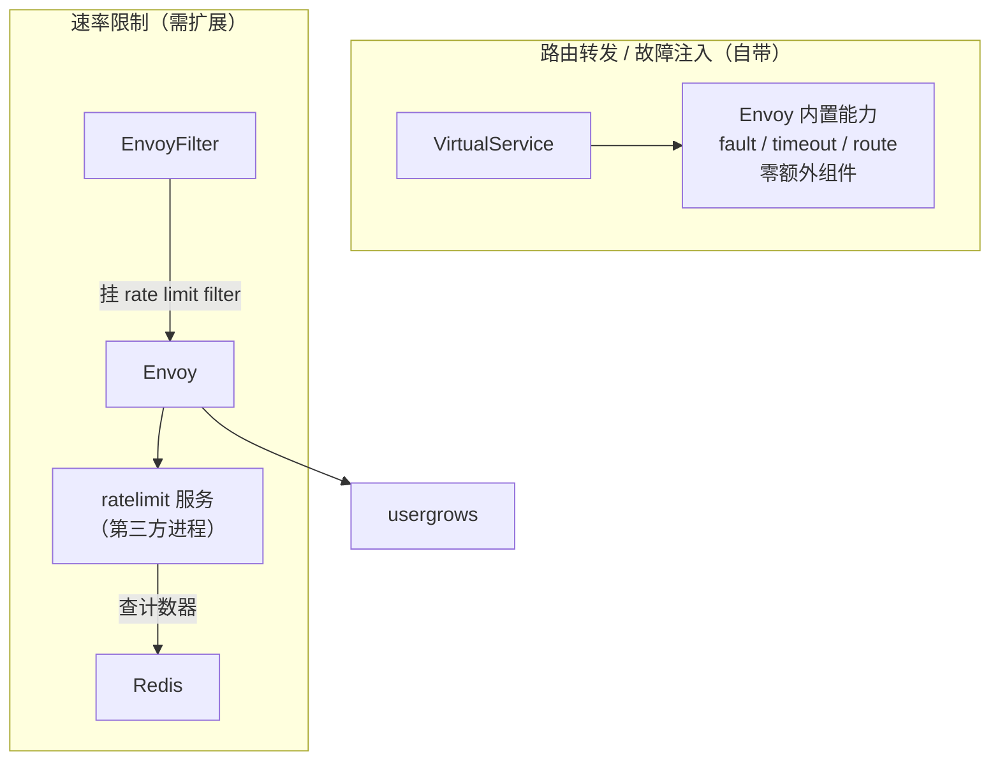
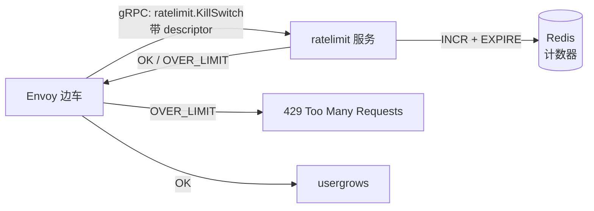
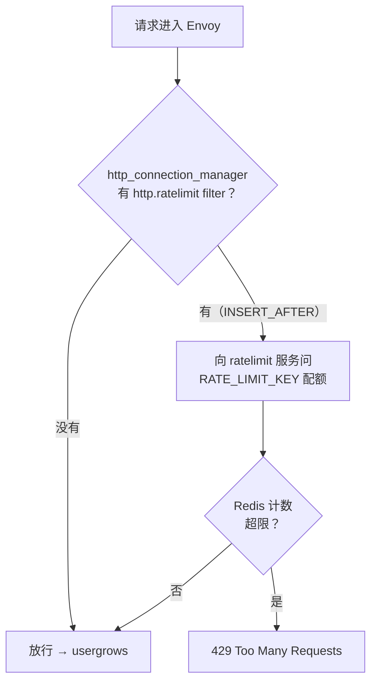
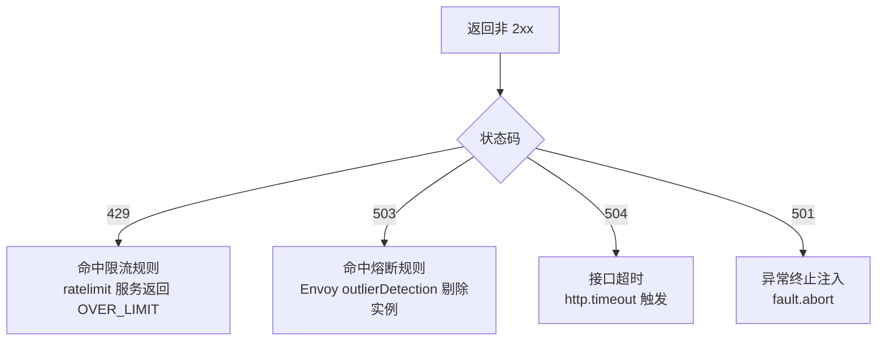
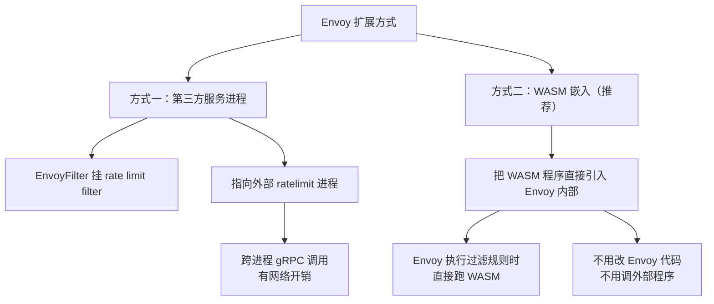

# Kubernetes 认证考点: 用 Envoy 过滤器扩展 Istio 实现速率限制

前面讲的故障注入和路由转发，Istio 都自带。**速率限制不一样 —— 它需要用到 Envoy 的扩展能力、配置过滤规则，实现一个第三方服务进程来做具体的处理。**

结论：**Istio 自带不提供全局限流，必须挂一个 ratelimit 服务（计数器用 Redis）；用 `EnvoyFilter` 把 Envoy 的 `http_connection_manager` 串上一个 `ratelimit` filter，指向该服务。限流规则写在 ConfigMap 里，命中就返回 429。**

## 纲要

- 限速与故障注入的处理方式完全不同
- 为什么必须自己开发/接入 ratelimit 服务
- ratelimit 服务的组成：ConfigMap 规则 + 服务 + Redis
- 用 EnvoyFilter 挂载 rate limit filter
- 验证 429 与常见混淆（残留熔断规则的 503）
- 两种扩展路径：外部进程 vs WASM（推荐）

## 限速与前面的差异在哪

我们接下来看使用 Istio 里面的 Envoy 网关来做流量限速，**这里的限速处理和前面的故障注入、路由转发都不一样**。

**因为我们会用到 Envoy 的扩展能力配置过滤规则，限速处理需要用到第三方的服务进程来做具体的实现。** 也就是意味着**要我们自己来开发一个限速服务，这里就不具体开发了，课程中是直接用的一个官方的 ratelimit 程序**。如果我们自己有不一样的实现，可以参照 ratelimit 这个来开发就好了。



关键差别：**限流需要"跨请求的状态"（每分钟多少次），Envoy 单个实例的内存计数器不够用，必须有个共享存储。**

## 第一步：写限速规则 ConfigMap

**给服务配置相应的 ConfigMap。看一下 `ratelimit-config.yaml`，这是一个 ConfigMap，里面定义服务的域名、指定要路径，这个目录是一次每分钟，其他的是一百次每分钟 —— 这是配置的限速规则。**

```yaml
apiVersion: v1
kind: ConfigMap
metadata:
  name: ratelimit-config
  namespace: usergrows
data:
  config.yaml: |
    domain: usergrows
    descriptors:
      - key: RATE_LIMIT_KEY
        rate_limit:
          unit: minute
          requests_per_unit: 100      # 其他路径：100 次/分钟
        descriptors:
          - key: PATH
            value: /hello
            rate_limit:
              unit: minute
              requests_per_unit: 1    # /hello 路径：1 次/分钟
```

规则语义：**命中 `/hello` 路径的请求一分钟最多 1 次，其他路径一分钟最多 100 次**，超过就返回 429。

## 第二步：部署 ratelimit 服务 + Redis

**这个限速服务里面有一个 Service 是 ratelimit，Redis 的部署；限速服务的计数器会用到 Redis 来存储。下面就是限速的 Deployment，它的协议和端口以及它的 Redis 配置 —— 因为在集群内访问，而且它们命名空间是一样的，所以可以直接这么缩写。**

```yaml
apiVersion: apps/v1
kind: Deployment
metadata:
  name: ratelimit
  namespace: usergrows
spec:
  replicas: 1
  selector:
    matchLabels: {app: ratelimit}
  template:
    metadata:
      labels: {app: ratelimit}
    spec:
      containers:
        - name: ratelimit
          image: envoyproxy/ratelimit:v0.6.2
          args: ["-configpath=/data/config/config.yaml"]
          volumeMounts:
            - name: config
              mountPath: /data/config
          ports:
            - containerPort: 8081
              name: grpc
          env:
            - name: REDIS_HOST
              value: redis.default.svc.cluster.local
            - name: REDIS_PORT
              value: "6379"
      volumes:
        - name: config
          configMap:
            name: ratelimit-config
---
apiVersion: v1
kind: Service
metadata:
  name: ratelimit
  namespace: usergrows
spec:
  selector: {app: ratelimit}
  ports:
    - port: 8081
      targetPort: 8081
      name: grpc
---
apiVersion: apps/v1
kind: Deployment
metadata:
  name: redis
  namespace: default
spec:
  replicas: 1
  selector:
    matchLabels: {app: redis}
  template:
    metadata:
      labels: {app: redis}
    spec:
      containers:
        - name: redis
          image: redis:7-alpine
          ports:
            - containerPort: 6379
---
apiVersion: v1
kind: Service
metadata:
  name: redis
  namespace: default
spec:
  selector: {app: redis}
  ports:
    - port: 6379
      targetPort: 6379
```



把服务、ConfigMap、部署都创建好，再去页面上看一下：集群内的部署 ratelimit、Redis 命名空间是 default，usergrows 的部署在 ivan 的命名空间下面，其他的一些部署现在服务已经好了。

## 第三步：下发 EnvoyFilter

**接下来我们要去把规则下发了。这个是 filter 过滤器的规则配置，下面是过滤的服务配置。这些配置平时接触得比较少，大家使用的时候把配置拿过来直接用就行了。**

```yaml
apiVersion: networking.istio.io/v1
kind: EnvoyFilter
metadata:
  name: rate-limit-filter
  namespace: istio-system
spec:
  configPatches:
    - patch:
        operation: INSERT_BEFORE
        value:
          name: envoy.filters.http.ratelimit
          typed_config:
            "@type": type.googleapis.com/envoy.extensions.filters.http.ratelimit.v3.RateLimit
            transport_socket:
              name: envoy.transport_sockets.tls
              typed_config:
                "@type": type.googleapis.com/envoy.extensions.transport_sockets.tls.v3.UpstreamTlsContext
                sni: ratelimit.default.svc.cluster.local
            domain: usergrows
            descriptor_proto:
              "@type": type.googleapis.com/envoy.extensions.ratelimit.v3.RateLimitDescriptorProto
            rules:
              - stage: 0
                header_value_match:
                  headers:
                    - name: ":authority"
                      string_match:
                        exact: usergrows
                  status: 1
                action:
                  skip: {}
        match:
          context: SIDECAR_INBOUND
          proxy:
            proxyVersion: "1\.[0-9]*"
          listener:
            name: 0.0.0.0_8080
            filterChain:
              filter:
                name: envoy.filters.network.http_connection_manager
    - patch:
        operation: INSERT_AFTER
        value:
          name: envoy.filters.http.ratelimit
          typed_config:
            "@type": type.googleapis.com/envoy.extensions.filters.http.ratelimit.v3.RateLimit
            grpc_service:
              transport_api_version: V3
              address: ratelimit.default.svc.cluster.local:8081
              timeout: 0.25s
            domain: usergrows
            descriptors:
              - key: RATE_LIMIT_KEY
                rate_limit:
                  unit: minute
                  requests_per_unit: 100
        match:
          context: SIDECAR_INBOUND
          listener:
            name: 0.0.0.0_8080
            filterChain:
              filter:
                name: envoy.filters.network.http_connection_manager
```

**名称和命名空间使用的网关下面。Envoy 里面有好多个扩展点可以来做定制处理，比如这里的流量限速，所以在配置的时候要去查一下官方文档，哪些地方可以注入，再开发相应的 patch 来扩展。**

它这里配置了一个域名 usergrows 服务的域名：**遇到这个域名的请求会转发到外部的这个 ratelimit 的服务，就是刚刚创建的这个服务，由它来做实际的限流处理。这个过滤的配置可以配置哪些域名、哪些方法需要做限速处理。**



```text
### 限速链路上要准备的五个对象
├── ConfigMap ratelimit-config        限流规则（挂载为 config.yaml）
│   └── descriptors[]
│       ├── key: PATH value: /hello   → 1 次/分钟
│       └── key: RATE_LIMIT_KEY       → 100 次/分钟
├── Deployment redis                  计数器存储（共享，不能只放 Envoy 内存）
├── Deployment ratelimit              限流服务进程（gRPC :8081）
├── Service ratelimit                 集群内访问入口
└── EnvoyFilter rate-limit-filter     把 filter 塞进 Envoy
    └── configPatches[]
        ├── INSERT_BEFORE（http_connection_manager 之前）
        └── INSERT_AFTER  → envoy.filters.http.ratelimit

```
## 验证 429

**我们来请求一下 hello 接口，第一次请求没问题，第二次请求就被限流了 —— 429 状态码提示太多请求，一分钟内都是返回 429 状态。**

```bash
$ curl -s -o /dev/null -w "%{http_code}\n" http://$INGRESS_HOST/hello
200
$ curl -s -o /dev/null -w "%{http_code}\n" http://$INGRESS_HOST/hello
429
$ curl -s -o /dev/null -w "%{http_code}\n" http://$INGRESS_HOST/hello
429
```

### 一个必须注意的混淆

**这里出现了服务不可用，说明前面的熔断规则还在生效，就是前面配置的熔断规则。先不管熔断，熔断规则关于这里的处理不返回 429 状态码，就是没有命中限流规则，出现 503 服务不可用，就是熔断的规则。**



**做限速实验前，务必先把上一节残留的熔断 / 故障注入规则清干净**，否则你分不清 429 和 503 是谁产生的。

## 两种扩展路径

**这里面能讲的东西会非常多，涉及到的定制开发也会很多，课程中只是点到为止。**

**关于 Envoy 的定制开发，这里也有两种开发方式：**



对比：

| 维度 | 外部第三方服务进程 | **WASM 嵌入（推荐）** |
| --- | --- | --- |
| 实现方式 | EnvoyFilter 挂 filter，指向外部进程 | WASM 模块直接嵌入 Envoy |
| 是否改 Envoy 源码 | 否 | 否 |
| 调用开销 | **有跨进程 gRPC 网络开销** | 进程内执行，效率更高 |
| 实现语言 | 任意（课程用官方 ratelimit） | **Go / C++ / Rust 等**（可用 Go plugin） |
| 故障面 | 多一个服务要运维 | Envoy 崩溃即整体失效 |
| 典型场景 | 需要复杂计数的限流 | 鉴权、改写、自定义 header 处理 |

**WASM 执行过滤规则的时候就会执行 WASM 的程序，因为是直接嵌入到 Envoy 里面来执行，就不用去改 Envoy 的代码了，也不用调用外部的程序，这样效率会更高 —— 毕竟调用第三方服务接口加 gRPC 网上调用还是有更大的开销，在程序内部执行代码效率肯定是更高了。**

**而 WASM 程序我们可以用 GoLang，也可以用 C++ 或者是其他的语言来开发，有很多种语言可以实现。**

> 大公司里有这种开发能力的团队，会专人来做网关开发，也会用 Envoy 的定制能力来实现 —— **WASM 也好，第三方服务也好，都可以扩展网关的能力，也可以叫做中间件的能力**。

## 清理

**我们这一讲的内容都验证完了，最后就把用到的资源给清理掉。把 Envoy 里限速的规则、服务、规则全部给删掉，使用 `kubectl` 的命令来管理 —— 是不是也非常快？跟前面的 Helm 软件安装包管理类似，都是命令行，操作速度也都更快。使用 `kubectl` 需要操作的次数更多，它是一个一个去执行。**

```bash
$ kubectl delete -f envoyfilter-rate-limit.yaml
$ kubectl delete -f ratelimit-config.yaml
$ kubectl delete -f ratelimit-deploy.yaml
$ kubectl delete -f redis-deploy.yaml
$ kubectl delete -f usergrows-vs-tcp.yaml     # 统一删掉
$ kubectl delete -f usergrows-service.yaml    # 最后我们自己开发的 usergrows 也删掉
```

如果已经删除了，它会提示"不存在"，路由规则也统一删掉。

## API 速览

| 能力 | 对象 / 字段 |
| --- | --- |
| 限流规则 | `ConfigMap` 里的 `config.yaml`（domain + descriptors + rate_limit） |
| 计数器存储 | Redis（ratelimit 服务通过 `REDIS_HOST` 连） |
| 限流服务 | Deployment `ratelimit` + Service（`grpc`，默认 8081） |
| 挂载 filter | `EnvoyFilter` + `configPatches[].patch.operation: INSERT_AFTER` |
| 目标扩展点 | `envoy.filters.network.http_connection_manager` |
| filter 名 | `envoy.filters.http.ratelimit` |
| 匹配上下文 | `match.context: SIDECAR_INBOUND` + `listener.name` |
| 限流响应码 | 429（超限）/ 正常 200 |
| 扩展方式对比 | 外部第三方进程 vs WASM 嵌入（推荐后者） |
| 清理 | `kubectl delete -f`（逐对象执行） |

## Demo 示例

从部署到验证到清理的完整序列。

```text
# ---------- 1. 先清掉上一节残留（重要）
$ kubectl delete -f dr-circuit.yaml -f vs-timeout.yaml \
    -f vs-abort.yaml -f vs-delay.yaml -f vs-tcp-8020.yaml
destinationrule.networking.istio.io "usergrows-circuit" deleted

# ---------- 2. 部署 ratelimit + Redis
$ kubectl apply -f ratelimit-config.yaml     # 限流规则（/hello 1次/分，其他 100次/分）
$ kubectl apply -f ratelimit-deploy.yaml     # ratelimit 服务 + Service
$ kubectl apply -f redis-deploy.yaml         # Redis 计数器

$ kubectl get pod -n default
NAME                     READY   STATUS    RESTARTS   AGE
redis-5f8c9b7d4-abcde    1/1     Running   0          15s
$ kubectl get pod -n usergrows
NAME                        READY   STATUS    RESTARTS   AGE
ratelimit-6b7d8f9c4-xyz12   2/2     Running   0          20s
usergrows-v1-xxx            2/2     Running   0          1h

# ---------- 3. 下发 EnvoyFilter
$ kubectl apply -f envoyfilter-rate-limit.yaml
envoyfilter.networking.istio.io/rate-limit-filter created

# ---------- 4. 验证限流
export HOST=$(kubectl -n istio-system get svc istio-ingressgateway \
  -o jsonpath='{.status.loadBalancer.ingress[0].ip}')
$ curl -s -o /dev/null -w "1st: %{http_code}\n" http://$HOST/hello
1st: 200
$ curl -s -o /dev/null -w "2nd: %{http_code}\n" http://$HOST/hello
2nd: 429
$ curl -s -o /dev/null -w "3rd: %{http_code}\n" http://$HOST/hello
3rd: 429

# ---------- 5. 其他路径走 100 次/分钟规则
$ for i in $(seq 1 3); do
    curl -s -o /dev/null -w "%{http_code} " http://$HOST/api/v1/task/list; done
200 200 200

# ---------- 6. 一分钟后再请求（计数器过期）
$ sleep 60
$ curl -s -o /dev/null -w "%{http_code}\n" http://$HOST/hello
200

# ---------- 7. 清理
$ kubectl delete -f envoyfilter-rate-limit.yaml
$ kubectl delete -f ratelimit-config.yaml -f ratelimit-deploy.yaml
$ kubectl delete -f redis-deploy.yaml -f usergrows-service.yaml
```

**结果对照表**

| 场景 | 期望码 | 产生者 |
| --- | --- | --- |
| `/hello` 第 1 次 | 200 | 未超配额 |
| `/hello` 第 2 次起 1 分钟内 | **429** | **ratelimit 服务 + Redis 计数** |
| 其他路径 1~100 次/分钟 | 200 | 走 100 次/分规则 |
| 并发打爆后端 | 503 | 残留的熔断规则（不该有） |
| 接口超过 timeout | 504 | `http.timeout` |

### 总结

速率限制是 Istio 里唯一需要"额外造轮子"的能力：**Envoy 没有内置全局限流，必须靠 `EnvoyFilter` 把 `envoy.filters.http.ratelimit` 挂进 `http_connection_manager`，再指向一个你自己部署的 ratelimit 服务（计数器放 Redis）**。规则本身写在 ConfigMap 的 `config.yaml` 里，改规则不用改代码。

两个实践要点：

1. **实验前先清干净前面的熔断 / 故障注入规则** —— 否则 503（熔断）会混进来，你看不懂 429 到底有没有生效；
2. **新扩展优先选 WASM 而不是外部进程** —— 外部方案每请求多一次 gRPC 跨进程调用，内部执行效率明显更高，而且不用改 Envoy 源码。

扩展能力本身是 Envoy 的强项：**第三方进程、WASM 模块、Lua 脚本、自定义 filter，都是扩展"网关/中间件能力"的路径**。要深挖这块，建议单独学 Envoy 定制开发 —— 课程只点到为止。

最后别忘了收尾：全部验证完用 `kubectl delete -f` 逐个清掉，托管网格按小时计费，留着就是持续烧钱。

