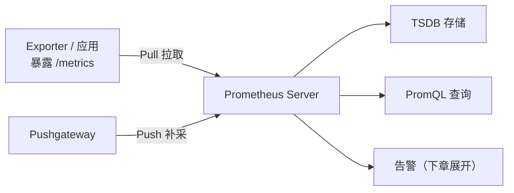

# 云原生监控与日志本章小结：Prometheus、Grafana 与日志成本优化

本章主要讲了服务运营和可观测性的两个点——**监控和日志**。其中监控包括 Prometheus 和 Grafana 的内容，日志主要是云原生日志服务及其成本优化。下面把全章收一遍口。

## 纲要

- Prometheus 架构三核心：采集器、TSDB、API/告警
- 采集模型：Pull 为主，Pushgateway 补 Push
- 动态服务发现 + PromQL 查询
- 四种指标类型：Counter / Gauge / Histogram / Summary
- Grafana：200+ 插件与可视化
- 日志成本优化：源头减量、精简索引、低频存储

## Prometheus 架构三核心

回顾 Prometheus 的架构图，核心部分就三块：**数据采集器、时序数据库（TSDB）、以及提供查询 / 告警等功能的 API Server**。



- **采集器**：默认以 **pull（轮询 `/metrics`）** 的方式拉取指标接口；但对于短生命周期任务或无法被主动拉取的服务，可以用 **Pushgateway** 支持 push 方式；
- **新服务**可以引入 `prometheus_client` SDK 生成指标接口和数据；
- 针对现有产品和系统，有大量 **exporter** 把它们的指标数据导出来。

## 动态服务发现

Prometheus 除了静态抓取指标接口，还支持**动态服务发现**——结合 K8s 的服务发现能力，可以把 K8s 的核心组件（kubelet、节点、Service、Pod 等）的各种指标数据都采集上来。这意味着你不用写死一堆 target，集群扩缩容时抓取目标会自动跟着变。

## PromQL 与告警

数据的查询要重点看 **PromQL**——它类似 SQL 一样用于对指标做查询和计算。告警功能本章做了引子，下一章（监控及告警）会重点展开。

## 四种指标类型

Prometheus 的指标类型务必记牢，这也是考试常考点：

| 类型 | 含义 | 典型场景 |
| --- | --- | --- |
| **Counter** | 单调递增计数器（只增不减） | 请求总量、错误累计、接口调用次数 |
| **Gauge** | 可增可减的瞬时值 | 内存占用、在线连接数、温度 |
| **Histogram** | 直方图，按桶统计分布 | 请求延时分布、响应大小 |
| **Summary** | 摘要，计算分位数 | 请求耗时 P50/P95/P99 |

> 四类指标的典型应用场景（如上表）是复习重点，具体分位计算语义**建议以官方文档为准**。

本章还在实战项目里引入了 Prometheus SDK，导出了一个指标数据——这部分"一看就会"，是把监控真正接进自己服务的第一步。

## Grafana：200+ 插件的可视化

关于云原生的图表服务 Grafana：它有 **200 多个插件**，可以把各种不一样的数据源接入进来，还有大量表现形式的组件，非常方便配置出各种可视化仪表盘。只要你需要把数据可视化呈现，用 Grafana 基本就足够了。

如果碰到比较复杂的数据加工、或没有现成的数据源插件，推荐用 **SimpleJSON 插件**——通过自定义编程几行代码，就可以把数据集塞进 Grafana。

## 日志服务与成本优化

云原生的日志服务与成本优化：大家几乎每天都会见到程序日志，处理看似不难；但**海量数据 + 分布式系统 + 容器化部署 + 微服务架构**叠到一起时，日志处理就变得非常棘手。对比 AWS 那套需要很多流程和工序才能搞定的方案，云厂商的日志服务已经把整套方案做成云服务，用起来很简单。

但日志成本一般很高（数据量大，流量、索引、存储都会增加费用）。成本优化的基本抓手：

| 抓手 | 做法 |
| --- | --- |
| **源头减量** | 从源头减少日志生成（不该打的日志不打） |
| **精简索引** | 能不用全文索引就不用，能精简就尽量精简 |
| **低频存储** | 利用低频存储大幅降低存储成本 |

```dir
本章可观测性内容结构
├── 监控（Prometheus + Grafana）
│   ├── 架构三核心：采集 / TSDB / API
│   ├── 采集：Pull + Pushgateway + Exporter
│   ├── 动态发现：结合 K8s 服务发现
│   ├── PromQL 查询
│   ├── 四类指标：Counter/Gauge/Histogram/Summary
│   └── Grafana：200+ 插件 / SimpleJSON 扩展
└── 日志（云原生日志服务）
    └── 成本优化：源头减量 / 精简索引 / 低频存储
```

## 关于"什么是云原生"的收口

本章最后又呼应了云原生的讨论：核心是**容器化使用**，加上云原生的架构与服务特性（模块化、可观测、可部署、可测试、可替换），满足所有这些才称得上是云原生。

## 总结

本章小结把监控与日志这条线收拢了：

1. **Prometheus 三核心**：采集器（Pull + Pushgateway）、TSDB、API/告警；
2. **动态服务发现**结合 K8s，自动采集核心组件指标；
3. **四类指标必考**：Counter（递增）、Gauge（可增减）、Histogram（直方图）、Summary（分位数）；
4. **Grafana 可视化简便**：200+ 插件，缺插件可用 SimpleJSON 自定义；
5. **日志成本三抓手**：源头减量、精简索引、低频存储；
6. **云原生判定回扣**：容器化 + 架构/服务特性，才称得上云原生。
