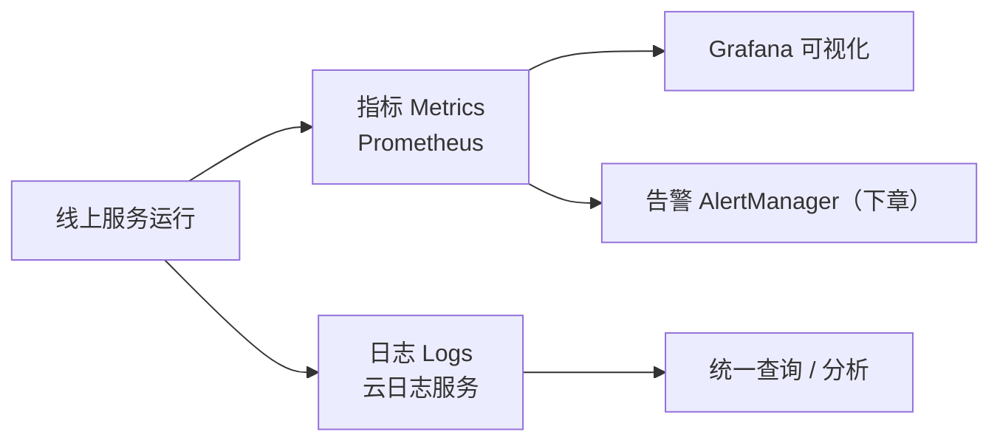

# 云原生的监控、告警和日志服务：本章导学

学完前面的课程，我们已经掌握了 K8s 以及 gRPC 的底层原理，也能设计、开发、测试、部署自己的服务了。服务上线后的治理，通过 Istio 的流量管控、只改控制平面配置就能实现很多能力；如果再有点自定义开发能力，能做的就更多，而且不只局限于微服务治理。

但微服务不只有"设计 / 开发 / 运维"，还有更长远的一条路——**运营，即持续的线上运营**。这里的"服务运营"不同于业务产品的运营，而是**技术上的服务运营**：实时掌控线上服务的状况，问题发生前能运营预警，问题发生时能马上知道并快速修复。本章就把这部分内容补充完整。

## 纲要

- 服务运营 = 技术运营，属于可观测性范畴
- 监控：Prometheus 采集指标 + 自定义指标接入
- 可视化：Grafana 多数据源与报表
- 日志：云原生日志服务统一采集容器日志
- 成本：日志服务的成本优化

## 服务运营与可观测性

本章涉及服务运营的两个方面——**监控**和**日志**，它们都属于"可观测性（Observability）"的范畴。前面讲 Istio 时其实也用到了这方面的能力，本章会专门把相关的云原生服务和产品讲透。

可观测性的目标很朴素：让线上服务的运行状况**尽在掌握**——异常发生前能预警，发生后能第一时间知道并修复。



## 监控：Prometheus

云原生的监控服务 Prometheus，不仅能简单快捷地采集市面上各大主流产品的指标数据，也很容易接入到我们自己的服务中。我们微服务运行时有一些自定义数据（比如后端登录接口的调用次数、文件上传延时统计、接口调用报错统计等），也可以整合进 Prometheus。

有了丰富的监控指标和数据，就能全面了解线上微服务的运行状况，也能做好事件预警、提前发现问题。

## 可视化：Grafana

为了把指标数据更好地展现出来，可以用云原生的图表服务 **Grafana**。它支持很多种数据源——Prometheus 只是其中一种，甚至**自定义接口也可以作为 Grafana 的数据源**。

在 Grafana 管理后台，可以快速配置出各种报表：表格、折线图、饼状图、柱状图等表现形式的组件都非常方便。而且 Grafana 的报表不仅能自己在后台查看，还可以把页面分享、嵌入到我们自己开发的产品和管理后台中——只要控制好权限，就能让不同角色的人查看不同的报表。

## 日志：云原生日志服务

一旦服务出现异常或特殊情况，需要分析和排查问题时，还是要靠日志。云原生的日志服务可以帮我们把容器里的日志提取到统一的管理中心：不用再操心分布式日志怎么采集，也不用担心容器里程序的标准输出日志和文件日志要怎么采集。

通过云原生的日志服务，只需简单配置，就能把这些问题通通搞定，之后只在控制台享受快速的日志查询和分析即可。当然，**这也是有代价的**：日志的数据量一般都会很大，成本也会随着数据量上升。

## 成本：日志服务的成本优化

正因为日志量大、成本高，本章专门讲了日志服务的成本优化，希望能帮到大家。核心思路是从"源头"和"存储/索引"两端下手，后面小结会展开具体抓手。

## 本章技术组件一览

把本章涉及的可观测性组件与其职责对照一下，方便建立全局视图：

| 组件 | 角色 | 解决什么 |
| --- | --- | --- |
| Prometheus | 指标采集与存储 | 采集主流产品 + 自定义业务指标 |
| Grafana | 可视化图表 | 多数据源、丰富报表、可嵌入 |
| 云日志服务 | 日志采集与检索 | 统一收集容器标准输出 / 文件日志 |
| 成本优化策略 | 控费 | 源头减量、精简索引、低频存储 |

```dir
本章可观测性组件
├── 监控
│   ├── Prometheus（采集 + 存储指标）
│   └── 自定义指标（prometheus_client 接入）
├── 可视化
│   └── Grafana（多数据源 / 报表 / 嵌入）
└── 日志
    ├── 云日志服务（统一采集与查询）
    └── 成本优化（减量 / 精简索引 / 低频存储）
```

## 为什么这部分重要

监控和日志结合，才构成完整的可观测性闭环：监控告诉你"系统现在什么样"，日志告诉你"刚才发生了什么"。二者配合，服务运营才真正从"被动救火"走向"主动掌控"。

## 总结

本章导学把"服务运营"这块拼图摆上了台面：

1. **服务运营是技术运营**，属于可观测性，目标是实时掌控、提前预警、快速修复；
2. **Prometheus 做监控**：既能采主流产品指标，也能接自定义业务指标；
3. **Grafana 做可视化**：多数据源、丰富图表、可嵌入自有后台；
4. **云原生日志服务做日志**：统一采集容器标准输出与文件日志，控制台即查即分析；
5. **日志有成本代价**：数据量大，所以本章专门讲成本优化；
6. **监控 + 日志 = 可观测闭环**，是从被动救火到主动掌控的关键。
