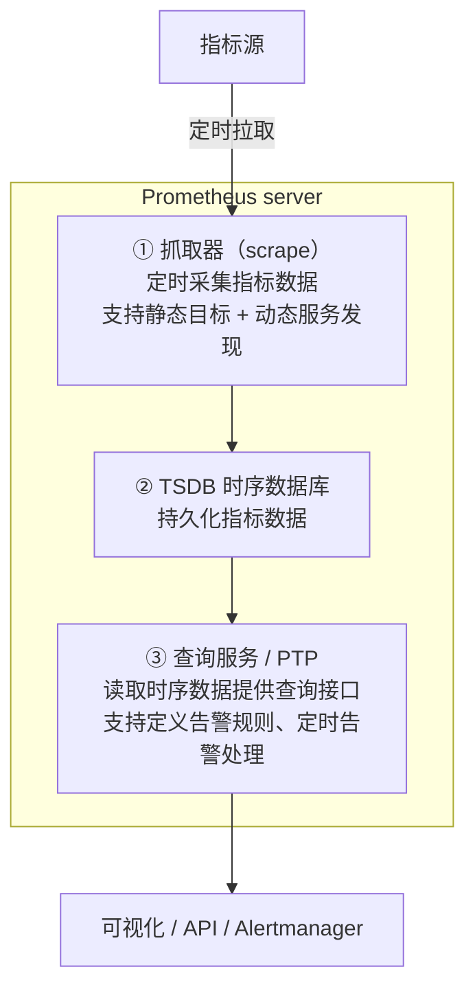
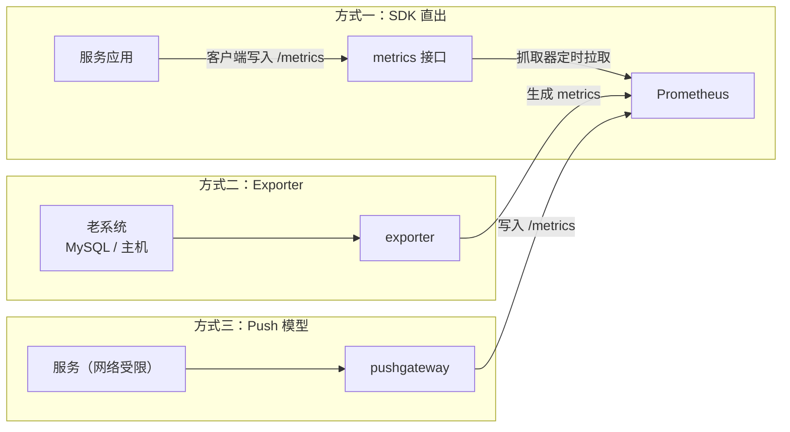
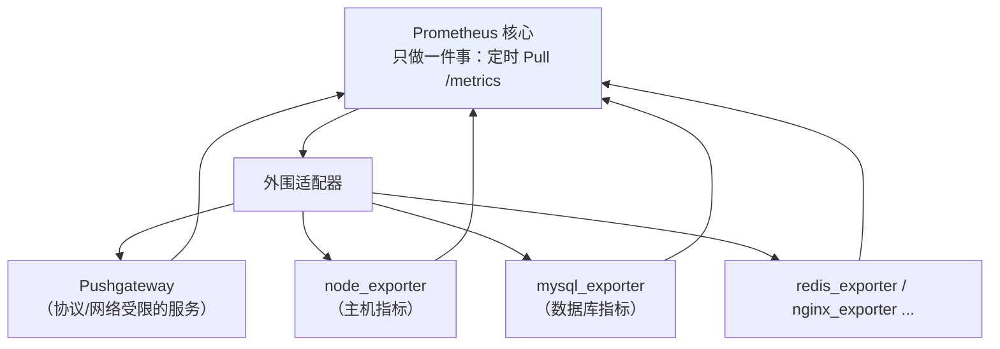
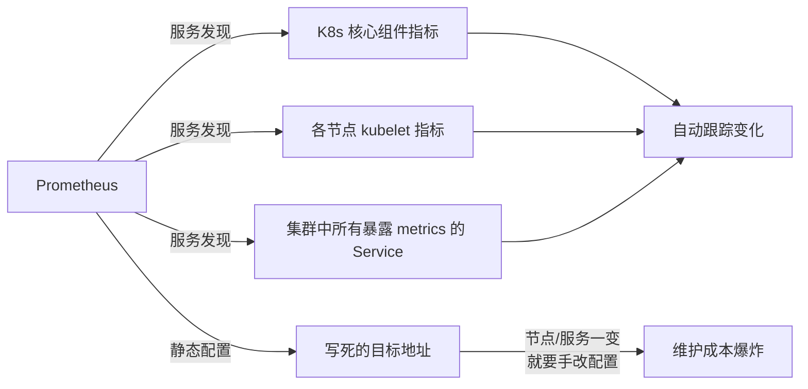
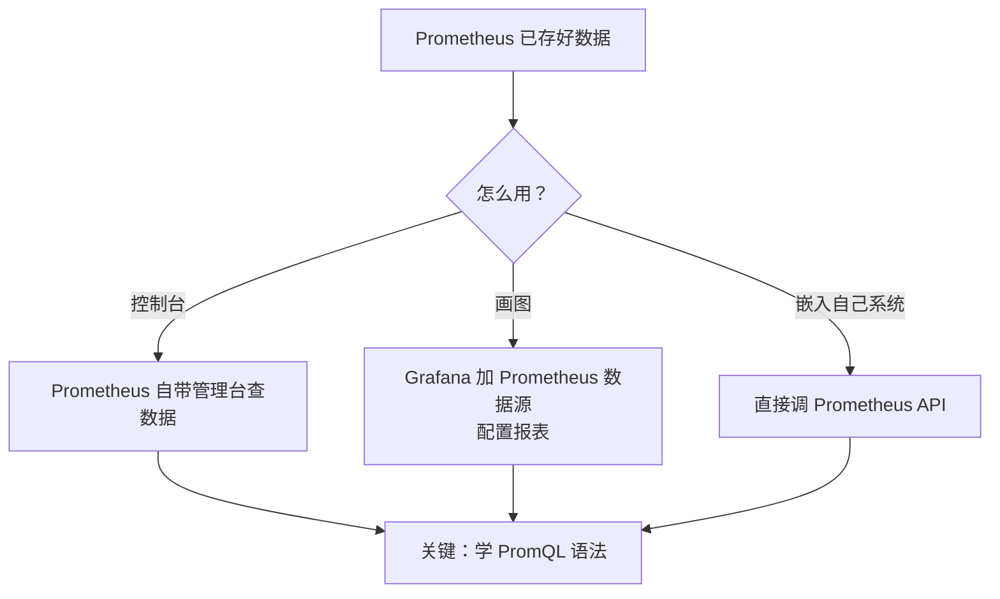
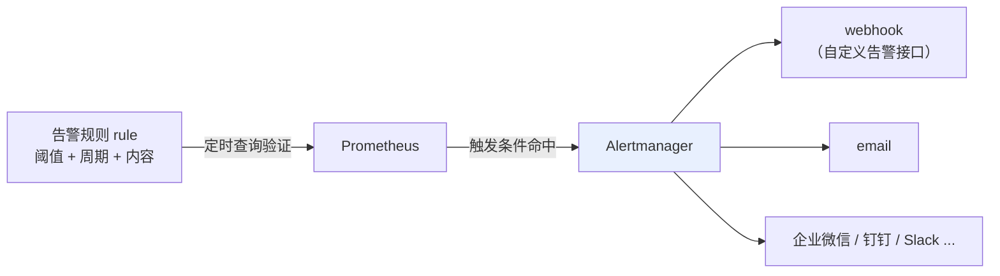

# Kubernetes 认证考点: 云原生的 Prometheus 架构、四种指标类型与 PromQL 查询

Prometheus 的作用和功能特性已经不用介绍了 —— 它是行业标杆，家喻户晓。

结论：**Prometheus 的 server 只有三块：抓取器（scrape）、时序数据库（TSDB）、查询服务（含告警规则）。它核心只支持 Pull 模型，靠 Pushgateway 和各类 Exporter 这两个"适配器"把老系统接进来 —— 这是典型的适配器模式，值得抄到自己的系统设计中。**

## 纲要

- Prometheus server 的三块结构
- 数据采集的三种方式：SDK / Exporter / Pushgateway
- Pushgateway 与 Exporters 是适配器模式
- 动态服务发现：为什么必须用它
- 四种指标类型：Counter / Gauge / Histogram / Summary
- PromQL：匹配运算符、区间向量、rate/irate 与聚合函数
- 告警链路：rule → Alertmanager → webhook / email
- 竞品对比与云上托管

## Prometheus server 就三块

从架构图看，Prometheus 结构非常简单清晰。server 包括三部分：



- **第一块是 scrape，就是抓取器**，供给各个服务应用程序的指标数据，它会定时采集数据，**支持静态的目标和动态的服务发现**两种；
- **第二块是 TSDB，时序数据库**，用来持久化保存指标数据的数据库 —— 也可以存储在本地文件，可以存储在远程的分布式文件系统或者云厂商的 COS 产品中；
- **第三块是查询服务**，可以读取时序数据库中的指标数据提供给外部的查询接口，**也支持定义告警规则，定时进行告警处理**。

一个 Prometheus 进程在集群里的实际形态大致是这样：

```text
prometheus-0 (单 Pod，通常配 StatefulSet)
├── /etc/config/prometheus.yml        # 抓取配置 + 告警规则文件
├── /etc/config/recording_rules.yml   # 预计算规则，降查询成本
├── /data                             # TSDB 本地目录（emptyDir 会被丢，PVC 才留下）
└── 端口
    ├── 9090  对外：UI / API / PromQL
    ├── 1090  Alertmanager 之外不常开（config_reloader 用）
    └── 8000  Prometheus 自身的健康与指标（go_*, process_*）

被抓的对象：
├── kubernetes pods/                 # kubernetes_sd_configs 自动发现
│   ├── 业务 Pod（/metrics，自带探针/埋点）
│   ├── cAdvisor（容器 CPU、内存、网络）
│   ├── kube-state-metrics（Deployment/ReplicaSet/节点状态）
│   └── kubelet（node_cpu_seconds_total 这类节点指标）
├── 其他 Prometheus（联邦 / 跨集群聚合）
└── Pushgateway（短任务主动推，Pull 摸不到）
```

这里有个很容易踩的点：**`/data` 目录用 `emptyDir` 的话，Pod 一重启指标全丢**。生产上要么挂 PVC，要么用 `remote_write` 把数据发到远程存储，让容器本身变成无状态。

## 数据采集：三种方式

架构图的左侧是数据采集。



**大部分的服务应用程序都会使用 Prometheus 的客户端，把指标数据直接写入到 metrics 接口中，然后通过抓取器来定时拉取的方式来采集。**

如果是一些老的产品，比如 MySQL 服务器、主机的，**如果内置接入 Prometheus 的客户端，它还开发了很多的 exporters，通过这些 exporters 来获取像 MySQL 或者服务器主机的相关指标，然后抓取 exporters 生成的 metrics 就可以了**。

如果你的程序因为网络原因或者别的原因不能使用 pull metrics 的方式，**也可以使用 push metrics 的方式 —— 不过 push 方式需要再部署一个中间件 pushgateway，服务的指标数据获取到 pushgateway，然后 pushgateway 还是会把数据写入到 metrics 接口，由 Prometheus 服务来抓取。**

### 这就是适配器模式

**看到 Prometheus 服务的抓取器的设计模式了吗？它本身只支持 pull metrics，但是它的外围存在 pushgateway 和 exporters，就可以把更多的现有产品接进来，也可以支持 push metrics 的方式，这就是典型的适配器模式 —— 通过外围的各种适配器把 Prometheus 的能力扩展到已有的各种产品和服务。**



> **做系统设计时可以照抄这一招：把系统的核心功能做得尽量简单可靠，把扩展性的能力放在外围来实现 —— 通过更多的外围系统来扩展和丰富系统，而不用改动系统的核心。**

## 动态服务发现：少了它工作量爆炸

架构图的上部是动态的指标采集，**可以支持 K8s 的服务发现：不仅可以采集 K8s 集群核心组件的运行指标，也可以通过服务发现采集到每个节点的 kubelet 上的指标，还可以采集 K8s 集群中所有暴露 metrics 的 service。**



**如果像静态的方式，一个个采集集群的节点数据、配置每一个需要采集的服务，工作量实在是太大了，扩展性也会很差。通过服务发现的动态采集能力，就可以随时跟踪集群的节点变化、集群中 Service 的变化，动态地发现和采集它们的指标数据。**

## 使用方式：查询、可视化、导出

数据采集了也存储了，接下来就是使用。**最常用的就是通过接口查询，把指标数据可视化展现出来，或者导出到外部应用程序中。**



**这里的关键就是要学习一下 PromQL 的语法 —— 像 SQL 一样，对指标数据进行查询和计算。**

## 四种数据类型

先看一下 Prometheus 数据类型。下面三行就是一个典型的指标数据：

```text
http_requests_total{code="200",method="GET"}  18432
http_requests_total{code="500",method="GET"}     128
go_goroutines{job="usergrow"}                    42
```

- 最前面是指标名称，大括号里面是指标的属性和值，**有点像 JSON 格式**；
- 最后的数字是这个指标当前的具体值。

**Prometheus 的 SDK 会把所有的指标数据都缓存在应用程序中，每次请求 metrics 接口来采集数据的时候，就会把所有的指标数据以纯文本的形式输出。服务端拿到这些数据之后，给他们加上一个时间戳，就保存为这个时刻的指标数据了。**

四种类型：

| 类型 | 特点 | 典型用途 |
| --- | --- | --- |
| **Counter** | **递增的计数器**，只有递增和归零（重启） | 接口总请求次数、总错误数 |
| **Gauge** | **可任意增减**，可设成指定值 | 服务当前内存量、当前连接数 |
| **Histogram** | **直方图**，观察指标在不同区间的分布 | 请求耗时分布、响应大小分布 |
| **Summary** | **摘要**，直接存储分位数 | 中位数、P95、P99 直接可读 |

> Histogram 与 Summary 的区别：**Histogram 存的是各桶（bucket）的计数，查询分位数要算；Summary 直接存储的就是百分位数，查询不需要计算就能看到样本的中位数。** 两者都常用来统计接口的请求耗时和响应大小。

**Histogram 和 Summary 可以用来统计接口的请求耗时和响应大小等指标。**

## PromQL：配置与查询

**Prometheus 要采集服务的指标数据需要配置在 `target` 属性中，只需要配置要采集的服务可访问的地址和端口或者 IP 和端口，它会默认采集这个站点下的 metrics 指标。**

```yaml
# prometheus.yml（抓取配置片段）
scrape_configs:
  - job_name: 'usergrow'
    static_configs:
      - targets: ['usergrow.usergrow.svc.cluster.local:8080']
  - job_name: 'kubernetes-nodes'
    kubernetes_sd_configs:          # ← 动态服务发现
      - role: node
  - job_name: 'kubernetes-pods'
    kubernetes_sd_configs:
      - role: pod
    relabel_configs:
      - source_labels: [__meta_kubernetes_pod_annotation_prometheus_io_scrape]
        action: keep
        regex: true
```

查询指标：

```promql
# 直接取某个指标
http_requests_total

# 用一对大括号加属性限定
http_requests_total{job="usergrow", method="GET"}

# 匹配运算符：等于 / 不等于 / 正则
http_requests_total{code!="200"}
http_requests_total{code=~"5.."}

# 区间向量过滤器：加时间范围，比如 1 分钟
http_requests_total[1m]

# 数字操作符与逻辑操作符：+ - * / and or unless
http_requests_total / on(job) job_requests_total
http_requests_total{code="200"} * 60
```

聚合与增长率：

```promql
# 使用 sum / avg 等函数聚合
sum(rate(http_requests_total[1m]))
avg(http_requests_total{code="200"})

# Counter 是递增的，要看它的增长率用 rate 或者 irate
#  计算 metric1 每分钟的增长率
rate(metric1[1m])
irate(metric1[1m])

# Gauge 类型（CPU / 内存使用量）用 sum / avg 等直接聚合
sum(node_cpu_seconds_total)
avg(memory_usage_bytes{job="usergrow"})
```

**如果要在图形界面上展示指标数据的折线/曲线图，比如 metric1 是一个递增的计数器，要看它的增长率，就可以使用 rate 或 irate 函数；如果指标是 gauge 类型，比如服务的 CPU、内存使用量，就用 sum/avg 等函数来聚合指标数据。**

一句话记牢：**Counter 看变化用 `rate`，Gauge 看绝对值直接聚合。**

## 告警链路

最后一块内容就是告警。**在 Prometheus 中可以配置告警的后端服务 alertmanager，也可以在 Prometheus 里面设置告警规则 —— 设置告警的指标阈值、周期和内容，比如服务的协程数量超过三个就要触发告警，查询周期是一分钟，同时设置相应的告警内容。**

**Prometheus 会定时查询和验证相应的告警规则，如果触发了指定的条件，就会把这个告警信息获取到 alertmanager 服务；而 alertmanager 中呢会设置相应的告警渠道，比如 webhook、email —— 通过 webhook，咱们自己开发的告警接口，就可以实现自定义的告警通知，还有更多的通知渠道。**



```yaml
# rules.yml
groups:
  - name: usergrow
    rules:
      - alert: GoRoutineTooMany
        expr: go_goroutines{job="usergrow"} > 3      # 协程数超过三个
        for: 1m                                      # 查询周期一分钟
        labels:
          severity: warning
        annotations:
          summary: "服务协程数过高"
          description: "usergrow 协程数超过 3，请检查是否有泄漏"
```

## 竞品对比

| 产品 | 定位 | 关键点 |
| --- | --- | --- |
| **InfluxDB** | 时序数据库 | **可作为一个中心化的存储服务**，商业版本支持集群化部署，扩展性更好；Prometheus 也可以把数据保存到 InfluxDB |
| **OpenTSDB** | 基于 HBase 的分布式时序库 | 基于 Hadoop/HBase，**数据规模巨大的长期存储更合适** |
| **PagerDuty（文中 Nagios 系）** | 事件处理平台 | **没有标签或查询语言的概念**，是一个可观测性管道，专注把可观测性数据作为流处理 + 报警事件，可扩展地过滤、聚合、转型和处理 |
| **Prometheus** | 指标监控 | 有标签（label）+ PromQL，**在告警规则的范围上与同类类似，但事件处理能力不如专业事件平台** |

**Prometheus 有很多的 exporters，它们可以把现有系统的指标导出来方便集成进 Prometheus —— 像常见的数据库、服务器、存储、Web 服务、持续集成和管理系统、日志、消息队列等等；当然更多的服务只是加上 Prometheus 的 SDK，就可以把很多指标暴露出来集成进去。**

## 云上托管

**Prometheus 作为指标监控的标杆产品，在各大云厂商的服务市场都是最基础的服务了 —— 就像租用服务器、云数据库一样，可以直接在云上采购和使用 Prometheus 服务。** 它既可以方便简洁地和云容器服务一起用起来，也可以作为独立的指标监控服务。

云上的 Prometheus **不仅仅是一个操作服务，同时还是一个 SaaS 服务**：很多功能都可以通过 API 来使用，同时也能在控制台页面上直接操作。它做到**开箱即用、没有运维成本**，而且有厂商提供的高可靠性服务承诺；还支持很多插件，像 alertmanager 和各种 exporter。

**云上 Prometheus 也有支持分布式的版本，可以有更好的性能，会比自己折腾的运维更加省心省力。**

## API 速览

| 能力 | 配置 / 函数 |
| --- | --- |
| 抓取目标 | `scrape_configs[].static_configs[].targets` |
| 动态发现 | `scrape_configs[].kubernetes_sd_configs[]`（`role: node/pod/service`） |
| 保留标签 | `relabel_configs[]`（`source_labels` / `action` / `regex`） |
| 默认采集路径 | `/metrics` |
| 即时查询 | `http://<prom>/api/v1/query?query=<promql>` |
| 区间查询 | `/api/v1/query_range` |
| 指标类型 | `counter` / `gauge` / `histogram` / `summary` |
| 匹配运算符 | `=` / `!=` / `=~` / `!~` |
| 区间向量 | `metric[1m]` |
| Counter 增长率 | `rate(metric[1m])` / `irate(metric[1m])` |
| Gauge 聚合 | `sum()` / `avg()` |
| 存储后端 | 本地文件 / 远程分布式 FS / 云对象存储（TSDB） |
| 告警 | `rules.yml` 的 `alert` / `expr` / `for` / `labels` / `annotations` |
| 告警路由 | Alertmanager：webhook / email / 三方渠道 |

## Demo 示例

以这个系列要监控的 usergrow 服务为例。

```bash
# ---------- 1. 看一个 Pod 暴露的 /metrics 长什么样
$ curl -s http://usergrow.usergrow.svc.cluster.local:8080/metrics | head -5
# HELP http_requests_total Total number of HTTP requests.
# TYPE http_requests_total gauge
http_requests_total{code="200",method="GET"} 18432
http_requests_total{code="500",method="GET"} 128
go_goroutines{job="usergrow"} 42
# ↑ 纯文本输出，SDK 把指标缓存在内存里，scrape 时整份吐出

# ---------- 2. 用 PromQL 抓增长率（Counter 必须 rate）
$ curl -s 'http://prometheus:9090/api/v1/query?query=rate(http_requests_total%5B1m%5D)' | python3 -m json.tool
{
  "status": "success",
  "data": {"resultType": "vector", "result": [
    {"metric": {"job": "usergrow"}, "value": [1759411200.123, "3.2"]}
  ]}
}

# ---------- 3. Gauge 直接聚合（不加 rate）
$ curl -s 'http://prometheus:9090/api/v1/query?query=sum(go_goroutines)' | python3 -c \
    "import json,sys; d=json.load(sys.stdin); print(d['data']['result'][0]['value'])"
[1759411200.123, '156']

# ---------- 4. 配一个告警规则
$ kubectl apply -f - <<'EOF'
apiVersion: monitoring.coreos.com/v1
kind: PrometheusRule
metadata: {name: usergrow-rules}
spec:
  groups:
    - name: usergrow
      rules:
        - alert: GoRoutineTooMany
          expr: go_goroutines{job="usergrow"} > 3
          for: 1m
          labels: {severity: warning}
          annotations:
            summary: "服务协程数过高"
EOF

# ---------- 5. 确认抓取目标已经自动发现
$ curl -s 'http://prometheus:9090/api/v1/targets' | python3 -c "
import json,sys
d = json.load(sys.stdin)['data']['activeTargets']
for t in d[:5]:
    print(f\"{t['labels'].get('job',''):28s} {t['scrapeUrl']:52s} {t['health']}\")
"
usergrow                http://10.96.42.17:8080/metrics   up
kubernetes-nodes        http://10.0.0.31:9100/metrics     up
```

**判据**

| 观察点 | 结论 |
| --- | --- |
| `/metrics` 输出是纯文本 key-value | SDK 缓存 + scrape 时整份吐出 |
| Counter 指标上 `rate()` 才有意义 | 直接 `http_requests_total` 看不出速度 |
| Gauge 指标 `sum/avg` 即可 | 加 `rate` 无意义 |
| Targets 里自动出现新 Pod 地址 | 动态服务发现生效 |

### 总结

Prometheus 的价值在于**把"监控"这件事拆成了极简的核心 + 丰富的外围**：核心 server 只做"定时 Pull `/metrics`、存 TSDB、提供查询"，扩展全靠 Pushgateway、各类 Exporter、K8s 服务发现这些外围适配器。这套**适配器模式很值得抄 —— 核心保持简单可靠，扩展性放在外围**。

落地的三个必记点：

1. **采集三选一**：新服务用 SDK 拉 `/metrics`；老系统（MySQL、主机）用 Exporter；网络受限走 Pushgateway。
2. **必须开动态服务发现** —— 静态配置在 K8s 里根本维护不动，节点和 Service 一直在变。
3. **指标类型决定 PromQL**：Counter 求速率用 `rate/irate`，Gauge 直接 `sum/avg`，耗时分布用 Histogram/Summary。

告警是两段式：**Prometheus 只负责"发现异常并推送"（rule → Alertmanager），渠道配置在 Alertmanager 里（webhook / email / 企微钉钉）**。要自定义通知就写个 webhook 接口挂上去。

生产上直接买云厂商的托管 Prometheus —— 开箱即用、有 SLA、有分布式版本，比自己运维省心得多。

