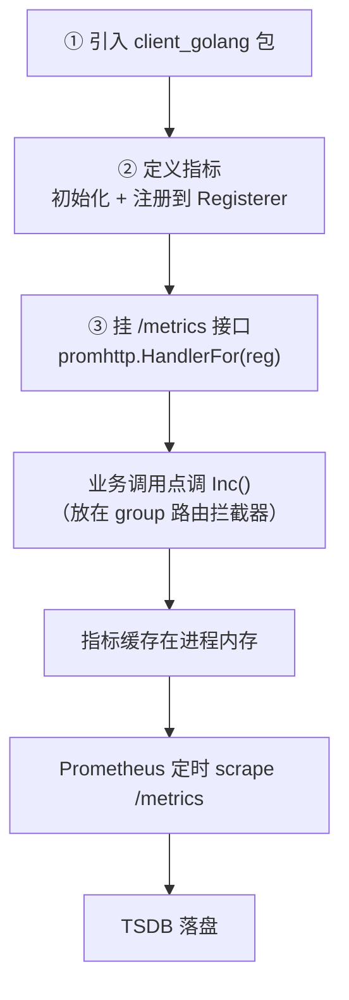
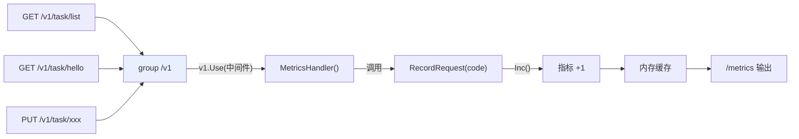
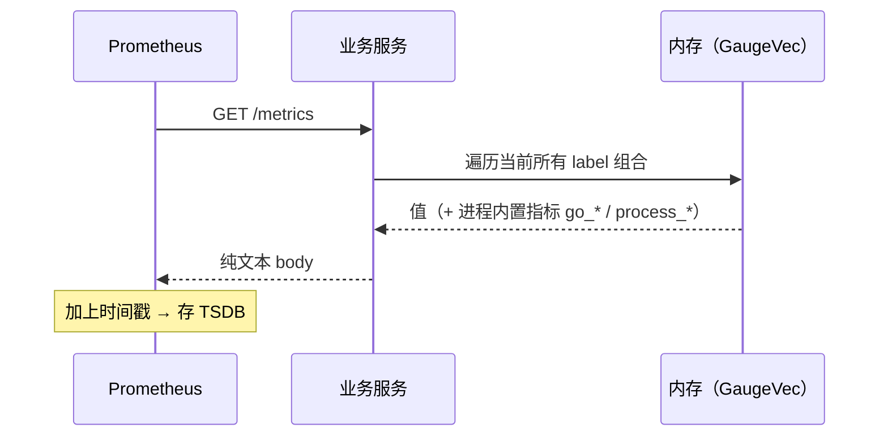

# Kubernetes 认证考点: 用 prometheus client SDK 把自定义指标接进服务

Prometheus 的核心能力是采集，但"哪些指标算数"得业务自己定义。

结论：**Go 服务接入只需三步 —— 引入 `client_golang`、定义并注册指标、把 `promhttp` 挂出一个 `/metrics` 接口；然后在业务调用点（一般是路由组拦截器里）调一次 `Inc()` 记录。之后 Prometheus 抓这个接口就能拿到你的自定义指标。**

## 纲要

- 接入三步走
- prometheus.go：指标定义 + 初始化 + 记录
- Gauge 与 Counter 的取舍
- 用 group 路由拦截器统一埋点
- 验证：日志 + `/metrics` 输出

## 三步走

**第一步需要引入它的 Go 客户端；第二步需要定义服务中的指标，对指标进行初始化和注册；第三步把 Prometheus 数据导出 HTTP 接口，也就是一个 `/metrics` 接口。** 完成这三步，就可以把项目中的自定义指标集成到 Prometheus 服务中了。



## 第一步目录准备

先进入到 manager 这个目录，**这个目录里面已经把相关的文档和代码都写好了**。

```text
manager/
├── prometheus.go        # 自定义指标（本文重点）
├── metrics.go           # 接口输出 / 中间件
└── ...
```

先看 `prometheus.go`，**这个文件里面已经做了一些代码的封装，需要引入 client_golang 的一些包**。

## 第二步：定义指标

**我们这里只定义了一个 `http_requests` 指标，它是 gauge 类型的指标，然后下面封装了两个方法：一个是指标初始化，一个是指标数据的记录方法。**

### 指标初始化

```go
package manager

import (
	"github.com/prometheus/client_golang/prometheus"
)

// HTTPRequests 自定义指标：HTTP 请求数。
// 类型选 Gauge —— 后面会解释为什么。
var HTTPRequests *prometheus.GaugeVec

// InitMetrics 指标初始化：把指标实例化创建出来。
func InitMetrics() {
	// 需要一个指标注册器，注册器有了之后，再创建这个指标
	registry := prometheus.NewRegistry()

	// 这里创建的 gauge 指标里设置了 namespace、subsystem 和 name，
	// 这三个值会用下划线分隔，最后联合起来成为一个指标名字
	HTTPRequests = prometheus.NewGaugeVec(
		prometheus.GaugeOpts{
			Namespace: "usergrow",
			Subsystem: "http",
			Name:      "requests_total",
			Help:      "Total number of HTTP requests.",
		},
		// 静态标签：固定会带上
		[]string{"code"},
	)

	// 把指标加入到注册器里面
	registry.MustRegister(HTTPRequests)

	// 最后使用 gin 框架生成一个接口 metrics，
	// 这个接口需要用到 Prometheus 的一个 handler 参数，需要把注册器放进去
	// （见 metrics.go）
	MetricsRegistry = registry
}
```

几个要点：

- **指标名字由 `namespace_subsystem_name` 拼成**：这里最终就是 `usergrow_http_requests_total`；
- **`NewGaugeVec` 是一个向量型的指标，可以支持动态的标签和值** —— 静态的标签和值写在定义里，动态的呢可以加参数进去，**比如请求的方法名、请求的地址、请求的服务器等信息，把它们动态加进去就可以生成更加详细的指标了**；
- **最后要把这个指标加入到注册器里面。**

### 指标记录方法

```go
// RecordRequest 记录一次请求：把指标加一。
// 这个方法挂在 gin 的 group 路由上，每一次调用都会走到。
func RecordRequest(code string) {
	if HTTPRequests == nil {
		return
	}
	HTTPRequests.WithLabelValues(code).Inc()
	// ↓ 下面这段不是必须的，只是方便调试，输出一条日志
	//  每一个请求进来都会打印指标的详细信息
	// （标签、指标值等）
}
```

**关于指标的记录，每一次 gRPC 服务方法调用的时候需要对请求数加一。对于这个指标呢，它只是加一只是递增的操作 —— 大家想一想，是否用 counter 类型也非常合适？但是用 gauge 类型可以实现这种递增加一，它可以实现设置为指定值，会比 counter 更灵活。当然具体的类型还是要根据实际的需求来选择。**

| 维度 | Counter | Gauge |
| --- | --- | --- |
| 语义 | 只增不减（重启归零） | 可增可减、可设定值 |
| `rate()` | 有意义 | **无意义** |
| 适合 | 累计量：请求总数、错误总数 | 瞬时量：内存、连接数、当前队列长度 |
| 灵活度 | 低 | **高（可直接 `Set` 到指定值）** |

本例选 Gauge 的理由：**将来可能要按业务规则 `Set` 一个绝对值（比如"当前待处理任务数"），Counter 做不到。** 如果确定永远是单调递增，用 Counter 语义更清晰、查询也更简单。

### 第三步：把指标导出成 /metrics 接口

```go
package manager

import (
	"net/http"

	"github.com/gin-gonic/gin"
	"github.com/prometheus/client_golang/prometheus/promhttp"
)

// MetricsRegistry 存放指标注册器
var MetricsRegistry *prometheus.Registry

// RegisterRoutes 注册指标相关的路由
func RegisterRoutes(r *gin.Engine) {
	// 这里用到 Prometheus 的 handler，把注册器放进去
	r.GET("/metrics", promhttp.HandlerFor(MetricsRegistry,
		promhttp.HandlerOpts{}).ServeHTTP)
}

// MetricsHandler gin 包装，方便直接挂中间件链
func MetricsHandler() gin.HandlerFunc {
	h := promhttp.HandlerFor(MetricsRegistry, promhttp.HandlerOpts{})
	return func(c *gin.Context) {
		// 对于不需要采集的（比如 /metrics 自身）直接放过
		if c.Request.URL.Path == "/metrics" {
			c.Next()
			return
		}
		h.ServeHTTP(c.Writer, c.Request)
	}
}
```

## 用 group 路由拦截器统一埋点

**下面这一段代码其实不是必须的，它只是为了方便调试，要输出一个日志；每一个请求进来，这里做了一个指标的处理，然后输出一个日志。哪里调用这个方法呢？我们把它放到了 group 路由的 v1 目录。**

```go
func RegisterV1Routes(r *gin.Engine) {
	v1 := r.Group("/v1")
	{
		v1.Use(manager.MetricsHandler())   // ← 跨域的处理同理，它就是个中间件
		// 每一次调用到 v1 目录，当然也包括 v1 目录上面的所有路由，
		// 咱们的服务方法都会包含这个 group 目录，所以都会调用一次
		// RecordRequest，这样就把 Prometheus SDK 集成到服务里了
		v1.GET("/task/list", ListTask)
		v1.GET("/task/hello", Hello)
	}
}
```

**每一次调用到 v1 目录的时候，当然也包括 v1 目录上面的所有路由、附加在 v1 上的所有服务方法，都会包含这个 group 目录，所以都会调用一次指标记录方法。这样的话，我们就把 Prometheus SDK 集成到服务里面了。**



> **挂 group 而不是挂单个 handler** 是这里的关键技巧：以后往 `/v1` 下加多少路由都自动统计，不用逐个改。

## 验证

**最后我们来验证一下：先把这个服务启动起来，然后调用一个接口，调用了一次，来看一下日志。这地方每一次调用都会输出一个日志，指标的详细信息都会打印出来，包括标签、指标值等。**

```bash
# ---------- 1. 启动服务并调用一次
$ curl -s http://localhost:8080/v1/task/hello > /dev/null
$ curl -s http://localhost:8080/v1/task/list > /dev/null

# ---------- 2. 看服务日志（每次调用都打印指标明细）
$ tail -2 app.log
[metrics] http_requests{code="200"} -> 1
[metrics] http_requests{code="200"} -> 2

# ---------- 3. 抓 /metrics 接口
$ curl -s http://localhost:8080/metrics | grep usergrow
# HELP usergrow_http_requests_total Total number of HTTP requests.
# TYPE usergrow_http_requests_total gauge
usergrow_http_requests_total{code="200"} 2
go_goroutines 42
#                                      ↑ 框架自带
#                                        ↑ 咱们自定义的指标
```

**再来看一下 metrics 这个接口，它会返回什么呢？它里面有我们自定义的一个指标，也有 Go 运行的一些指标。这个就是我们刚刚自定义的指标。再来看一下它的格式，大家熟悉一下格式。**



## API 速览

| 能力 | API / 字段 |
| --- | --- |
| 客户端库 | `github.com/prometheus/client_golang/prometheus` |
| 向量指标 | `prometheus.NewGaugeVec(GaugeOpts, []string)` |
| 单值指标 | `prometheus.NewGauge` / `NewCounter` / `NewHistogram` |
| 指标三要素 | `GaugeOpts{Namespace, Subsystem, Name, Help}`（下划线拼接成指标名） |
| 注册器 | `prometheus.NewRegistry()` + `registry.MustRegister(...)` |
| 记录-加一 | `metric.WithLabelValues(v...).Inc()` |
| 记录-设定值 | `metric.WithLabelValues(v...).Set(n)` |
| 导出接口 | `promhttp.HandlerFor(registry, promhttp.HandlerOpts{})` |
| gin 挂载 | `r.GET("/metrics", ...)` 或做成 `gin.HandlerFunc` 挂 group |
| 动态标签 | `Vec.With(prometheus.Labels{...})` |

## Demo 示例

完整可跑的最小实现。

```go
package main

import (
	"log"
	"net/http"

	"github.com/gin-gonic/gin"
	"github.com/prometheus/client_golang/prometheus"
	"github.com/prometheus/client_golang/prometheus/promhttp"
)

var (
	reg = prometheus.NewRegistry()

	// GaugeVec：带动态标签 code
	httpRequests = prometheus.NewGaugeVec(
		prometheus.GaugeOpts{
			Namespace: "usergrow",
			Subsystem: "http",
			Name:      "requests_total",
			Help:      "Total number of HTTP requests.",
		},
		[]string{"code", "method"},
	)
)

func main() {
	reg.MustRegister(httpRequests)

	r := gin.New()
	r.Use(gin.Recovery())

	// ③ 暴露 /metrics
	r.GET("/metrics", gin.WrapH(promhttp.HandlerFor(reg,
		promhttp.HandlerOpts{})))

	// 用 group 中间件统一埋点
	v1 := r.Group("/v1")
	v1.Use(func(c *gin.Context) {
		c.Next() // 先跑业务
		code := "500"
		if c.Writer.Status() < 400 {
			code = "200"
		}
		httpRequests.WithLabelValues(code, c.Request.Method).Inc()
		log.Printf("[metrics] http_requests{code=%s,method=%s}", code, c.Request.Method)
	})
	{
		v1.GET("/task/list", func(c *gin.Context) { c.JSON(200, gin.H{"ok": true}) })
		v1.GET("/task/hello", func(c *gin.Context) { c.JSON(200, gin.H{"hello": "world"}) })
	}

	log.Println("listen :8080")
	log.Fatal(http.ListenAndServe(":8080", r))
}
```

```bash
$ go run main.go
$ curl -s localhost:8080/v1/task/hello
$ curl -s localhost:8080/v1/task/list
$ curl -s localhost:8080/metrics | grep usergrow
# HELP usergrow_http_requests_total Total number of HTTP requests.
# TYPE usergrow_http_requests_total gauge
usergrow_http_requests_total{code="200",method="GET"} 2
```

```yaml
# 对应的抓取配置（Prometheus 侧）
scrape_configs:
  - job_name: 'usergrow'
    static_configs:
      - targets: ['usergrow:8080']     # 默认抓该站点的 /metrics
```

**验证清单**

| 检查点 | 期望 |
| --- | --- |
| 日志每次调用打印一条 | 埋点挂在 group 上，覆盖所有子路由 |
| `/metrics` 里有 `usergrow_http_requests_total` | 自定义指标已注册 |
| 同时有 `go_goroutines` 等 | 默认注册器框架指标也在 |
| 连续调用两次值 +2 | `Inc()` 生效，值是 Gauge 语义 |
| Prometheus 抓到后能 `rate()` | Counter 指标才配 rate，Gauge 直接看值 |

### 总结

自定义指标接入 Prometheus 在 Go 里非常轻，就三件事：**定义并注册指标（GaugeVec + Registry）、挂一个 `/metrics` 出口（promhttp）、在调用点 Inc/Set**。

两个工程经验：

1. **埋点挂 group 中间件，不要逐个 handler 加** —— 以后加路由自动统计，省掉重复劳动，也避免漏埋；
2. **指标类型按"将来要不要 Set 绝对值"选** —— 只增不减用 Counter（查询配 `rate` 最顺手），需要任意赋值就 Gauge。别为了省事全用 Gauge，会误导看板的使用方式。

最后别忘了：**SDK 只是把指标缓存在进程内存里，`/metrics` 只是吐文本；真正落盘靠 Prometheus 定时 scrape。** 如果服务有多个副本，每个副本各吐各的，聚合时用 `sum(rate(...))` 而不是直接看总量。

