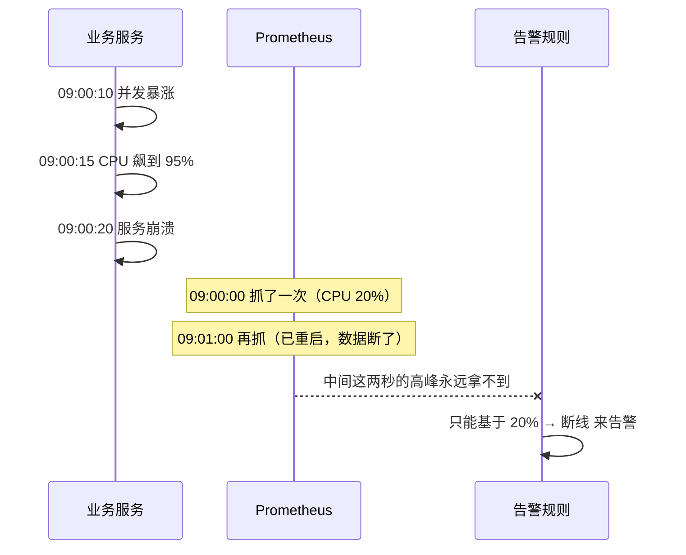

# Kubernetes 认证考点: Prometheus 与 Grafana 落地时的五个避坑要点

Prometheus 装上之后跑得起来，和它能在生产里长期待得住，是两回事。

结论：**五个坑 —— ①定时采集有盲区，告警不能只看 CPU/内存；②Histogram 的桶划分不合理会让分位数严重失真；③数据量上来必须拆存储，本地留热、远程存冷；④指标数量和查询时间范围要从源头控制；⑤复杂图表要用自定义数据源替代纯 PromQL，而且 Grafana 本身必须有测试环境；最后还有个"自己监控自己"的悖论，得靠第二套监控或云托管解决。**

## 纲要

- 坑一：定时采集的盲区，告警靠 CPU 内存会漏
- 坑二：Histogram 区间定义不合理，分位数是假的
- 坑三：存储拆分，本地热数据 + 远程冷数据 + 过期时间
- 坑四：控制指标数量与查询范围
- 坑五：图表复杂度与测试环境
- 自检：监控栈自身的高可用

## 坑一：采集间隔本身就是精度上限

Prometheus 是**拉模型 + 定时抓取**，抓到的永远是"抓的那一刻"的值，中间没抓到的点谁也看不见。



采集间隔设一分钟的话，一次两三秒的尖峰就整个被跳过了。更糟的是**时间序列在抓取失败后会被标记为不存在（staleness）**，图表上那段直接是断的，看起来像"没流量"而不是"挂了"。

所以针对这类崩溃场景，**不能只盯着 CPU、内存这类资源指标告警，必须对服务的错误数、请求失败率、存活探针失败次数做监控告警** —— 这些"事件型"信号是 Prometheus 抓到了存量也依然能算出来的。

实践上的取值参考：

| 采集间隔 | 适合场景 | 代价 |
| --- | --- | --- |
| 5s~10s | 关键业务、抖动敏感的 QPS/延迟 | 数据量 ×6~12，TSDB 压力大 |
| 15s~30s | 大多数线上服务的折中 | 秒级尖峰会丢 |
| 60s | 资源水位、节点级指标 | 只能看趋势，不能看瞬时 |
| 5min+ | 存储成本敏感的历史指标 | 基本只够画日趋势 |

## 坑二：Histogram 的桶划不好，分位数就是假的

Prometheus 存的是**区间统计数据**，`histogram_quantile()` 是在桶（bucket）的 cumulative 计数上做线性插值算出来的。

**如果区间定义不合理，数据没有均匀分配到各个桶里，算出来的 P99 会偏得离谱。** 典型症状：你把桶全设在 `{0.005, 0.01, 0.025, 0.05, 0.1, 0.25, 0.5, 1, 2.5, 5, 10}` 这一套（Prometheus 官方默认），但你的服务实际延迟集中在 20ms~40ms，那 0.005~0.05 这几个桶里几乎全是 +Inf 的累计边界，P99 会被插值成一个毫无意义的值。

```yaml
# 正确姿势：按实测分布调整桶，别直接用默认桶
latency:
  buckets: [0.01, 0.02, 0.03, 0.05, 0.08, 0.1, 0.15, 0.2, 0.3, 0.5, 1, 2, 5]
```

判断方法：**画一次 histogram 的 bucket 分布，看数据是不是"贴着某个桶的边界堆着"**。如果大量样本落在同一个桶里，就说明这个桶太宽、相邻的桶太窄，要么细分开、要么把上限抬上去。

## 坑三：存储必须拆，本地只留热数据

数据量这事儿是可以预判的：指标数量 × 时间序列条数 × 采集间隔 ≈ 每秒样本数，再乘保留天数就是总样本。

```text
一个 2 核 4G 的 Prometheus Pod 大致能扛：
├── 本地 TSDB：5~10 GB 量级（再大 CPU 打满，查询秒级起步）
├── 官方建议：单实例 < 5000 万样本/天
└── 换算公式：样本数/秒 = 指标数 × 时间序列数 / 采集间隔

举例：
  600 个指标 × 400 条序列 / 15s ≈ 16000 样本/秒
  → 一天约 13.8 亿样本
  → 已经远超单实例舒适区，必须 remote_write
```

拆分思路是固定的：

```text
Prometheus（本地）
├── /data：只存最近 N 小时的热数据（比如保留 2~15 天，看磁盘）
└── remote_write 定时推送
    └── 对象存储 / 分布式存储
        ├── 时间序列天然可按时间片切分文件
        ├── 冷数据打包 + 压缩后直接转存到 COS/S3
        └── 设一个合理过期时间（越久存得越多，成本越高）

查询历史数据：
  先从远程把对应时间片的文件下载/挂载到本地，再查
  → 功能完整，代价是性能
  → 用性能换存储成本，让海量历史数据的存储与查询成为可能
```

```yaml
# remote_write 片段：本地留 15 天，远程补齐历史
remote_write:
  - url: https://cos.example.com/prom/remote-write
    queue_config:
      capacity: 20000
      max_shards: 30
    retry_on_error: true
```

**关键点：这个转存一定要配定时任务 + 明确过期时间。** Prometheus 是时序数据，按时间切文件、打包、压缩是最自然的事；但"存多久"必须有人拍板，否则对象存储的账单会悄悄翻倍。

## 坑四：控制指标数量和查询范围

**控制数据量的根本手段在源头 —— 控制指标的数量。**

一个服务提供 100 万个指标、另一个只提供 100 个，数据量差一万倍。所以：

- 梳理一遍服务的指标，**把最重要的先定义出来**；
- 可用可不用的指标，等真有需求了再加；
- **别为了"全面"和"以后可能用得上"一次性全记上**，那些永远没人画的指标，每秒都在真金白银地烧存储。

查询侧同样要收着点：

| 查询时间范围 | 数据来源 | 观感 |
| --- | --- | --- |
| 最近 1 小时 | 本地 TSDB | 毫秒~亚秒 |
| 最近 6~24 小时 | 部分已从远程拉取 | 秒级 |
| 跨天以上 | 远程对象存储 | 可能几十秒甚至更久 |

**所以查询时把时间范围限制在较短区间（比如 1 小时内）**；真要看跨天趋势，用 recording rule 预计算成一个粗粒度指标，别每次现算。

```yaml
# recording rule：把 1 分钟的原始查询压成 1 分钟的粗结果
rules:
  - record: job:http_requests:rate1m
    expr: sum(rate(http_requests_total[1m])) by (job)
    interval: 1m
```

## 坑五：图表复杂度和 Grafana 的测试环境

图表用到的函数一多（多个 `sum`、`rate`、`histogram_quantile` 套嵌套），复杂度一上来，**后续维护就是个坑**。

这时候**不如自定义接口来做这个图表的数据源，写几行 Go/Python 处理数据**。代码虽然比一行查询语句"重"，但简洁性、灵活性和可维护性都好得多 —— 调试方便、能加注释、能改逻辑、别人接手看得懂。

还有一条硬规矩：**Prometheus 服务一定要有测试环境，而线上 Grafana 服务要给每一个正式图表再配一个一模一样的测试图表。更新正式图表之前，先在线上的测试图表中验证没问题，再发布正式图表。**

理由很实际：线上图表的数据在企业里非常敏感，很多是要给管理层看的，不能出错。而"线上图"直接改的风险在于 —— 改错了，看板当场就废了，且没有回滚的版本中间态。

```text
Grafana 的双环境结构（不要省这步）
├── grafana-staging（跟生产同版本、同数据源）
│   └── 与生产完全一致的测试图表（复制粘贴过来）
│       └── 每次改图 → 先在 staging 验证数字符合预期
│           └── 通过 → 再同步到生产 grafana
└── grafana-prod
    ├── 数据源指向生产 Prometheus
    └── 图表由 staging 验证后同步发布（可走版本 / 导出导入）
```

## 自检：监控栈自己也得有人盯着

**如果要自己维护 Prometheus 和 Grafana，就会遇到"自己监控自己"的悖论** —— 监控服务挂了，没人知道。

出路就两条：

1. 直接**用云厂商的监控服务**，可靠性由云厂商的 SLA 承诺兜底；
2. 自己维护的话，**部署第二套监控告警服务来监控线上的 Prometheus 和 Grafana**，或者干脆换一款别的监控产品做交叉备份。

**总之，基础服务的可用性一定不能忽视。**

```text
两层监控的典型摆法
┌──────────────────────────────────────────┐
│ 第二层（元监控，独立部署在另一个集群/云）      │
│   Zabbix / 云厂商云监控 / 另一套 Prometheus  │
│   └── 盯：普罗米修斯是不是活着、抓了多少序列    │
│       Grafana 是不是活着、数据源通不通         │
│       Alertmanager 是不是收得到告警           │
└──────────────────────────────────────────┘
        │ 独立进程、独立存储，不依赖被监控对象
┌──────────────────────────────────────────┐
│ 第一层（业务监控）                          │
│   Prometheus + Grafana + Alertmanager      │
│   └── 盯：业务指标、集群指标                  │
└──────────────────────────────────────────┘
```

## API 速览

| 对象 / 字段 | 作用 | 备注 |
| --- | --- | --- |
| `scrape_interval` | 抓取间隔 | 直接决定精度上限，越小越贵 |
| `scrape_timeout` | 单次抓取超时 | 要小于 `scrape_interval` |
| `retention.time` | 本地保留时长 | 本地只留热数据 |
| `remote_write.url` | 远程写入端点 | 配定时转存 + 过期清理 |
| `bucket` | Histogram 分桶边界 | 必须贴合实测分布 |
| `histogram_quantile(0.99, ...)` | 算分位数 | 依赖桶划分质量 |
| `recording rule` | 预计算指标 | 压查询成本的关键手段 |
| `Grafana datasource` | 图表数据源 | 测试/生产要分开指向 |
| `Alertmanager` | 告警路由与去重 |  Prometheus 只负责产生告警 |

## Demo 示例

把上面几坑落成一段可落地的配置骨架：本地留 15 天、远程转存、告警规则避开"只看资源"的陷阱。

```yaml
global:
  scrape_interval: 15s
  scrape_timeout: 10s
  evaluation_interval: 15s

rule_files:
  - /etc/config/recording_rules.yml
  - /etc/config/alert_rules.yml

remote_write:
  - url: https://cos.internal/prom/remote-write
    queue_config:
      capacity: 20000
      max_shards: 30
    retry_on_error: true

scrape_configs:
  - job_name: kubernetes-pods
    kubernetes_sd_configs:
      - role: pod
    relabel_configs:
      - source_labels: [__meta_kubernetes_pod_annotation_prometheus_io_scrape]
        action: keep
        regex: "true"
```

告警规则这里，**崩溃场景一定要上错误信号，不能只靠资源水位**：

```yaml
groups:
  - name: service-liveness
    rules:
      # 坑一的正解：用错误率 + 存活探针，而不是盯着 CPU
      - alert: ServiceErrorRateHigh
        expr: |
          sum(rate(http_requests_total{status=~"5.."}[2m]))
            / sum(rate(http_requests_total[2m])) > 0.05
        for: 1m
        labels:
          severity: critical
        annotations:
          summary: "{{ $labels.job }} 错误率超过 5%"

      # 序列直接消失 = 服务挂了（比资源告警快得多）
      - alert: ServiceScrapeStale
        expr: absent(up{job="user-service"})
        for: 5m
        labels:
          severity: critical
```

预计算规则解决"跨天查询慢"：

```yaml
# recording_rules.yml
groups:
  - name: aggregated
    interval: 1m
    rules:
      - record: job:http_requests:rate1m
        expr: sum(rate(http_requests_total[1m])) by (job)
      - record: job:http_requests_error:ratio_rate1m
        expr: |
          sum(rate(http_requests_total{status=~"5.."}[1m])) by (job)
            / sum(rate(http_requests_total[1m])) by (job)
```

## 总结

Prometheus + Grafana 的坑，本质上都来自同一个矛盾：**它是"定时采样"的系统，而运维需要的是"完整事实"。** 采样必然丢细节，所以：

1. 资源类指标看趋势、看水位，**崩溃/故障类信号必须换错误率、存活探针这类事件指标**；
2. 分位数是插值算的，**桶要贴着实测分布设**；
3. 本地只留热数据、远程补历史、**转存要有定时、过期要有期限**；
4. **指标数量是存储的源头**，可要可不要的一律先不加；查询收在 1 小时内，跨天靠 recording rule；
5. 复杂图表**该写代码就写代码**，并且 **Grafana 必须双环境，正式图表先在测试图表上验证**；
6. 最后，**监控栈自身要套一层元监控**，否则它挂了就是无声挂。

