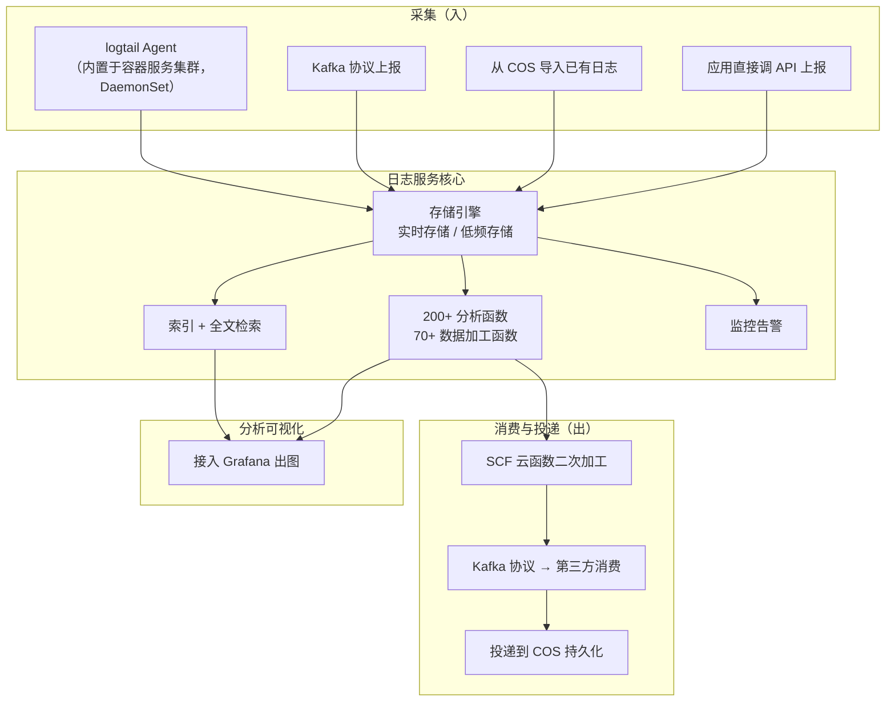

# Kubernetes 认证考点: 云原生日志服务的采集、投递与检索链路

监控告诉你"服务不对劲"，日志告诉你"到底哪一步错了"。但微服务一上来，日志量就是几十上百倍地涨。

结论：**云原生日志服务（以容器服务里的日志服务为例）是一套"采集 →  almacenar/存储 → 检索分析 → 消费投递"的完整链路：采集端有 Agent（logtail，以 DaemonSet 形式跑在每个节点）、Kafka 协议上报、COS 导入、应用直调 API 四种入口；核心能力是两百多个筛口分析函数 + 七十多个数据加工函数，支持检索、监控告警和自定义加工；存储分实时存储和低频存储两档，性能与价格差异很大；消费端支持 SCF 云函数二次加工、Kafka 协议转第三方、以及投递到 COS 持久化。在容器集群里开启采集，本质是三步：开采集 → 配规则 → 建日志集/主题并设索引。**

## 纲要

- 整体架构：采集、存储、检索、消费四段
- 采集端：四种入口与 logtail 的 DaemonSet 形态
- 核心能力：检索 + 加工函数 + 监控告警
- 存储引擎：实时存储与低频存储
- 消费与投递：SCF / Kafka / COS
- 在容器集群里落地的三步
- 自建方案 vs 云日志服务的取舍

## 整体架构



**最上层是分析结果可视化 —— 日志服务的数据可以集成到 Grafana 服务，输出各种形式的图表。** 中间一层是核心能力，底层是存储引擎层。

## 采集端：四种入口

```text
日志采集入口
├── ① logtail 采集文件           ← 最常用
│   └── 内置在容器服务（K8s 集群）里，服务通过简单配置
│       就能把容器内的日志采集上来，使用起来极其简单
├── ② Kafka 协议上报
│   └── 不用 Agent，应用直接按 Kafka 协议把日志推送上来
├── ③ 从 COS 导入
│   └── 已经躺在对象存储里的历史/离线日志，直接导入索引
└── ④ 应用程序直接调用 API 上报
    └── 特殊格式（结构化 JSON、二进制）走 API 最灵活
```

**这几种工具和接口组合起来，就能从各类服务器、各类服务中把日志采集到日志服务里。** 其中 logtail 是 K8s 场景的主力 —— 它在集群内是**以 DaemonSet 的形式运行的**（每个节点一个 Pod，跟着节点走，节点扩了自动补上），容器里写标准输出或者落盘的文件都能收。

```yaml
# 简化示意：日志 Agent 在集群里的形态就是 DaemonSet
kind: DaemonSet
metadata:
  name: logtail
spec:
  selector:
    matchLabels: { app: logtail }
  template:
    metadata:
      labels: { app: logtail }
    spec:
      containers:
        - name: logtail
          image: nginx:1.20-alpine   # 此处仅为形态示意
          volumeMounts:
            - name: varlog
              mountPath: /var/log
            - name: containers
              mountPath: /var/lib/docker/containers
      volumes:
        - name: varlog
          hostPath: { path: /var/log }
        - name: containers
          hostPath: { path: /var/lib/docker/containers }
```

## 核心能力

**最核心的能力可以拆成三块：数据加持、日志分析、监控告警。**

- **检索**：日志服务支持日志数据的全面检索，**可以用 RUSEN（这里指检索/查询 DSL）来做检索，支持两百多个筛口（筛选）分析函数**；
- **数据加工**：**支持七十多个数据加工函数**，可以做字段提取、类型转换、富化、路由、脱敏；
- **监控告警**：不仅支持日志检索，**也可以支持监控告警**；
- **可视化**：分析结果的出口之一，是接到 Grafana 出图。

所以它的定位不是"一个存日志的地方"，而是：**检索 + 加工 + 告警 + 可视化 一条龙**。

## 存储引擎：实时 vs 低频

**底层存储引擎层支持实时存储和低频存储两种，它们在性能和价格方面会有较大差异。**

| 存储类型 | 定位 | 适合 | 代价 |
| --- | --- | --- | --- |
| 实时存储 | 索引完整、检索快 | 近 7~30 天的热日志、要按字段精确查 | 单价高 |
| 低频存储 | 成本低、检索慢些 | 归档备份、合规留存、偶尔才查 | 写入/查询延迟高 |

**一句话：既能满足高性能要求，也能满足低成本的需求。** 典型做法是按主题拆 —— 出问题的排查期走实时，冷数据定期转低频。

## 消费与投递

架构图右侧是消费与投递。**如果这些数据还想导出一份到外部处理，也是支持的：**

- **走 SCF（云函数）做数据的二次加工** —— 在云函数里写一段逻辑，把日志清洗成下游要的格式；
- **通过 Kafka 协议转到第三方进行日志消费和处理** —— 把日志流接到自己的流处理里（Flink/Spark 之类）；
- **投递到 COS 进行持久化保存** —— 冷归档，成本最低。

```text
投递拓扑
日志服务 ──► SCF 云函数 ──► 下游业务（清洗/富化后入库）
    │
    └──► Kafka 协议 ──► 第三方消费者（Flink / ELK / 自研）
    │
    └──► COS 对象存储 ──► 长期持久化（合规、离线分析）
```

## 在容器集群里落地的三步

**第一步：在容器服务的 K8s 集群中手动开启日志采集功能。开启后，日志采集 Agent 会在集群内以 DaemonSet 的形式运行。**

**第二步：配置日志采集规则。** 可以采容器内的文件，也可以采集服务的标准输出日志。采集 Agent 会**根据日志采集规则，从采集源进行采集，将日志内容发送到日志消费端**。

**第三步：创建日志集和日志主题。这个操作也可以在配置日志采集规则的地方自动创建。如果要更好地进行管理，建议手动创建和管理日志集和主题。**

**为了支持快速检索或者全文检索，还需要给日志主题设置索引。**

三步都做完，Agent 就会采集到 K8s 集群中各服务的日志，也就可以在日志服务里**查询和分析指定日志主题的日志**了。

```text
三个操作对象的层级关系
日志集（Logset）            ← 容器级/项目级，手动创建便于管理
└── 日志主题（Topic）        ← 一条业务线一个，索引配置挂在这里
    ├── 日志采集规则（采集哪些容器的哪些路径）
    ├── 索引配置（全文检索的字段 + 分词符）
    └── 告警策略（基于检索结果的监控）
```

> 各自建一套、自动创建很方便，但**日志集和主题手动建、手动管，后面改索引和迁移主题时才不会乱** —— 自动创建出来的名字一般是系统串，不好认。

## 自建 vs 云日志服务

**简单的日志服务，没想到内容也有这么多。** 而在实际使用里，尤其是微服务、日志数据量非常大的时候，**如果没有日志服务，要自己来处理，困难是非常多的** —— 哪怕是对标 AWS 这样的平台：**虽然有成熟方案，但要构建和配置的服务特别多；自定义能力和灵活性确实很好，但复杂度还是太高。**

| 维度 | 自建 ELK / Loki 栈 | 云厂商日志服务 |
| --- | --- | --- |
| 组件数 | Filebeat + Logstash + ES + Kibana + Kafka（至少 5 个） | Agent + 日志服务（2 个心智对象） |
| 运维成本 | 要自己管 ES 分片、JVM、索引生命周期 | 托管，扩容和保留策略给个配置就够 |
| 上手速度 | 一周起 | 三步开启 |
| 自定义能力 | 极强，随便改 | 受平台能力约束（但函数 + API 够补） |
| 长期成本 | 机器 + 人力 | 按写入量/存储量计费，需刻意控 |

**所以对比多个云厂商的同类方案时，对复杂度和上手成本这两项的差异，体会会特别深。** 课程这一节只做介绍不演示，因为云厂商页面上操作帮助已经非常详细、文档也简单易懂，实操重点是下面三步。

## API 速览

| 概念 / 字段 | 作用 | 备注 |
| --- | --- | --- |
| logtail Agent | 节点上采集容器的文件与标准输出 | 集群内以 DaemonSet 运行 |
| 日志集 Logset | 日志的顶层归属 | 建议手动创建管理 |
| 日志主题 Topic | 检索与索引的作用粒度 | 索引配在主题上 |
| 索引配置 | 支持快速检索 / 全文检索 | 不设索引就检索不了 |
| 采集规则 | 指定采集源与路径 | 容器文件路径 / stdout |
| Kafka 协议上报 | 应用侧无 Agent 直推 | 适合已有 Kafka 客户端的服务 |
| COS 导入 | 把对象存储里的老日志导入 | 离线数据回灌 |
| SCF 云函数 | 日志二次加工后再投递 | 灵活清洗 |
| 实时 / 低频存储 | 性能与价格的两种档位 | 按需混合使用 |

## Demo 示例

把三步落成一份等价的采集配置骨架，方便对照界面看懂每一项在说什么。

```yaml
# 采集配置（示意）：容器标准输出 + 容器文件两条路径
inputs:
  - type: container_stdout          # ② 采集容器的标准输出
    stdout: true
    stderr: true
  - type: container_file            # ① 采集容器内落盘的日志文件
    paths:
      - /var/log/app/*.log
    wildcard: true
    depth: 1

processors:                         # ← 对应七十多个数据加工函数里的两类
  - parse_json:                     # 结构化解析
      source_key: content
  - rename_keys:                    # 字段改名
      - from: content.TraceId
        to: trace_id

flushers:                           # 采集源 → 消费端
  - type: kafka                     # 也可选 HTTP / COS
      brokers:
        - 127.0.0.1:9092
      topic: app-logs
```

索引与检索侧的配置，直接对应"为了支持快速检索或者全文检索，需要给日志主题设置索引"：

```text
# 索引配置要覆盖你真正在查的字段，否则检索查不出来
索引字段：
├── @timestamp   时间（分词/时间范围）
├── level         分词（error / warn / info 精确筛）
├── service_name  分词（按服务过滤）
├── trace_id      分词（链路串联，必配）
└── content       全文（模糊匹配正文）

查询示例（这里指 RUSEN 检索 DSL）：
  level:error AND service_name:user-service AND @timestamp:[$today]
```

一条"采集起来之后先验证能查到"的最小检查：

```bash
# 等日志进来之后，查一下这个主题里的最新几条
# 先给变量赋值，例如：CLS_ENDPOINT=ap-guangzhou.cls.tencentcs.com；LOGSET_ID=0f1e2d3c-4b5a-6789-abcd-ef0123456789；TOPIC_ID=6a7b8c9d-0e1f-2345-6789-abcdef012345；TOKEN=xxxxxxxxxxxxxxxx
curl -s "https://$CLS_ENDPOINT/logset/$LOGSET_ID/topic/$TOPIC_ID/search" \
  -H "Authorization: $TOKEN" \
  -d '{"query":"level:error","start":0,"size":5}' \
  | python3 -m json.tool
```

## 总结

云原生日志服务的本质，是把"日志"从一堆散落在不同容器里的文本文件，变成一条**可索引、可检索、可告警、可投递**的数据管道。

1. **采集端四入口**：logtail（容器内文件/stdout，集群内 DaemonSet）、Kafka 协议、COS 导入、应用直调 API；
2. **Agent 的部署形态是 DaemonSet** —— 一个节点一个，节点扩缩自动跟随，这是 K8s 场景里它比"每个 Pod 自带采集器"更省资源的原因；
3. **核心是检索 + 加工 + 告警**：两百多个分析函数、七十多个加工函数，检索结果还能接 Grafana 出图；
4. **存储分实时与低频两档**，价格差很大 —— 按主题拆分冷热，是最直接的成本杠杆；
5. **出口有三个**：SCF 云函数二次加工、Kafka 协议转第三方、COS 持久化归档；
6. **容器集群里落地就是三步**：开采集（Agent 起来）→ 配规则（文件还是 stdout）→ 建日志集/主题并设索引；**日志集和主题手动管理更省心**；
7. **自建不是不行，但组件多、复杂度高**；日志量一大，人力成本会超过机器成本 —— 对比各家云方案时，上手步骤数是最直观的差距。

