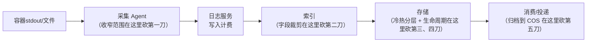
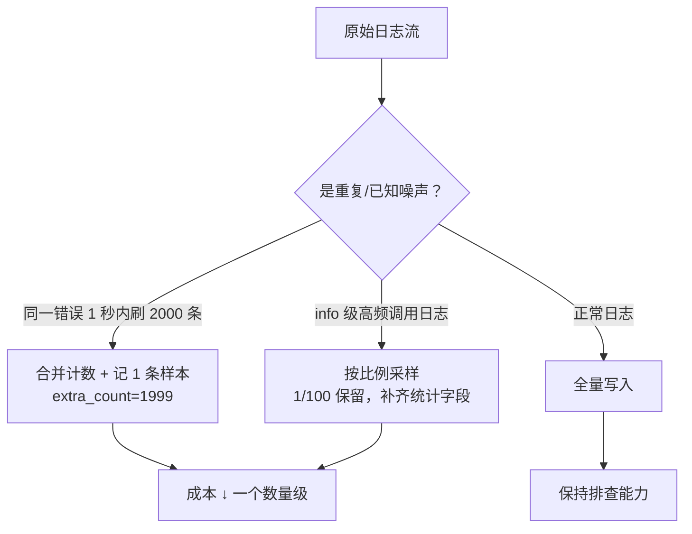

# Kubernetes 认证考点: 日志服务成本优化的六个抓手

日志是集群里最容易"悄悄长胖"的那一类数据 —— 它不像 CPU 那样有明确的利用率曲线，涨上去了账单才回头看见。

结论：**日志成本 = 写入量 × 单条写入单价 + 存储量 × 单价 × 留存天数，两头都能控。六个抓手：①收窄采集范围（采该采的）；②裁剪索引字段（不是每列都值得建索引）；③冷热分层（实时存储 + 低频存储）；④生命周期与过期；⑤采样与降噪（高频重复日志只留一条、关键信息补齐）；⑥冷归档投递到 COS。其中索引裁剪和采集合规是杠杆最大的两个。**

## 纲要

- 成本模型：钱花在哪两段
- 抓手一：采集范围收窄
- 抓手二：索引字段裁剪（最容易被忽略的一笔）
- 抓手三：实时存储与低频存储分层
- 抓手四：生命周期与过期
- 抓手五：采样与降噪
- 抓手六：冷归档投递到 COS
- 算一笔账：改之前 vs 改之后

## 成本模型

日志服务（以及大部分日志平台）的账单基本只有两个来源：

```text
月度成本 ≈
    写入量(GB) × 写入单价
  + 留存数据量(GB) × 存储单价   ← 看的是"峰值留存"还是"平均留存"要问清
  + 索引字段数 × 留存天数 × 单价 ← 索引比原始日志还贵，这是大头
```

**关键认知：索引是加价项，不是免费项。** 一条日志原始内容 1KB，加了 15 个索引字段之后，倒排索引可能占好几个 KB。所以"检索快"和"存得便宜"经常是同一个旋钮的两端。



## 抓手一：收窄采集范围

**第一刀砍在采集源。** 上线时最省事的写法是"全量采集"，但全量采集会把健康检查、探针、K8s 控制面刷屏日志全带上。

```text
采集对象的取舍
├── 该采
│   ├── 服务的 error / warn 级别日志
│   ├── 业务访问日志（带 trace_id、状态码、耗时）
│   ├── panic / 栈信息（哪怕量大，也必须留）
│   └── 关键审计日志（谁改了什么）
├── 可降采样采
│   └── info 级别的常规调用日志（配合采样率）
└── 别采 / 直接丢弃
    ├── K8s 组件自己刷屏的探针日志
    ├── 健康检查脚本的输出
    └── 大段无结构的调试 dump（要留就单独落到文件排查，不进日志服务）
```

另外一个常见写法是**只认标准输出，别同时再配一份文件采集** —— 同一个容器如果 stdout 和宿主机路径都被规则命中，日志会被采两遍，写入量直接翻倍。

```yaml
# 反面：同一个容器两条规则都命中
inputs:
  - type: container_stdout        # 采了 stdout
  - type: container_file          # paths 又匹配到 /var/log/... 同一份
    paths: [/var/log/app/*.log]   # ← 重复
```

```yaml
# 正面：stdout 采业务日志，文件只采那条明确的错误文件
inputs:
  - type: container_stdout
    stdout: true
  - type: container_file
    paths: [/var/log/app/fatal-*.log]
    when: 'json.level == "FATAL" || "panic" in raw'
```

## 抓手二：索引字段裁剪（最容易被忽略的一笔）

**日志服务支持快速检索或者全文检索，前提是给日志主题设了索引 —— 但"设了索引"不等于"所有字段都建索引"。**

只有**用来做过滤条件和分组条件**的字段才需要建索引（即"快速检索/精确筛"）；**只会在 results 里回显、从不参与查询的字段，设成全文或干脆不设索引更便宜。**

| 字段 | 是否建索引 | 理由 |
| --- | --- | --- |
| `@timestamp` | ✅ 时间索引 | 几乎所有查询都要时间范围 |
| `level` | ✅ 分词索引 | 高频过滤条件 |
| `service_name` | ✅ 分词索引 | 按服务定位是第一刀 |
| `trace_id` | ✅ 分词索引 | 链路串联必查 |
| `status_code` | ✅ 数值/分词 | 错误率统计要用 |
| `user_id` | ⚠️ 视量而定 | 量小就建，量大考虑不建 |
| `request_body` | ❌ 不建/全文 | 体积大且基本不按它筛 |
| `stack_trace` | ❌ 全文都不用 | 排查时从原始内容看即可 |

```text
一条日志的三种存法，成本差很多
原始内容 1.2 KB
├── 全字段建索引  → 存储 ~6 KB（倒排 + 列存 + 原始）
├── 5 个关键字段建索引 → 存储 ~3 KB
└── 无索引（只全文）  → 存储 ~1.5 KB

年化（按 500 GB/天 写入、保留 30 天估算）：
  全字段索引：~ 数百个 GB 量级的索引副本
  裁剪 5 字段：接近砍掉一半以上的索引体积
```

## 抓手三：实时存储与低频存储分层

**存储引擎层支持实时存储和低频存储，它们在性能和价格方面会有较大差异，既能满足高性能要求，也能满足低成本的需求。**

正确姿势是**按主题拆冷热，而不是整库一个策略**：

```text
日志主题（Topic）分层设计
├── user-service-access   → 实时存储（排查要快，检索占比高）
├── order-service-access  → 实时存储
├── 所有服务 info 归档     → 低频存储（只偶尔查）
└── 全量冷备主题           → 低频存储 + 到期转 COS
```

**什么时候从实时转低频**：看这条日志"查它的概率随时间怎么衰减"。排查一般发生在出事后的几小时内，取数脚本偶尔跑；超过这个窗口还偶尔要看的（周报、故障复盘），低频存储完全够。

## 抓手四：生命周期与过期

**必须给每个主题设一个明确的过期时间 —— 时间越久，数据越多，存储成本越高。**

```text
生命周期建议（按主题分）
├── 排查类主题（error / 报警）    保留 30 天   实时存储
├── 常规业务日志                  保留 7~14 天 实时存储 → 到期转低频
├── 审计合规类（必须留）           保留 180+ 天 低频存储（法务拍板）
└── 全量镜像（只为兜底）           保留 3~7 天   低频存储（超期不续）
```

**注意"过期"和"删除"是两件配置事**：有些平台的过期策略只管到"转入归档"，真正的物理删除还要单独确认，否则账单不会因为设了 30 天就真的少 30 天之后的数据。

## 抓手五：采样与降噪

成本优化最狠的一刀，往往是**别把重复日志一条不落地全记下来**。



两种采样思路要分清：

| 方式 | 做法 | 代价 |
| --- | --- | --- |
| 采样（Sampling） | 按比例只留一部分（如 1/100） | 可能漏掉关键那条，且采样率要能动态调 |
| 合并计数（Counting） | 重复日志只存 1 条 + 计数，周期性 flush | **推荐**：总量可控，样本还在 |

**合并计数的正确姿势是"补统计维度"**：被合并掉的那 1999 条丢了不可怕，只要留下 `count`、`首次时间`、`最后时间`、以及一个能定位到的 `sample_id`，排查时再回原始日志按 sample_id 把上下文捞出来就行。

## 抓手六：冷归档投递到 COS

**如果这些数据还想留一份到外部，可以投递到 COS 进行持久化保存** —— 这一步是成本曲线上最陡的那一段（对象存储单价通常只有日志服务存储单价的零头）。

```text
分级留存
最近 7 天   → 日志服务（实时存储，能检索）
第 8~30 天  → 日志服务（低频存储，慢点能查）
30 天以上   → COS 对象存储（投递过去，检索关掉，需要时导入回查）
```

代价是**超过 30 天的查询要"先下载回来再查"**，功能和实时性打折 —— 但能让海量历史数据的归档与查询在成本上成立。

## 算一笔账：改之前 vs 改之后

```text
改之前（一个中等规模集群，估算）
├── 采集：stdout + 宿主机文件双份命中      100% 写入量
├── 索引：全字段建索引                     6 个字段
├── 存储：全实时，统一保留 30 天
└── 月成本：写 500 GB × P + 留存 15 TB × Q

改之后
├── 采集：去重，只采 error + 采样的 info   写入量 ~55%
├── 索引：裁剪到 5 个关键字段 + 关闭大字段  索引体积 ~50%
├── 存储：实时 7 天 + 低频 30 天
├── 采样：info 按 1/100 合并计数
└── 归档：30 天以上投递 COS
```

**同一件事的三个排序**：采集去重 → 索引裁剪 → 采样合并，这三个是"不动检索能力的降本"；冷热分层和生命周期是"不改行为的降本"；COS 归档是"牺牲查询体验的降本"。**优先做前三个。**

## API 速览

| 配置项 | 位置 | 对成本的影响 |
| --- | --- | --- |
| 采集规则 paths / 过滤条件 | Agent 采集配置 | 直接决定写入量 |
| 索引字段列表 | 日志主题索引配置 | 索引体积的最主要变量 |
| 存储类型（实时/低频） | 主题存储设置 | 单价差，通常 2~5 倍量级 |
| 保留期 / 过期策略 | 主题生命周期 | 决定留存数据量上限 |
| 采样率 / 合并计数 | 采集或加工配置 | 降本最猛，注意可动态调 |
| 投递目标（COS） | 投递任务 | 冷归档，把单价拉到最低 |
| 全文（模糊）开关 | 索引配置 | 全文比精确索引略贵 |

## Demo 示例

一份把上面六个抓手落齐的主题配置骨架：

```yaml
# 主题：user-service-error（排查类，实时存储）
logset: k8s-prod
topic: user-service-error
storage:
  type: realtime          # 抓手三：排查类走实时
  retention: 30d          # 抓手四：明确过期
  archive_after: 30d      # 到期转低频
index:                    # 抓手二：只给关键字段建索引
  - field: "@timestamp"   mode: time
  - field: level          mode: keyword
  - field: service_name   mode: keyword
  - field: trace_id       mode: keyword
  - field: status_code    mode: long
  # request_body / stack_trace 只落原始内容，不建索引
consumers:                # 抓手六：冷数据投递归档
  - type: cos
    bucket: k8s-logs-cold
    prefix: user-service-error/
    trigger: after_index_writer
```

加工侧把噪声压下去，同时不丢可排查性：

```yaml
# 采集/加工配置（示意）
filters:                  # 抓手一：收窄范围
  - drop_when: 'json.level in ("DEBUG","TRACE")'
  - drop_when: 'raw matches "^\\s*$"'

processors:
  - replace_rules:        # 脱敏，顺带减小体积
      - pattern: '(\d{11})'
        replace: '*****'
  - packer:               # 抓手五：重复日志合并计数
      when: 'json.level == "ERROR"'
      group_by: [service_name, json.error_code]
      interval: 10s
      max_message_count: 5       # 最多留 5 条样本
      extra:                     # 被合并的条数必须留下来
        count: '$.count'
        first_time: '$.first_time'
```

验证一下降本效果，重点看写入量和索引体积两条曲线：

```bash
# 看主题的写入量与计费估算（各平台字段名略有差别，此处为通用形式）
# 先给变量赋值，例如：CLS_ENDPOINT=ap-guangzhou.cls.tencentcs.com；TOPIC_ID=6a7b8c9d-0e1f-2345-6789-abcdef012345；TOKEN=xxxxxxxxxxxxxxxx
curl -s "https://$CLS_ENDPOINT/topic/$TOPIC_ID/statistics?range=7d" \
  -H "Authorization: $TOKEN" | python3 -m json.tool

# 期望看到的变化顺序：
#   1. 写入量 GB 下降（采集去重 + 采样）
#   2. 索引存储 GB 下降（索引裁剪）
#   3. 实时存储 GB 下降（生命周期 + 转低频）
#   4. COS 归档量上升（这条路是"账面上便宜"，不是"真的少了数据"）
```

## 总结

日志成本不是靠"省着点打日志"解决的，是靠**每一层的默认配置都对得上真实查询模式**：

1. **先算清账**：写入 + 存储 + 索引，三块里索引最容易被忽略，也常常最贵；
2. **采集去重是第一刀** —— stdout 和文件别重复命中，DEBUG/TRACE 和探针日志直接丢；
3. **索引只建真会拿来筛的字段**，`request_body`、`stack_trace` 这类大字段老老实实只留原始内容；
4. **按主题分冷热**：排查类走实时，归档类走低频，别整个集群一个策略；
5. **过期时间必须有人拍板**，而且要确认它真的会物理删除，不是只"转归档"；
6. **重复日志用合并计数而不是硬采样** —— 总量下来一个数量级，样本还留着，排查能力不打折；
7. **30 天以上投递到 COS**，用一点查询延迟换存储单价的大幅下降。

最后一句判断标准：**如果一个优化动作会让"次日排查无据可查"，那就不是优化，是埋雷。** 温和排序永远是：采集去重 → 索引裁剪 → 采样合并 → 冷热分层 → 生命周期 → 冷归档。

