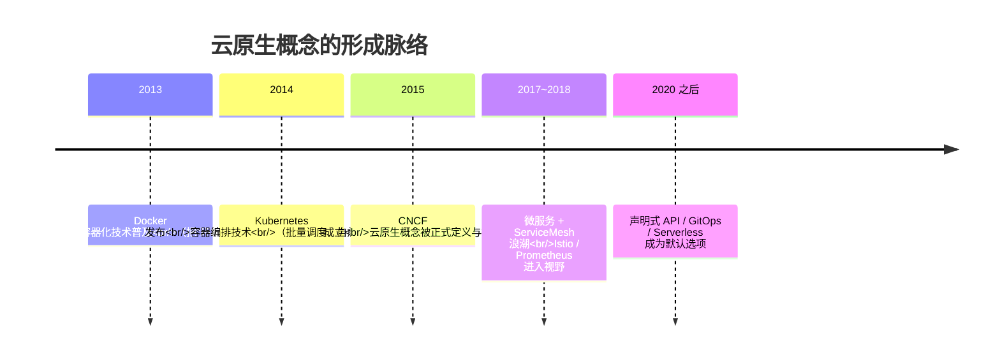
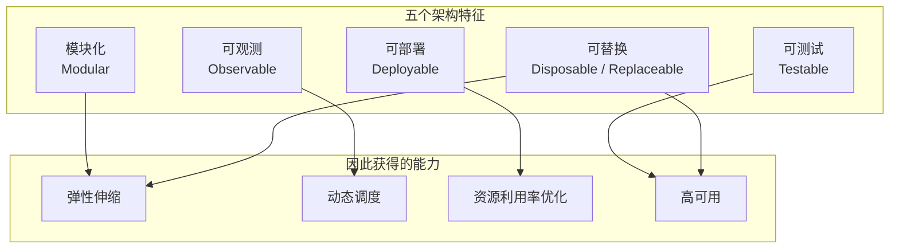

# Kubernetes 认证考点: 到底什么才算云原生

"我们上云了"、"我们用了 K8s"、"我们上了微服务" —— 这三句话在评审会上经常被用来证明"我们是云原生的"，但它们其实说的是三件不同的事。

结论：**云原生的概念出现不过十年，源头是容器化技术，然后是容器编排技术，两个最关键的产品是 Docker 和 Kubernetes。基础设施上云、DevOps 平台、微服务、容器化、敏捷开发、持续构建部署、开源软件，都只是它的组成部分而非全部。真正的判断标准是应用架构本身：模块化的、可观测的、可部署的、可测试的、可替换的 —— 这样的服务才具备弹性伸缩、动态调度、资源利用率优化和高可用。云原生技术里最核心的还是容器化技术，只有适应容器化技术的服务，才能称为云原生的服务。**

## 纲要

- 四个"这算不算"的追问
- 时间线：从容器化到编排
- 组成部分 ≠ 全部
- 云原生的架构特征：五件事
- 上云 ≠ 云原生：把云主机当虚拟机用
- 容器化为什么是核心

## 四个"这算不算云原生"的追问

课程开头一连抛了四个反问，这是理解整章的钥匙：

| 追问 | 答案 |
| --- | --- |
| **基础设施、基础服务上云就是云原生吗？** —— 比如租云厂商的云服务器、用云数据库 | ❌ 这只是"上云"，还谈不上云原生 |
| **用了 DevOps 平台、微服务架构、容器化技术，就是云原生了吗？** | ⚠️ 是组成部分，但不是全部 |
| **用了敏捷开发、持续构建和持续部署、用开源软件，就是云原生吗？** | ⚠️ 同上，是组成条件而非判定标准 |
| **那到底什么时候算是？** | ✅ 看应用架构本身是否适配容器化环境 |

## 时间线：概念只有十年

**云原生的概念也是近十年才开始出现的。最开始就是容器化技术的出现，然后是容器编排技术的发布，其中特别重要的两个产品，就是 Docker 和 Kubernetes。**



关键顺序不能颠倒：**先有"容器把应用标准化了"，才有"编排器去规模化调度这些容器"。** Docker 解决的是"在我机器上能跑"，Kubernetes 解决的是"跑一百个节点还知道哪个挂了"。

```text
两层技术的分工
├── Docker（容器化 / 运行时）
│   └── 把应用 + 依赖打成镜像，做到环境一致、秒级启动
└── Kubernetes（编排 / 集群管理）
    └── 管这些镜像跑在哪、挂了怎么换、要几个副本、怎么灰度
        ├── 调度（Scheduler）
        ├── 自愈（Controller / ReplicaSet）
        ├── 滚动更新与回滚（Deployment）
        ├── 服务发现与负载均衡（Service）
        └── 声明式 API（kubectl apply 之后不再管过程）
```

## 组成部分 ≠ 全部

**前面提到的基础设施上云、DevOps、微服务、容器化技术、敏捷开发、持续构建、开源软件，都是云原生的组成部分，但它们不是云原生的全部。**

```text
云原生的"零件清单"（有这些 ≠ 云原生）
├── 基础设施上云（云主机、云数据库、云网络）
├── 微服务架构
├── 容器化技术
├── DevOps 平台
├── 敏捷开发
├── 持续构建 / 持续部署（CI/CD）
└── 开源软件

但只有这些零件，装出来的东西可能是个"传统单体跑在云上"
```

零件齐了只是"差不多"，判定还得落到**应用长什么样**这件事上。

## 云原生的架构特征：五件事

**云原生应用架构应该是：模块化的、可观测的、可部署的、可测试的、可替换的。**



逐个说清楚：

| 特征 | 含义 | 在 K8s 里的对应物 |
| --- | --- | --- |
| **模块化** | 功能拆成独立单元，能单独升级和替换 | 微服务、Deployment 分服务部署 |
| **可观测** | 指标、日志、链路三条信号都能取出来 | Prometheus + 日志服务 + Trace |
| **可部署** | 一键、可重复、不依赖手操作 | 声明式 YAML / Helm / GitOps |
| **可测试** | 能在_ci_里跑起来并验证 | 容器秒起 → 单测/集成/冒烟全程容器化 |
| **可替换** | 实例随时能销毁重建，不含状态依赖 | 无状态副本、Pod 随时重建、HPA 扩缩 |

**具备这五点的服务，具有非常好的弹性伸缩、方便的动态调度、能优化资源使用率，而且具有高可用性。**

**可替换（Disposable）这一点最容易被忽略，也最能验证是否真云原生**：如果一个服务 Pod 被删掉就瘫，那它不是云原生服务；如果删了能自己起来、多上几个也不打架、少一个也不影响主链路，它才适配容器化环境。

## 上云 ≠ 云原生

这一节最反直觉、也最实用的一条：

**采购云厂商的容器服务和其他云服务，只是企业上云。比如只是采购了几个云主机，但是还是传统的服务开发和部署方式，把云主机当作虚拟机管理和使用，也就不符合云原生的理念了。**

```text
上云（Cloud Adoption）          云原生（Cloud Native）
├── 买了云主机                    ├── 用托管 K8s 集群
├── 装 JDK / Tomcat / Nginx       ├── 应用跑在容器里，镜像交付
├── 手动改配置、手动重启           ├── 声明式 YAML，apply 完不用管
├── 一个主机一个应用（或乱堆）      ├── 一个 Pod 一个职责
├── 扩容 = 加机器 + 配环境          ├── 扩容 = 副本数 +1（或 HPA）
├── 挂了 = 人 ssh 上去看           ├── 挂了 = 控制器重建，看事件流
└── 单机会话、本地文件保存状态      └── 状态外置（DB/Redis/对象存储）

判断一句口诀：把云主机当虚拟机用，就不算云原生。
```

**是不是云原生，看的是"跑的方式"而不是"买的什么"。** 买了云原生数据库但应用还是单体 + 手动部署，那是上云；应用拆成容器、用 K8s 编排、自动扩缩、可观测齐备，就算买了最便宜的云主机，也是云原生在跑。

## 为什么容器化是核心

**容器化技术（本质是集群管理）非常契合云原生的架构和理念，所以才会有越来越多的服务 —— 无论是新开发的还是进行改造的 —— 适应容器化的环境，成为云原生的服务。**

原因就一条：**容器把"应用"变成了标准化、可丢弃、可复制的物件**，而弹性伸缩、动态调度、高可用这些能力，全都建立在"应用可以被随意替换"这个前提上。容器化提供了这个前提。

```text
为什么非得是容器（而不是直接跑在物理机上）
├── 环境一致 → 测试环境能跑，生产就能跑（可测试、可部署）
├── 秒级启动 → 副本可以被快速替换（可替换）
├── 资源隔离 → 一台机跑多个服务而不互相拖垮（资源利用率）
├── 镜像即制品 → 部署产物就是 CI 产出的那个包（可重复）
└── 声明式编排 → 集群能自动补位（高可用）
**这五条正好对上前面那五个架构特征。
```

## 考试视角的收口

如果这就是一道简答题，标准答案的结构大概是：

```text
云原生 = 技术底座（容器/编排/微服务/CI-CD/DevOps） 
      + 架构特征（模块化、可观测、可部署、可测试、可替换）
      + 最终产出（弹性伸缩、动态调度、资源利用率高、高可用）

判定落点：适应容器化技术的服务，才可称之为云原生的服务。
只采购云服务、把云主机当虚拟机用 = 企业上云，不是云原生。
```

## API 速览

| 概念 | 归属 | 在云原生判定里的角色 |
| --- | --- | --- |
| Docker | 容器化技术 | 提供标准化交付物（镜像） |
| Kubernetes | 容器编排 / 集群管理 | 提供调度、自愈、滚动更新 |
| 声明式 API | K8s 核心 | 可部署、可重复的落点 |
| Helm / Kustomize | 打包部署 | 可部署特征的工程手段 |
| Prometheus / 日志 / Trace | 可观测 | 三条信号缺一不可观测 |
| HPA / HPA v2 | 弹性伸缩 | 依赖"可替换"前提 |
| PodDisruptionBudget | 高可用 | 主动运维时的自愈护栏 |
| CI/CD 流水线 | 持续构建部署 | 可测试、可部署的自动化 |
| 无状态 + 状态外置 | 架构约束 | 可替换的前提条件 |

## Demo 示例

用一组最小配置，把"可替换 + 可部署 + 可观测"这三条同时落地 —— 这是判定云原生最省事的验证集。

```yaml
# 一个符合云原生五特征的 Deployment 骨架
apiVersion: apps/v1
kind: Deployment
metadata:
  name: user-service
spec:
  replicas: 3                # ← 弹性伸缩的基础
  selector:
    matchLabels: { app: user-service }
  template:
    metadata:
      labels: { app: user-service }
    spec:
      containers:
        - name: app
          image: registry.internal/user-service:1.4.0   # 镜像即制品
          ports:
            - containerPort: 8080
          resources:          # ← 资源利用率优化的前提
            requests: { cpu: "200m", memory: "256Mi" }
            limits:   { cpu: "500m", memory: "512Mi" }
          readinessProbe:     # ← 可替换（挂了不接流量）
            httpGet: { path: /ready, port: 8080 }
            initialDelaySeconds: 5
          livenessProbe:      # ← 可观测 + 自愈
            httpGet: { path: /health, port: 8080 }
            initialDelaySeconds: 15
---
# 弹性伸缩：直接复用"可替换"这个前提
apiVersion: autoscaling/v2
kind: HorizontalPodAutoscaler
metadata:
  name: user-service
spec:
  scaleTargetRef:
    apiVersion: apps/v1
    kind: Deployment
    name: user-service
  minReplicas: 3
  maxReplicas: 20
  metrics:
    - type: Resource
      resource:
        name: cpu
        target: { type: Utilization, averageUtilization: 70 }
```

自检"是不是真云原生"，用这三步：

```bash
# 1. 可替换：删掉一个 Pod，看它自己回来（30 秒内）—— 不回来就不是
kubectl delete pod -l app=user-service
kubectl get pod -l app=user-service -w

# 2. 可部署：改一个字段 apply 两次，第二次应当 no-op（说明是声明式，不是脚本）
kubectl apply -f deployment.yaml
kubectl apply -f deployment.yaml   # 期望输出 "unchanged"

# 3. 可观测：三条信号都能取到
kubectl top pod -l app=user-service                     # 指标
kubectl logs -l app=user-service --tail=50             # 日志
kubectl get events --sort-by=.lastTimestamp | tail -10  # 事件（编排器的"解释"）
```

## 总结

"什么是云原生"这个问题，最实用的答案不是背定义，而是**拿一把尺子去量自己的服务**：

1. **上云 ≠ 云原生**：买了云主机、云数据库，用传统方式开发部署，只是企业上云；
2. **用了容器 / 微服务 / CI-CD 也不等于云原生** —— 它们都只是组成部分；
3. **真正的落点是应用架构**：模块化、可观测、可部署、可测试、可替换；
4. **这五点换来四件事**：弹性伸缩、动态调度、资源利用率优化、高可用；
5. **云原生概念只有十年**，起点是容器化（Docker），接着是编排（Kubernetes）—— 顺序反了就理解错了，没有"先编排"这回事；
6. **容器化是核心**，因为它把应用变成了标准化、可丢弃、可复制的物件，而这正是扩容、调度、自愈成立的前提；
7. **一句话判定**：**适应容器化技术的服务，才可以称之为云原生的服务**；反过来说，删掉一个实例会瘫掉的服务，无论挂了多少云产品，都不算。

