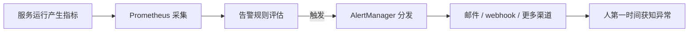

# K8s 监控及告警：让系统风险无处遁逃（本章导学）

关于服务的运营和可观测性，上一章我们把监控和日志补全了——它们能很全面地帮我们掌握线上服务的运行状况。但有个前提：**需要你主动去查看和分析，才能知道是否有异常**。而本章的"告警"，就是让系统帮我们做这个预警工作：通过一些简单的配置，把异常状态及时发现并告警出来，让我们第一时间知道系统异常，更及时地响应。

## 纲要

- 监控/日志要"人去看"，告警让"系统替你看"
- 先搞清 Prometheus + AlertManager 的架构与流程
- 在 K8s 集群里部署（而非本地）Prometheus + Grafana
- 配置 Prometheus + AlertManager 实现邮件告警
- 采集 K8s 资源信息，用 Grafana 出资源报表
- 自定义 webhook 告警，打通更多渠道与智能收敛

## 为什么需要告警

监控和日志解决的是"看得见"，但要"看得见"就得有人一直盯着。告警解决的是"不用一直盯"——它把"异常判断"从人工巡检变成系统自动触发：



## Prometheus + AlertManager 架构

本章先要了解 Prometheus 和 AlertManager 这套监控及告警系统的框架——会讲它们的架构和流程，也顺便复习上一章的 Prometheus 架构。二者的分工是：

- **Prometheus**：负责采集指标、用 PromQL 评估**告警规则（Alerting Rules）**，当规则命中时把告警发给 AlertManager；
- **AlertManager**：负责告警的**去重、分组、抑制、路由**，再按配置把通知发到邮件、webhook 等接收端。

二者分工对照：

| 组件 | 职责 | 关键动作 |
| --- | --- | --- |
| Prometheus | 采集 + 评估告警规则 | 用 PromQL 写规则，命中即发告警给 AlertManager |
| AlertManager | 告警的接收与分发 | 去重、分组、抑制、按路由发到邮件 / webhook 等 |

## 在 K8s 集群里部署（而非本地）

上一章的 Prometheus / Grafana 是在本地部署、用于测试；本章的实践环节不一样——我们要**在 K8s 集群中启用 Prometheus 和 Grafana 服务**（生产级部署），而不是本地测试用的那种。这意味着要处理集群内的服务暴露、持久化、权限等真实问题。

## 配置邮件告警

我们要配置 Prometheus 和 AlertManager 来实现**邮件告警**。启用 Prometheus / Grafana 之后，还要通过 Prometheus 把 K8s 集群中的服务、资源信息采集上来，然后通过 Grafana 配置出服务的资源使用情况报表。

告警规则大致写在 Prometheus 侧，类似：

```yaml
# prometheus 告警规则（示意，字段以官方文档为准）
groups:
  - name: example
    rules:
      - alert: HighCpuUsage
        expr: rate(container_cpu_usage_seconds_total[5m]) > 0.8
        for: 5m
        labels: { severity: warning }
        annotations:
          summary: "Pod CPU 使用率过高"
```

> 上述 `expr` / `for` / `labels` / `annotations` 为通用结构，**具体字段与 PromQL 函数建议以所用 Prometheus 版本官方文档为准**。

## 采集 K8s 资源并出报表

通过 Prometheus 采集 K8s 集群的服务、资源信息后，在 Grafana 里把"资源使用情况"做成报表——这是把监控数据变成"一眼能懂"的运营视图的关键一步。

```dir
本章告警实战结构
├── 集群内部署 Prometheus + Grafana（生产级）
├── 配置告警
│   ├── Prometheus 告警规则（Alerting Rules）
│   └── AlertManager：路由 / 分组 / 去重
├── 邮件告警
├── 采集 K8s 服务/资源指标
└── Grafana 资源使用报表
```

## 自定义 webhook 告警

最后，除了邮件告警，本章还会实现**一个 webhook 的自定义告警**。有了自定义告警，就能做更多事：

- 自定义**通知内容的格式**；
- 扩展**更多通知渠道**（钉钉、企业微信、Slack 等）；
- 对告警做**更智能的收敛**或全面分析，发现更多潜在问题。

当然，本章只是把"自定义告警这种方式跑通"，具体要怎么处理——告警消息的格式要支持哪些渠道、要实现更丰富的功能——还需要大家根据实际情况做选择。

## 总结

本章导学把"监控 + 告警"的闭环讲清了：

1. **监控/日志要人看，告警让系统看**：把异常判断自动化，第一时间通知人；
2. **Prometheus + AlertManager 分工**：前者采集 + 评估告警规则，后者去重/分组/路由分发；
3. **本章是生产级部署**：在 K8s 集群里启用 Prometheus + Grafana，而非本地测试；
4. **邮件告警是起点**：配规则 + 配 AlertManager 路由即可；
5. **报表让数据可懂**：采集 K8s 资源信息，用 Grafana 出资源使用报表；
6. **webhook 打通更多可能**：自定义格式、渠道与智能收敛，本章先跑通方式。
