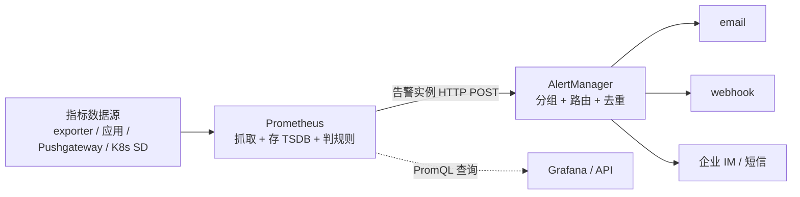

# 本章小结 —— K8s 集群监控告警体系的完整回顾

这一章我们围绕 K8s 集群的监控与告警展开，从理解 Prometheus 与 AlertManager 的架构，到亲手把监控栈部署进集群、配出动态服务发现、做出 Grafana 资源报表，再到把告警真正发到邮箱。下面把整条链路再串一遍，帮助复习和查漏。

## 纲要

- Prometheus 与 AlertManager 的分工与数据流程
- 在集群里部署监控栈：镜像制作与 Ingress 暴露
- 告警配置的两个落点：Prometheus 告警规则 + AlertManager 分组接收
- 动态服务发现：靠 RBAC 与注解采集集群指标
- 用 Grafana 出资源使用报表
- AlertManager 自定义告警框架与落地建议

## Prometheus 与 AlertManager 的分工

监控做完只是"看见"，告警做完才是"有人知道"。在 Prometheus 体系里这是两个组件各干各的活：



- **Prometheus**：负责收集、存储指标（本地 TSDB）、按 `alerting` 里的规则定时检查，条件满足就产生告警实例发给 AlertManager；
- **AlertManager**：负责接收告警、按标签分组路由、再投递到接收器（邮件 / webhook / IM）。告警规则写在 Prometheus，路由和接收器写在 AlertManager，这点搞反了会查半天。

数据源有四类：`exporter`（node_exporter 这类格式转换）、应用 SDK（进程内埋点）、`Pushgateway`（短任务/批处理主动推送）、以及 **K8s 动态服务发现**（自动补齐 Pod / Service / 节点）。查询统一走 PromQL，这也是 Prometheus 成为指标监控翘楚的原因——扩展性和灵活性极佳。

## 在集群里部署监控栈

最省事的办法是直接在云厂商控制台开托管 Prometheus / Grafana 服务；我们的实战选择是**在集群里手动部署**，这就要先制作监控服务的镜像。

```dir
监控镜像与部署产物
├── Dockerfile
│   ├── 基础镜像 alpine
│   ├── prometheus 可执行文件（下载解压，删压缩包让镜像小一圈）
│   ├── alertmanager（专用源，两行命令装好）
│   ├── grafana（专用源安装）
│   └── 启动脚本：prometheus & / alertmanager & / grafana 前台阻塞当 PID 1
├── Deployment（容器端口 9090 / 9093 / 3000）
├── Service（ClusterIP 暴露三个端口）
└── Ingress（ingress-nginx，用二级域名区分三个服务）
```

关键坑：**容器里必须有且仅有一个前台进程占住 PID 1**。前两个服务加 `&` 后台跑，最后一个 Grafana 故意不加 `&` 前台阻塞，否则脚本跑完就退、容器立刻 CrashLoopBackOff。对外访问则靠 ingress-nginx，用 `prometheus.xxx / alertmanager.xxx / grafana.xxx` 三个二级域名区分，没有子域名就退而用路径前缀（后端 path 前缀要不同）。

## 告警配置的两个落点

邮件告警最常被忽略的不是规则写错，而是两处配置没对上：

```dir
observability/
├── prometheus.yml      ← 改：静态/动态采集 + alerting 指向 9093 + rule_files
├── alert_rules.yml      ← 改：告警分组、名称、表达式、阈值、摘要
└── alertmanager.yml     ← 改：SMTP + route + receivers
```

Prometheus 侧用 `alerting.alertmanagers` 告诉它"告警往哪发"，用 `rule_files` 指向"什么时候算告警"；规则文件里 `alert` 是名称（也是分组维度）、`expr` 是判定表达式、`for` 是持续时间、`labels.severity` 是路由依据、`annotations` 写摘要。AlertManager 侧关键是 `global` 里的 SMTP 配置、`route` 的分组策略、`receivers` 里的邮件与 webhook。

邮件告警三个常见坑：① 云厂商服务器 **25 端口被封**，要换 465（SSL）或 587；② 海外/香港 465 安全校验不过，换 Gmail SMTP；③ 填的是**邮箱 SMTP 授权码而不是登录密码**，且 `smtp_from` 必须与 `smtp_auth_username` 同一邮箱。通知节奏由 `group_wait` / `group_interval` / `repeat_interval` 三个旋钮控制，分组按 `alertname`，不恢复时靠 `repeat_interval`（课程实验设 5 分钟）重复提醒。改完必须重启两个服务规则才生效。

## 动态服务发现与权限

要采集集群内微服务资源（CPU / 内存 / 网络）的使用情况，需要给 Prometheus 加动态服务发现配置。`role: node` 抓 kubelet/cAdvisor、`role: endpoints` 靠 Service 上的注解（`prometheus.io/scrape`、`prometheus.io/port`、`prometheus.io/path`）自动发现业务服务、`apiserver` 抓控制面。同时要特别注意**容器运行的账号与权限**——通过 ServiceAccount + ClusterRole + ClusterRoleBinding 三件套，并在 Deployment 写 `serviceAccountName` 把权限带进容器（必须用 ClusterRole，因为要跨命名空间读节点和 endpoint）。

```dir
monitoring 命名空间产物
├── account.yaml
│   ├── Namespace monitoring
│   ├── ServiceAccount prometheus
│   ├── ClusterRole（nodes / services / endpoints / pods 的 get/list/watch）
│   └── ClusterRoleBinding
├── deployment-prometheus.yaml（serviceAccountName: prometheus）
├── service-prometheus.yaml（NodePort 透出 33001/33002）
└── prometheus.yml（kubernetes_sd_configs 三类任务）
```

进容器用 token 验一下 `api/v1/nodes` 是否 200，能避免"Pod Running 但 targets 全 403"的隐蔽故障。改完配置要杀进程重启，静态容器不会热加载。

## 用 Grafana 出资源报表

动态服务发现生效后，targets 里会出现节点、Service 与容器指标。在 Grafana 配好数据源（填 Prometheus 地址即可），新建 dashboard，就能把服务的 CPU、内存、网络等情况以图表呈现：

| 面板 | 取数指标 | 分组维度 |
| --- | --- | --- |
| CPU 使用率 | `rate(container_cpu_usage_seconds_total[5m])` | by (container, pod) |
| 内存使用 | `container_memory_usage_bytes` | by (container, pod) |
| 网络接收/发送 | `rate(container_network_receive/transmit_bytes_total[5m])` | by (pod) |
| 磁盘读写 | `rate(container_fs_read/write_bytes_total[5m])` | by (pod) |

一张报表里可以同时看到业务服务和 Prometheus 自身的资源曲线，整条采集链路才算闭环。

## AlertManager 自定义告警

课程还演示了 AlertManager 的自定义告警功能：框架搭起来了，但具体的处理逻辑（比如收到告警后调内部系统、落库、触发工单）需要自己补齐。建议的落地顺序是：先把 `alertmanager.yml` 的路由与接收器配通，用一条恒真规则做端到端自测，确认邮件/ webhook 能送达，再逐步把业务相关的处理函数接进去。

## 总结

整章围绕"怎么看见、怎么告警"两条线：

1. **分工清晰**：Prometheus 抓指标、存 TSDB、判规则；AlertManager 接收、`group_by` 分组、路由投递；规则在 Prometheus，路由与接收器在 AlertManager；
2. **部署监控栈**：镜像三合一（prometheus + alertmanager + grafana），容器里必须有一个前台进程当 PID 1（Grafana 前台阻塞），靠 ingress-nginx 用二级域名暴露 9090 / 9093 / 3000；
3. **告警两落点**：Prometheus 的 `alerting` + `rule_files`（条件），AlertManager 的 SMTP + route + receivers（投递）；邮件三个坑是 25 端口被封、海外换 Gmail、密码是授权码不是登录密码；
4. **动态服务发现**：用 `kubernetes_sd_configs` 的 node / endpoints / apiserver 三类角色，靠 Service 注解自动发现；权限靠 ServiceAccount + ClusterRole + ClusterRoleBinding，必须用 ClusterRole 跨命名空间；
5. **资源报表**：Grafana 配数据源后，用 `container_cpu/memory/network_*` 系列指标按 container / pod 分组，把 CPU、内存、网络、磁盘四张面板做出来；
6. **自定义告警**：框架先搭通（含自测），再按需补齐业务处理逻辑；把监控告警体系跑顺，是 K8s 生产化的基本功。
