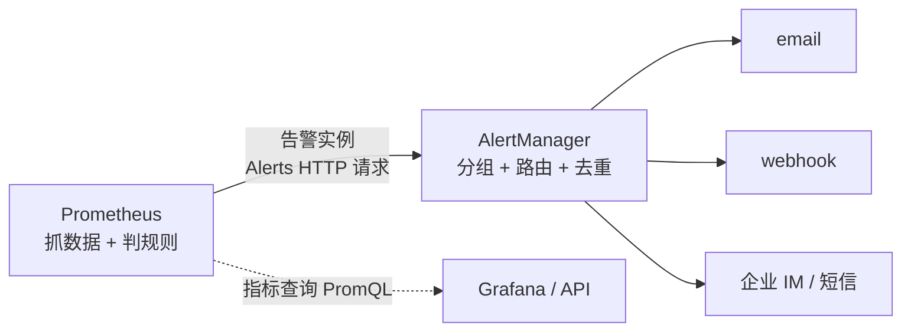
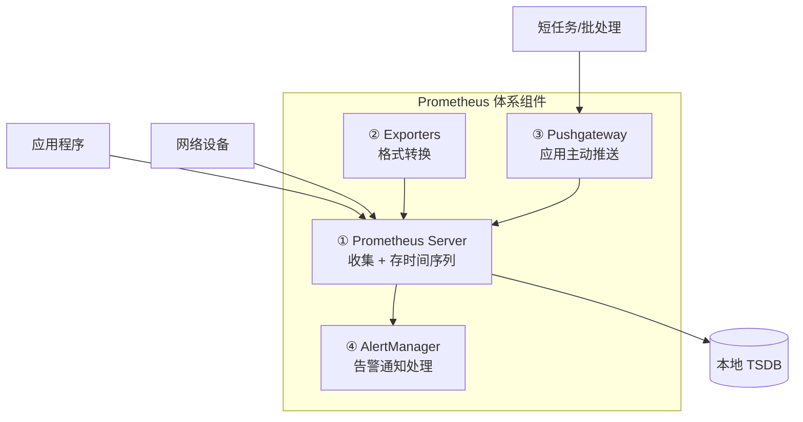
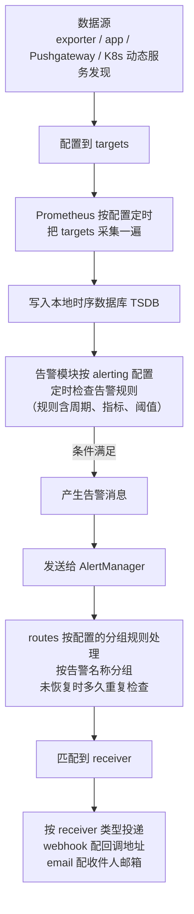

# Kubernetes 认证考点: Prometheus 与 AlertManager 监控告警体系的分工与全流程

监控做完只是"看见"，告警做完才是"有人知道"。这两件事在 Prometheus 体系里是两个组件干的两件事。

结论：**Prometheus 负责收集、存储指标并触发告警规则，AlertManager 负责接收这些告警通知、按标签做分组与路由、再送到接收器（email / webhook / 企业 IM 等）。从数据源到通知的完整链路是：数据源（exporter / app / Pushgateway / K8s 服务发现）→ 配进 targets → Prometheus 定时抓取 → 存 TSDB → 告警模块按规则定时检查 → 产生告警发给 AlertManager → routes 分组路由 → receiver 投递。配置量集中在 Prometheus 的 targets 与 alerting、AlertManager 的 receiver 两处，其余多是一次性配置。**

## 纲要

- 两个组件的分工
- Prometheus 的四个主要组件
- AlertManager 的三个组成部分
- 完整处理流程（端到端）
- 配置落在哪：只有两处要长期维护
- 一个具体的分组路由示例

## 两个组件的分工

先立住分工，后面所有配置才不会写错地方：

| | Prometheus | AlertManager |
| --- | --- | --- |
| 干什么的 | **收集 + 存储指标 + 触发告警规则** | **处理告警通知 + 分组 + 路由 + 投递** |
| 数据形态 | 时序数据（样本流） | 告警事件（带 labels 的通知） |
| 关心什么 | 阈值、周期、指标 | 谁收、怎么合、多久提醒一次、要不要抑制 |
| 典型配置 | `targets`、`alerting.rules` | `route`、`receivers`、`inhibit_rules` |

**一句话：Prometheus 判定"出事了"，AlertManager 决定"告诉谁、怎么告诉、告诉几遍"。**



## Prometheus 的四个主要组件

课程里给的拆分是四个：**server、exporters、Pushgateway、AlertManager**。



逐个说：

**① Prometheus Server —— 用来收集和存储时间序列数据。** 它**定期从被监控的目标（比如应用程序、服务器、网络设备）拉取指标数据，并将其存在本地的时间序列数据库中**。

**② Exporters —— 把不是 Prometheus 格式的指标数据，转换成 Prometheus 可识别的格式。** 例如 node_exporter 就可以从 linux 系统中收集指示（系统）指标数据。这类东西存在的唯一理由：**老组件的指标格式（SNMP、SQL、JMX）Prometheus 喂不进去，必须先转一道。**

**③ Pushgateway —— 允许应用程序推送指标数据到 Prometheus server，不需要安装 exporter。**

> 它的定位要说准确：**给"拉取"补一个"推送"通道**，主要服务那些生命周期短到来不及被抓的任务（批处理、cron 任务）。**不是用来给长驻服务做主采集通道的** —— 硬把业务服务全推给它，会丢自监控、还会引出网关单点问题。

**④ AlertManager —— 用于处理告警通知，从 Prometheus server 中接收告警通知，并根据配置的规则对这些告警进行分组和路由，然后发送到接收器（电子邮件、webhook 等）。**

**另外，Prometheus 还发布了多种语言的 SDK，让应用开发者把自定义的指标集成到 Prometheus 服务中**（Go 的 `prometheus/client_golang`，前面已经写过接入方式）。

```text
四种"指标从哪来"对照
├── Exporter（主动暴露，被抓）
│   └── node_exporter、mysql_exporter、redis_exporter、kube-state-metrics
├── App SDK（进程内埋点，被抓）
│   └── client_golang / client_jvm / client_py，暴露 /metrics
├── Pushgateway（自己推，不被抓）
│   └── 短任务、cron _jobs，注意要设 grouping key 并清旧数据
└── 远程系统（网关/代理模式）
    └── 某些网关型组件把外部监控转发进来
```

## AlertManager 的三个组成部分

AlertManager 由三块构成：

**① Alerts —— 在 Prometheus server 中定义的触发条件。当这个条件被满足时，Prometheus server 将告警通知发送到 AlertManager。**

注意这里有个常被搞混的时序：**告警规则写在 Prometheus 里，不是写在 AlertManager 里。** AlertManager 收到的已经是"条件满足了"的告警实例。

**② Routes —— 用来定义如何处理告警通知。例如可以根据标签，将告警路由到特定的接收器，也可以定义多个接收器，以确保可靠的通知传递。**

**③ Receivers —— 接收告警通知的组件。AlertManager 支持多种接收器类型，包括电子邮件、外部服务（webhook）等。**

```text
AlertManager 内部
├── alerts（输入）
│   └── Prometheus 推过来的告警实例，形如 {labels:{alertname, severity, job}, annotations,...}
├── routes（处理）
│   ├── 按标签匹配树：severity=critical → 值班电话；severity=warning → 群机器人
│   ├── group_by：按什么维度合并（alertname + cluster）
│   ├── group_wait / group_interval：等一等再发 / 合并间隔
│   └── repeat_interval：没恢复就多久再提醒一次
└── receivers（输出）
    ├── email_configs   → to / from / smtp_smart_host
    ├── webhook_configs → url（回调地址）
    ├── slack_configs / dingtalk / 企业微信 / 短信 / PagerDuty
    └── 每种类型配置不一样：webhook 要回调地址，email 要收件人地址
```

## 完整处理流程

端到端串一遍：



标红那几个环节对应到配置上，正是下面这一节要说的事。

```text
一条告警的一生
t0    规则首次满足        Prometheus 产生告警实例 → POST /api/v2/alerts
t0    进入 AlertManager  相同 labels 的告警归到同一个 group
t0+30s group_wait 结束   合并出一条通知（不是 200 条）
t0+30s 转发到 receiver   找 route 命中的 receiver
───────── 以上期间告警自己恢复（resolved）─────────
恢复                      Prometheus 推 resolved，通知里带 resolved:true
                         ★ 恢复通知也必须能发出去，否则值班的人不知道停
───────── 若一直不恢复 ─────────
每 repeat_interval（如 4h）重复提醒一次，直到 resolved
```

**注意"恢复通知"这件事：AlertManager 只有在收到 resolved 之后才会发出恢复消息。所以如果 Prometheus 的告警规则写了 `for` 却在恢复时没清干净，接收方会一直挂着"未恢复"。**

## 配置落在哪

**从处理流程里能直接看出：使用 Prometheus 和 AlertManager 做监控告警，配置较多的地方在 Prometheus 中的 targets 和 alerting，在 AlertManager 中主要是 receiver 下面的接收人、地址。**

```text
真正需要长期维护的配置（就这两块）
├── prometheus.yml
│   ├── scrape_configs    ← targets：加服务、加 job 时改这里
│   └── rule_files → alert_rules.yml   ← alerting：加告警规则时改这里
└── alertmanager.yml
    ├── route             ← 按标签路由到谁（中改）
    ├── receivers         ← 接收人、地址（改人改地址时改这里）
    └── inhibit_rules     ← 抑制（一般可选）

其余的配置（relabel、group_interval、smtp 细节…）
大部分是一次性的，配好之后基本不用再改。
```

**这句话的操作含义很直接：换值班人/换群机器人地址，改的是 AlertManager 的 receiver；加一个新服务要监控，加的是 Prometheus 的 targets；加一条新告警，加的是 rule_files。三者别写混。**

## 一个具体的分组路由示例

把上面三块落成一份地道的 `alertmanager.yml`：

```yaml
global:
  resolve_timeout: 5m

route:
  receiver: default
  group_by: [alertname, cluster]   # 按告警名称分组
  group_wait: 30s                  # 等 30s 看还有没有同组的
  group_interval: 5m
  repeat_interval: 4h              # 未恢复时多久重复检查一次
  routes:
    - matcher: 'severity="critical"'
      receiver: pager              # 值班同学
      group_wait: 10s
      continue: false
    - matcher: 'severity="warning"'
      receiver: chat-group
      group_wait: 2m

receivers:
  - name: default
    webhook_configs:
      - url: http://agent.internal/hook/default
  - name: pager
    webhook_configs:
      - url: http://pager.internal/hook/critical
    email_configs:
      - to: oncall@example.com
        from: alert@example.com
        smarthost: smtp.example.com:587
        require_tls: true
  - name: chat-group
    webhook_configs:
      - url: http://im.internal/webhook/warning
```

对应的 Prometheus 侧规则（**告警条件在这里，不在 AlertManager**）：

```yaml
groups:
  - name: service-alerts
    rules:
      - alert: HighErrorRate
        expr: |
          sum(rate(http_requests_total{status=~"5.."}[2m]))
            / sum(rate(http_requests_total[2m])) > 0.05
        for: 2m                       # ← 规则里的"周期"
        labels:
          severity: critical          # ← 这个 label 决定路由到谁
        annotations:
          summary: "{{ $labels.job }} 错误率过高"
      - alert: NodeLoadHigh
        expr: node_load5 > 8
        for: 10m
        labels:
          severity: warning
        annotations:
          summary: "节点 {{ $labels.instance }} 负载高"
```

## API 速览

| 对象 / 路径 | 位置 | 作用 |
| --- | --- | --- |
| `scrape_configs` | prometheus.yml | 定义 targets 与抓取方式 |
| `kubernetes_sd_configs` | 某个 job 里 | K8s 动态服务发现，自动补 Pod/Service |
| `rule_files` | prometheus.yml | 指向告警规则与记录规则文件 |
| `alerting.alertmanagers` | prometheus.yml | 告诉 Prometheus 往哪发告警 |
| `alert_rules.yml` | 规则文件 | `alert` / `expr` / `for` / `labels` / `annotations` |
| `route.matcher` | alertmanager.yml | 按标签路由（severity、team、cluster） |
| `group_by` / `group_wait` | alertmanager.yml | 告警合并策略 |
| `repeat_interval` | alertmanager.yml | 未恢复时的重复提醒间隔 |
| `receivers` | alertmanager.yml | email / webhook / slack 等终点 |
| `/api/v2/alerts` | AlertManager | 接收 Prometheus 推送的告警实例 |

## Demo 示例

一条从"配到能用"的最小可验证链路：

```bash
# 1. Prometheus 侧：确认 targets 都 UP、规则被加载
kubectl port-forward svc/prometheus 9090:9090
curl -s localhost:9090/-/ready                      # Prometheus is Ready.
curl -s localhost:9090/api/v1/targets | \
  python3 -c "import sys,json;d=json.load(sys.stdin)['data']['activeTargets'];print(len(d),'targets');print([t['labels'].get('job')+':'+t['health'] for t in d][:5])"
curl -s localhost:9090/api/v1/rules | \
  python3 -c "import sys,json;print([g['name'] for g in json.load(sys.stdin)['data']['groups']])"

# 2. AlertManager 侧：确认收到了告警实例、路由命中
kubectl port-forward svc/alertmanager 9093:9093
curl -s localhost:9093/api/v2/alerts                 # 正在 firing 的告警
curl -s "localhost:9093/api/v2/status" | python3 -m json.tool   # 看配置有没有效
```

用告警本身做一次端到端验证（比干等真实故障快得多）：

```yaml
# 故意造一条必然触发的规则，验证整条链路
groups:
  - name: smoke-test
    rules:
      - alert: AlwaysFiring
        expr: vector(1)                 # 恒真
        for: 10s
        labels:
          severity: critical            # → 应当路由到 pager
        annotations:
          summary: "链路自测告警，验证分组路由是否生效"
```

```text
验证顺序（照着排，出问题好定位）
① Prometheus /api/v1/rules 里能看到 AlwaysFiring 且 health=ok  → 规则配对了
② Prometheus /api/v1/query?query=ALERTS 出现 active(ALERTS{alertname="AlwaysFiring"}) → 触发了
③ AlertManager /api/v2/alerts 能看到这条 → 发过来了
④ AlertManager UI 里看到它进了 group、route 命中 pager → 分组路由生效
⑤ 值班渠道 30 秒（group_wait=10s 的话更快）内收到通知 → 链路通
⑥ 把规则删掉 / 触发条件改假 → 收到 resolved 通知
```

## 总结

这套体系值得记的地方，是"谁负责什么"划得非常干净：

1. **Prometheus 干两件：抓指标存时序，判规则发告警**；**AlertManager 干两件：处理通知 + 投递**；
2. **告警规则写在 Prometheus，路由和接收器写在 AlertManager** —— 搞反了会查半天；
3. **数据源有四类**：exporter（格式转换）、app SDK（进程内埋点）、Pushgateway（短任务推送）、K8s 动态服务发现（自动补目标）；
4. **AlertManager 三件套**：alerts（输入的告警实例）、routes（按标签分组路由）、receivers（email / webhook / IM 终点）；
5. **完整链路**：数据源 → targets → 定时抓取 → TSDB → 规则检查 → AlertManager → 分组 → receiver；
6. **分组策略三个旋钮**：`group_by` 按什么合并、`group_wait` 等多久一起发、`repeat_interval` 多久重复提醒 —— 没有 repeat 就等于"恢复前只提醒一次"，运维会漏；
7. **配置量集中在两处**：Prometheus 的 targets + alerting，AlertManager 的 receiver；其余基本一次性；
8. **别忘验证恢复通知** —— resolved 消息走的是同一条链路，实测一遍才敢放心。

